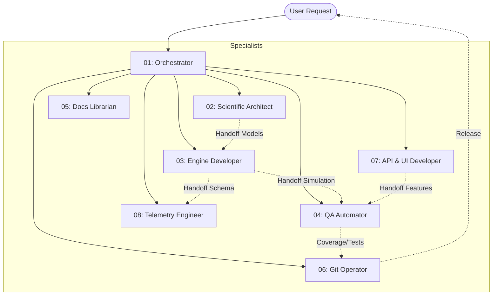
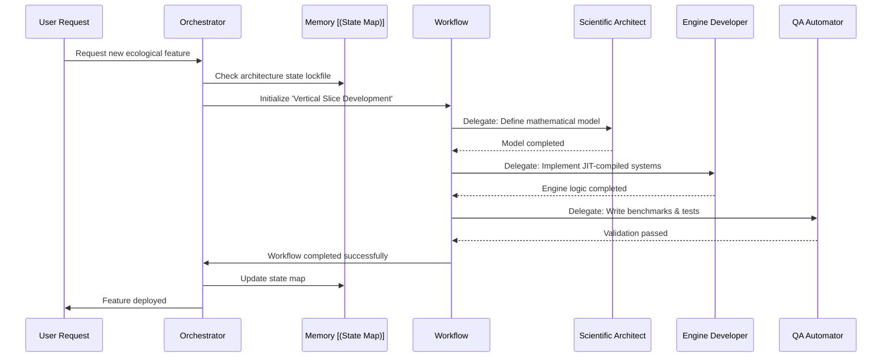
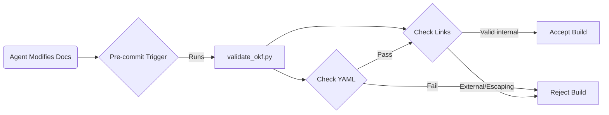

# Welcome to the PHIDS Agent Ecosystem

Welcome to the autonomous nervous system of the Plant-Herbivore Interaction & Defense Simulator (PHIDS). This repository is not maintained by a single monolithic Artificial Intelligence; instead, it is driven by an ecosystem of decoupled, narrow-jurisdiction AI specialists.

Our philosophy relies on **strict discipline and separation of concerns**. By dividing problem-solving into granular roles guided by absolute invariants (our Rule Engine), we prevent the architectural drift, hallucinated dependencies, and catastrophic looping often seen in general-purpose coding LLMs. Here, agents collaborate, delegate, verify their work against hard automated gates, and systematically log their learnings.

---

## 2. Team Directory: Roles & Jurisdictions

The PHIDS workspace is governed by 8 distinct specialist roles. When you submit a request, it is intercepted, deconstructed, and routed to the appropriate domain expert.



### The Specialist Roster

* **01. Orchestrator**
  * **Role:** Command ingress and workflow manager.
  * **Jurisdiction:** Broad workflow planning, but restricted from writing math/kernels.
  * **Dependencies:** Triggers all sub-agents and orchestrates `.agents/workflows/`.
* **02. Scientific Architect**
  * **Role:** Translates ecological theories into optimized matrix operations.
  * **Jurisdiction:** `docs/scientific_model/`.
  * **Dependencies:** Hands off numerical designs to the Engine Developer.
* **03. Engine Developer**
  * **Role:** Implements the core Entity-Component-System (ECS) loops and spatial hashing.
  * **Jurisdiction:** `src/phids/engine/`.
  * **Dependencies:** Relies on the Scientific Architect; passes simulation logic to QA Automator.
* **04. QA Automator**
  * **Role:** Validates deterministic execution, monitors performance regressions, and writes mutation tests.
  * **Jurisdiction:** `tests/`.
  * **Dependencies:** Validates code from the Engine and API Developers.
* **05. Docs Librarian**
  * **Role:** Synchronizes the documentation tree and manages formatting.
  * **Jurisdiction:** `docs/` and `zensical.toml`.
  * **Dependencies:** None.
* **06. Git Operator**
  * **Role:** Manages the repository lifecycle, versioning, and commit integrity.
  * **Jurisdiction:** Git tree and `.github/workflows/`.
  * **Dependencies:** Only acts after QA signs off; halts on missing cryptographic keys.
* **07. API & UI Developer**
  * **Role:** Builds the FastAPI backends, WebSockets, and HTMX server-rendered interfaces.
  * **Jurisdiction:** `src/phids/api/` and `src/phids/ui/`.
  * **Dependencies:** Supplies the front-end for the engine; verified by QA.
* **08. Telemetry & Data Engineer**
  * **Role:** Manages Zarr serialization schemas and out-of-core Polars analytics.
  * **Jurisdiction:** `src/phids/telemetry/`.
  * **Dependencies:** Ingests tick outcomes from the Engine Developer.

---

## 3. Guardrails: The Rule Engine

Agents operate within an ironclad set of core invariants located in `.agents/rules/`. These rules are non-negotiable and override standard agent impulses.

* **Python Modernization (`00`)**: Prevents the use of legacy tools. Agents must strictly use `uv run` and `just`, enforce `mypy` typings, and validate code via `ruff`.
* **Stochastic Engine & Replay (`01`)**: Ensures absolute determinism. All tick outcomes are written to the `_write` layer (double-buffering) and logged to Zarr replay buffers to guarantee flawless serialization.
* **Numba Constraints (`02`)**: Maintains the execution speed of our JIT hot-paths. It bans Python objects (like lists or dicts) inside `@njit` boundaries and enforces pre-allocation to eliminate dynamic allocations inside simulation loops.
* **Git Security & Signing (`03`)**: Mandates cryptographic GPG/SSH signatures on all commits. Agents are instructed to halt and escalate to a human operator rather than bypass failed signatures.

---

## 4. Collaboration: Workflows & The Delegation Protocol

To prevent recursive loops or fragmented development, agents pass tasks via established workflows located in `.agents/workflows/`.

### The Vertical Slice Development Workflow
This pipeline ensures a new ecological feature is implemented securely across the entire stack. A concept moves from the Scientific Architect's models directly into the Engine Developer's JIT loops, gets wired to Telemetry, exposed via the API Developer's UI, and strictly verified by QA—simultaneously.

### The Delegation Protocol
When an agent encounters a structurally blocked task (e.g., an interactive MFA prompt, or a missing GPG key), they use the **Delegation Protocol**. Instead of guessing or failing silently, the agent outputs a highly structured markdown checklist of the exact context, instructions, and resumption signals for the human operator to complete the manual gate.



---

## 5. Automated Quality Gates & Skills

Our repository does not rely on agent promises; it relies on automated enforcement scripts found in `.agents/skills/`. Before any code is committed, it must survive pre-commit hooks and explicit programmatic skills.

* **Run Benchmarks (`run-benchmarks`):** Evaluates `pytest-benchmark` execution speeds to reject any code that degrades the performance of the spatial hashing loops.
* **Analyze Zarr (`analyze-zarr`):** Inspects Zarr schemas to guarantee telemetry replays match active loop data.
* **Validate OKF (`validate-okf`):** A critical gate enforcing our implementation of the Open Knowledge Format (OKF v0.1).

### The OKF Validation Pipeline
The `validate_okf.py` script inspects all documentation files to guarantee they possess correct YAML frontmatter and that they do not contain dangling or escaping markdown links.



### 🔗 Link Validation Reference Examples
To ensure your documentation passes the `validate_okf.py` build gates, strictly format your links according to these rules:

```markdown
# ✅ VALID LINK (Relative internal path)
[Engine Architecture](../docs/technical_architecture/engine_execution.md)

# ❌ INVALID LINK (External web protocol)
[External Reference](https://example.com/docs)
<!-- Error: Target path escapes authorized knowledge domains -->

# ❌ INVALID LINK (Escaping repository boundary)
[Secret File](../../../etc/passwd)
<!-- Error: Target path escapes authorized knowledge domains -->
```

---

## 6. Memory Paradigms: How Context Persists

Multi-agent conversations are ephemeral. To maintain long-term coherence across sessions, agents persist their context using tightly controlled markdown files inside `.agents/memory/`.

### The Architecture State Map
The `architecture_state_map.md` acts as our global lockfile. Before initiating major refactors, the Orchestrator checks this file to avoid clashing with ongoing migrations. **Protocol:** Agents must update this map when opening or closing major architectural tasks.
* *Example Context:* Currently tracking the active migration to Python 3.13 and the switch to `uv` for dependency management.

### Agent Performance Journals
Individual agents maintain their own hyper-focused journals (e.g., `bolt.md` for engine performance, `palette.md` for UI/UX lessons).
* **Protocol:** These files are **not routine activity logs**. They are reserved exclusively for logging high-value architectural lessons structured as `Learning:` and `Action:` pairs. This prevents the logs from bloating while preserving crucial micro-lessons (like ECS query optimizations) for future reference.
