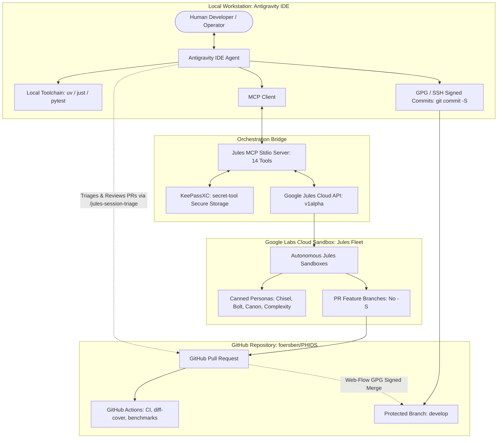
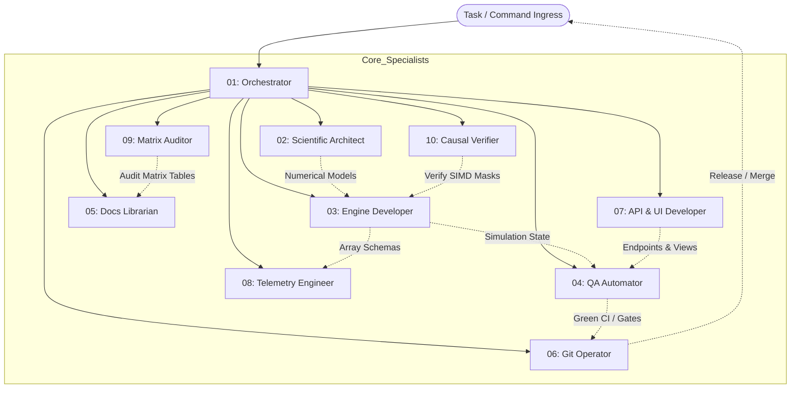
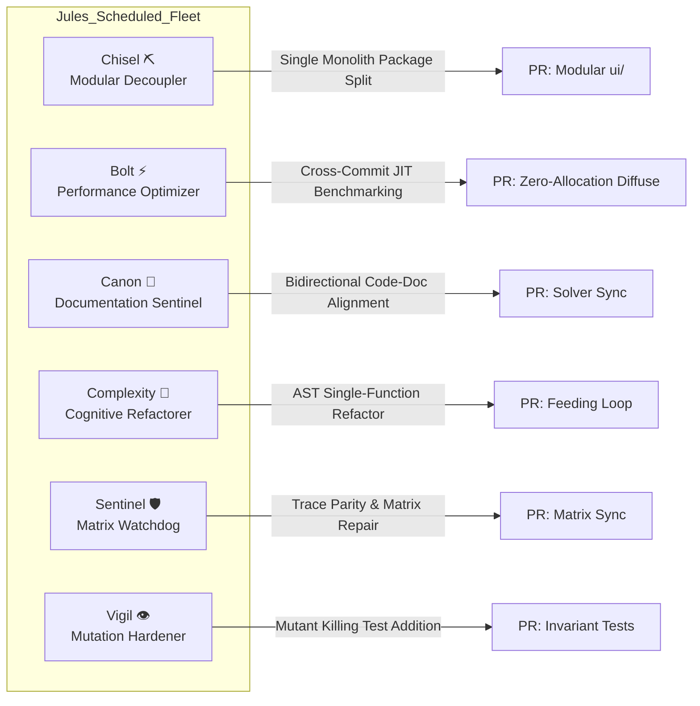
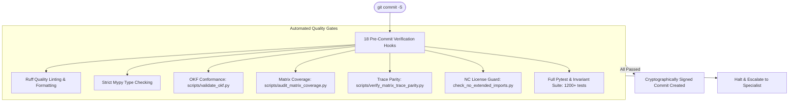
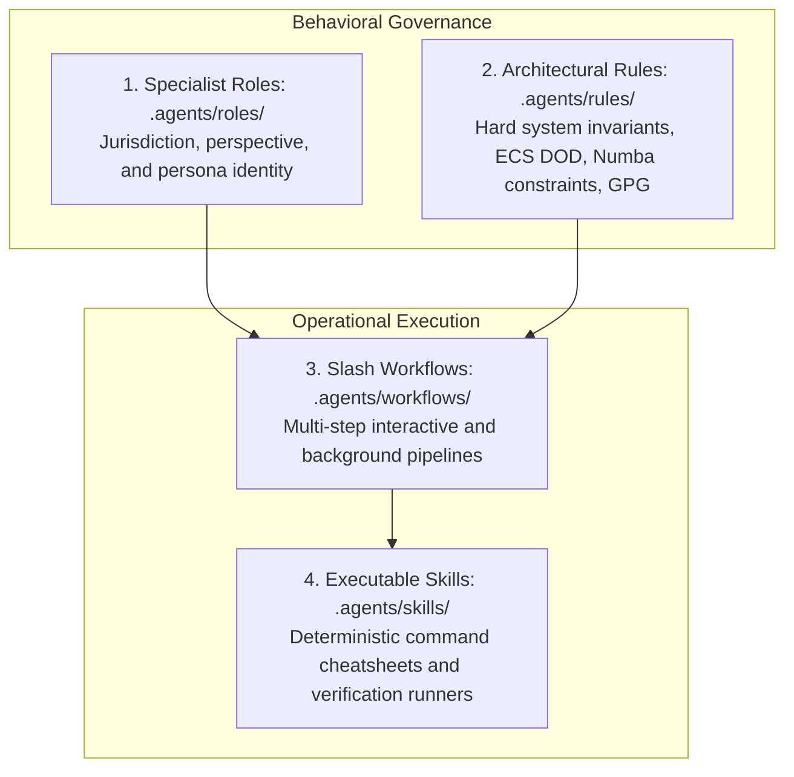
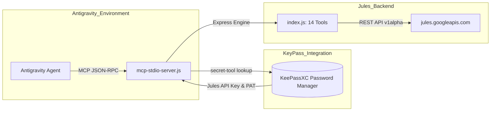

# PHIDS Autonomous Agent Ecosystem Architecture

Welcome to the autonomous development and operational nervous system of the Plant-Herbivore Interaction & Defense Simulator (PHIDS). The PHIDS repository is not maintained by a single monolithic Artificial Intelligence model; instead, it is driven by an orchestrated ecosystem of decoupled, narrow-jurisdiction AI specialists, autonomous cloud bots, and programmatic quality gates.

Our engineering philosophy relies on **strict discipline, domain separation, and deterministic execution**. By decomposing large engineering problems into granular roles bounded by absolute invariants (our Rule Engine), we prevent architectural drift, hallucinated dependencies, and circular loops.

---

## 1. Dual-Agent Execution Topology

The PHIDS development lifecycle operates across a complementary pair of agent architectures:


```mermaid
graph TD
    subgraph Local_Workstation [Local Workstation: Antigravity IDE]
        Human([Human Developer / Operator]) <--> AGY[Antigravity IDE Agent]
        AGY --> LocalTools[Local Toolchain: uv / just / pytest]
        AGY --> GPGSign[GPG / SSH Signed Commits: git commit -S]
        AGY --> MCPClient[MCP Client]
    end

    subgraph Orchestration_Layer [Orchestration Bridge]
        MCPClient <--> JulesMCP[Jules MCP Stdio Server: 14 Tools]
        JulesMCP <--> KeePass[KeePassXC: secret-tool Secure Storage]
        JulesMCP <--> JulesAPI[Google Jules Cloud API: v1alpha]
    end

    subgraph Cloud_Sandbox [Google Labs Cloud Sandbox: Jules Fleet]
        JulesAPI --> JulesAgent[Autonomous Jules Sandboxes]
        JulesAgent --> CannedPrompts[Canned Personas: Chisel, Bolt, Canon, Complexity]
        JulesAgent --> UnsignedFeatureBranch[PR Feature Branches: No -S]
    end

    subgraph GitHub_Remote [GitHub Repository: foersben/PHIDS]
        UnsignedFeatureBranch --> PullRequest[GitHub Pull Request]
        PullRequest --> GHA[GitHub Actions: CI, diff-cover, benchmarks]
        GPGSign --> DevelopBranch[Protected Branch: develop]
        PullRequest -.->|Web-Flow GPG Signed Merge| DevelopBranch
    end

    AGY -.->|Triages & Reviews PRs via /jules-session-triage| PullRequest
```

### Topology Characteristics

* **Local Workstation (Antigravity IDE):**
  * **Environment:** Interactive pairing environment executing directly on Linux workstation hardware.
  * **Commands:** Executes system commands via `uv run` and `just`.
  * **Commit Integrity:** All commits produced locally **MUST** be cryptographically GPG/SSH signed (`git commit -S`). Escalates to the human operator if keys are locked.
  * **Role:** High-context reasoning, complex cross-cutting refactoring, workflow dispatching, PR triage, and human collaboration.

* **Cloud Sandbox (Google Labs Jules Fleet):**
  * **Environment:** Ephemeral, isolated cloud containers running asynchronous batch or scheduled tasks.
  * **Commands:** Operates in non-interactive remote sandboxes via bash tool runners.
  * **Commit Integrity:** Creates PR feature branches with unsigned commits. Signing occurs cryptographically upon PR merge via GitHub Web-Flow.
  * **Restricted Execution:** Never runs Docker-in-Docker tools (`act` is banned in agent sandboxes). Bounded by single-task limits and non-crawling routing rules.
  * **Role:** Targeted autonomous micro-tasks: cognitive complexity reduction, JIT performance optimization, document alignment, and package refactoring.

---

## 2. Team Directory: The 10 Core Specialist Roles

The PHIDS codebase is governed by 10 distinct specialist roles defined in `.agents/roles/`. Every modification routes through the algorithmic decision matrix in `.agents/index.md`.


```mermaid
graph TD
    User([Task / Command Ingress]) --> Orch[01: Orchestrator]

    subgraph Core_Specialists
        Orch --> Sci[02: Scientific Architect]
        Orch --> Eng[03: Engine Developer]
        Orch --> QA[04: QA Automator]
        Orch --> Docs[05: Docs Librarian]
        Orch --> Git[06: Git Operator]
        Orch --> API[07: API & UI Developer]
        Orch --> Tel[08: Telemetry Engineer]
        Orch --> Aud[09: Matrix Auditor]
        Orch --> Caus[10: Causal Verifier]
    end

    Sci -.->|Numerical Models| Eng
    Eng -.->|Simulation State| QA
    Eng -.->|Array Schemas| Tel
    API -.->|Endpoints & Views| QA
    QA -.->|Green CI / Gates| Git
    Aud -.->|Audit Matrix Tables| Docs
    Caus -.->|Verify SIMD Masks| Eng
    Git -.->|Release / Merge| User
```

### Role Roster

* **01. Orchestrator (`@orchestrator`):**
  * **Jurisdiction:** Command ingress, workflow dispatching, and cross-cutting project management.
  * **Constraints:** Restricted from directly authoring mathematical equations or Numba kernels. Delegates to specialist sub-agents.
* **02. Scientific Architect (`@scientific-architect`):**
  * **Jurisdiction:** `docs/scientific_model/`, `src/phids/api/schemas/`.
  * **Responsibilities:** Translates ecological theories (reaction-diffusion PDEs, chemotaxis, volatile signaling, mycorrhizal exchange) into continuous-discrete hybrid dynamical models.
* **03. Engine Developer (`@engine-developer`):**
  * **Jurisdiction:** `src/phids/engine/`.
  * **Responsibilities:** Implements data-oriented Entity-Component-System (ECS) arrays, Numba `@njit` kernels, spatial hashing grids, and double-buffering layers. Banned from introducing Python objects or allocations in hot paths.
* **04. QA Automator (`@qa-automator`):**
  * **Jurisdiction:** `tests/`, `scripts/`.
  * **Responsibilities:** Validates deterministic replay invariants, isolates test regressions, monitors `pytest-benchmark` gates, and writes mutation/hypothesis tests.
* **05. Docs Librarian (`@docs-librarian`):**
  * **Jurisdiction:** `docs/`, `zensical.toml`.
  * **Responsibilities:** Enforces Open Knowledge Format (OKF v0.2) compliance, validates graph links via `scripts/validate_okf.py`, maintains Zensical documentation builds, and enforces zero-truncation policies.
* **06. Git Operator (`@git-operator`):**
  * **Jurisdiction:** Git tree, `.github/workflows/`, release tags.
  * **Responsibilities:** Manages branch merges, release tags, and cryptographic commit signing verification (`git commit -S`).
* **07. API & UI Developer (`@api-and-ui-developer`):**
  * **Jurisdiction:** `src/phids/api/`, `src/phids/templates/`.
  * **Responsibilities:** Builds FastAPI REST endpoints, WebSocket telemetry streams, and HTMX server-rendered interfaces.
* **08. Telemetry & Data Engineer (`@telemetry-and-data-engineer`):**
  * **Jurisdiction:** Zarr replay buffers, Polars telemetry schemas, and replay playback services.
  * **Responsibilities:** Ensures all tick outcomes serialize faithfully into out-of-core columnar formats.
* **09. Matrix Auditor (`@matrix-auditor`):**
  * **Jurisdiction:** Data-Flow Matrix specifications across documentation and tests.
  * **Responsibilities:** Runs `scripts/audit_matrix_coverage.py` to ensure all multi-tick behavioral cascades possess documented tables and bilateral test links.
* **10. Causal Verifier (`@causal-verifier`):**
  * **Jurisdiction:** Causal loop invariant checks and branchless SIMD kernel masks.
  * **Responsibilities:** Runs `scripts/verify_matrix_trace_parity.py --all` to assert exact numerical table-to-trace parity.

---

## 3. Autonomous Scheduled Personas (Jules Fleet)

For recurring cloud background runs, specialized personas are instantiated using the standardized prompt architecture in `.agents/PROMPT_TEMPLATE.md`:


```mermaid
graph LR
    subgraph Jules_Scheduled_Fleet
        Chisel["Chisel ⛏️<br/>Modular Decoupler"]
        Bolt["Bolt ⚡<br/>Performance Optimizer"]
        Canon["Canon 📜<br/>Documentation Sentinel"]
        Complexity["Complexity 🧩<br/>Cognitive Refactorer"]
        Sentinel["Sentinel 🛡️<br/>Matrix Watchdog"]
        Vigil["Vigil 👁️<br/>Mutation Hardener"]
    end

    Chisel -->|Single Monolith Package Split| PR1[PR: Modular ui/]
    Bolt -->|Cross-Commit JIT Benchmarking| PR2[PR: Zero-Allocation Diffuse]
    Canon -->|Bidirectional Code-Doc Alignment| PR3[PR: Solver Sync]
    Complexity -->|AST Single-Function Refactor| PR4[PR: Feeding Loop]
    Sentinel -->|Trace Parity & Matrix Repair| PR5[PR: Matrix Sync]
    Vigil -->|Mutant Killing Test Addition| PR6[PR: Invariant Tests]
```

### The Persona Profiles

* **Chisel ⛏️ (Autonomous Codebase Sculptor):**
  * **Mission:** Autonomously identify and carve exactly **ONE** monolithic module (>400 lines or mixed domain responsibilities) into cohesive, strictly typed sub-packages.
  * **Standard Finder:** `find src/phids/ -name "*.py" -not -name "__init__.py" -exec wc -l {} + | sort -rn | head -n 10`.
  * **Verification:** Enforces backward compatibility via `__init__.py` facade re-exports and runs full pytest.

* **Bolt ⚡ (Performance Optimization Specialist):**
  * **Mission:** Identify and implement exactly **ONE** measurable performance optimization in hot paths (tight loops, array allocation, scalar gating).
  * **Verification Tool:** Compares active changes against baseline `develop` using the cross-commit JIT benchmarking utility:
    ```bash
    just bench-compare-jit develop worktree examples/rectangular_crossfire_extended.json 100 10 10
    ```
  * **Boundary:** Rejects changes that show throughput regressions or add branch divergence to SIMD loops. Records findings in `.agents/memory/bolt.md`.

* **Canon 📜 (Documentation & Invariant Sentinel):**
  * **Mission:** Audits the codebase against the Zensical documentation and OKF Data-Flow Matrices.
  * **Bidirectional Authority:** Can autonomously decide whether code drifted from documentation or whether documentation lagged behind approved optimizations, updating whichever is appropriate and defending the decision in the PR description.

* **Complexity 🧩 (Cognitive Complexity Specialist):**
  * **Mission:** Uses `complexipy` and AST inspection to find exactly **ONE** function with cognitive complexity > 15 and refactor it into clean, typed helper functions without introducing interpreter overhead.

* **Sentinel 🛡️ (Matrix Drift & Invariant Watchdog):**
  * **Mission:** Enforces Rule 05 invariants. Runs `scripts/audit_matrix_coverage.py` and `scripts/verify_matrix_trace_parity.py --all`. Reconciles table rows when simulation kinetics intentionally drift.

* **Vigil 👁️ (Mutation Testing & Suite Hardener):**
  * **Mission:** Discovers surviving mutant branches using mutation testing and hypothesis property testing, crafting targeted unit tests to harden system invariants.

---

## 4. The Rule Engine: Non-Negotiable Invariants

All agents (local or cloud) must strictly adhere to the rules located in `.agents/rules/`:

* **Rule 00: Python Modernization (`00-python-modernization.md`):**
  * Ban `pip`, `poetry`, `python`, `black`, `flake8`.
  * Execute ALL commands strictly via `uv run` or `just`.
  * Enforce strict `mypy` typing across all modules (favor built-in generics `list`, `dict`, `str | None`).
  * Format and lint strictly via `uv run ruff check` and `uv run ruff format`.

* **Rule 01: Stochastic Engine & Replay (`01-stochastic-engine-and-replay.md`):**
  * Strict double-buffering: Systems read from current layer; write ONLY to `_write` layer.
  * Deterministic serialization: Record all tick outcomes tick-by-tick into Zarr replay buffers. Playback reads Zarr directly, bypassing engine logic.
  * Seed PRNGs per Biotope region or Swarm component.

* **Rule 02: Numba Constraints (`02-numba-constraints.md`):**
  * Zero Python collections (`dict`, `list`, custom classes) inside `@njit` hot paths.
  * Contiguous layouts and explicit dtypes (`np.float32`, `np.int32`, avoiding accidental `float64` upcasts).
  * Zero array allocations (`np.zeros`, `np.append`) inside per-tick JIT loops.
  * Float state masking: Represent transitions via float transfers (`delta * alive_mask`), prohibiting scalar enums or branching conditionals in SIMD inner loops.

* **Rule 03: Git Security & Signing (`03-git-security-and-signing.md`):**
  * Workstation commits MUST be cryptographically GPG/SSH signed (`git commit -S`). Halts and escalates if signing keys are locked.
  * Never bypass signature requirements via `.git/config` tampering.

* **Rule 04: Markdown Formatting Standards (`04-markdown-formatting.md`):**
  * Standard hyphen (`-`) exclusively. En-dash and em-dash are strictly prohibited.
  * Unordered lists must use `*` with exactly 1 space after `*` and 2 spaces per indent level.
  * Exactly 1 blank line before and after lists, code blocks, and headings. Trim trailing whitespace.

* **Rule 05: Data-Flow Invariants (`05-data-flow-invariants.md`):**
  * **Rule 05-A (Table-to-Trace Parity):** Every Markdown Data-Flow Matrix table must match Pytest traces in `tests/integration/scientific_invariants/test_causal_data_flow_matrices.py`.
  * **Rule 05-B (Branchless SIMD Masks):** State transfers in JIT kernels must execute via scalar/vector float multiplication (`delta * mask`).
  * **Rule 05-C (Bilateral Resource Mapping):** OKF frontmatter `sources:` must declare both system code and test trace files.
  * **Rule 05-D (Agentic Gate):** Pre-commit hooks reject commits failing matrix audit or trace parity.

* **Universal Sandbox Constraint:**
  * Running `act` (local GitHub Actions runner) is strictly banned in all agent sandboxes.

---

## 5. Active Workflows & Slash Commands

Workflows in `.agents/workflows/` coordinate multi-phase tasks:

| Slash Command | Workflow Document | Primary Roles | Description |
| :--- | :--- | :--- | :--- |
| `/jules-session-triage` | [jules-session-triage.md](workflows/jules-session-triage.md) | `01`, `04`, `06` | Discovers live Jules sessions, unblocks paused agents, evaluates PRs against develop, and generates HITL triage reviews. |
| `/epistemic-soundness-audit` | [epistemic-soundness-audit.md](workflows/epistemic-soundness-audit.md) | `02`, `09`, `10` | 10-slice relational audit verifying biological fidelity, mathematical rigor, and HPC invariants across docs and code. |
| `/matrix-tdd-refactor` | [matrix-tdd-refactor.md](workflows/matrix-tdd-refactor.md) | `03`, `04`, `09` | Translates conceptual behavior to Data-Flow Matrix tables, Pytest traces, branchless Numba kernels, and verified OKF links. |
| `/validate-full-stack` | [validate-full-stack.md](workflows/validate-full-stack.md) | All | Coordinated pipeline running all pre-commit gates, OKF compliance, matrix trace parity, and Zensical build. |
| `/implement-scientific-model` | [implement-scientific-model.md](workflows/implement-scientific-model.md) | `02`, `03` | Protocol for introducing new ecological/mathematical behaviors into ECS arrays and simulation loop. |
| `/matrix-drift-reconciliation` | [matrix-drift-reconciliation.md](workflows/matrix-drift-reconciliation.md) | `09`, `10` | Automated detection and reconciliation of drifted Data-Flow Matrices against runtime simulation traces. |
| `/vertical-slice-development` | [vertical-slice-development.md](workflows/vertical-slice-development.md) | `01` + All | Coordinated pipeline for building full-stack simulation features across models, kernels, telemetry, and UI. |
| `/delegation-protocol` | [delegation-protocol.md](workflows/delegation-protocol.md) | `01` | Structured markdown escalation checklist for human operators when agents encounter manual confirmation gates. |
| `/ecs-refactor-pipeline` | [ecs-refactor-pipeline.md](workflows/ecs-refactor-pipeline.md) | `03`, `04` | Safely refactors cold-path control plane modules while preserving DOD/JIT hot-path immutability. |

---

## 6. Automated Quality Gates & Skills Architecture

Quality and computational invariants are enforced programmatically through repository scripts and native Antigravity skills residing in `.agents/skills/`.

### 6.1. Pre-Commit Gate Pipeline

Every commit must satisfy 18 deterministic pre-commit hooks before being cryptographically signed:


```mermaid
graph TD
    CommitAttempt([git commit -S]) --> PreCommit[18 Pre-Commit Verification Hooks]

    subgraph Gates [Automated Quality Gates]
        PreCommit --> Lints[Ruff Quality Linting & Formatting]
        PreCommit --> Types[Strict Mypy Type Checking]
        PreCommit --> OKFCheck[OKF Conformance: scripts/validate_okf.py]
        PreCommit --> MatrixCov[Matrix Coverage: scripts/audit_matrix_coverage.py]
        PreCommit --> MatrixParity[Trace Parity: scripts/verify_matrix_trace_parity.py]
        PreCommit --> LicenseGuard[NC License Guard: check_no_extended_imports.py]
        PreCommit --> Pytest[Full Pytest & Invariant Suite: 1200+ tests]
    end

    Gates -->|All Passed| SignedCommit[Cryptographically Signed Commit Created]
    Gates -->|Any Failed| Halt[Halt & Escalate to Specialist]
```

### 6.2. The Four-Tier Governance & Skills Model

In the PHIDS agent architecture, skills occupy the deterministic execution layer beneath roles, rules, and workflows:


```mermaid
graph TD
    subgraph Governance [Behavioral Governance]
        Roles[1. Specialist Roles: .agents/roles/<br/>Jurisdiction, perspective, and persona identity]
        Rules[2. Architectural Rules: .agents/rules/<br/>Hard system invariants, ECS DOD, Numba constraints, GPG]
    end

    subgraph Execution [Operational Execution]
        Workflows[3. Slash Workflows: .agents/workflows/<br/>Multi-step interactive and background pipelines]
        Skills[4. Executable Skills: .agents/skills/<br/>Deterministic command cheatsheets and verification runners]
    end

    Roles --> Workflows
    Rules --> Workflows
    Workflows --> Skills
```

* **Specialist Roles (`.agents/roles/*.md`):** Establish jurisdiction and mental models (e.g., `@engine-developer`, `@matrix-auditor`).
* **Architectural Rules (`.agents/rules/*.md`):** Hard invariants enforced by pre-commit and CI (e.g., Rule 00 `uv run`, Rule 02 float masks, Rule 05 parity).
* **Slash Workflows (`.agents/workflows/*.md`):** Multi-step operational pipelines triggered via slash commands (e.g., `/matrix-tdd-refactor`, `/jules-session-triage`).
* **Specialist Skills (`.agents/skills/*/SKILL.md`):** Atomic, deterministic playbooks that wrap repository verification scripts into standardized AI execution units.

### 6.3. Dynamic Discovery & Agent Registration

Skills in PHIDS are **not** static text; they are natively discovered and mounted by Google Antigravity:

* **Auto-Discovery:** At startup, Antigravity scans `.agents/skills/` for all subdirectories containing a valid `SKILL.md` with YAML frontmatter.
* **Context Injection:** Antigravity automatically registers every skill into the active AI toolbelt under `<skills>`, defining the skill name, trigger, and description.
* **Zero-Hallucination Execution:** When an agent encounters an operational trigger, it views the corresponding `SKILL.md` to retrieve exact, tested CLI flags and arguments rather than improvising shell commands.

### 6.4. Specialist Skills Catalog

| Skill Name | Path | Primary Python Harness | Primary Role Trigger |
| --- | --- | --- | --- |
| **Analyze Zarr Telemetry** | [analyze-zarr](skills/analyze-zarr/SKILL.md) | `scripts/inspect_zarr.py` | `@telemetry-and-data-engineer` after running scenarios |
| **Audit OKF Matrix Coverage** | [audit-okf-matrix-coverage](skills/audit-okf-matrix-coverage/SKILL.md) | `scripts/audit_matrix_coverage.py` | `@matrix-auditor` during doc & cascade reviews |
| **Auto Reconcile Matrix Drift** | [auto-reconcile-matrix-drift](skills/auto-reconcile-matrix-drift/SKILL.md) | `scripts/reconcile_matrix_drift.py` | `@causal-verifier` on intentional parameter drift |
| **Run Benchmarks** | [run-benchmarks](skills/run-benchmarks/SKILL.md) | `pytest tests/benchmarks/` | `@engine-developer`, `Bolt` before PR opening |
| **Validate Open Knowledge Format** | [validate-okf](skills/validate-okf/SKILL.md) | `scripts/validate_okf.py` | `@docs-librarian`, all agents editing `docs/` |
| **Verify Matrix Trace Parity** | [verify-matrix-trace-parity](skills/verify-matrix-trace-parity/SKILL.md) | `scripts/verify_matrix_trace_parity.py` | `@matrix-auditor`, `@causal-verifier`, pre-commit gate |
| **Visualize Open Knowledge Format** | [visualize-okf](skills/visualize-okf/SKILL.md) | `scripts/visualize_okf.py` | `@docs-librarian` for graph builds and audits |

### 6.5. Deep Skill Invariants & CLI Execution

#### Analyze Zarr Telemetry (`analyze-zarr`)

* **Purpose:** Inspects multi-species simulation recordings stored in Zarr format.
* **Invariants:** Validates chunk structure, time dimension indexing, floating-point dtypes, and compression codecs.
* **CLI Command:**

```bash
uv run python scripts/inspect_zarr.py path/to/replay.zarr
```

#### Audit OKF Matrix Coverage (`audit-okf-matrix-coverage`)

* **Purpose:** Enforces Rule 05 by scanning `docs/scientific_model/` for temporal state transitions missing formal Data-Flow Matrix specifications.
* **Invariants:** Asserts that every biological or environmental interaction concept document has an associated Markdown matrix table.
* **CLI Command:**

```bash
uv run python scripts/audit_matrix_coverage.py --dir docs/scientific_model/
```

#### Auto Reconcile Matrix Drift (`auto-reconcile-matrix-drift`)

* **Purpose:** Automatically captures runtime execution traces and updates Markdown table rows when simulation parameters drift intentionally.
* **Invariants:** Parses AST tables, executes the corresponding test trace, and rewires numerical cells while preserving explanatory narrative prose.
* **CLI Command:**

```bash
uv run python scripts/reconcile_matrix_drift.py --doc docs/scientific_model/part_2_autotrophic_dynamics/morphological_defenses.md
```

#### Run Benchmarks (`run-benchmarks`)

* **Purpose:** Executes `pytest-benchmark` suites to ensure zero throughput regression in Numba `@njit` kernels and spatial hash grids.
* **CLI Command:**

```bash
uv run pytest tests/benchmarks/ --benchmark-only --benchmark-json artifacts/benchmark_results.json
```

#### Validate Open Knowledge Format (`validate-okf`)

* **Purpose:** Validates OKF v0.2 YAML frontmatter schemas, trust tier definitions, freshness timestamps, and internal link structure.
* **CLI Command:**

```bash
uv run python scripts/validate_okf.py
```

#### Verify Matrix Trace Parity (`verify-matrix-trace-parity`)

* **Purpose:** Enforces Rule 05-A by asserting exact 1:1 numerical parity between documented Markdown tables and runtime simulation arrays.
* **CLI Command:**

```bash
uv run python scripts/verify_matrix_trace_parity.py --all
```

#### Visualize Open Knowledge Format (`visualize-okf`)

* **Purpose:** Generates an interactive Cytoscape.js knowledge graph visualization from all OKF markdown files and their relational links.
* **CLI Command:**

```bash
uv run python scripts/visualize_okf.py
```

### 6.6. How to Author and Register a New Skill

When introducing new programmatic verification tools or execution scripts into PHIDS:

* **Create Directory:** Create `.agents/skills/<skill-name>/`.
* **Add `SKILL.md`:** Populate with standard OKF frontmatter:

```yaml
---
type: Agent Skill
title: <Human-Readable Skill Name>
status: stable
stale_after: "2027-01-01T00:00:00Z"
version: 1.0
description: <One-line summary of what the skill executes>
tags: [python, ecs, verification]
generated: {by: process:okf-updater, at: "<ISO-TIMESTAMP>"}
verified: {by: process:okf-updater, at: "<ISO-TIMESTAMP>"}
name: <Skill Display Name>
sources:
- id: script_id
  resource: scripts/<script_name>.py
---
```

* **Define Trigger & Execution:** Specify `# <Skill Display Name>` followed by `## Trigger` and `## Execution` with the exact `uv run` command.
* **Register in Indices:** Add the skill entry to [`.agents/README.md`](README.md), [`.agents/index.md`](index.md), and [`.agents/AGENTS.md`](AGENTS.md).

---

## 7. Jules MCP Orchestration Engine

Antigravity IDE communicates with Google Labs Jules via a local stdio MCP server located in `antigravity-jules-orchestration`:


```mermaid
graph LR
    subgraph Antigravity_Environment
        AGY[Antigravity Agent] -->|MCP JSON-RPC| StdioServer[mcp-stdio-server.js]
    end

    subgraph KeyPass_Integration
        StdioServer -->|secret-tool lookup| KeyPass[(KeePassXC Password Manager)]
        KeyPass -->|Jules API Key & PAT| StdioServer
    end

    subgraph Jules_Backend
        StdioServer -->|Express Engine| JulesBackend[index.js: 14 Tools]
        JulesBackend -->|REST API v1alpha| GoogleJules[jules.googleapis.com]
    end
```

### Capabilities & Configuration

* **Tool Configurations:**
  * **Optimal Curated Mode (Default, 14 Tools):** `jules_list_sources`, `jules_create_session`, `jules_list_sessions`, `jules_get_session`, `jules_send_message`, `jules_approve_plan`, `jules_get_activities`, `jules_cancel_session`, `jules_delete_session`, `jules_get_diff`, `jules_retry_session`, `jules_create_from_issue`, `jules_get_pr_status`, `jules_merge_pr`.
  * **Full Orchestration Suite (68 Tools):** Enabled by setting `JULES_EXPOSE_ALL_TOOLS=true` in `~/.gemini/config/mcp_config.json` or in the server `.env`. Adds batch processing, session timelines, queue pipelines, semantic memory, and suggested tasks.
* **Payload Protocol:**
  * Interactive prompt messages sent via `jules_send_message` map strictly to `{ "prompt": "<message>" }` in the Google Jules REST API.
* **Credential Security:**
  * Keys are resolved dynamically from KeePassXC via `secret-tool lookup Title "Jules API Key"`, keeping raw secrets out of plaintext configs.

---

## 8. Memory System & Persistent Knowledge

To prevent cross-session context loss, agents persist learnings in `.agents/memory/`:

* **Global Lockfile (`architecture_state_map.md`):**
  * Tracks high-level architectural migrations (e.g., Python 3.13 upgrade, zero-allocation array buffer swaps).
  * Checked by the Orchestrator before dispatching structural refactoring.
* **Specialist Learning Journals:**
  * Focused memory logs (`bolt.md`, `chisel.md`, `canon.md`, `complexity.md`, `palette.md`).
  * Reserved exclusively for critical learnings formatted as `Learning:` and `Action:` pairs (e.g., why branchless `abs` intrinsics outperform inline branching in Numba).
* **Restricted Loading Policy:**
  * Memory files are **never** crawled or bulk-loaded automatically. They are loaded exclusively on explicit task triggers to safeguard agent context tokens.

---

## 9. Open Knowledge Format (OKF v0.2) & Multi-Audience Documentation

Documentation in PHIDS is treated as executable knowledge:

* **YAML Frontmatter:** Every markdown document must declare `type`, `title`, `status`, `version`, `description`, `tags`, `generated`, and relative `sources:`.
* **Zero Truncation / Compression Policy:** Agents are strictly prohibited from summarizing away narrative scientific prose, biological rationales, or mathematical derivations.
* **Floating Explanatory Prose:** Explanatory context between equations and tables must remain preserved.
* **Multi-Audience Stratification:** Documentation must cater simultaneously to:
  * Theoretical Ecologists (botanical defenses, volatile kinetics, mycorrhizal resource allocations).
  * Applied Mathematicians (reaction-diffusion PDEs, continuous-discrete hybrid dynamical systems, isotropic Gaussian diffusion).
  * Systems & HPC Engineers (data-oriented ECS arrays, branchless SIMD masks, Numba `@njit` kernels).
  * General Scientific Readers (accessible abstracts and clear architectural diagrams).
* **Footnote Attribution:** Sources are cited via inline markdown footnotes (`[^id]`) without interrupting continuous prose.
