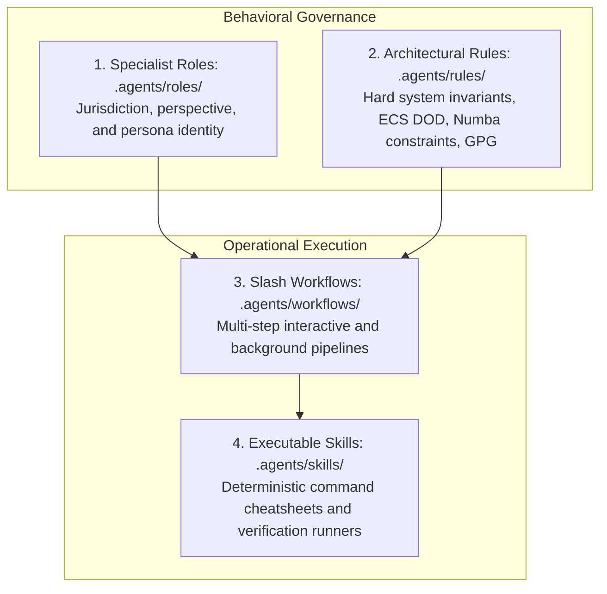

# PHIDS Automated Skills Architecture & Catalog

The `.agents/skills/` directory forms the deterministic execution engine for AI agents in the PHIDS repository. While personas define *identity* and rules dictate *invariants*, skills provide **executable cheatsheets and programmatic harnesses** that allow both local IDE agents (Google Antigravity) and autonomous cloud bots (Google Jules) to inspect, verify, benchmark, and reconcile simulation code and mathematical models with zero hallucination.

---

## 1. What are Agent Skills?

Under the Google Antigravity Customization Architecture, AI behavior is governed across four decoupled tiers:



* **Roles (`.agents/roles/*.md`):** Establish jurisdiction, domain boundaries, and mental models (e.g., `@engine-developer`, `@matrix-auditor`).
* **Rules (`.agents/rules/*.md`):** Absolute constraints enforced by pre-commit hooks and CI (e.g., Rule 00 `uv run`, Rule 02 float masks, Rule 05 trace parity).
* **Workflows (`.agents/workflows/*.md`):** Multi-step protocols invoked via slash commands (e.g., `/epistemic-soundness-audit`, `/jules-session-triage`).
* **Skills (`.agents/skills/<skill>/SKILL.md`):** Atomic, executable playbooks that wrap repository scripts and test runners.

---

## 2. Dynamic Discovery & Agent Registration

Skills are **not** passive documentation files. Antigravity IDE natively scans `.agents/skills/` upon workspace initialization:

1. **Auto-Discovery:** Antigravity searches for every subdirectory containing a valid `SKILL.md` with YAML frontmatter.
2. **Context Injection:** When an AI agent is initialized, Antigravity injects the skill registry (name, trigger, and description) directly into the agent system prompt under `<skills>`.
3. **Deterministic Invocation:** When an agent encounters a trigger condition (such as checking Zarr replay files or auditing matrix coverage), it reads the designated `SKILL.md` using `view_file` to obtain the exact, tested CLI command and options without guessing.

---

## 3. Catalog of Specialist Skills

| Skill | Directory | Primary Python Harness | Primary Role Trigger |
| --- | --- | --- | --- |
| **Analyze Zarr Telemetry** | [analyze-zarr/SKILL.md](analyze-zarr/SKILL.md) | `scripts/inspect_zarr.py` | `@telemetry-and-data-engineer` after running scenarios |
| **Audit OKF Matrix Coverage** | [audit-okf-matrix-coverage/SKILL.md](audit-okf-matrix-coverage/SKILL.md) | `scripts/audit_matrix_coverage.py` | `@matrix-auditor` during doc & cascade reviews |
| **Auto Reconcile Matrix Drift** | [auto-reconcile-matrix-drift/SKILL.md](auto-reconcile-matrix-drift/SKILL.md) | `scripts/reconcile_matrix_drift.py` | `@causal-verifier` on intentional parameter drift |
| **Run Benchmarks** | [run-benchmarks/SKILL.md](run-benchmarks/SKILL.md) | `pytest tests/benchmarks/` | `@engine-developer`, `Bolt` before PR opening |
| **Validate Open Knowledge Format** | [validate-okf/SKILL.md](validate-okf/SKILL.md) | `scripts/validate_okf.py` | `@docs-librarian`, all agents editing `docs/` |
| **Verify Matrix Trace Parity** | [verify-matrix-trace-parity/SKILL.md](verify-matrix-trace-parity/SKILL.md) | `scripts/verify_matrix_trace_parity.py` | `@matrix-auditor`, `@causal-verifier`, pre-commit gate |
| **Visualize Open Knowledge Format** | [visualize-okf/SKILL.md](visualize-okf/SKILL.md) | `scripts/visualize_okf.py` | `@docs-librarian` for graph builds and audits |

---

## 4. Deep Skill Specifications

### 4.1. Analyze Zarr Telemetry (`analyze-zarr`)

* **Purpose:** Inspects multi-species simulation recordings stored in Zarr format.
* **Checks:** Validates chunk structure, time dimension indexing, floating-point dtypes, and compression codecs.
* **CLI Command:**

```bash
uv run python scripts/inspect_zarr.py path/to/replay.zarr
```

### 4.2. Audit OKF Matrix Coverage (`audit-okf-matrix-coverage`)

* **Purpose:** Enforces Rule 05 by scanning `docs/scientific_model/` for temporal state transitions missing formal Data-Flow Matrix specifications.
* **Checks:** Asserts that every biological or environmental interaction concept document has an associated Markdown matrix table.
* **CLI Command:**

```bash
uv run python scripts/audit_matrix_coverage.py --dir docs/scientific_model/
```

### 4.3. Auto Reconcile Matrix Drift (`auto-reconcile-matrix-drift`)

* **Purpose:** Automatically captures runtime execution traces and updates Markdown table rows when simulation parameters drift intentionally.
* **Checks:** Parses AST tables, executes the corresponding test trace, and rewires numerical cells while preserving explanatory narrative prose.
* **CLI Command:**

```bash
uv run python scripts/reconcile_matrix_drift.py --doc docs/scientific_model/part_2_autotrophic_dynamics/morphological_defenses.md
```

### 4.4. Run Benchmarks (`run-benchmarks`)

* **Purpose:** Executes `pytest-benchmark` suites to ensure zero throughput regression in Numba `@njit` kernels and spatial hash grids.
* **CLI Command:**

```bash
uv run pytest tests/benchmarks/ --benchmark-only --benchmark-json artifacts/benchmark_results.json
```

### 4.5. Validate Open Knowledge Format (`validate-okf`)

* **Purpose:** Validates OKF v0.2 YAML frontmatter schemas, trust tier definitions, freshness timestamps, and internal link structure.
* **CLI Command:**

```bash
uv run python scripts/validate_okf.py
```

### 4.6. Verify Matrix Trace Parity (`verify-matrix-trace-parity`)

* **Purpose:** Enforces Rule 05-A by asserting exact 1:1 numerical parity between documented Markdown tables and runtime simulation arrays.
* **CLI Command:**

```bash
uv run python scripts/verify_matrix_trace_parity.py --all
```

### 4.7. Visualize Open Knowledge Format (`visualize-okf`)

* **Purpose:** Generates an interactive Cytoscape.js knowledge graph visualization from all OKF markdown files and their relational links.
* **CLI Command:**

```bash
uv run python scripts/visualize_okf.py
```

---

## 5. How to Add a New Skill

When introducing new programmatic verification tools or execution scripts into PHIDS:

* **Create Directory:** Create `.agents/skills/<skill-name>/`.
* **Add `SKILL.md`:** Populate with standard OKF frontmatter:

```yaml
---
type: Agent Skill
title: <Human-Readable Skill Name>
status: stable
stale_after: "2027-01-01T00:00:00Z"
version: 1.0
description: <One-line summary of what the skill executes>
tags: [python, ecs, verification]
generated: {by: process:okf-updater, at: "<ISO-TIMESTAMP>"}
verified: {by: process:okf-updater, at: "<ISO-TIMESTAMP>"}
name: <Skill Display Name>
sources:
- id: script_id
  resource: scripts/<script_name>.py
---
```

* **Define Trigger & Execution:** Specify `# <Skill Display Name>` followed by `## Trigger` and `## Execution` with the exact `uv run` command.
* **Register in Index:** Add the skill entry to [`.agents/skills/README.md`](README.md), [`.agents/index.md`](../index.md), and [`.agents/AGENTS.md`](../AGENTS.md).
