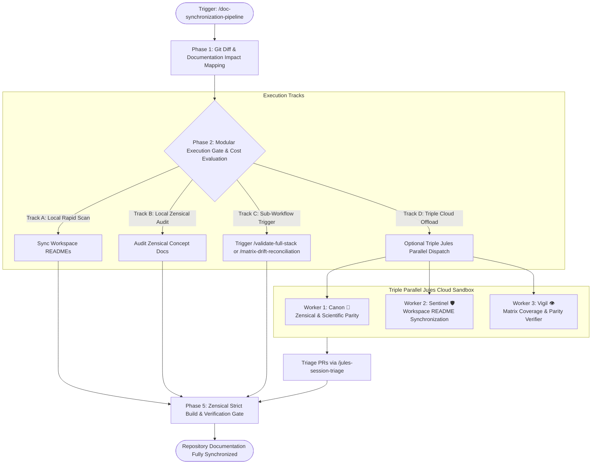

# Documentation & README Synchronization Pipeline

A comprehensive, modular pipeline designed to eliminate documentation drift across the repository following multi-module code, schema, or algorithmic refactors. It inspects all workspace README files, audits Zensical concept documentation (`docs/`), validates OKF invariants, and offers an optional **triple-parallel Jules cloud dispatch** to offload token-intensive audits.

---

## Trigger

* **Slash Command:** `/doc-synchronization-pipeline`
* **Direct Triggers:**
  * After major feature additions or vertical slice merges.
  * When modifying schemas (`src/phids/api/schemas/`) or engine systems (`src/phids/engine/systems/`).
  * Prior to tagging a new release.

---

## Architectural Sequence



---

## Phase 1: Git Diff & Documentation Impact Mapping

The orchestrator inspects active changes against `develop` or the target base commit:

```bash
git diff --name-only develop...HEAD
```

The agent correlates modified paths against the **PHIDS Documentation Impact Matrix**:

| Modified Path | Impacted Documentation Files | Verification Gate |
| --- | --- | --- |
| `src/phids/engine/systems/` | `docs/scientific_model/`, `docs/technical_architecture/engine_execution.md` | `audit_matrix_coverage.py`, `verify_matrix_trace_parity.py` |
| `src/phids/api/schemas/` | `docs/reference/api.md`, `docs/technical_architecture/state_management.md` | Pydantic schema export parity |
| `src/phids/api/routers/` | `docs/reference/api.md`, root `README.md` | HTTP route table parity |
| `.agents/` | `.agents/README.md`, `.agents/index.md`, `.agents/AGENTS.md` | `validate_okf.py` |
| `scripts/` | `scripts/README.md`, `.agents/README.md` (skills catalog) | Script flag and CLI usage checks |
| `src/data_pipeline/` | `src/data_pipeline/README.md`, `docs/scientific_model/` | NC-license boundary guard |
| `pyproject.toml`, `justfile` | Root `README.md`, `docs/development_guide/` | CLI target and dependency docs |

---

## Phase 2: Modular Execution Gate & Cost Evaluation

Because comprehensive multi-document narrative auditing is token-intensive, the agent MUST present the user with modular execution options and its personal recommendation based on change scope:

### Modular Execution Tracks

* **Track A: Workspace README Synchronization:**
  * Root `README.md`
  * `.agents/README.md`
  * `scripts/README.md`
  * `src/data_pipeline/README.md`
* **Track B: Zensical Scientific & Conceptual Parity:**
  * `docs/scientific_model/` (Part 1 through Part 4, future prospects)
  * `docs/technical_architecture/` (Engine execution, state management, ECS arrays)
* **Track C: OKF Invariant & Matrix Coverage Verification:**
  * `scripts/validate_okf.py`
  * `scripts/audit_matrix_coverage.py`
  * `scripts/verify_matrix_trace_parity.py --all`
* **Track D: Triple Cloud Offload to Jules:**
  * Dispatches 3 parallel background sessions to Google Jules to preserve local Antigravity context tokens.

### Routing Recommendation Heuristic

* **Small change (< 3 files, 1 domain):** Run locally within Antigravity (Tracks A & C).
* **Medium change (3-8 files across API and engine):** Run Track A locally; offload Track B to Jules.
* **Large change (> 8 files, behavioral equations or architectural migration):** Strongly recommend Track D (Triple Parallel Jules Dispatch) to avoid context window degradation in the local session.

---

## Phase 3: Optional Triple Parallel Jules Dispatch

When Track D is selected, Antigravity calls `jules_create_session` to launch three specialized cloud agents concurrently:

### Worker 1: Canon 📜 (Zensical Scientific Alignment)

* **Persona:** Canon (`.agents/PROMPT_TEMPLATE.md`).
* **Prompt Focus:**
  * Audits `docs/scientific_model/` and `docs/technical_architecture/` against modified engine math.
  * Preserves floating explanatory prose and biological rationale.
  * Submits PR on branch `jules/canon-zensical-sync`.

### Worker 2: Sentinel 🛡️ (Workspace README Synchronization)

* **Persona:** Sentinel (`.agents/PROMPT_TEMPLATE.md`).
* **Prompt Focus:**
  * Audits and updates root `README.md`, `.agents/README.md`, `scripts/README.md`, and subpackage guides.
  * Aligns CLI commands, directory trees, and feature matrices.
  * Submits PR on branch `jules/sentinel-readme-sync`.

### Worker 3: Vigil 👁️ (Matrix Coverage & Parity Verifier)

* **Persona:** Vigil (`.agents/PROMPT_TEMPLATE.md`).
* **Prompt Focus:**
  * Asserts 100% Data-Flow Matrix coverage across modified biological files.
  * Runs `uv run python scripts/verify_matrix_trace_parity.py --all`.
  * Fixes table drift and updates OKF frontmatter sources.
  * Submits PR on branch `jules/vigil-matrix-parity-sync`.

---

## Phase 4: Composable Sub-Workflow Delegation

This pipeline can seamlessly invoke or compose existing specialized workflows:

* **`/validate-full-stack`:** Invoke to execute the full test suite, linting, type checks, and Zensical build in a single pass.
* **`/matrix-drift-reconciliation`:** Invoke if simulation parameters shifted intentionally and documented markdown tables require automatic AST-based cell updates.
* **`/epistemic-soundness-audit`:** Invoke if deep multi-pass relational auditing of biological, mathematical, and HPC invariants is required.
* **`/jules-session-triage`:** Invoke after cloud dispatch to unblock running sessions and evaluate resulting PRs.

---

## Phase 5: Zensical Strict Build & Verification Gate

Regardless of execution track (local or cloud), the pipeline concludes with strict static documentation verification:

```bash
# 1. OKF metadata and graph structure
uv run python scripts/validate_okf.py

# 2. Strict Zensical documentation build (fails on any broken link or markdown error)
uv run zensical build -f zensical.toml -s

# 3. Data-Flow Matrix coverage & parity
uv run python scripts/audit_matrix_coverage.py
uv run python scripts/verify_matrix_trace_parity.py --all
```

A final synthesis report is generated detailing:

* All modified documentation files and their OKF freshness timestamps.
* Parity test status.
* PR links and merge recommendations if cloud tasks were dispatched.
