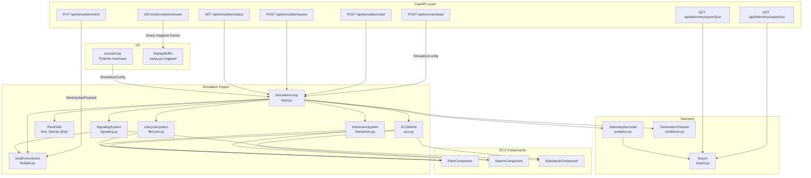
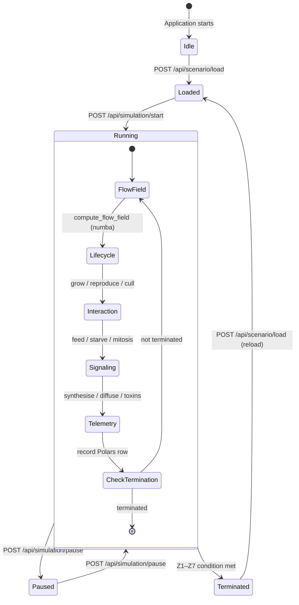
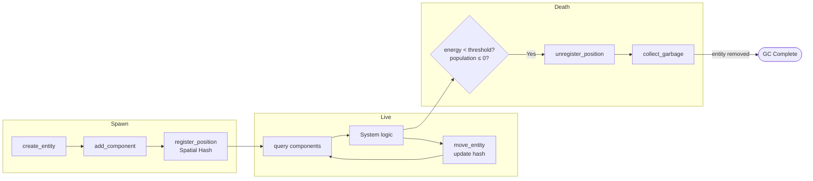

# Architecture Documentation

This document provides Mermaid.js diagrams describing the PHIDS (Plant-Herbivore Interaction &
Defense Simulator) architecture.

---

## 1. System Architecture Overview

---

## 2. Simulation Loop State Machine

---

## 3. Substance Trigger Matrix – Logical Flow

---

## 4. ECS Entity Lifecycle

