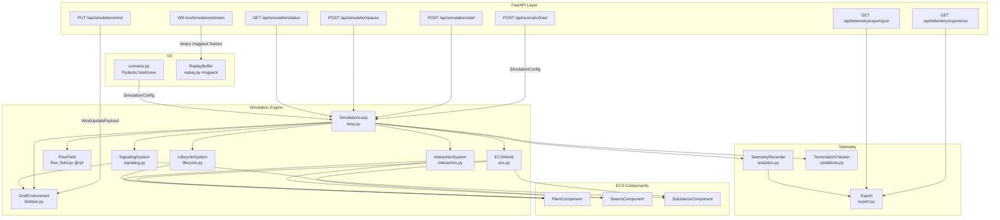
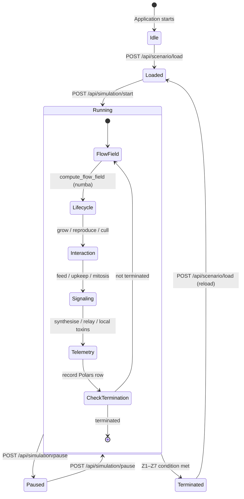
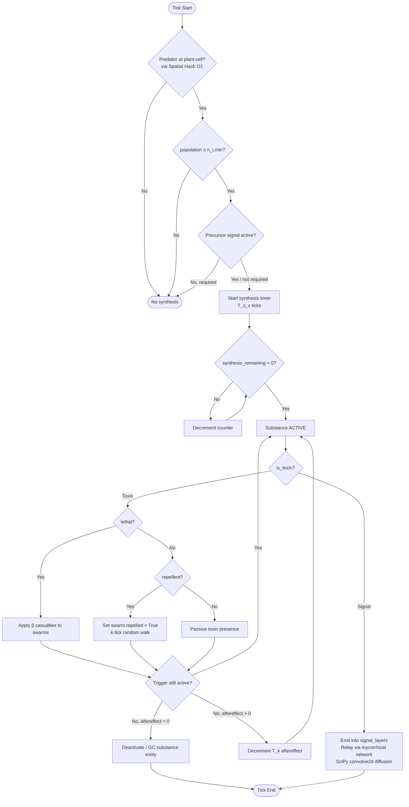

# Architecture Documentation

This document provides Mermaid.js diagrams describing the PHIDS (Plant-Herbivore Interaction &
Defense Simulator) architecture.

Unlike a minimal diagram sheet, this note should be read as a compact interpretive companion to the
rendered figures. PHIDS is architected as a deterministic ecological simulator in which discrete
biological actors, continuous environmental fields, and externally visible telemetry remain separated
by explicit ownership boundaries. The purpose of the diagrams is therefore not merely illustrative.
They make visible the causal structure of the simulation: where state enters, where it is
transformed, and where it is exported as evidence.

Readers looking for the canonical narrative architecture chapter should also consult
`docs/architecture/index.md`. The present page preserves the concise diagram-centered view while now
adding the explanatory connective tissue that helps the figures read more like a methods section than
like isolated engineering sketches.

---

## 1. System Architecture Overview

The first diagram presents PHIDS as a layered system whose central coordinating element is
`SimulationLoop`. The surrounding boxes are not interchangeable services. They represent distinct
classes of responsibility: ingress and operator control in the API layer, state ownership in the
engine and ECS components, and observational export in telemetry and replay infrastructure. The most
important architectural fact visible here is that runtime control remains centralized even though
state is distributed across specialized stores.

Interpreted scientifically, this means that PHIDS can trace a published observation back through a
bounded path: exported telemetry arises from loop-mediated engine state, which in turn arises from
validated scenario inputs and the current ordered tick sequence. That traceability is more important
than superficial modularity, because it defines how confidently simulation outcomes can be explained.

---

## 2. Simulation Loop State Machine

The state machine clarifies that PHIDS is not an always-mutating process. It alternates between
well-defined control states and, when running, advances through a fixed intra-tick phase order. This
ordering is a core part of the model semantics. A change in phase order would not be a cosmetic
refactor; it would alter what counts as the current ecological state at each point in the run.

The most important inference from this diagram is that signaling is downstream of interaction.
Plants therefore observe the ecological consequences of movement and feeding that have already
occurred during the current tick. Conversely, telemetry records the post-phase state rather than an
intermediate partial configuration. This is exactly the kind of ordering statement that should be
made explicit in simulation documentation.

---

## 3. Substance Trigger Matrix – Logical Flow

This trigger flow diagram compresses a more elaborate runtime mechanism into a single causal chain.
It shows that substance activation is not a monolithic boolean event, but a staged process involving
local threat detection, threshold checks, optional precursor or composite gating, synthesis delay,
and finally either volatile signaling or local toxin effects. The diagram is especially useful for
distinguishing between trigger presence and active defense, which are not synonymous in PHIDS.

The key architectural message is that chemical behavior remains rule-bound and spatially localized.
Predator presence is evaluated through the spatial hash, synthesis is attached to a specific owning
plant, and post-activation effects are governed by explicit persistence logic. In other words, the
diagram describes not merely a feature but a mechanistic chain of evidence from threat to response.

---

## 4. ECS Entity Lifecycle

The final figure abstracts the life history of any ECS entity into spawn, live mutation, and
garbage-collection phases. This is particularly important in PHIDS because ecological realism depends
on fast locality queries, but simulation stability depends equally on disciplined cleanup. The ECS is
therefore not just a storage technique; it is the formal mechanism by which entities become visible,
actable, and eventually removable from the world.

Taken together, the four diagrams show PHIDS as a simulation architecture in which reproducibility
depends on explicit state ownership, strict phase ordering, and bounded lifecycle transitions. That is
the level at which the documentation should be read: not as a collection of disconnected boxes and
arrows, but as an argument for why the simulator remains interpretable under change.

