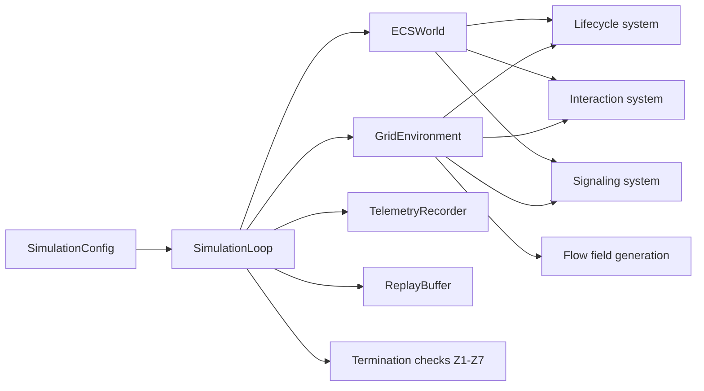

# System Architecture

PHIDS is a deterministic ecological simulation system organized around a single runtime package,
`phids.*`, under `src/phids/`. Its architecture is intentionally layered so that scientific
state transitions, operator workflows, and external interfaces remain traceable to a small set
of explicit state owners.

From a documentation perspective, this matters because PHIDS is not merely a collection of modules
that happen to cooperate. It is a constrained experimental apparatus. Each architectural boundary is
therefore also an epistemic boundary: it determines where ecological state is allowed to exist, how
it may be mutated, and which transformations can be interpreted as scientifically meaningful steps in
the simulated world.

At a high level, PHIDS combines:

1. a **validated scenario boundary** built with Pydantic,
2. a **deterministic ECS + vectorized grid engine**,
3. a **dual interface surface** consisting of REST/WebSocket APIs and a server-rendered UI,
4. a **telemetry and replay layer** for post-run inspection and export.

## Architectural Thesis

PHIDS is not structured as an object-oriented simulation of individual organisms. Instead, it is
a data-oriented runtime in which:

- discrete entities live in `ECSWorld`,
- continuous fields live in NumPy layers inside `GridEnvironment`,
- phase ordering is controlled by `SimulationLoop`,
- expensive numerical kernels are centralized and optimized,
- interface surfaces mutate validated configuration rather than arbitrary runtime internals.

This architecture is a methodological commitment as much as a software design decision. It
constrains the simulation to a deterministic, inspectable, and benchmarkable execution model.

In higher-quality scientific writing, a systems diagram is rarely presented as decoration. It is used
to make a causal claim about the model. The same principle applies here: the PHIDS architecture is
valuable not because it looks orderly, but because it makes the provenance of every observable result
recoverable from a bounded chain of state transitions.

## Runtime Center of Gravity

The architectural center of gravity is `phids.engine.loop.SimulationLoop`.

It owns or coordinates the following stateful subsystems:

- `self.env: GridEnvironment` — vectorized environmental layers,
- `self.world: ECSWorld` — entities, component indices, and the spatial hash,
- `self.telemetry: TelemetryRecorder` — tick-wise metric collection,
- `self.replay: ReplayBuffer` — deterministic snapshot accumulation,
- cached lookups derived from `SimulationConfig`, such as flora parameters, trigger rules, and
  the diet matrix.

The loop is also the only place where the engine’s ordered phases are composed into a full
simulation tick.

## Layered Decomposition

The layered decomposition below should be read from the outside inward. Validation and interface
surfaces constrain what may enter the runtime; the engine then transforms that input through ordered
phases; telemetry finally converts runtime state into persistent analytical evidence. This sequence is
what gives PHIDS its dual character as both a simulator and a reproducible experimental record.

### 1. Schema and ingress layer

This layer defines what a valid experiment is before execution begins.

- `phids.api.schemas`
- `phids.io.scenario`

Responsibilities:

- validate scenario shape and numeric bounds,
- enforce Rule-of-16 compatible matrix dimensions,
- define structured payloads for configuration and API interaction,
- serialize and deserialize scenario inputs.

### 2. Runtime engine layer

This layer advances the ecological model forward by one tick at a time.

- `phids.engine.loop`
- `phids.engine.core.biotope`
- `phids.engine.core.ecs`
- `phids.engine.core.flow_field`
- `phids.engine.systems.lifecycle`
- `phids.engine.systems.interaction`
- `phids.engine.systems.signaling`

Responsibilities:

- store plant, swarm, and substance entities,
- maintain vectorized environmental state,
- compute the global flow field,
- execute ordered lifecycle, interaction, and signaling systems,
- rebuild read-visible layers after writes,
- evaluate termination conditions.

### 3. Interface layer

This layer exposes the engine without making the UI the primary state owner.

- `phids.api.main`
- `phids.api.ui_state`
- `src/phids/api/templates/`

Responsibilities:

- provide REST control and scenario-loading endpoints,
- stream runtime state over WebSockets,
- maintain `DraftState` as the editable server-side UI model,
- render HTMX/Jinja partials for configuration and observation.

### 4. Telemetry and persistence layer

This layer transforms runtime state into analytical artifacts.

- `phids.telemetry.analytics`
- `phids.telemetry.conditions`
- `phids.telemetry.export`
- `phids.io.replay`

Responsibilities:

- collect per-tick ecological summary metrics,
- evaluate `Z1`–`Z7` termination conditions,
- export telemetry in tabular formats,
- preserve replayable state snapshots.

## Canonical State Owners

One of the most important architectural properties of PHIDS is that state has clear owners.

### `SimulationConfig`

Defines the validated experimental input. It is the canonical schema-level description of a run.

### `DraftState`

Defines the editable UI-side scenario draft. It is not the live runtime.

### `SimulationLoop`

Defines the live runtime controller once a draft or scenario has been loaded.

### `ECSWorld`

Owns discrete entities and their component associations, including the spatial hash used for
locality queries.

### `GridEnvironment`

Owns vectorized grid-aligned state such as plant energy, signal layers, toxin layers, wind, and
the current flow field.

This separation is crucial: the UI never directly becomes the engine, and the engine never treats
template state as authoritative runtime state.

## Data Flow Across a Tick

The runtime data flow can be summarized as follows:

This diagram intentionally emphasizes ownership rather than network topology: `SimulationLoop`
is the orchestrator, while `ECSWorld` and `GridEnvironment` are the principal runtime stores.

What the diagram suppresses for clarity, but what contributors should keep in mind, is that the two
stores play very different scientific roles. `ECSWorld` holds discrete biological actors and their
local relations; `GridEnvironment` holds continuous spatial fields whose values are meaningful only
because the loop updates them in a stable phase order. The architecture therefore couples discrete
and continuous representations without allowing either to become an informal side channel.

This separation is especially important for interpretation of downstream telemetry. When a swarm
changes position, the meaning of that change is grounded in ECS locality and spatial-hash updates.
When a signal plume spreads, the meaning of that spread is grounded in buffered field propagation.
The architecture is designed so these two kinds of evidence can coexist without collapsing into one
another.

## Current-State Determinism Model

PHIDS presently achieves determinism through ordered execution, explicit tick control, and
buffered environmental updates. The strongest determinism anchors are:

- an `asyncio.Lock` protecting `SimulationLoop.step()`,
- a fixed phase ordering,
- pre-allocated arrays and bounded matrix dimensions,
- centralized flow-field generation,
- replay snapshots appended once per tick.

The codebase also describes this in double-buffering terms. In current implementation, that is
most concrete in `GridEnvironment`, where plant-energy aggregates and diffusion layers have
distinct read and write buffers that are swapped after updates. PHIDS is therefore best described
as having **buffered environmental state** rather than a fully duplicated whole-world state.

That distinction should be stated carefully. The simulator does not construct a second complete
universe for every tick. Instead, it isolates the numerically sensitive environmental fields that most
need read/write discipline, while relying on deterministic phase sequencing for the entity world.
This is a pragmatic architecture: strict where numerical stability and interpretability demand it,
and deliberately lighter where a full mirrored world would add cost without corresponding scientific
benefit.

## Architectural Invariants

The following invariants are essential to the current implementation and should be treated as
non-negotiable unless the simulator’s research model is explicitly redefined.

### Data-oriented entity model

Entities are lightweight IDs with attached components, not deep behavior-rich object graphs.

### Vectorized environmental storage

Continuous spatial fields are NumPy arrays. Multi-dimensional Python lists are not an accepted
runtime representation for biotope state.

### Bounded configuration space

The Rule of 16 is encoded in `phids.shared.constants` and reflected in the environment’s
pre-allocated species-specific layers.

### Locality-sensitive interactions

Co-location checks rely on `ECSWorld.entities_at()` and related spatial-hash helpers rather than
quadratic distance scans.

### Centralized global guidance field

Movement decisions are derived from a single global flow field rather than per-agent search.

### Separation of draft and live state

The HTMX/Jinja UI edits `DraftState`; only an explicit load action produces a live
`SimulationLoop`.

## Architectural Boundaries and Current Limitations

The current implementation intentionally blurs neither scientific specification nor engineering
ownership, but some boundaries are important to state precisely:

- environmental double-buffering is strong; whole-world double-buffering is more limited and is
  mediated through ordered system execution,
- some runtime behavior is still concentrated in overview modules rather than split into more
  specialized policy objects,
- telemetry and replay preserve coarse serialized state, not every intermediate transient.

These are not flaws in themselves; they are part of the present architectural state and should be
documented as such.

For that reason, PHIDS documentation should read less like promotional software copy and more like a
methods section. The aim is not to claim maximal elegance, but to state exactly which architectural
guarantees are presently strong, which are intentionally bounded, and which remain topics for future
refinement. That style is the best fit for a simulator whose credibility depends on traceability more
than on abstraction for its own sake.

## Where to Read Next

- For ordered tick semantics: [`../engine/index.md`](../engine/index.md)
- For research framing and scope: [`../foundations/index.md`](../foundations/index.md)
- For API and UI state boundaries: [`../interfaces/index.md`](../interfaces/index.md) and
  [`../ui/index.md`](../ui/index.md)
- For export, replay, and termination: [`../telemetry/index.md`](../telemetry/index.md)

## Legacy Provenance

The diagrammatic and conceptual basis for this section is preserved in:

- `legacy/2026-03-11/architecture.md`
- `legacy/2026-03-11/comprehensive_description.md`
