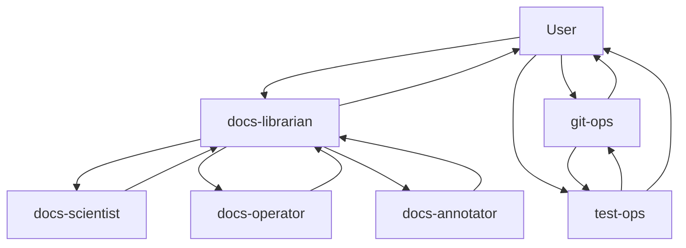
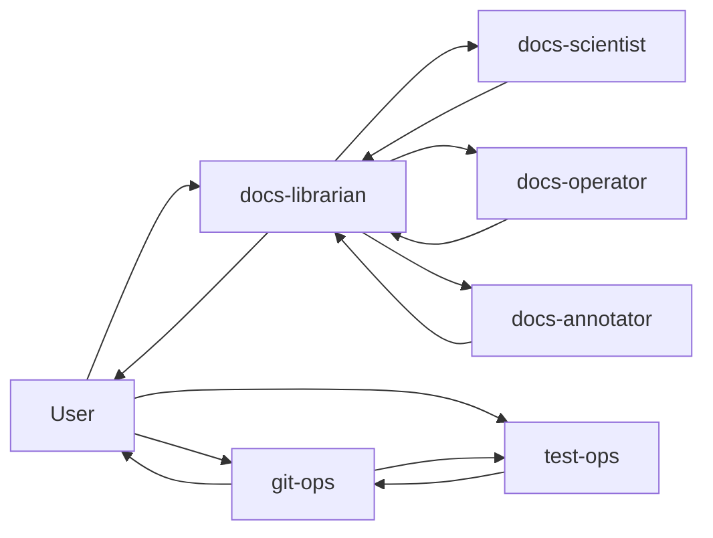

# Agent Ecosystem and Governance

PHIDS uses a deliberately partitioned agent ecosystem to keep documentation, repository operations, and test recovery aligned with the project’s scientific and architectural constraints. The intent is not to multiply roles for its own sake. The intent is to separate concerns so that each agent receives a narrow, well-defined responsibility surface, while a small number of coordinator roles preserve traceability, QA discipline, and authorization boundaries. In practice, this means that documentation tasks are routed through `docs-librarian`, repository lifecycle operations are routed through `git-ops`, and test-failure recovery is routed through `test-ops`, with the user remaining the root requester and final decision point.

The agent model is easiest to understand as a governance layer above the repository itself. The simulator remains a deterministic codebase with a strict data-oriented core, but the surrounding human-and-agent workflow needs its own structure so that documentation, testing, and Git operations do not blur into one another. The documentation agents explain the system, the operational agent manages repository motion, and the testing agent restores confidence when validation fails. This separation is especially important in PHIDS because quality gates are not ornamental: `pytest`, coverage thresholds, benchmark discipline, and `mkdocs --strict` are all part of the delivery contract.

## Purpose of the Agent Mesh

The agent mesh exists to make complex work more reviewable. A single general-purpose instruction stream is not sufficient for PHIDS because the repository includes at least three distinct kinds of work: scientific explanation, operational procedure, and executable recovery. The documentation agents need to speak in the correct prose mode for their surface; the Git agent needs to preserve clean repository history and respect explicit authorization for remote-impacting actions; the test agent needs to triage failing checks deterministically and restore a passing state before publication continues.

The project therefore treats each agent as a specialist with an explicit remit. Coordinator agents collect work, delegate to the correct specialist, and perform the final QA pass. This keeps implementation truth, documentation truth, and verification truth separated until they can be reconciled deliberately.

## Current Agent Roles

### `docs-librarian`

`docs-librarian` is the documentation coordinator and QA gatekeeper. It owns the structure of the documentation corpus, assigns concrete work to the specialist documentation agents, and decides whether the result is sufficiently aligned with current repository behavior. It should verify nav integrity, traceability, and writing-mode compliance before closing a documentation task.

### `docs-scientist`

`docs-scientist` owns scientific and algorithmic explanation. It should be used for engine and foundations material, or for any documentation that needs precise treatment of ECS, double-buffering, flow-field logic, metabolic attrition, spatial-hash locality, or other scientific mechanics. Its work should favor formal exposition and, when useful, Mermaid diagrams or equations.

### `docs-operator`

`docs-operator` owns operational prose. It should be used for contributor workflows, CI rehearsal, release procedures, and practical runbooks. Its content should be direct, reproducible, and command-oriented, while still retaining enough explanatory prose to explain why a workflow exists.

### `docs-annotator`

`docs-annotator` owns Python docstrings and test docstrings. It should only refine documentation embedded in code and tests, keeping the implementation unchanged. Its responsibility is to ensure scholarly Google-style prose, section ordering, and meaningful explanation of behavior where the code surface warrants it.

### `git-ops`

`git-ops` owns repository lifecycle motion: staging, commits, signing, branching, rebasing, merges, pushes, pull-request workflows, tagging, and publication preparation. It must preserve clean commit slices and it must treat remote-impacting actions as authorization-gated. If validation fails, it should delegate recovery to `test-ops` before resuming publication work.

### `test-ops`

`test-ops` owns deterministic test execution, failure isolation, coverage recovery, and verification handoff. It should start with the smallest valid failing slice, expand only as needed, and report a recheck bundle back to `git-ops` or the user. It is the specialist for turning broken validation into actionable root-cause evidence.

## Coordination Hierarchy

The current hierarchy is intentionally narrow.

This diagram expresses two separate ideas. First, `docs-librarian` is the coordination hub for documentation workstreams. Second, `git-ops` and `test-ops` form an operational loop in which failure recovery precedes publication. The user remains above the system as the root requester and approval authority, while the agents provide specialization and traceable execution.

## Invocation and Reporting Paths

The invocation path is not symmetrical. Some agents are best invoked directly by the user, while others are best reached through a coordinator.

This routing keeps work pieces small. The documentation coordinator assigns scope and quality criteria, the specialist executes within that scope, and the coordinator validates the result. The Git and test specialists operate in the same spirit: `git-ops` handles repository motion, but if validation fails it should move the problem to `test-ops` rather than pushing uncertainty downstream.

## What the Documentation Should Explain

Future documentation pages should explain the agent ecosystem from several angles rather than collapsing everything into one abstract overview.

1. **Authority and routing** — which agent may invoke which other agent, and under what kind of task.
2. **Reporting and QA** — which agent reports back to whom, and what evidence must be returned.
3. **Operational boundaries** — which work belongs in docs, which belongs in Git operations, and which belongs in validation recovery.
4. **MCP-facing capability model** — how resources, prompts, and tools differ once the server surfaces them, and why that matters for PHIDS.
5. **Current state versus future state** — what is already implemented in the repository and what remains an intended extension.

For PHIDS, this distinction matters because the repository already has a functioning multi-agent workflow, but not every future integration is implemented yet. Documentation should therefore be explicit about present capability and future extension, especially when discussing MCP exposure, internal resources, or agent-specific tools.

## MCP Concepts in the PHIDS Context

The multi-agent model is closely related to MCP, but the concepts should be described carefully. An MCP server can expose read-only resources, executable tools, and prompt templates. Those three surfaces are not the same thing, and they should not be documented as if they were interchangeable.

In PHIDS, the important point is that the agent ecosystem and the MCP server ecosystem are adjacent layers. The agents describe how work is routed, who coordinates whom, and which roles exist. MCP describes what data or actions a connected AI may access through a server. The documentation should therefore keep the governance layer separate from the transport layer, while still explaining how they interact.

A useful future section can describe the distinction in concrete terms:

- **Resources** are read-only data surfaces.
- **Tools** are executable actions.
- **Prompts** are pre-authored templates.

This page intentionally does not define a PHIDS MCP implementation contract yet. That material belongs in a follow-up chapter once the server surfaces are actually implemented and stabilized.

## Writing and Review Rules

Documentation about the agent ecosystem should follow the normal PHIDS writing conventions.

- `docs-librarian` should own the overall structure and final QA.
- `docs-scientist` should write the conceptual and architectural sections.
- `docs-operator` should write the procedural and workflow sections.
- `docs-annotator` should be reserved for code-level docstrings, not for narrative pages.
- `git-ops` and `test-ops` should be described as operational specialists with explicit handoff rules.

The prose should remain current-state oriented. If a future capability is discussed, the text should label it clearly as planned or hypothetical rather than implied fact.

## Summary

The agent ecosystem is a governance mechanism for keeping PHIDS documentation, Git motion, and test recovery disciplined. It should make specialization visible, route work to the correct expert, and preserve a clear escalation path back to the user. The documentation task for this area is therefore not to invent new authority, but to make the existing authority relationships explicit, navigable, and reviewable.

Related chapters:

- [`agent-ownership-delegation.md`](agent-ownership-delegation.md)
- [`agent-invocation-and-reporting.md`](agent-invocation-and-reporting.md)
- [`agent-target-state-blueprint.md`](agent-target-state-blueprint.md)
- [`mcp-capability-model.md`](mcp-capability-model.md)
- [`mcp-lifecycle.md`](mcp-lifecycle.md)
