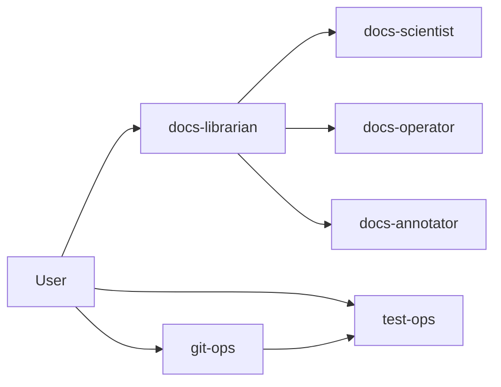
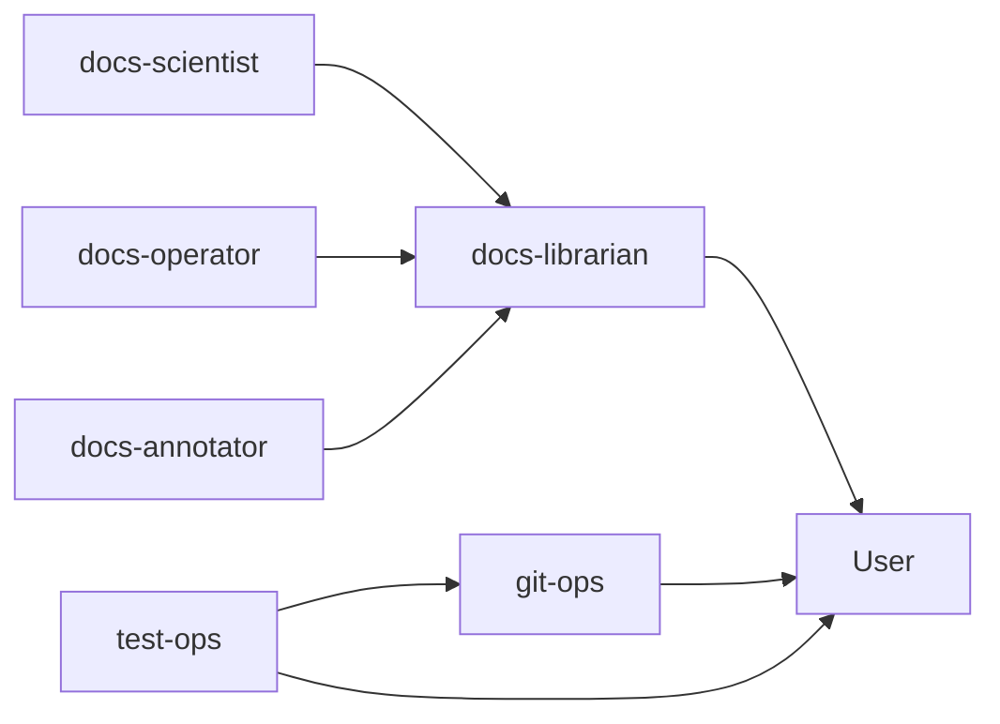

# Agent Invocation and Reporting

This chapter specifies how PHIDS agents are invoked, what they are expected to report, and how evidence is evaluated before a task is considered complete. The goal is operational determinism: requests should follow predictable routing, and responses should be verifiable without relying on implicit assumptions.

The invocation model distinguishes coordinator-mediated flows from direct specialist calls. Documentation work is generally coordinated through `docs-librarian`; Git and testing surfaces may be invoked directly through `git-ops` and `test-ops` when the task is operational by nature.

## Invocation Paths

## Reporting Paths

## Direct Invocation Contract

When a specialist is invoked directly, responses should follow a fixed structure:

- `Checklist`
- `Findings`
- `Actions Taken`
- `Evidence`
- `Verification`
- `Open Risks`

This format is intended to prevent ambiguous closure statements and to ensure that blocked execution is reported explicitly.

## Evidence Requirements

- Material claims must cite concrete paths (line references when available).
- Tool-backed checks should be preferred over inferred statements.
- If required checks cannot run, the response should include exact reproduction commands and a blocked status.

## Completion Criteria

A task should not be treated as complete until:

1. Requested file or state changes are verified.
2. Required quality gate checks are run, or explicitly marked blocked with commands.
3. Remaining risks are listed with actionable next steps.

## Anti-Patterns

- Emitting raw tool envelopes in user-visible output.
- Claiming completion without evidence.
- Mixing coordinator responsibilities with unassigned specialist scope.
- Hiding blocked tool steps instead of reporting fail-closed status.

## Summary

Invocation and reporting contracts in PHIDS are explicit by design. Structured outputs, evidence-backed claims, and fail-closed behavior ensure that agent interactions remain reviewable and safe under strict quality constraints.
