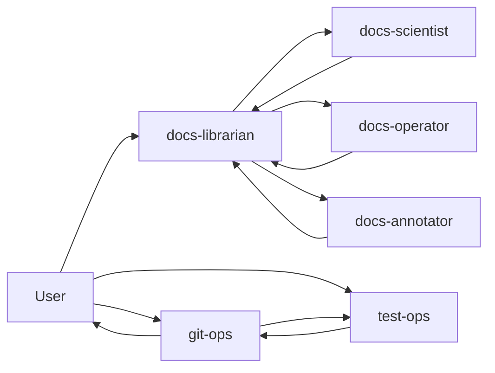
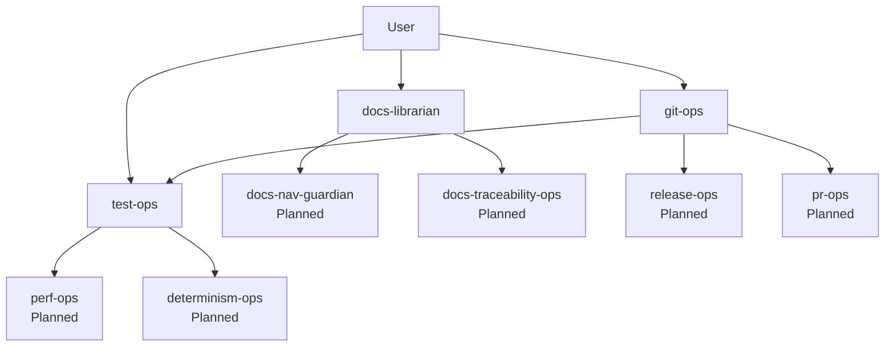

# Agent Ecosystem Target-State Blueprint

This chapter defines the target-state design for the PHIDS multi-agent ecosystem while preserving a strict distinction between implemented controls and planned expansion. The intent is to create a comprehensive planning surface that can guide incremental rollout without conflating roadmap intent with current operational truth.

The chapter is normative for planning, not for immediate enforcement. Sections explicitly labeled as implemented describe active behavior. Sections labeled as planned describe intended behavior pending implementation, validation, and policy promotion.

## Reading Contract

Use these status labels consistently when reading or updating this chapter:

- `Implemented`: active and currently enforced.
- `Planned`: approved design target, not yet enforced.
- `Experimental`: partial trial surface under active evaluation.
- `Deprecated`: retained for historical context, not recommended.

## Implemented Baseline

### Implemented Agent Set

| Agent | Status | Current Ownership |
|---|---|---|
| `docs-librarian` | Implemented | Documentation orchestration and final docs QA |
| `docs-scientist` | Implemented | Scientific and algorithmic narrative sections |
| `docs-operator` | Implemented | Operational/runbook documentation |
| `docs-annotator` | Implemented | Python docstring-only surfaces |
| `git-ops` | Implemented | Repository lifecycle and publication workflows |
| `test-ops` | Implemented | Test triage, recheck, and coverage recovery |

### Implemented Delegation Graph

### Implemented Guardrails

- Documentation work is coordinator-driven through `docs-librarian`.
- Remote-impacting Git actions remain authorization-gated.
- Failing tests and coverage gates escalate to `test-ops` before publish continuation.
- Direct-invocation outputs are evidence-first and fail-closed when tools are blocked.

## Planned Role Families

The target-state model organizes agents into role families so future additions can be planned without flattening responsibilities.

### 1. Documentation Family

- Coordinator: `docs-librarian`.
- Specialists: `docs-scientist`, `docs-operator`, `docs-annotator`.
- Planned additions:
  - `docs-nav-guardian` (navigation and link integrity sweeps).
  - `docs-traceability-ops` (requirements-to-code/docs mapping maintenance).

### 2. Verification Family

- Current: `test-ops`.
- Planned additions:
  - `perf-ops` (benchmark regression triage and performance budget tracking).
  - `determinism-ops` (replay determinism checks and seed-consistency audits).

### 3. Delivery Family

- Current: `git-ops`.
- Planned additions:
  - `release-ops` (release candidate preparation, tagging policy checks, release artifact readiness).
  - `pr-ops` (PR hygiene, reviewer assignment policy, merge-queue preparation).

### 4. Domain-Focused Engineering Family (Planned)

- `api-contract-ops`: API schema drift and compatibility planning.
- `scenario-ops`: scenario authoring validation policy and catalog consistency.
- `telemetry-ops`: analytics/export contract validation and dashboard payload schema stewardship.

## Planned Delegation Expansion

The target-state graph preserves single-owner closure per workstream while allowing conditional specialist fan-out.

## MCP Ownership Model

The MCP capability surface should be planned by server domain, then assigned by primary owner and verification owner.

| MCP Domain | Capability Type | Primary Owner | Verification Owner | Status |
|---|---|---|---|---|
| Documentation MCP | resources/tools/prompts for docs workflows | `docs-librarian` | `docs-librarian` | Planned |
| Git MCP | repository lifecycle actions | `git-ops` | `test-ops` (when gate-related) | Implemented/Planned split |
| Test MCP | test execution and diagnostics surfaces | `test-ops` | `test-ops` | Implemented/Planned split |
| Performance MCP | benchmark and budget telemetry surfaces | `perf-ops` | `test-ops` | Planned |
| Release MCP | release publication and artifact checks | `release-ops` | `git-ops` | Planned |

## Tool, Resource, Prompt Planning Rules

For each planned MCP capability, planning documentation should include:

1. Capability class (`tool`, `resource`, or `prompt`).
2. Owning server domain and owning agent.
3. Side-effect classification (`read-only`, `local mutation`, `remote-impacting`).
4. Required verification command and expected evidence.
5. Promotion criteria from `Planned` to `Implemented`.

## Promotion Criteria (Planned -> Implemented)

A planned agent capability or MCP surface should not be marked implemented until all conditions are met:

1. Ownership is assigned in this chapter and cross-linked from role documentation.
2. Invocation and reporting contract is documented.
3. Verification path is executable and reproducible.
4. Evidence is captured in passing quality gates relevant to the surface.

## Roadmap Phases

### Phase A: Consolidate Current Controls

- Keep current agent set as canonical.
- Ensure docs pages remain aligned and non-duplicative.

### Phase B: Verification Specialization

- Introduce `perf-ops` and `determinism-ops` planning and acceptance criteria.
- Define benchmark and determinism escalation triggers.

### Phase C: Delivery Specialization

- Introduce `release-ops` and `pr-ops` planning.
- Define publish/release workflow interfaces with `git-ops`.

### Phase D: Domain Stewards

- Plan API/scenario/telemetry steward agents.
- Define drift detection and contract verification surfaces.

## Cross-References

- `development/agent-ecosystem-and-governance.md`
- `development/agent-ownership-delegation.md`
- `development/agent-invocation-and-reporting.md`
- `development/mcp-capability-model.md`
- `development/mcp-lifecycle.md`

## Summary

The PHIDS target-state blueprint is a staged expansion plan, not a claim of immediate implementation. It preserves current operating truth while providing a structured path to fuller agent specialization and MCP capability governance.
