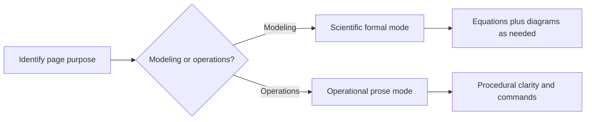

# Documentation Standards

PHIDS documentation is a maintained product surface with the same quality expectations applied to source code. Every canonical page must be current-state accurate, traceable to implementation, and compatible with strict MkDocs builds used in local rehearsal and GitHub Actions. This chapter defines the contributor standard for writing, structuring, and validating documentation updates.

## Documentation Responsibilities

The documentation corpus has three concurrent responsibilities. It must explain the simulator as an architectural and scientific system, map claims to real modules and tests, and preserve historical provenance without allowing legacy intent to override current implementation behavior. A page that fails any one of these responsibilities is incomplete.

## Required Writing Modes

PHIDS uses two required writing modes. Scientific formal mode applies to modeling and algorithm chapters, especially under `docs/engine/*` and `docs/foundations/*`, where equations and Mermaid state-flow diagrams improve explanatory precision. TikZ is reserved for geometry-constrained figures that Mermaid cannot represent faithfully, such as coordinate-anchored constructions and stencil-like layouts. Operational prose mode applies to administrative checklists, CI/CD workflow pages, release operations, and contributor runbooks, where practical clarity and reproducible steps are more important than symbolic formalization.

Contributors must choose the mode that matches the page purpose. Scientific pages should provide rigorous floating-text explanation of mechanics and rationale. Operational pages should avoid equation-heavy presentation and instead prioritize direct narrative guidance, compact process diagrams, and copyable commands.



## Current-State and Traceability Rule

Canonical pages describe what the repository currently does. They should reference real symbols, routes, and modules, and they should prefer tested behavior over aspirational architecture language. When implementation is nuanced or constrained, document the nuance explicitly rather than smoothing it into generic statements.

Useful anchors include runtime symbols (`SimulationLoop`, `GridEnvironment`, `ECSWorld`, `DraftState`), owning modules under `src/phids/`, and corroborating tests under `tests/`. Claims that are sensitive to edge behavior should cite the most relevant test file so readers can verify semantics directly.

## Legacy Provenance Rule

Legacy documents under `docs/legacy/` remain archival evidence, not active authority. During migration, preserve legacy sources, write fresh current-state prose in canonical pages, and note provenance when historical context materially aids interpretation. If legacy design intent diverges from current implementation, document the implementation truth and describe the divergence plainly.

## Docstrings and API Surface

Docstrings are part of the rendered documentation surface through mkdocstrings. Public-facing modules and symbols should maintain Google-style docstrings aligned with current behavior and existing type hints. Contributors should avoid duplicative narrative between module pages and API reference output; narrative chapters explain system behavior, while API reference pages enumerate module and symbol surfaces.

## Navigation and Build Contract

Navigation in `mkdocs.yml` is part of the build contract. When adding or restructuring canonical pages, update navigation entries in the same change set so strict builds remain green. Documentation changes are complete only when strict build validation succeeds.

```bash
uv run mkdocs build --strict
```

## Practical Update Workflow

A reliable contributor workflow is to identify the owning subsystem, review implementation and relevant tests, draft the page in the correct writing mode, add cross-links to adjacent chapters, update `mkdocs.yml` if navigation changed, and run strict docs build before opening review. For non-trivial updates, run the repository test suite to ensure behavior claims remain synchronized with executable state.

## Verification Anchors

Primary policy anchors for this standard are `mkdocs.yml`, `pyproject.toml`, `.pre-commit-config.yaml`, `.github/workflows/ci.yml`, and the canonical pages under `docs/reference/` and `docs/development/`.

For adjacent guidance, see `docs/development/contribution-workflow-and-quality-gates.md`, `docs/development/scientific-authoring-workflow.md`, and `docs/reference/module-map.md`.
