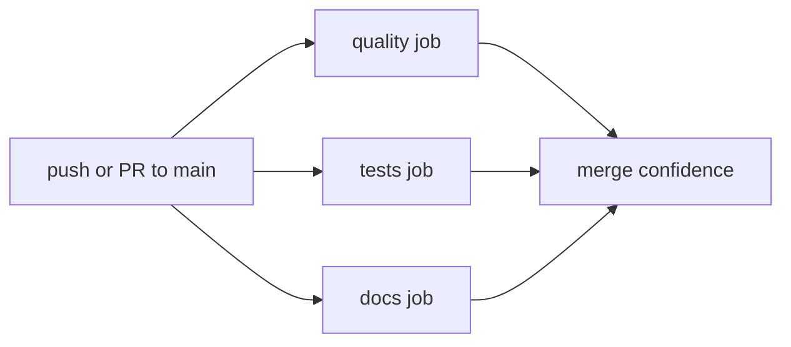

# GitHub Actions and Local CI Rehearsal

PHIDS treats continuous integration as an architectural safeguard rather than a packaging afterthought. The workflow design couples source-quality gates, deterministic simulation tests, and strict documentation rendering so that each merge candidate remains executable, analyzable, and publishable on GitHub Pages without manual intervention. The production documentation site at `https://foersben.github.io/PHIDS/` is built from the same strict MkDocs command used in local rehearsal and CI jobs, which keeps deployment semantics transparent and reproducible.

## CI Topology and Trigger Policy

The repository uses focused GitHub Actions jobs for quality checks, full test execution, and documentation buildability. These jobs run on GitHub-hosted Linux runners and are triggered on pushes to `main`, pull requests targeting `main`, and manual dispatch events. This trigger scope is intentionally narrow to preserve compute budget during exploratory branch development while preserving strict merge gates at integration boundaries.

The job decomposition in `.github/workflows/ci.yml` separates lint/format diagnostics, full `pytest` execution with coverage policy, and strict MkDocs rendering. This separation reduces diagnostic ambiguity because failures can be attributed directly to the phase that produced them, instead of surfacing as blended multi-tool output in one monolithic job.

## GitHub Pages Compatibility Contract

Documentation publication is managed through `.github/workflows/docs-pages.yml`, with `uv run mkdocs build --strict` as the non-negotiable build gate before deployment. To preserve compatibility with the current Material theme stack and plugin ecosystem, PHIDS constrains MkDocs to major version 1 in `pyproject.toml` (`mkdocs>=1.6,<2`). This version policy avoids unresolved MkDocs 2 transition risks and stabilizes page rendering for Mermaid, KaTeX, and Kroki-backed TikZ integration.

In practice, publishability requires three concurrent conditions: the quality job must pass, the full test job must pass under the configured coverage threshold, and the strict documentation job must pass. If any one of these gates fails, the release candidate is treated as non-deployable until the failing gate is resolved.

## Local Rehearsal Strategy

Local rehearsal has two complementary modes. The fast parity path executes repository commands directly on the developer machine and is suitable for rapid pre-push confidence checks. The containerized parity path uses `act` to emulate GitHub Actions job topology under runner containers, which is useful when workflow behavior itself is being modified.

In both modes, hook discipline remains important because PHIDS enforces separate pre-commit and pre-push checks. The pre-push path includes strict mypy, full tests, and strict documentation build, so local contributor validation remains close to merge-gate semantics even when hosted CI is intentionally narrower.

## Benchmarks and Runtime Confidence

Benchmark tests remain in the canonical `pytest` run because the flow-field and spatial-hash benchmarks currently serve as regression sentinels for algorithmic hotspots. This policy reflects a scientific-engineering priority: behaviorally correct but computationally unstable kernels are treated as integration risks, not merely optimization backlog.

## Operational Evidence and Cross-References

Current implementation evidence for this chapter is grounded in `.github/workflows/ci.yml`, `.github/workflows/docs-pages.yml`, `.actrc`, `scripts/local_ci.sh`, `scripts/run_ci_with_act.sh`, `.pre-commit-config.yaml`, and `pyproject.toml`. Related policy detail is elaborated in `docs/development/contribution-workflow-and-quality-gates.md`, `docs/development/testing-strategy-and-benchmark-policy.md`, and `docs/development/scientific-authoring-workflow.md`.
