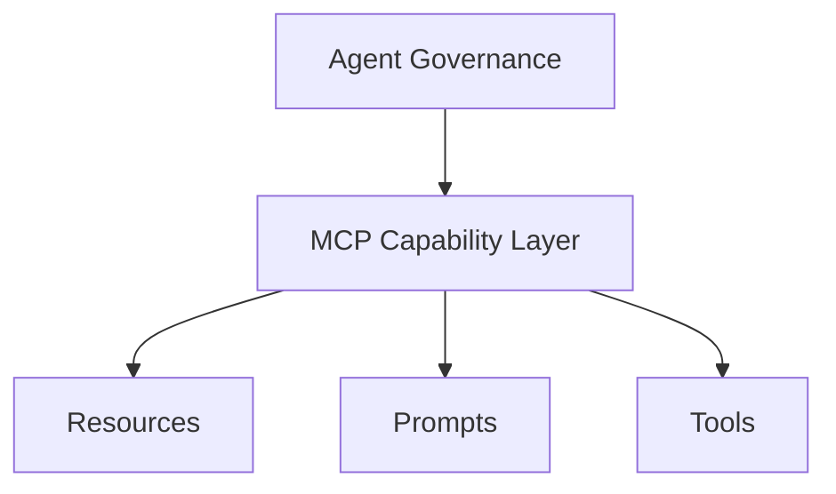

# MCP Capability Model

This chapter explains how Model Context Protocol (MCP) capability surfaces should be interpreted in PHIDS documentation and operations. The purpose is to keep governance responsibilities separate from runtime capability exposure while still documenting their interaction.

Agent governance answers who should perform work. MCP capability answers what an AI can read or execute through a connected server. These are related but not interchangeable concerns.

## Capability Classes

### Resources

Resources are read-only data surfaces. They provide state visibility without execution side effects.

### Prompts

Prompts are reusable templates. They improve consistency of repeated tasks but do not mutate runtime state by themselves.

### Tools

Tools are executable actions. They require explicit handling of side effects, safety boundaries, and verification.

## Capability Model in PHIDS

This separation helps avoid category errors in documentation. A role assignment in governance does not automatically imply an MCP tool exists for that action.

## Current-State Reporting Rule

MCP documentation should always distinguish:

- currently implemented capability,
- planned or proposed capability.

If a server exposes no resources or no tools, documentation should say so explicitly.

## Safety and Traceability Expectations

For any documented tool capability, include:

1. Input contract.
2. Side effects.
3. Failure modes.
4. Verification path.
5. Operator authorization boundary when relevant.

For any documented resource capability, include:

1. Identifier/path convention.
2. Data provenance.
3. Consistency expectations.

## Cross-References

- `development/agent-ecosystem-and-governance.md`
- `development/agent-ownership-delegation.md`
- `development/agent-invocation-and-reporting.md`

## Summary

The MCP capability model in PHIDS exists to document read, template, and execute surfaces without blurring governance logic. Treat capability claims as implementation-truth statements, and mark future extensions as planned work.
