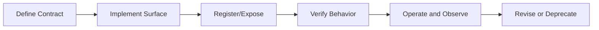

# MCP Tool, Resource, and Prompt Lifecycle

This chapter defines lifecycle stages for MCP-facing artifacts in PHIDS documentation and operational review. The objective is to ensure each capability class is introduced, validated, and maintained with explicit traceability requirements.

## Lifecycle Stages

## Stage Requirements

### 1. Define Contract

- State capability class (`resource`, `prompt`, or `tool`).
- Define ownership and expected behavior.
- Define safety constraints and authorization assumptions.

### 2. Implement Surface

- Implement in the owning server/module.
- Keep naming and payload conventions deterministic.
- Avoid undocumented side effects.

### 3. Register and Expose

- Ensure the capability is discoverable by clients.
- Document identifiers and usage expectations.

### 4. Verify Behavior

- Run targeted checks for availability and contract conformance.
- Include reproducible commands in verification notes.
- Fail closed if checks cannot run.

### 5. Operate and Observe

- Monitor whether usage matches documented behavior.
- Capture drift, stale assumptions, or error patterns.

### 6. Revise or Deprecate

- Update docs and navigation when behavior changes.
- Mark deprecated surfaces explicitly and provide migration notes when needed.

## Documentation Completion Gates

For lifecycle-related documentation updates, completion requires:

1. Page content updated with current-state accuracy.
2. `mkdocs.yml` nav wiring updated for new canonical pages.
3. Landing-page cross-links updated where applicable.
4. `uv run mkdocs build --strict` status recorded.

## Handoff Alignment

- Documentation lifecycle coordination: `docs-librarian`.
- Test or coverage verification tied to lifecycle claims: `test-ops`.
- Publication lifecycle actions after validation: `git-ops`.

## Summary

Lifecycle documentation ensures MCP capability surfaces are treated as managed contracts rather than ad-hoc features. This keeps PHIDS governance, validation, and publication workflows aligned with implementation truth.
