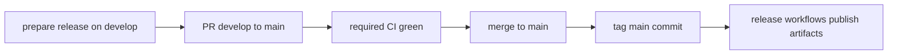

# Release Checklist

This chapter defines the operational release path for PHIDS from prepared candidate on `develop` to published artifacts on GitHub Releases, GHCR, and GitHub Pages. The process is intentionally split into a promotion boundary and a publication boundary so every shipped version can be traced to one audited commit lineage.

The promotion boundary (`develop` to `main`) verifies that the candidate is merge-ready under all required quality and documentation gates. The publication boundary (version tag on `main`) triggers immutable release workflows for binaries, container images, and release metadata.



## Preconditions

Before opening the promotion pull request, confirm version updates are consistent across release-visible surfaces, release-facing documentation is current, and no unrelated artifacts are staged. Run the full local quality gate before requesting review.

```bash
uv sync --all-extras --dev
uv run ruff check .
uv run ruff format --check .
uv run mypy
uv run pytest
uv run mkdocs build --strict
```

## Promotion to `main`

Push release-preparation commits to `develop`, open a pull request targeting `main`, and wait for all required checks in `.github/workflows/ci.yml` to pass. Merge only through the protected-branch policy configured for the repository. Documentation publication to GitHub Pages then proceeds through `.github/workflows/docs-pages.yml` on `push` to `main`.

## Tag and Publish

After merge, tag the exact `main` commit intended for release. Use an annotated semantic version tag and push it to trigger publication workflows.

```bash
git checkout main
git pull --ff-only origin main
git tag v0.4.0
git push origin v0.4.0
```

Tag publication triggers `.github/workflows/release-binaries.yml` for bundled platform artifacts and `.github/workflows/docker-publish.yml` for GHCR image publication.

## Post-Release Verification

Verify that the GitHub release entry exists and includes expected binaries, GHCR image tags are present for the version line, GitHub Pages serves the updated documentation, and version references in `README.md` and release-facing docs match the shipped semantic version.

## Failure Handling

If publication fails, do not silently retag a different commit under the same version label. Fix forward on `develop`, promote again through `main`, and cut the next semantic version tag unless repository policy explicitly permits rerunning the same tag without content drift.
