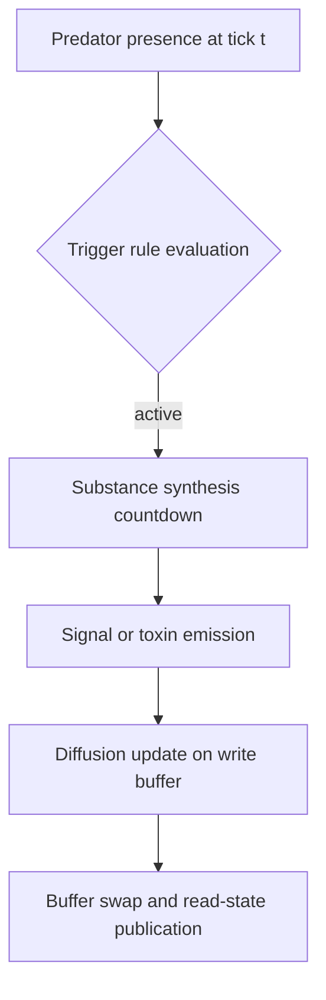
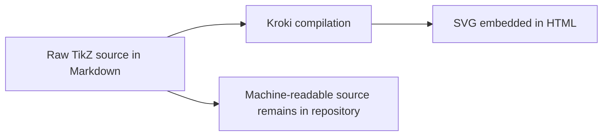

# Scientific Authoring Workflow

This workflow defines a scientific authoring method in which all analytical notation and diagram source remain in raw Markdown while visual rendering is delegated to MkDocs at build and browser time. The key architectural objective is dual readability: machine agents must parse equations and diagram syntax exactly as authored, while human readers receive high-fidelity rendered mathematics and vector graphics in the published documentation.

## Methodological Principle

Authoring in PHIDS is intentionally source-preserving. A mathematical expression, a state-transition graph, or a TikZ construction is never replaced in-repository by a binary asset. Instead, the Markdown file remains the canonical artifact, and rendering extensions project that source into publication-quality HTML and SVG outputs. This separation is important for reproducibility, for AI-assisted refactoring, and for scholarly review workflows that require exact symbolic inspection.

The rendering stack combines Mermaid through `pymdownx.superfences`, LaTeX through `pymdownx.arithmatex` and KaTeX, and TikZ through `mkdocs-kroki-plugin`. In this configuration, the simulator documentation can represent algorithm flow, formal operators, and geometric constructions without sacrificing machine readability of the underlying source text.

## Narrative Diagram Authoring with Mermaid

Mermaid should be used to communicate operator ordering, causal dependencies, and state handoff boundaries in the simulation loop. The diagram source should be embedded directly where the narrative explains the corresponding transformation sequence, so that prose interpretation and graph topology remain synchronized.



## Mathematical Authoring with TeX and KaTeX

LaTeX should be used whenever the text describes a computable operator, a conservation relation, or an approximation boundary. Inline symbols clarify definitions inside sentences, whereas display equations should present complete update laws with explicit terms and coefficients. KaTeX rendering is selected for low-latency client-side performance on pages containing dense formulae.

$$
\frac{\partial C_s(x,y,t)}{\partial t}
= D_s\nabla^2 C_s(x,y,t) + S_s(x,y,t) - \lambda_s C_s(x,y,t)
$$

The same page may include matrix notation when documenting diet compatibility, coupling structure, or transfer operators:

$$
\mathbf{A}_{\mathrm{flora,pred}} =
\begin{bmatrix}
1 & 0 & 1 \\
0 & 1 & 1 \\
1 & 1 & 0
\end{bmatrix}
$$

## Vector Graphics Authoring with TikZ and Kroki

Mermaid remains the default for process and dependency diagrams. TikZ should be used only when diagram geometry carries semantic meaning that Mermaid cannot express faithfully, such as neighborhood stencils, anisotropic kernels, or coordinate-anchored analytical constructions. The Kroki bridge compiles fenced TikZ blocks into SVG during documentation build while the original TikZ code remains intact in Markdown for machine parsing and revision.



To prevent Kroki LaTeX parser failures such as `Missing \begin{document}`, TikZ blocks retained in PHIDS should be authored as complete minimal LaTeX documents rather than bare `tikzpicture` fragments:

```latex
\documentclass[tikz,border=2pt]{standalone}
\begin{document}
\begin{tikzpicture}
  % geometry-critical drawing
\end{tikzpicture}
\end{document}
```

## Composition Guidance for Formal Chapters

A formal chapter should begin with a declarative model statement, proceed with the analytical operator, then disclose the numerical approximation used in implementation. Each equation must point to concrete modules in `src/phids/`, and each approximation should state its validity envelope. Prose should dominate over list formatting so the reader can follow an argument rather than scan disconnected bullets.

## Verification

The strict build remains the canonical integrity check for plugin wiring, navigation completeness, and renderability.

```bash
uv run mkdocs build --strict
```
