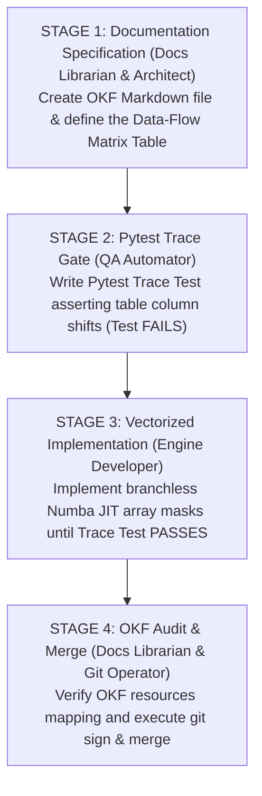

## 1. Executive Summary & Rationale

The Plant-Herbivore Interaction & Defense Simulator (PHIDS) is a high-performance, data-oriented Entity-Component-System (ECS) executing Numba `@njit` compiled parallel sweeps over contiguous double-buffered NumPy arrays.

Attempting to model complex sequential behavior (such as multi-stage trigger cascades, synthesis delays, or death guards) using traditional Object-Oriented state machines (`IntEnum`, `if/else` branching) causes severe CPU branch mispredictions and destroys AVX2/AVX-512 SIMD vectorization. Conversely, formal methods tools (such as TLA+ or Alloy) introduce massive synchronization overhead across multiple non-Python DSL files.

The **OKF Data-Flow Matrix** bridges this gap. It models complex, multi-tick causal chains directly in Markdown documentation as Columnar Transfer Tables. These tables map 1:1 to:

* **Vectorized Numba Math:** Array arithmetic using SIMD boolean masks (`alive_mask`, `trigger_mask`) with zero `if/else` branching.
* **Pytest Time-Series Trace Tests:** Automated assertions that evaluate NumPy array traces over time steps ($t, t+1, t+2$).

---

## 2. Anatomy of a Data-Flow Matrix Table

A Data-Flow Matrix in PHIDS documentation is a Markdown table where:

* **Rows** represent consecutive simulation time steps ($\text{Tick } t, t+1, t+2, \dots$).
* **Columns** represent specific contiguous read/write NumPy array layers in `GridEnvironment` or `ECSWorld`.
* **Rightmost Column** defines the branchless mathematical transformation operator applied during that tick.

### Master Example: The Defense Signaling Cascade

Below is the canonical Data-Flow Matrix for plant defense initiation, synthesis, emission, and mortality interruption:

| Tick $t$ | $E_{\text{current}}$ | `is_triggered` | `alive_mask` | $M_{\text{internal\_toxin}}$ | $L_{\text{external\_grid}}$ | Applied Vectorized Operation & Gate Rule |
| :--- | :--- | :--- | :--- | :--- | :--- | :--- |
| $t_0$ | 50.0 | 1.0 (Attack) | 1.0 | 0.0 | 0.0 | **Initiation:** Attack detected. `is_triggered` set to 1.0. |
| $t_1$ | 45.0 | 1.0 | 1.0 | 5.0 | 0.0 | **Synthesis:** Energy burned to build internal pool ($\Delta E = -5.0, \Delta M = +5.0$). Emission is $0.0$ because synthesis delay is active. |
| $t_2$ | 40.0 | 0.0 (Ceased) | 1.0 | 10.0 | 2.0 | **Active Emission:** Synthesis completes. Toxin flows from internal pool to external grid ($\Delta M = -2.0, \Delta L = +2.0$). |
| $t_3$ | 0.0 (Dead) | 0.0 | 0.0 | 8.0 | 2.0 | **Death Interruption:** Herbivore consumes remaining energy. `alive_mask` drops to $0.0$. |
| $t_4$ | 0.0 | 0.0 | 0.0 | 8.0 | 2.0 | **Ghost Guard:** `alive_mask == 0.0` forces $\Delta M = 0.0$ and $\Delta L = 0.0$. Toxin emission instantly halts without an `if` statement. |

---

## 3. Required Repository Adjustments

To realize this model across PHIDS, adjustments are established across four key layers:

### A. Engine Layer (`src/phids/engine/systems/`)

Replace scalar timers or implicit conditional flags with contiguous, double-buffered buffer pairs:
* **Internal Substance Pools:** Add `internal_substance_mass` array to `SubstancesComponent` and `GridEnvironment`.
* **Branchless Masking:** All kernel updates must multiply transfer deltas by the boolean float mask `alive_mask = (E_current > 0.0) * 1.0`.

```python
# Canonical Numba JIT Kernel Pattern (_synthesis_and_emission_jit)
@njit(parallel=True, fastmath=True)
def _process_defense_cascade_jit(
    E_current: np.ndarray,
    is_triggered: np.ndarray,
    M_internal: np.ndarray,
    L_external: np.ndarray,
    rate_synth: float,
    rate_emit: float,
) -> None:
    for i in prange(E_current.shape[0]):
        alive = (E_current[i] > 0.0) * 1.0

        # 1. Energy to Internal Synthesis (Masked by alive and triggered)
        energy_burn = min(E_current[i], rate_synth) * is_triggered[i] * alive
        E_current[i] -= energy_burn
        M_internal[i] += energy_burn

        # 2. Internal Pool to External Grid Emission (Masked by alive and available internal mass)
        emission = min(M_internal[i], rate_emit) * alive
        M_internal[i] -= emission
        L_external[i] += emission
```

### B. Testing Layer (`tests/integration/scientific_invariants/`)

Introduce Time-Series Trace Tests (`test_causal_data_flow_matrices.py`) that run the engine for $N$ ticks, capture array histories, and evaluate column-shift invariants:

```python
def test_defense_cascade_data_flow_matrix(run_trace_session):
    # Run 10-tick simulation trace for a single coordinate
    trace = run_trace_session(ticks=10, trigger_tick=1, kill_plant_at_tick=3)

    # Invariant 1: Mass Conservation (Energy Burned >= Internal + External Mass)
    assert np.all(trace.M_internal + trace.L_external <= trace.E_burned_cumulative)

    # Invariant 2: Ghost Guard (Dead plants must have zero delta on external grid)
    dead_ticks = trace.E_current == 0.0
    assert np.all(trace.delta_L_external[dead_ticks] == 0.0)

    # Invariant 3: Synthesis Delay (External grid cannot receive mass before internal pool is > 0)
    zero_internal_ticks = trace.M_internal_prev == 0.0
    assert np.all(trace.L_external_delta[zero_internal_ticks] == 0.0)
```

### C. Documentation Layer (`docs/scientific_model/`)

Standardize concept documents in `docs/scientific_model/` to include a mandatory section titled `## Data-Flow Matrix Specifications` containing the Markdown transfer tables.

### D. Governance & Memory Layer (`.agents/`)

Update project memory and agent rules to establish table-first modeling:

* `.agents/memory/canon.md`: Add Rule: *"All multi-tick behavioral cascades must be modeled as an OKF Data-Flow Matrix before implementation."*
* `.agents/rules/02-numba-constraints.md`: Add Rule: *"State transitions must be represented as array-to-array transfers gated by float masks (0.0 or 1.0), prohibiting scalar enums in JIT hot paths."*

---

## 4. Agentic Governance Infrastructure (Roles, Rules, Skills & Workflows)

To automate the counterchecking, updating, verification, and test alignment of Data-Flow Matrices without human friction, the following specialized infrastructure is integrated into `.agents/`:

### 4.1 Specialized Agent Roles

#### A. `@matrix-auditor` (`.agents/roles/09-matrix-auditor.md`)

* **Coverage Auditing:** Periodically scan all Markdown documentation files in `docs/scientific_model/` to verify that every multi-tick behavioral cascade (foraging, signaling, phloem translocation, mortality) has an associated Data-Flow Matrix Table.
* **Trace Parity Cross-Checking:** Validate point-by-point numerical parity between documented Data-Flow Matrix tables and live Pytest time-series trace outputs (`tests/integration/scientific_invariants/test_causal_data_flow_matrices.py`).
* **Read-Only Boundary & Gap Reporting:** Act as a read-only auditor. Generate actionable gap and drift reports, issuing diff tasks to `@qa-automator` and `@docs-librarian`.
* **MCP Introspection:** Prefer native MCP tools (`validate_okf_compliance`, `inspect_telemetry_schema`, `query_diagnostic_logs`) when inspecting simulation state, schema compliance, and diagnostic drift.

#### B. `@causal-verifier` (`.agents/roles/10-causal-verifier.md`)

* **Causal Trace Monitoring:** Monitor engine execution traces for implicit state leaks, ghost entity updates, zero-division hazards, and unmasked dead-entity updates.
* **Branchless Mask Enforcement:** Assert that every Numba kernel in `src/phids/engine/systems/` includes strict float mask gates (`alive_mask`, `capacity_mask`, `trigger_mask`) instead of scalar `if/else` branching.
* **Double-Buffering & Mass Conservation:** Enforce invariant checks on mass conservation across internal and external substance pools, verifying that dead entities produce zero external grid deltas.
* **MCP Telemetry Inspection:** Utilize `runtime_snapshot` and `inspect_telemetry_schema` to inspect live simulation invariants and detect causal drift.

### 4.2 Enforceable Agent Rules (`.agents/rules/05-data-flow-invariants.md`)

* **Rule 05-A (Table-to-Trace Parity):** Every Markdown Data-Flow Matrix table MUST have a corresponding Pytest trace test in `tests/integration/scientific_invariants/test_causal_data_flow_matrices.py`. Discrepancies between table values and test trace arrays are treated as build-blocking failures.
* **Rule 05-B (Branchless SIMD Mask Mandate):** JIT kernels implementing Data-Flow Matrix rules must execute array transfers via scalar/vector float multiplication (`delta * alive_mask`). `if/else` conditionals on entity states in inner JIT loops are hard-blocked by pre-commit AST checks (`scripts/check_no_branching_jit.py`).
* **Rule 05-C (Bilateral Resource Mapping):** OKF frontmatter `resources: []` for any scientific model doc containing a Data-Flow Matrix MUST explicitly declare both the underlying system file (e.g., `src/phids/engine/systems/signaling/emission.py`) AND the corresponding trace test file.

### 4.3 Automated Agent Skills (`.agents/skills/`)

* **Skill 1: `verify-matrix-trace-parity` (`.agents/skills/verify-matrix-trace-parity/SKILL.md`):** Parses Markdown Data-Flow Matrix tables into temporary Pandas/Polars DataFrames, executes the corresponding Pytest trace fixture, and calculates point-by-point numerical parity.
* **Skill 2: `audit-okf-matrix-coverage` (`.agents/skills/audit-okf-matrix-coverage/SKILL.md`):** Scans all `docs/scientific_model/` files and reports any concept document that describes temporal state shifts without a Data-Flow Matrix Table.
* **Skill 3: `auto-reconcile-matrix-drift` (`.agents/skills/auto-reconcile-matrix-drift/SKILL.md`):** When engine array formulas are updated (e.g., modifying synthesis rate scalars), this skill runs a trace session, captures exact numerical output, and automatically updates the Markdown table rows while flagging the change for user review.

### 4.4 Specialized Agentic Workflows (`.agents/workflows/`)

* **Workflow 1: Matrix-Driven TDD Refactoring (`.agents/workflows/matrix-tdd-refactor.md`):** The 4-stage pipeline translating concept docs to failing tests, branchless Numba kernels, and passing audits.
* **Workflow 2: Automated Matrix Drift Reconciliation (`.agents/workflows/matrix-drift-reconciliation.md`):** Automated recovery when telemetry diverges from documented matrix tables.

---

## 5. End-to-End Development Workflow



### Stage Breakdown

* **Stage 1: Specification (`@scientific-architect` & `@docs-librarian`)**
    * Read target theory and source code. Construct the Data-Flow Matrix Table (Ticks $t_0 \dots t_n$, NumPy array columns, branchless float masks). Save under `## Data-Flow Matrix Specifications` in the target doc. *Pause for human review and approval.*
* **Stage 2: Pytest Trace Gate (`@qa-automator` & `@matrix-auditor`)**
    * Translate the Data-Flow Matrix Table into a time-series trace test in `tests/integration/scientific_invariants/test_causal_data_flow_matrices.py`. Run Pytest and confirm the tests fail (TDD gate).
* **Stage 3: Branchless Numba Implementation (`@engine-developer` & `@causal-verifier`)**
    * Implement or refactor Numba `@njit` kernels in `src/phids/engine/systems/` using contiguous double-buffered arrays and float mask math (`alive_mask`, `capacity_mask`). Iterate until all trace tests pass.
* **Stage 4: Verification & Audit (`@docs-librarian`, `@matrix-auditor`, & `@git-operator`)**
    * Run `verify-matrix-trace-parity` to ensure 100% parity. Validate OKF frontmatter `resources` links with `scripts/validate_okf.py`. Execute signed git commit.
