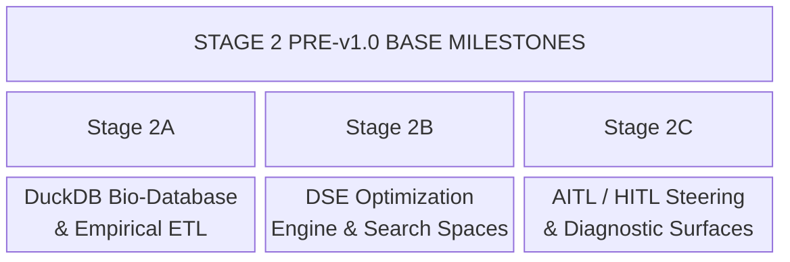

This document defines the strategic development roadmap for the Plant-Herbivore Interaction & Defense Simulator (PHIDS). It details implemented foundations, active pre-v1.0 base milestones, and future research horizons across **biological fidelity**, **full-stack software architecture**, **spatiotemporal scaling**, **empirical database ingestion**, **UI controls**, **telemetry/replay updates**, **QA regression gates**, and **high-performance computing (HPC)**.

---

!!! important "Pre-v1.0 Development & Milestone Governance"
    PHIDS is currently in active **pre-v1.0 development (v0.x)**. Formal **Version 1.0** will only be declared once all foundational base capabilities - including the core ECS simulation loop, empirical DuckDB bio-database pipeline, Design Space Exploration (DSE) optimization engine, and full-stack UI/telemetry integration - are completely implemented, thoroughly tested, and manually verified in great detail.

    Development is structured into functional milestones rather than premature semantic version numbers. Furthermore, Design Space Exploration (DSE) and automated calibration components are currently at the conceptual design and prototype stub stage; interfaces, search space bounds, and solver APIs remain fluid and will be refined during full implementation and empirical testing.

---

## Core Architectural Principles

1. **Pre-v1.0 Base Completeness Gate**: Version 1.0 is reserved until all foundational components (ECS core loops, DuckDB bio-database ETL, DSE optimization pipelines, and UI/telemetry streaming) are completely realized, tested, and manually verified end-to-end.
2. **Standalone Scientific Utility**: Every milestone stage is partitioned into self-contained, independent sub-components. Completing any single sub-stage yields an immediately usable, scientifically validated capability for ecological researchers, requiring zero reliance on subsequent stages.
3. **Zero-Overhead Opt-In Guarantee**: Optional biological and environmental systems (e.g., soil chemistry, weather profiles, 3D grids) default to disabled ($0\text{ bytes}$ allocated, $0\text{ ms}$ CPU overhead). They can be selectively loaded via scenario YAML/JSON files.
4. **Clean Unencumbered Evolution Strategy (No Backward Compatibility Shims)**: PHIDS explicitly rejects backward-compatibility shims, legacy schema fallbacks, or versioned dataset wrappers during pre-v1.0 development. Data models, Zarr telemetry buffers, and scenario schemas evolve cleanly. When breaking updates occur, example scenario files (`scenarios/*.yaml`), benchmark suites, and tests are updated directly to the latest specification.
5. **Full-Stack End-to-End Scope**: Each sub-stage plans all necessary modifications across the Python backend, Jinja2/HTMX web UI, scenario import/export buttons, DuckDB empirical database ETL, Zarr telemetry schemas, PyInstaller packaging, and Design Space Exploration (DSE) parameter search spaces.
6. **Quality & Regression Gates**: Every milestone must pass strict QA gates, including mutation testing via `mutmut` ($>85\%$ kill rate) and performance regression gates via `pytest-benchmark` ($<5\%$ tick latency regression).
7. **Deterministic PRNG Seeding**: All stochastic events (seed flight, zoochory transport, weather noise) use per-component/per-region PRNG generators (`np.random.Generator`), ensuring tick-by-tick deterministic replay capability.

---

## Stage 1: Core Simulation Engine & Spatial Dynamics (Implemented Foundation)

### Implemented Biological & Computer Science Milestones

* **Data-Oriented ECS Architecture & Flow Fields** `[Implemented]`: Unified spatial hashing with zero-allocation JIT execution loops ($F = \alpha E \cdot N - \beta \sum T_k$).
* **Continuous Sigmoidal Hill Priming** `[Implemented]`: Transitioned VOC perception from step-functions to dose-dependent logarithmic Hill kinetics ($S(c) = \frac{c^n}{K^n + c^n}$).
* **Rate-Limited Phloem Translocation** `[Implemented]`: Modeled vascular carbohydrate movement from leaves to roots ($\frac{dN}{dt} = -k(N - N_{\text{target}})$).
* **Constitutive Morphological Defenses** `[Implemented]`: Integrated mechanical mouthpart damage ($\lfloor m_{\text{bite}} (1-\rho) \rfloor$) and cell-wall caloric discounting ($\eta_{\text{net}}$).
* **Holling Type II Response & Swarm Paradigms** `[Implemented]`: Implemented saturating feeding curves with handling time $T_h$ and multi-tier flight behavior (`MACRO_SWARM`, `SOLITARY_GRAZER`, `OVIPOSITION_SEEKER`).
* **Operator-Splitting PDE Solvers & Telemetry** `[Implemented]`: Combined semi-Lagrangian wind advection with $5\times 5$ Gaussian stencils, Zarr telemetry, and HTMX web visualization.
* **Phase-Staggered Cohort Loops & Kinematics** `[Implemented]`: Multi-scale temporal decoupling (`(entity_id % S) == (tick % S)`), 4-way Von-Neumann kinematics, branchless capacity masking, and $O(1)$ stochastic seed dispersal.

### Stage 1B: Charnov's Marginal Value Theorem (MVT) & Softmax Stochastic Foraging (Pre-v1.0 Base Milestone - Active Target)

* **Biological Target**: Replace rigid binary feeding state locks (`is_feeding = True` until $E_{\text{plant}} = 0$) with optimal foraging theory governed by **Charnov's Marginal Value Theorem (MVT)**. Optimal foragers evaluate surrounding continuous spatial potentials $\nabla F(\mathbf{r})$ at **every tick** and abandon depleting patches as soon as local caloric intake drops below the expected average intake rate of the surrounding landscape.
* **Theoretical & Architectural Foundations**:
    1. **Continuous Potential Re-Evaluation**: Movement vector calculations evaluate gradient $\nabla F(\mathbf{r})$ on every tick, eliminating artificial state locks that force swarms to remain on depleting tiles.
    2. **Holling Type II Intake Coupling**: As local biomass $E_{\text{plant}}(\mathbf{r})$ drops from grazing, local intake $f(E) = \frac{a E}{1 + a T_h E}$ decelerates rapidly. Local potential $F(\mathbf{r}_{\text{curr}})$ decays, causing the potential gradient to point toward healthier unbrowsed neighboring cells long before $E_{\text{plant}} \to 0$.
    3. **Softmax / Boltzmann Stochastic Action Selection**: Replaces greedy maximum selection over the local 4-way von Neumann neighborhood $\mathcal{N}$ with Boltzmann transition probabilities:

        $$P(\text{move to cell } j) = \frac{\exp\left(\frac{F(\mathbf{r}_j)}{\tau}\right)}{\sum_{k \in \mathcal{N}} \exp\left(\frac{F(\mathbf{r}_k)}{\tau}\right)}$$

        where $\tau$ is a tunable temperature parameter ($0.01 \le \tau \le 5.0$) controlling stochasticity (low $\tau \to$ deterministic gradient ascent; high $\tau \to$ random exploratory flight).

* **Emergent Ecological Dynamics**:
    * **Partial Herbivory & Plant Recovery**: Plants are rarely browsed to extinction; they undergo partial biomass loss, drop below the MVT foraging threshold, and enter logistic recovery ($r N (1 - N/K)$).
    * **Density-Dependent Herd Dispersion**: Multiple swarms on a single tile accelerate local intake depletion, driving early herd splitting and spatial scattering.
    * **Spatial Refugia**: Plants near toxic neighbors or low-density patches gain passive protection because surrounding potential valleys ($-\beta \sum T_k$) suppress transition probabilities $P(\text{move})$.
* **Standalone Researcher Utility**: Enables chemical ecologists and foraging theorists to model realistic patch departure kinetics, partial defoliation recovery, and density-dependent herd dispersal without artificial extinction artifacts.
* **Computational & Performance Cost**:
    * **Memory**: $+8\text{ Bytes/swarm entity}$ for per-swarm temperature state $\tau$ ($\sim 0.08\text{ KB}$ for 100 swarms). Zero biotope array expansion.
    * **CPU Latency**: $\sim 0.04\text{ ms/tick}$ additional overhead per swarm batch. Softmax exponentiation $\exp(F/\tau)$ across 4 von Neumann neighbors is compiled via Numba `@njit(fastmath=True)` using SIMD vector instructions.
* **Implementation Effort & Full-Stack Scope**:
    * **Backend & API**: Remove movement bypass lock in `src/phids/engine/systems/interaction/movement.py`, implement `@njit(cache=True, fastmath=True)` Softmax probability sampler `_select_softmax_neighbour_jit`, and add `softmax_temperature` ($\tau$) parameter to `HerbivoreSpeciesParams` schema (`src/phids/api/schemas/species.py`) and `SimulationConfig` ($\sim 240$ LOC).
    * **UI & Dashboard**: Add "Stochastic Foraging & MVT" settings card to config form (`src/phids/api/templates/index.html`), Softmax Temperature ($\tau$) slider, and live telemetry widgets tracking "Early Patch Departure Rate" and "Plant Recovery vs Extinction Ratio".
    * **Empirical Bio-Database Pipeline**: Extend DuckDB schema (`phids.analytics.bio_database`) and `src/data_pipeline/json_builder.py` to ingest species-specific MVT patch residence time thresholds and temperature parameters $\tau$ from PanTHERIA / empirical literature.
    * **Telemetry & Replay Schema**: Direct update to `ReplayState` and Zarr dataset schemas to serialize per-swarm foraging mode transitions and departure ticks. All scenario examples (`scenarios/*.yaml`) updated to match.
    * **QA & Verification Gates**: Unit tests for Boltzmann transition probabilities, MVT departure triggers, and partial herbivory recovery in `tests/unit/engine/systems/test_movement.py`; `mutmut` kill rate $>85\%$; benchmark regression gate $<5\%$ tick latency overhead.
    * **Documentation**: Update `docs/scientific_model/herbivore_behavior.md`, `docs/scientific_model/chemotaxis.md`, and `docs/technical_architecture/engine_execution.md`.
    * **DSE Scope Extension**: Expose continuous gene `softmax_temperature` ($\tau$) in [Design Space Exploration Guide](../scenario_guide/design_space_exploration.md) for evolutionary trajectory optimization.

---

## Stage 2: Empirical Bio-Database Ingestion & Design Space Exploration (Pre-v1.0 Base Milestone - Prototype & Active Implementation)

This stage establishes the data foundation and search capabilities required for v1.0. DSE components currently exist as conceptual specifications and initial prototype stubs, which are being actively implemented and verified.

### Stage 2A: DuckDB Bio-Database ETL Pipeline (`phids.analytics.bio_database`)

* **Target**: Ingest open-access trait data (TRY, PanTHERIA, GloBI, Pherobase) into an embedded DuckDB database (`bio_database.duckdb`), deriving non-dimensional Buckingham $\Pi$ parameters and allometric scaling bounds ($BMR \propto M^{0.75}$).
* **Full-Stack Integration**: `data_pipeline/json_builder.py` transforms raw database rows into validated `FloraSpeciesParams` and `HerbivoreSpeciesParams` structs for simulation scenarios.

### Stage 2B: Evolutionary Encapsulated Design Space Exploration (EEDSE Engine)

* **Target**: Multi-objective Pareto optimization across continuous species traits and discrete defense choices.
* **Implementation Status**: **Prototype & Active Implementation**. Core concepts (Genotype sub-DSE, Phenotype simulation validation, error delta learning $\mathbf{\Delta}_{\text{epistemic}}$) and module stubs (`src/phids/analytics/dse_optimizer.py`, `src/phids/api/services/dse/task_manager.py`) are established. Detailed testing and validation across Ray/Tune + OptunaSearch are underway.

### Stage 2C: AITL / HITL Diagnostic Steering & Control Surfaces

* **Target**: Interactive steering controls allowing researchers to switch between autonomous AI optimization sweeps (AITL) and step-by-step generational breakpoints (HITL).
* **UI Surface**: HTMX control bar and diagnostic discrepancy banners for real-time scenario auditing.

---

## Stage 3: Advanced Spatial Fidelity & Micro-Climate Extensions (Pre-v1.0 Base Milestone - Planned)

Stage 3 is structured into granular, independent sub-stages. Each sub-stage can be implemented, tested, and verified independently.

### Stage 3A: Soil Seed Bank & Dormancy Kinetics

* **Biological Target**: Replace instant adult plant spawning with a persistent soil seed bank. Dispersed seeds land in a dormant state (`seed_bank_layer`) and require accumulated thermal degree-days ($GDD = \sum \max(0, T - T_{\text{base}})$) and a moisture threshold ($W > W_{\text{germ}}$) to sprout.
* **Standalone Researcher Utility**: Enables plant ecologists to study seed longevity, seasonal germination windows, seed mortality, and weed bank dynamics without requiring subterranean soil chemistry or weather layers.
* **Computational & Performance Cost**:
    * **Memory**: $+4\text{ Bytes/cell}$ float32 seed density array ($\sim 1\text{ MB}$ for a $512 \times 512$ grid).
    * **CPU Latency**: $< 0.05\text{ ms/tick}$ via vectorized Numba JIT array updates.
* **Implementation Effort & Full-Stack Scope**:
    * **Backend & API**: Add `SeedBankConfig` schema to `phids.api.schemas.simulation`, create `seed_bank_layer` in `GridEnvironment`, update `DraftState`/`DraftService` for hot-reloading, and integrate germination triggers in `lifecycle.py` ($\sim 250$ LOC).
    * **UI & Dashboard**: Add a "Seed Bank & Dormancy" toggle card in `src/phids/api/templates/index.html`, GDD threshold sliders, scenario JSON export/import bindings, and a live "Seed Bank Heatmap" layer toggle in the web dashboard renderer.
    * **Empirical Bio-Database Pipeline**: Extend DuckDB schema (`phids.analytics.bio_database`) and `src/data_pipeline/json_builder.py` to ingest `germination_gdd_threshold` and `seed_decay_rate` from the TRY database.
    * **Telemetry & Replay Schema**: Direct update to `ReplayState` and Zarr dataset schemas to serialize `seed_bank_density`. All scenario examples (`scenarios/*.yaml`) updated to match.
    * **QA & Verification Gates**: Unit tests for $GDD$ accumulation; mutation test coverage via `mutmut` ($>85\%$ kill rate on `lifecycle.py`); benchmark regression gate ($<5\%$ tick overhead).
    * **Packaging**: Verify standalone binary bundling in `packaging/phids.spec` for updated templates and DuckDB schemas.
    * **Documentation**: Update `docs/technical_architecture/engine_execution.md` (lifecycle phase update) and `docs/scenario_guide/index.md`.
    * **DSE Scope Extension**: Cross-reference [Design Space Exploration Guide](../scenario_guide/design_space_exploration.md) for new continuous genes (`germination_gdd_threshold`, `seed_dormancy_decay_rate`).

### Stage 3B: Soil Detritus & Biomass Recycling Loop

* **Biological Target**: Convert dead plant tissue and herbivore carcasses into an organic detritus layer ($B_{\text{detritus}}$) that mineralizes into bio-available soil nitrogen ($N_{\text{soil}}$), establishing a closed-loop nutrient cycle.
* **Standalone Researcher Utility**: Provides soil scientists and ecosystem ecologists with a tool to investigate nutrient turnover, plant competition under nitrogen limitation, and organic fertilizing feedback loops.
* **Computational & Performance Cost**:
    * **Memory**: Dense Mode: $+8\text{ Bytes/cell}$ ($\sim 2\text{ MB}$ for $512^2$). Macro-Patch Mode ($16 \times 16$ coarse grid): $+32\text{ Bytes/patch}$ ($\sim 32\text{ KB}$).
    * **CPU Latency**: Dense Mode: $\sim 0.10\text{ ms/tick}$. Macro-Patch Mode: $< 0.01\text{ ms/tick}$.
* **Implementation Effort & Full-Stack Scope**:
    * **Backend & API**: Add `SoilModule` to `GridEnvironment`, implement JIT mineralization kernels, and hook dead entity biomass into detritus pools during `lifecycle.py` and `interaction.py` passes ($\sim 350$ LOC).
    * **UI & Dashboard**: Add "Soil & Biomass Recycling" settings panel (mode selection: Disabled / Dense / Macro-Patch 16x16), initial nitrogen slider, scenario JSON export/import bindings, and a live 2D "Soil Nitrogen Overlay" map view.
    * **Empirical Bio-Database Pipeline**: Update DuckDB tables with soil nitrogen baselines and plant tissue N:P decomposition ratios.
    * **Telemetry & Replay Schema**: Direct update to Zarr schema adding `/soil_nitrogen` matrix layer when enabled.
    * **QA & Verification Gates**: Nitrogen and total biomass conservation law integration tests.
    * **Documentation**: Update `docs/technical_architecture/system_architecture.md` with soil double-buffering layers.
    * **DSE Scope Extension**: Cross-reference [Design Space Exploration Guide](../scenario_guide/design_space_exploration.md) for soil mineralization continuous/discrete genes.

### Stage 3C: Macro-Patch Weather & Micro-Climate Profile

* **Biological Target**: Introduce dynamic seasonal/diurnal temperature $T(t)$, relative humidity $H(t)$, and rainfall pulses $W(t)$ that modulate photosynthesis rates, VOC diffusion constants ($D_{\text{VOC}}(T)$), and insect activity.
* **Standalone Researcher Utility**: Enables climate change impact assessments, heatwave/drought stress experiments, and diurnal VOC emission studies.
* **Computational & Performance Cost**:
    * **Memory**: $< 1\text{ KB}$ (scalar or $K \times K$ macro-patch struct).
    * **CPU Latency**: $< 0.03\text{ ms/tick}$.
* **Implementation Effort & Full-Stack Scope**:
    * **Backend & API**: Implement `WeatherModule` in `phids.engine.core` and integrate climate parameter updates into `SimulationLoop.step()` Phase 0 ($\sim 220$ LOC).
    * **UI & Dashboard**: Add "Weather Profile" selection menu (Constant, Sinusoidal Seasonal, Drought Pulse), ambient temperature live telemetry badge on the top dashboard bar, and scenario JSON import/export support.
    * **Empirical Bio-Database Pipeline**: Ingest species thermal tolerance limits ($T_{\text{min}}, T_{\text{max}}$) into `bio_database.json`.
    * **Telemetry & Replay Schema**: Record global climate scalars directly in Zarr frame metadata.
    * **QA & Verification Gates**: Validate Arrhenius reaction rate scaling tests for VOC synthesis.
    * **Documentation**: Update `docs/scientific_model/mathematical_framework.md` with temperature-dependent Arrhenius kinetics for VOC synthesis.
    * **DSE Scope Extension**: Cross-reference [Design Space Exploration Guide](../scenario_guide/design_space_exploration.md) for climate amplitude and drought intensity genes.

### Stage 3 Implementation Summary Matrix

| Stage | Core Feature | Dev Complexity | Backend & API | UI & Scenario Import/Export | Empirical DB & ETL | Zarr Telemetry & QA Gates | Target Docs | DSE Parameters Added |
| --- | --- | --- | --- | --- | --- | --- | --- | --- |
| **Stage 3A** | Soil Seed Bank | Low-Mod ($\sim 250$ LOC) | `seed_bank_layer`, `lifecycle.py` GDD logic | HTMX Seed Bank toggle, GDD sliders, JSON buttons, live overlay | Ingest `gdd_threshold`, `seed_decay` in DuckDB | Direct `/seed_bank_density` Zarr update, `mutmut` $>85\%$ | `engine_execution.md` | `germination_gdd_threshold`, `seed_decay_rate` |
| **Stage 3B** | Soil Detritus Recycling | Moderate ($\sim 350$ LOC) | `SoilModule` JIT mineralization kernels | Soil settings panel (Disabled/Dense/Patch), live N-map | Soil N baselines & tissue N:P decay ratios | Direct `/soil_nitrogen` Zarr array | `system_architecture.md` | `mineralization_rate`, `soil_nitrogen_baseline` |
| **Stage 3C** | Weather Profiles | Low-Mod ($\sim 220$ LOC) | `WeatherModule`, `SimulationLoop` Phase 0 | Weather profile selector, dashboard temp badge | Species thermal limits ($T_{\text{min}}, T_{\text{max}}$) in JSON | Direct climate scalars in Zarr metadata | `mathematical_framework.md` | `seasonal_temp_amplitude`, `drought_factor` |

---

## Stage 4: Unified Forest-Scale Architecture & Biome Scaling (Pre-v1.0 Base Milestone)

To simulate an entire physical biome (e.g., a 1 km² mixed forest) realistically, PHIDS enforces Dimensional Anchoring ($\Delta L = 1\text{m}$, $\Delta \tau = 1\text{hr}$, $\Delta E = 100\text{kcal}$) and multi-scale temporal loop boundaries.

### Stage 4A: Toroidal Power-of-2 Bitwise Wrap & Memory Locality

* **Computational Target**: Shift to power-of-two grid dimensions ($1024 \times 1024$) allowing single-cycle bitwise AND masking (`x & 1023`) for toroidal wrap-around boundaries, guaranteeing high cache-line locality during $5 \times 5$ spatial convolutions.

### Stage 4B: $O(1)$ Trophic Anchoring Fast-Path ("Bolt Optimization")

* **Computational Target**: Short-circuit chemotactic gradient calculations ($\Delta x = 0, \Delta y = 0$) when swarms are co-located with uneaten food, bypassing multi-layer tensor evaluations during feeding.

---

## Stage 5: Post-v1.0 Distributed HPC Execution & Speculative Research (Future Horizon)

Milestones planned for post-v1.0 exploration after full base engine verification:

### Stage 5A: GPU-Accelerated PyTorch/CUDA PDE Engines

* **Target**: Port 2D/3D reaction-diffusion cellular automata layers to GPU tensor accelerators (PyTorch / CUDA C++ kernels) for large biotope grids ($2048 \times 2048$ to $4096 \times 4096$).

### Stage 5B: Multi-Agent Coevolutionary Arms Race Solvers

* **Target**: Reinforcement learning / MARL policies for dynamic counter-adaptation (e.g., herbivore digestive enzyme mutations reacting to plant chemical defenses across generations).

### Stage 5C: Speculative Granularity & Reality Neglectables

Speculative mechanisms evaluated for future stages:

1. **Chronological Aging & Senescence**: Mean Swarm Age components, Weibull cohort hazard mortality ($\mu_{\text{age}}$), and multi-cohort stage partitioning.
2. **3D Canopy VOCs**: Deferred until GPU tensor engine integration (Stage 5A) to avoid CPU L3 cache eviction.
3. **Agentic Diagnostic Log Writer**: Non-blocking telemetry observer agent (`dse-log-observer`) to audit DSE trajectories via MCP tools.
