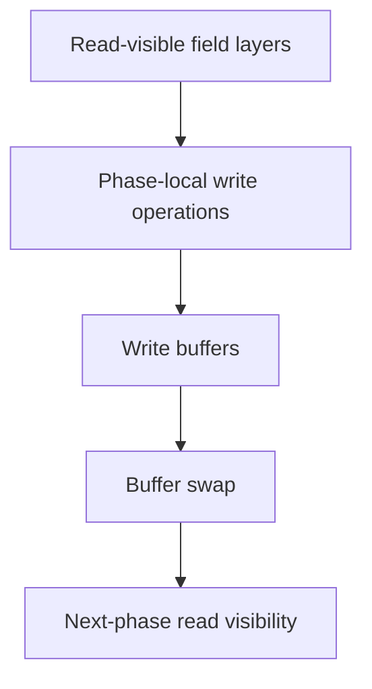
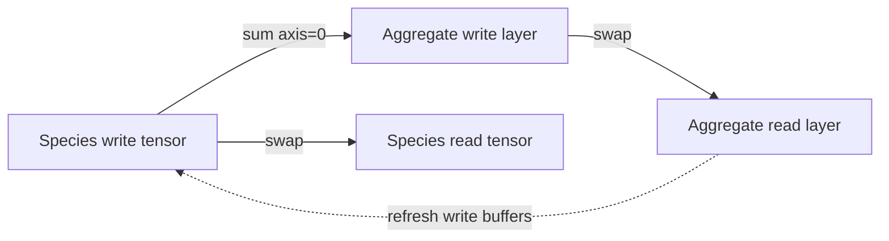

# Biotope and Double-Buffering

`GridEnvironment` is the canonical owner of PHIDS field state and the principal implementation site of explicit double-buffering. The module `src/phids/engine/core/biotope.py` couples vectorized lattice storage, Gaussian signal transport, wind-driven advection, and buffered visibility boundaries so that ecological fields remain deterministic under multi-phase updates.

In architectural terms, the engine separates discrete entities (`ECSWorld`) from continuous or aggregate fields (`GridEnvironment`). Plant energy, airborne signals, toxin concentration, wind vectors, and the interaction flow field are all represented as preallocated NumPy layers. This preallocation is constrained by `GRID_W_MAX`, `GRID_H_MAX`, and Rule-of-16 species caps, preventing dynamic resizing during the simulation loop.

## Buffered State Semantics

The biotope expresses read/write separation at field level. For plant energy, writes accumulate into species-resolved write buffers and become read-visible only after `rebuild_energy_layer()` performs aggregation and swaps. For signals, `diffuse_signals()` reads from `signal_layers`, writes into `_signal_layers_write`, and then swaps references. This separation enforces temporal consistency: a phase consumes a coherent snapshot and publishes updates only at its synchronization point.

In compact form, a buffered phase operator satisfies

$$
W_t \leftarrow \Phi(R_t, \Theta), \qquad R_{t+1} \leftarrow W_t,
$$

where $R_t$ and $W_t$ denote read and write buffers and $\Theta$ denotes configuration and source terms. PHIDS applies this principle to field layers rather than cloning the entire world state.

## Signal Diffusion and Wind Advection

Signal transport is implemented as a two-stage local advection-diffusion operator. First, each destination cell samples concentration from an upwind source coordinate using semi-Lagrangian backtracing with the local wind vector field. Second, the advected field is convolved with an isotropic Gaussian diffusion kernel and multiplied by decay (`SIGNAL_DECAY_FACTOR`). After decay, values below `SIGNAL_EPSILON` are zeroed to preserve numerical sparsity and eliminate subnormal tails.

The per-layer update is

$$
\tilde{S}^{t}(x,y)=S^t\!\left(x-u_x(x,y),\ y-u_y(x,y)\right),
\qquad
S^{t+1}=\gamma\,(\mathcal{K}_{iso}*\tilde{S}^{t}),
$$

followed by the sparsity clamp $S^{t+1}[S^{t+1}<\varepsilon]=0$. This formulation preserves local wind heterogeneity; opposing flow regions no longer collapse into a single mean-vector plume.

## Toxin Locality

Toxin layers are preallocated in the biotope but are not propagated by the diffusion routine. Instead, signaling rebuilds toxin concentration as local plant-defense fields during its own phase. This design keeps toxins tissue-local in the current model and distinguishes them from airborne alarm propagation.

## Plant-Energy and Wind Interfaces

The plant-energy API (`set_plant_energy`, `clear_plant_energy`, `rebuild_energy_layer`) is write-buffer oriented, and `set_plant_energy` clamps negative values to zero at write time. Wind control is exposed through both `set_uniform_wind(vx, vy)` and `update_wind_at(x, y, vx, vy)`, allowing coarse or cell-local forcing fields.

The following schematic shows the plant-energy read/write topology with species aggregation.

## Snapshot and Transport Role

`GridEnvironment.to_dict()` serializes current layer state into list-backed payloads used by replay and streaming surfaces. The biotope is therefore not only a numeric subsystem but also the field-state source for external observation interfaces.

## Validation Anchors and Current Limits

Behavioral evidence is anchored in `tests/unit/engine/core/test_biotope_diffusion.py` and `tests/unit/api/test_schemas_and_invariants.py`, which verify threshold truncation, dimension guards, local-wind plume displacement under heterogeneous wind forcing, write-visibility boundaries after rebuild, and non-negative energy clamping. Current model limits remain explicit: diffusion is layer-based rather than particle-resolved, advection is semi-Lagrangian without higher-order flux limiting, toxins are rebuilt locally by signaling, and double-buffering is field-centric rather than full-world duplication.

For cross-phase context, see `docs/engine/flow-field.md`, `docs/engine/signaling.md`, and `docs/engine/index.md`.
