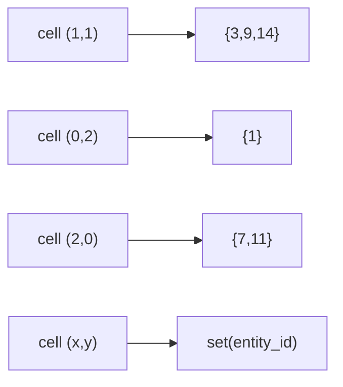

# ECS and Spatial Hash

`ECSWorld` is the discrete-state substrate of PHIDS, implemented in `src/phids/engine/core/ecs.py`. It provides entity allocation, component indexing, and O(1)-style spatial locality lookups, allowing ecological systems to resolve co-location events without prohibited global pairwise scans. The design follows a data-oriented architecture in which entities are lightweight identifiers with typed component payloads and system behavior lives in phase functions rather than entity methods.

## Entity and Indexing Semantics

An `Entity` in PHIDS is intentionally minimal: an `entity_id` and a component dictionary keyed by type. `ECSWorld` owns the global registry and the component-type index used by `query(*component_types)`. Query execution begins with the smallest component set and intersects by membership checks on the remaining required types. This strategy keeps the implementation simple while avoiding full-world scans for common system passes.

The query model can be expressed as set intersection over component ownership sets,

$$
Q(C_1,\dots,C_k)=\bigcap_{j=1}^{k} I(C_j),
$$

where $I(C_j)$ is the indexed entity-id set for component type $C_j$. Runtime iteration then yields entity records for ids that remain live in `_entities`.

## Spatial Hash as a Locality Invariant

The spatial hash is stored as `dict[(x,y) -> set[entity_id]]`. Registration, unregistration, and movement update this structure so that `entities_at(x,y)` remains the canonical local occupancy query. Multiple occupancy is explicitly supported; a cell may contain plants, swarms, and multiple swarm entities simultaneously.

This locality structure is central to PHIDS biological semantics. Feeding in interaction, herbivore-presence aggregation in signaling, and occupancy-aware cleanup across phases all rely on cell-level lookups rather than distance-wide scans.

## Movement, Destruction, and Garbage Collection

`move_entity(entity_id, old_x, old_y, new_x, new_y)` applies a two-step update through unregistration and registration. Entity destruction removes records from `_entities`, component indices, and spatial-hash sets. The current cleanup strategy searches spatial cells during destruction instead of using a reverse-position index. Given bounded grids and constrained entity counts, this is an accepted design tradeoff for clarity and determinism.

Bulk cleanup is exposed through `collect_garbage(dead_entity_ids)`, which consolidates destruction calls while leaving death decisions to system phases. This separation keeps system logic explicit and keeps state-structure hygiene centralized.

The occupancy model can be visualized as a per-cell roster map over a sparse key space.

## Validation Anchors and Current Limits

Implementation behavior is validated in `tests/test_ecs_world.py`, `tests/test_schemas_and_invariants.py`, and `tests/test_spatial_hash_benchmark.py`. These tests cover registration/movement invariants, query intersection correctness, multiple-occupancy behavior, and benchmark sensitivity of hot-cell lookups. Current limits are explicit: ECS storage is Python-dictionary based, destruction-time spatial cleanup scans cells, and the model prioritizes bounded-state clarity and locality guarantees over maximal generic ECS abstraction.

For field-side buffering semantics, see `docs/engine/biotope-and-double-buffering.md`. For movement consumption of field gradients under locality constraints, see `docs/engine/flow-field.md` and `docs/engine/interaction.md`.
