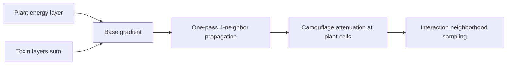

# Flow Field

The PHIDS flow field is the global guidance surface that couples distributed plant resources and local defensive chemistry to swarm movement decisions. Instead of solving independent path-planning problems per swarm, the engine computes one scalar lattice per tick and lets each swarm read an O(1) local neighborhood during interaction. This design preserves deterministic throughput while keeping biological response aligned with ambient resource and toxin gradients.

In `src/phids/engine/loop.py`, flow-field generation is executed at the beginning of each ecological tick through `compute_flow_field(...)`. The temporal position of this phase is significant: lifecycle and interaction both consume a field derived from the same read-visible environment state, which prevents order-dependent drift within a tick.

The computational implementation in `src/phids/engine/core/flow_field.py` is intentionally split between a testable kernel body and a Numba-compiled hot path. The wrapper first aggregates toxin channels and passes a compact numeric representation into the compiled routine. In analytical form, the base scalar contribution at cell $(x,y)$ is

$$
G_t(x,y) = E_t(x,y) - T_t(x,y), \qquad T_t(x,y)=\sum_k T_{k,t}(x,y),
$$

where $E_t$ denotes aggregate plant-energy density and $T_{k,t}$ denotes toxin channel $k$. The current propagation policy then applies a one-pass local spreading step with fixed decay coefficient $\delta=0.5$, yielding a short-range influence map rather than a long-horizon equilibrium potential. Numerically, this should be interpreted as a first-order neighborhood heuristic.



Camouflage is applied after field construction through `apply_camouflage(...)`, so the attenuation acts on movement guidance directly rather than mutating plant-energy sources. This distinction matters scientifically: camouflage in PHIDS is currently a perceptual masking process, not a metabolic suppression process.

The interaction consumer reads only the current cell and its 4-connected neighbors. A compact idealized stencil illustration is shown below; the center value is the current swarm location and arrows represent candidate transitions.

```tikz
\documentclass[tikz,border=2pt]{standalone}
\begin{document}
\begin{tikzpicture}[scale=0.9,>=stealth]
  \foreach \x/\y in {0/1,1/1,2/1,1/0,1/2} {
    \draw[thick] (\x,\y) rectangle ++(1,1);
  }
  \node at (1.5,1.5) {$F(x,y)$};
  \node at (0.5,1.5) {$F(x-1,y)$};
  \node at (2.5,1.5) {$F(x+1,y)$};
  \node at (1.5,0.5) {$F(x,y-1)$};
  \node at (1.5,2.5) {$F(x,y+1)$};
  \draw[->,thick] (1.5,1.5) -- (0.95,1.5);
  \draw[->,thick] (1.5,1.5) -- (2.05,1.5);
  \draw[->,thick] (1.5,1.5) -- (1.5,0.95);
  \draw[->,thick] (1.5,1.5) -- (1.5,2.05);
\end{tikzpicture}
\end{document}
```

Because flow-field generation runs every tick and influences all swarm movement, it remains one of the principal benchmark-sensitive kernels in the repository. The behavior is validated in `tests/unit/engine/core/test_flow_field.py`, and performance regressions are tracked in `tests/benchmarks/test_flow_field_benchmark.py`. Current tests confirm zero-input stability, toxin-layer aggregation, edge-condition correctness for degenerate grid dimensions, and camouflage attenuation behavior.

The present model deliberately trades expressive richness for deterministic, interpretable dynamics: it uses a single propagation pass, 4-connectivity, toxin-layer summation, and local neighborhood reads. These constraints are not documentation simplifications; they are the active numerical assumptions governing PHIDS runtime behavior.
