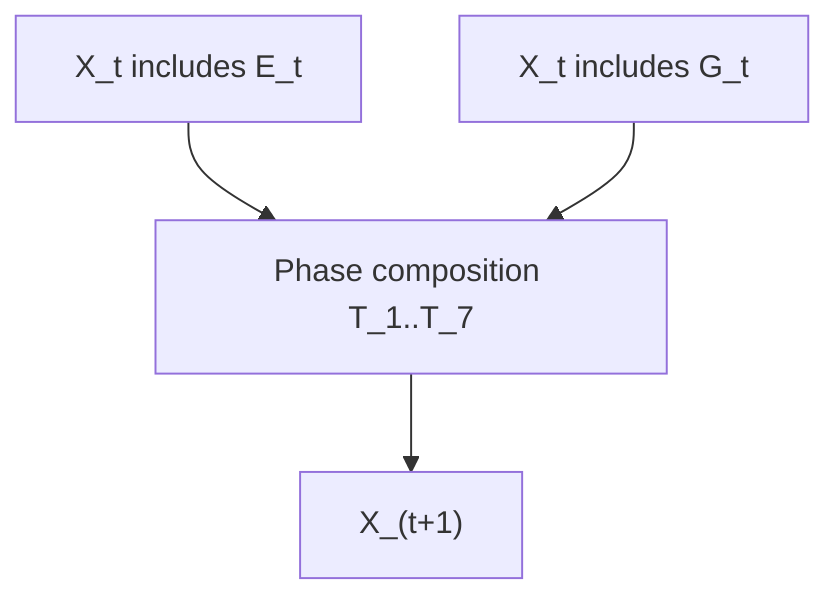

# Formal Algorithmic Model

This chapter formalizes PHIDS as a coupled hybrid dynamical system in which discrete entity transitions in an ECS state space are synchronized with continuous field updates on double-buffered NumPy lattices. The central purpose is to expose, in mathematically explicit form, how resource growth, predation pressure, induced defense signaling, metabolic attrition, and swarm dispersal are encoded as deterministic phase operators. The implementation follows a fixed tick schedule in `src/phids/engine/loop.py`, and the analytical notation below is intentionally aligned with that runtime ordering to preserve direct traceability between equations and executable system passes.

Let the global state at tick $t$ be represented by:

$$
\mathcal{X}_t = (\mathcal{E}_t, \mathcal{G}_t, \mathcal{P}_t)
$$

where:

$$
\mathcal{E}_t\;\text{is the ECS entity-component state in `ECSWorld`,}\quad
\mathcal{G}_t\;\text{is the lattice field state in `GridEnvironment`,}\quad
\mathcal{P}_t\;\text{is the static and derived parameter bundle.}
$$

The deterministic one-tick advance is an ordered composition of phase operators:

$$
\mathcal{X}_{t+1} = \mathcal{T}_7 \circ \mathcal{T}_6 \circ \mathcal{T}_5 \circ \mathcal{T}_4 \circ \mathcal{T}_3 \circ \mathcal{T}_2 \circ \mathcal{T}_1 (\mathcal{X}_t)
$$

with the implementation order enforced in `phids.engine.loop.SimulationLoop.step()`.

The following schematic mirrors the execution topology and should be interpreted as an operator pipeline rather than a control-flow abstraction. Each node corresponds to a mathematically distinct transformation whose output state is consumed without reordering by the next phase.

The movement guidance field driving swarm navigation is computed as a weighted scalar superposition of attractive flora energy and repulsive toxin burden:

$$
F_t(x,y) = \alpha\,E_t(x,y) - \beta\,\max_k T_{k,t}(x,y)
$$

where $E_t$ is aggregate plant energy, $T_{k,t}$ are toxin channels, and $(\alpha,\beta)$ are configurable gains.

This expression is evaluated on a bounded rectangular lattice, and the interaction system subsequently samples local neighborhoods rather than solving a global variational optimization. The numerical approximation is therefore a local finite-neighborhood ascent policy over $F_t$, implemented in `src/phids/engine/core/flow_field.py` and consumed in `src/phids/engine/systems/interaction.py`. Computationally, this approximation sacrifices global optimality in favor of deterministic throughput under fixed memory and O(1) locality constraints.

To make the local policy explicit, let $\mathcal{N}(x,y)$ denote the admissible Moore-neighborhood stencil with boundary clipping. The candidate step is selected by

$$
(x',y') = \operatorname*{arg\,max}_{(u,v)\in\mathcal{N}(x,y)} F_t(u,v),
$$

with stochastic tie handling in the implementation when equal-valued candidates coexist.

Swarm interaction introduces biologically motivated local overrides before this gradient decision is committed. Under local overcapacity, a brief repelled random-walk mode enforces physical jostling. Under immediate co-location with diet-compatible, non-depleted flora, an anchoring condition suppresses movement so feeding can proceed in place. These two mechanisms represent a computational surrogate for crowding-induced displacement and arrestment behavior observed in herbivore host-contact dynamics.

For each swarm entity $i$ at position $(x_i,y_i)$ and population $N_i$, consumption from a co-located eligible plant $j$ follows

$$
\Delta E_{i\leftarrow j}
= \min\!\left(\frac{r_i}{\max(1,v_i)}N_i,\;E_j\right),
$$

where $r_i$ is species-level consumption rate and $v_i$ is velocity. The divisor term encodes the numerical assumption that higher movement cadence lowers per-tick feeding dwell time. The post-contact behavioral update then applies an arrestment reflex when compatible feeding occurred and a taste-rejection repelled episode when contact occurred only with incompatible plants.

Signal transport and persistence are modeled as a discretized reaction-diffusion system on substance-indexed channels. For each substance channel $s$, concentration $C_s$ evolves by

$$
C_s^{t+1} = C_s^t + \Delta t\left(D_s \nabla_h^2 C_s^t + Q_s^t - \lambda_s C_s^t\right)
$$

where $D_s$ is the diffusion coefficient, $Q_s^t$ is the active emitter source term, $\lambda_s$ is the clearance coefficient, and $\nabla_h^2$ is the discrete Laplacian induced by the configured kernel. The runtime implementation performs this update through explicit read/write buffer separation in `src/phids/engine/core/biotope.py`; the write layer is populated from read-visible state and swapped only after the phase completes. This separation is not a stylistic implementation choice but a temporal-consistency constraint that prevents intra-phase causal leakage.

The same consistency principle can be written generically. For a read buffer $R_t$ and write buffer $W_t$, the phase operator $\Phi$ satisfies

$$
W_t \leftarrow \Phi(R_t, \mathcal{E}_t, \mathcal{P}_t),\qquad
R_{t+1} \leftarrow W_t
$$

which ensures that ecological interactions are evaluated against a coherent state snapshot. Biologically, this is the discrete-time analogue of simultaneous ecological response during an observation window, rather than sequential perturbation within that same window.

The numerical model intentionally applies first-order approximations. Local-neighborhood movement approximates continuous chemotactic ascent. Signal spread uses lattice finite differences rather than closed-form Green's-function propagation. Toxin impact combines field exposure with rule-based casualties to prioritize interpretable control over biochemical microphysics. Mycorrhizal relay is encoded as graph-constrained transfer and therefore does not claim full continuum transport fidelity through root tissue.

The dependency flow from ECS state and grid fields into the phase composition operator is shown below.

Direct implementation anchors are `src/phids/engine/loop.py` for phase composition, `src/phids/engine/core/flow_field.py` for movement guidance field generation, `src/phids/engine/systems/interaction.py` for swarm decision and feeding updates, and `src/phids/engine/systems/signaling.py` with `src/phids/engine/core/biotope.py` for defensive emission and diffusion. Subsequent chapters will expand these operators into symbol-level derivations, bounded-stability discussions, and calibration methodology for empirical ecological regimes.
