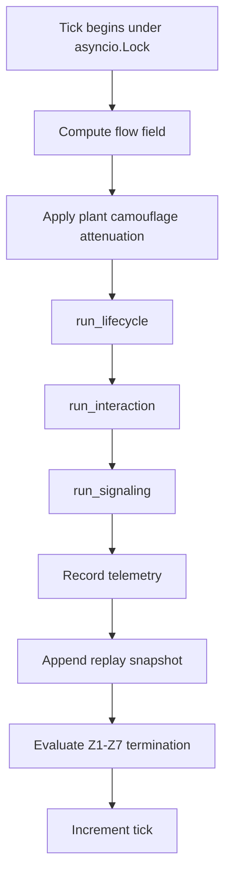

# Engine

The PHIDS engine is a deterministic ecological state-transition machine organized around `SimulationLoop.step()`. Its central task is to transform a coupled world of discrete organisms and continuous environmental fields through a fixed, reproducible sequence of operators. In scientific terms, the engine is the executable hypothesis layer of PHIDS: it is the place where assumptions about plant growth, trophic interaction, induced defense, diffusion, and termination are converted into explicit numerical and structural rules.

This chapter serves as the architectural introduction to that runtime. It explains how `SimulationLoop`, `ECSWorld`, and `GridEnvironment` divide responsibility, why phase ordering is scientifically consequential rather than stylistic, and how the project's non-negotiable constraints—double-buffering, O(1) spatial lookups, vectorized field state, and bounded memory—shape the class of ecological behavior the simulator can express. The engine should therefore be read not as an undifferentiated code path, but as a controlled computational apparatus whose phase structure defines the causal grammar of every PHIDS experiment.

## Execution Model Overview

The live runtime consists of two principal state stores and one orchestrator:

- `SimulationLoop` — orders the phases and owns runtime coordination,
- `ECSWorld` — stores discrete plant, swarm, and substance entities,
- `GridEnvironment` — stores continuous and grid-aligned fields.

The engine should therefore be read as a **hybrid ECS + cellular automata system**:

- entity-centric processes are expressed through components and system passes,
- field-centric processes are expressed through vectorized NumPy layers and convolution-style
  updates.

## Tick Ordering

The current tick ordering implemented by `SimulationLoop.step()` is:

1. **Flow-field generation**
2. **Camouflage attenuation**
3. **Lifecycle system**
4. **Interaction system**
5. **Signaling system**
6. **Telemetry recording and replay snapshotting**
7. **Termination evaluation**

This ordering is not cosmetic. Each later phase assumes the side effects of the previous one.

## Runtime Ownership and Invariants

### `ECSWorld`

`ECSWorld` owns:

- entity allocation and destruction,
- per-component indexing,
- a spatial hash mapping `(x, y)` cells to entity IDs.

This structure enables O(1)-style co-location queries through `entities_at()` and supports the
project rule that local interactions should not devolve into pairwise global scans.

### `GridEnvironment`

`GridEnvironment` owns:

- aggregate plant energy,
- per-species plant energy layers,
- signal layers,
- toxin layers,
- wind fields,
- the current scalar flow field.

It also owns the most explicit double-buffered mechanics in the engine. Plant-energy aggregates,
signal layers, and toxin layers all have corresponding write buffers that are swapped after the
relevant update step.

### `SimulationLoop`

`SimulationLoop` owns:

- the global tick counter,
- live/paused/terminated state,
- the async lock guarding `step()`,
- cached parameter tables derived from `SimulationConfig`,
- telemetry and replay integration.

It is the only object that composes all systems into a scientifically meaningful update order.

## Phase-by-Phase Semantics

### 1. Flow-field generation

The tick begins by computing `env.flow_field` from the current read-visible plant-energy and
toxin layers:

- `compute_flow_field(self.env.plant_energy_layer, self.env.toxin_layers, ...)`

The flow field is a scalar guidance surface used by the interaction system. Positive values are
associated with attractive plant energy; toxin contribution is subtractive and therefore can act
as a repulsive signal.

This phase is performance-sensitive and centralized in `phids.engine.core.flow_field`.

### 2. Camouflage attenuation

Immediately after global flow-field generation, the loop traverses live plants and attenuates the
field at cells where camouflage is enabled.

This is a useful example of PHIDS’s design style: a global field is computed once, then modified
by local plant traits before it is consumed by swarm movement logic.

### 3. Lifecycle system

`run_lifecycle()` updates flora-centric state. Its current responsibilities include:

- growth according to the configured energy formula,
- reproduction attempts when interval and energy constraints permit,
- pruning of dead mycorrhizal links,
- plant death and garbage collection,
- deterministic, interval-gated mycorrhizal link formation,
- rebuilding of the aggregate plant-energy layer after writes.

Important current-state details:

- reproduction is stochastic in placement but bounded by the environment and occupancy rules,
- root-network growth is deterministic in ordering and cadence,
- at most one new mycorrhizal link is formed per permitted growth attempt,
- dead plants are removed from spatial occupancy before garbage collection.

### 4. Interaction system

`run_interaction()` updates swarm-centric behavior. Its current responsibilities include:

- movement cooldown handling,
- gradient-following movement via the flow field,
- random-walk behavior for repelled swarms,
- diet-matrix gated feeding on co-located plants,
- metabolic upkeep and deficit-driven attrition,
- toxin casualty application from toxin layers,
- reproduction by converting stored energy into new individuals,
- mitosis at a configured split threshold (or legacy baseline fallback).

Two architectural features are especially important here:

1. plant feeding is resolved through `world.entities_at(swarm.x, swarm.y)`, not by scanning the
   entire world,
2. swarm movement reads a single global field rather than running individualized search.

### 5. Signaling system

`run_signaling()` is responsible for defensive substance logic. In current implementation it:

- evaluates trigger conditions plant by plant,
- materializes `SubstanceComponent` entities when a trigger first fires,
- advances synthesis countdowns,
- activates substances once synthesis is complete and any activation condition passes,
- emits signals and toxins into the environment,
- relays signals through mycorrhizal connections,
- updates aftereffect timers,
- delegates diffusion to `GridEnvironment`,
- removes expired or orphaned substance entities.

Current-state nuance matters here:

- toxin layers are rebuilt from active emitters each signaling pass,
- active toxin effects are also applied directly to swarms through the signaling logic,
- only `env.diffuse_signals()` is called at the end of the phase,
- toxins remain local to emitting plant cells and do not diffuse,
- mycorrhizal relay deposits signal concentration but is not itself a direct trigger predicate,
- signals and toxins both honor aftereffect persistence, and either can be configured as
  irreversible induced defenses.

This is one of the richest areas of the simulator and deserves a dedicated chapter later.

### 6. Telemetry and replay

After ecological state transitions are complete for the tick, the loop records telemetry and then
appends a serialized snapshot of the current environment state.

The order matters: replay and telemetry are intended to describe the post-phase state of the
completed tick, not an intermediate partial state.

Current telemetry includes not only aggregate flora/predator measures, but also per-tick plant death
diagnostics distinguishing herbivore feeding, defense maintenance, reproduction, mycorrhizal growth,
and background deficit culling.

### 7. Termination evaluation

Finally, the loop evaluates termination conditions through `check_termination()`.

The currently implemented conditions are:

- `Z1` — maximum tick count reached,
- `Z2` — extinction of a configured flora species,
- `Z3` — extinction of all flora,
- `Z4` — extinction of a configured predator species,
- `Z5` — extinction of all predators,
- `Z6` — total flora energy exceeds a threshold,
- `Z7` — total predator population exceeds a threshold.

The tick counter is incremented after the termination check has been computed for the current
state.

## Double-Buffering in Practice

PHIDS’s documentation and architectural rules refer to double-buffering. In the current engine,
this is most concretely implemented in `GridEnvironment`.

### Plant-energy buffering

- writes go to `_plant_energy_by_species_write`,
- `rebuild_energy_layer()` aggregates and swaps the write and read buffers,
- the aggregate `plant_energy_layer` thereby becomes a read-visible summary for later phases.

### Diffusion-layer buffering

- `signal_layers` and `_signal_layers_write` form a read/write pair,
- `toxin_layers` and `_toxin_layers_write` remain pre-allocated for local toxin state,
- only signal diffusion computes into a write buffer and then swaps.

This means PHIDS currently has **field-level double-buffering** rather than a universally cloned
entire simulation state. The engine relies on phase ordering plus buffered fields to preserve
deterministic behavior.

## Performance-Sensitive Regions

Several parts of the engine are architecturally hot paths.

### Flow field

The flow-field kernel is Numba-compiled and benchmark-tested because it is computed every tick and
used globally by moving swarms.

### Diffusion

Airborne signal diffusion uses `scipy.signal.convolve2d` and explicitly truncates subnormal tails
below `SIGNAL_EPSILON` to preserve sparsity and avoid performance degradation. Toxins are rebuilt as
local layers and therefore skip Gaussian diffusion entirely.

### Spatial queries

All cell-local ecological interactions rely on spatial-hash lookup rather than global scans.

## Methodological Limits of the Current Engine

The current implementation is highly structured, but it should be described precisely rather than
idealized.

- It is deterministic in phase ordering and bounded state handling, but not every biological event
  is purely deterministic because some processes, such as seed dispersal, use randomness.
- It uses buffered environmental state, but it is not a fully duplicated read/write world state in
  the strongest ECS-simulation sense.
- Some behavior spans both environment layers and entity-side state transitions, especially in the
  signaling/toxin region.

These limitations are not documentation problems; they are part of the present engine model.

## Canonical Deep-Dive Chapters

- [`biotope-and-double-buffering.md`](biotope-and-double-buffering.md)
- [`ecs-and-spatial-hash.md`](ecs-and-spatial-hash.md)
- [`flow-field.md`](flow-field.md)
- [`lifecycle.md`](lifecycle.md)
- [`interaction.md`](interaction.md)
- [`signaling.md`](signaling.md)

These chapters now document the strongest current architectural invariants beneath the engine
overview. The engine phase sequence is now documented end-to-end at both overview and subsystem
depth.

## Key Source Modules

- `src/phids/engine/loop.py`
- `src/phids/engine/core/biotope.py`
- `src/phids/engine/core/ecs.py`
- `src/phids/engine/core/flow_field.py`
- `src/phids/engine/systems/lifecycle.py`
- `src/phids/engine/systems/interaction.py`
- `src/phids/engine/systems/signaling.py`
