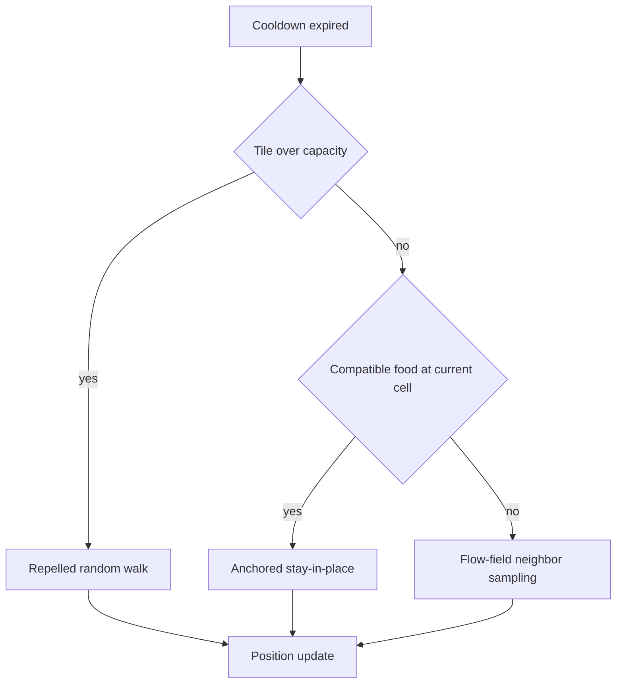
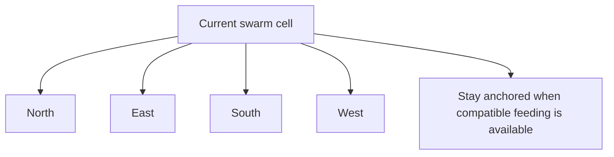

# Interaction

The interaction phase in PHIDS resolves swarm-centered ecological dynamics by coupling local movement decisions, diet-gated feeding, metabolic attrition, and population growth in `src/phids/engine/systems/interaction.py`. Within the tick sequence, this phase executes after lifecycle updates and before signaling, which means it consumes the most recent plant distribution and flow-field guidance while producing the swarm state that downstream defense logic will observe.

A compact formal representation of the phase update for swarm state $\mathcal{W}_t$ and plant state $\mathcal{P}_t$ is

$$
(\mathcal{W}_{t+1}, \mathcal{P}_{t+1}) = \mathcal{I}(\mathcal{W}_t, \mathcal{P}_t, F_t, D, \Theta),
$$

where $F_t$ is the current flow field, $D$ is the herbivore-flora diet matrix, and $\Theta$ collects species-level parameters such as consumption rates, upkeep rates, and split thresholds.

## Movement Dynamics with Capacity Pressure and Anchoring

Movement is tick-gated through `move_cooldown`, so velocity is implemented as a discrete movement period rather than a continuous speed. When a swarm is eligible to move, the phase first evaluates aggregate tile population from a per-tick cache. If local occupancy exceeds `TILE_CARRYING_CAPACITY`, a crowding-induced repelled state is injected and the swarm executes a short random walk. This physical jostling rule enforces density-dependent dispersal without global pairwise distance scans.

If crowding does not force displacement, the phase evaluates anchoring through O(1) spatial-hash co-location checks at the current cell. Presence of diet-compatible, non-depleted flora suppresses movement so feeding can proceed in place. In the absence of anchoring, movement is selected from local field candidates by `_choose_neighbour_by_flow_probability(...)`, preserving stochastic de-phasing between co-located swarms and reducing lockstep trajectories.

## Feeding and Behavioral Refinements

Feeding is locality constrained: only co-located plants returned by `world.entities_at(x, y)` are considered, and each candidate is validated by `world.has_entity(...)` before component access to prevent stale-reference failures during in-phase garbage collection. Diet compatibility is then applied through the herbivore-flora matrix.

Energy transfer from eligible plant $j$ to swarm $i$ is computed as

$$
\Delta E_{i\leftarrow j}
= \min\!\left(\frac{r_i}{\max(1,v_i)}N_i,\;E_j\right),
$$

where $r_i$ is consumption rate, $v_i$ is movement cadence, and $N_i$ is swarm population. The velocity-adjusted numerator encodes finite foraging dwell time: faster movers gain less energy per tick from a fixed contact event.

Current behavioral refinements include an arrestment reflex and a taste-rejection response. When any compatible feeding succeeds, repellency state is immediately cleared so the swarm remains in productive contact. When only incompatible plant contact occurs, a short repelled random-walk window is imposed, representing aversive departure from misleading scent peaks.

A compact abstraction of local action space and anchored/non-anchored outcomes is shown below.

## Metabolic Attrition, Reproduction, and Mitosis

After movement and potential feeding, swarms pay upkeep proportional to population and species-level energetic requirements. Deficits convert continuously into casualties rather than through coarse starvation counters, so decline and recovery remain smooth under fluctuating intake. If population reaches zero, the swarm is unregistered from the spatial hash and queued for garbage collection at phase end.

Surviving swarms convert surplus reserve energy into new individuals only after baseline viability is satisfied. Let baseline reserve be $E_{\mathrm{base}} = N_i\,E_{\min,i}$ and offspring cost be $c_i = E_{\min,i}\,\rho_i$, where $\rho_i$ is the reproduction-energy divisor. Then new individuals are

$$
\Delta N_i = \left\lfloor
\frac{\max(0, E_i - E_{\mathrm{base}})}{c_i}
\right\rfloor.
$$

This formulation prevents biologically implausible growth in barely sustained mega-swarms by forcing scale-consistent reserve requirements.

Mitosis is evaluated after energy-based reproduction. If configured split thresholds are met, `_perform_mitosis(...)` partitions population and energy between parent and offspring entities and registers the offspring in the same local neighborhood. Because `initial_population` participates in legacy threshold semantics, it remains an active control parameter rather than historical metadata.

## Numerical and Architectural Notes

Interaction writes both entity and field-adjacent state. Plant-energy deltas are applied through `GridEnvironment` helpers, while aggregate energy-layer commits are synchronized later in the loop. This preserves the global read/write contract of the engine while allowing local interaction events to remain computationally O(1) in spatial lookup paths.

Current behavioral claims are anchored in `src/phids/engine/systems/interaction.py`, `src/phids/engine/loop.py`, and `tests/integration/systems/test_systems_behavior.py`. These sources verify diet gating, crowding-induced dispersal, anchoring behavior, arrestment and taste-rejection transitions, deficit attrition, reproduction from surplus reserves, and mitosis threshold behavior.
