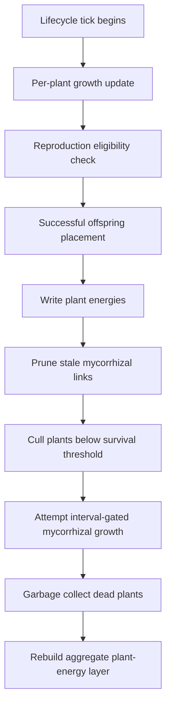
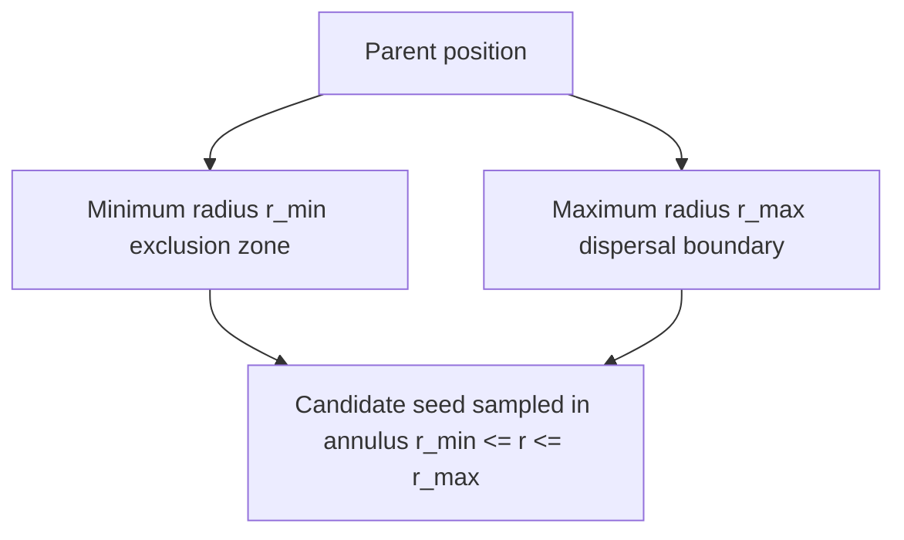
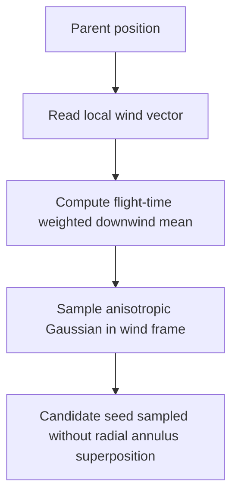

# Lifecycle

The lifecycle phase in PHIDS governs plant-centered state evolution by integrating deterministic growth, interval-gated reproduction, mycorrhizal network extension, and survival-threshold culling inside `src/phids/engine/systems/lifecycle.py`. Within the global tick schedule, lifecycle executes after flow-field construction and camouflage attenuation, but before swarm interaction and signaling. This ordering is biologically and computationally consequential because interaction must consume plant energy that has already been updated for the current tick, and signaling must evaluate defense triggers against the flora population that survived lifecycle transitions.

A compact operator expression for this phase is

$$
(\mathcal{P}_{t+1}, \mathcal{G}_{t+1}) = \mathcal{L}(\mathcal{P}_t, \mathcal{G}_t, t, \Theta_{flora}, \Theta_{myco}),
$$

where $\mathcal{P}_t$ denotes plant entities in ECS state, $\mathcal{G}_t$ denotes environmental plant-energy layers, and parameter bundles encode species growth, reproduction, and mycorrhizal constraints.

## Phase Mechanics

Lifecycle applies a strict local progression for each plant entity: growth is integrated, reproduction eligibility is evaluated, successful offspring are materialized as new ECS entities, and energy writes are pushed through biotope helpers. A subsequent pass prunes invalid mycorrhizal references, removes plants below survival threshold, and optionally attempts deterministic network expansion among disjoint neighboring pairs. Aggregate plant-energy visibility is then synchronized through a single `rebuild_energy_layer()` call, preserving a coherent read boundary for downstream phases.

## Growth and Reproduction Dynamics

Growth is implemented as a bounded incremental update,

$$
E_i^{t+1} = \min\!\left(E_i^t + E_{base,i}\,\frac{g_i}{100},\;E_{max,i}\right),
$$

where $E_i$ is current plant energy, $E_{base,i}$ is species base energy, and $g_i$ is growth rate. The key modeling decision is local incremental integration rather than a global-clock reconstruction, which avoids assigning artificial age-dependent energy to newly spawned plants.

Reproduction requires both temporal and energetic feasibility. A plant can attempt seed placement only when the species reproduction interval has elapsed since `last_reproduction_tick` and when paying the configured seed cost still keeps the parent at or above its survival threshold. Placement is constrained by boundary and occupancy checks, and energy is deducted only on successful placement, preventing deterministic self-starvation from failed landing attempts in crowded neighborhoods.

The dispersal kernel is mode-dependent and coupled to local wind state. Under near-zero wind, candidate placement is sampled from a bounded annulus around the parent (`seed_min_dist <= r <= seed_max_dist`) with uniformly sampled polar angle. Under non-zero wind, lifecycle switches to an anemochorous kernel: displacement is sampled directly in wind-aligned Gaussian coordinates derived from local wind magnitude, effective flight time (`seed_drop_height / seed_terminal_velocity`), and configured turbulence scales. In this wind-active regime, annulus displacement is not added to the Gaussian sample. This avoids an annulus-plus-Gaussian convolution artifact and preserves a biologically plausible downwind seed shadow anchored at the parent.

The calm-mode geometry is therefore interpreted as a bounded annulus:

Wind-active placement replaces that annulus sample with direct wind-kernel sampling:

## Mycorrhizal Network Extension

Lifecycle is the sole phase that forms new mycorrhizal edges in the current runtime. Growth attempts are interval-gated and deterministic in candidate ordering. Plants are sorted by stable coordinates and identifiers, and only forward neighbors are evaluated to avoid duplicate pair enumeration. During an eligible tick, multiple links may form, but each plant can participate in at most one new edge, and participating pairs must be disjoint within that pass.

Both plants in a candidate pair must be able to pay connection cost while remaining above survival thresholds after payment. When link formation succeeds, energy is deducted symmetrically and the bidirectional connection is written immediately. The implementation additionally performs an immediate post-connection viability check and same-pass removal for any participant that becomes non-viable due to numerical edge effects or externally modified thresholds; this prevents one-tick ghost residency in the ECS and preserves death-cause telemetry fidelity for mycorrhiza-induced attrition. When inter-species linking is disabled, cross-species candidates are rejected before energy checks.

## Survival Threshold Culling and Telemetry Coupling

After growth and possible reproduction, any plant with energy below survival threshold is unregistered from the spatial hash, cleared from write-side energy layers, and queued for garbage collection. Destruction is executed in a bulk cleanup step after iteration, which avoids in-loop structural mutation hazards.

Lifecycle also updates `last_energy_loss_cause`, enabling downstream telemetry attribution to distinguish deaths associated with reproduction spending, mycorrhizal construction costs, or background deficit attrition. This causal bookkeeping is important for interpreting whether a collapse is resource-limited, connectivity-limited, or behaviorally induced by prior phase interactions.

## Numerical and Architectural Boundary

Lifecycle mutates ECS plant components directly but treats environmental layers through write-side biotope helpers (`set_plant_energy`, `clear_plant_energy`) and a single synchronized rebuild at phase end. The resulting hybrid strategy preserves deterministic throughput and avoids read-after-write contamination across phase boundaries, while remaining faithful to the project rule that locality-sensitive queries must use O(1) spatial-hash lookups instead of global pairwise scans.

Implementation and validation anchors for this chapter are `src/phids/engine/systems/lifecycle.py`, `src/phids/engine/components/plant.py`, `src/phids/engine/loop.py`, `tests/integration/systems/test_systems_behavior.py`, `tests/integration/systems/test_lifecycle_reproduction.py`, and `tests/unit/api/test_schemas_and_invariants.py`.

## Where to Read Next

- For the swarm-centered phase that follows lifecycle: [`interaction.md`](interaction.md)
- For root-network signal transfer after lifecycle: [`signaling.md`](signaling.md)
- For buffered plant-energy visibility: [`biotope-and-double-buffering.md`](biotope-and-double-buffering.md)
