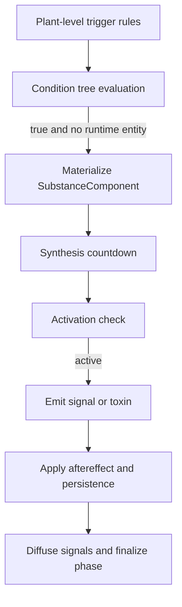
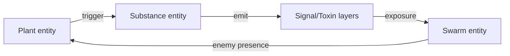

# Signaling and Substance Lifecycle

The signaling phase in PHIDS converts local ecological pressure into dynamic chemical state transitions by coupling trigger logic in `src/phids/engine/systems/signaling.py` to double-buffered environmental fields in `src/phids/engine/core/biotope.py`. The phase executes after lifecycle and interaction, so it observes post-feeding plant energy, current predator co-location, and any interaction-induced movement patterns before writing defensive emissions.

The state transition can be expressed as an operator on ecological entities and field layers:

$$
(\mathcal{E}_{t+1},\mathcal{G}_{t+1})
= \mathcal{S}\big(\mathcal{E}_t,\mathcal{G}_t,\Theta\big),
$$

where $\mathcal{E}_t$ is the ECS state, $\mathcal{G}_t$ is the grid environment, and $\Theta$ denotes species-level trigger and substance parameters. In runtime terms, `SubstanceComponent` is the central dynamic record; it stores ownership, synthesis timing, activation status, aftereffect persistence, irreversible mode, toxicity and repellence intensities, and optional activation-condition trees. This representation ensures substances are first-class entities rather than anonymous field values.

## Trigger Evaluation and Materialization

Trigger evaluation is locality constrained and spatial-hash backed. For each plant entity, the phase evaluates configured trigger rules against co-located swarm populations and optional condition-tree predicates. Implemented predicate families include direct enemy presence, same-plant substance activity, and environmental signal threshold checks. The environmental-signal predicate is biologically important because it allows ambient signal exposure to prime or activate defensive pathways without requiring direct herbivore contact at the same tick.

When a `(plant, substance_id)` rule fires and no runtime entity exists, a new `SubstanceComponent` is instantiated from schema parameters. Consequently, trigger rules in PHIDS are generative templates: they do not merely toggle booleans, they allocate persistent defensive state with explicit synthesis and persistence semantics.

## Synthesis, Activation, and Emission Dynamics

For non-active substances that were triggered in the current pass, synthesis countdown is advanced until activation eligibility is reached. Once synthesis completes and activation conditions hold, the substance enters active mode and initializes its aftereffect window. Active substances then emit either signal concentration or toxin concentration at owner coordinates.

Signal channels are subsequently diffused by `env.diffuse_signals()` under a reaction-diffusion update that can be summarized as

$$
C_s^{t+1} = C_s^t + \Delta t\left(D_s\nabla_h^2 C_s^t + Q_s^t - \lambda_s C_s^t\right),
$$

with source term $Q_s^t$ generated by active emitters and relay deposits. Runtime diffusion uses preallocated write buffers and swaps visibility only after each pass. Concentration tails below `SIGNAL_EPSILON` are truncated to suppress subnormal floating-point overhead and preserve stable sparse-field behavior.

Toxin channels differ intentionally: they are rebuilt as local plant-defense fields and do not undergo airborne diffusion. This makes toxin behavior tissue-local in the current model, while signal channels carry distributed communication semantics.

## Energy Maintenance and Persistence Semantics

Active defensive expression can consume owner plant energy through `energy_cost_per_tick`. The maintenance transaction is written immediately to plant-energy buffers to preserve consistency with subsequent tick computations. Persistence logic then determines whether a substance remains active when trigger pressure weakens.

Aftereffect windows support delayed deactivation for both signals and toxins, while irreversible mode pins activity after activation and models a systemic acquired resistance analogue. The implementation also enforces an asymmetric self-preservation boundary: if a substance is active only by lingering aftereffect and payment would cross the owner survival threshold, deactivation can occur instead of forced plant collapse. If the defense remains actively triggered or irreversible, the cost may continue and can still produce defense-maintenance mortality.

## Direct Toxin Effects and Swarm State Coupling

The signaling system is the sole authority for toxin lethality and repellence because it owns the full active substance parameterization. The helper `_apply_toxin_to_swarms(...)` reads toxin concentration at each swarm coordinate, applies lethal casualties when configured, and writes repelled-state timers for behavioral avoidance in later movement updates.

Immediate garbage collection of toxin-killed swarms is a correctness requirement. A swarm reduced to zero population is unregistered from the spatial hash and collected within the same signaling pass, preventing stale occupancy artifacts that would otherwise contaminate O(1) locality predicates in subsequent trigger checks.

A compact state coupling view is shown below.

## Verification Anchors

Current implementation evidence is concentrated in `src/phids/engine/systems/signaling.py`, `src/phids/engine/core/biotope.py`, `src/phids/engine/loop.py`, and `tests/test_systems_behavior.py`. Together, these sources verify configured toxin materialization, co-located population aggregation for trigger thresholds, aftereffect persistence behavior, irreversible activation semantics, and direct toxin casualty application with spatial-hash consistency preservation.
