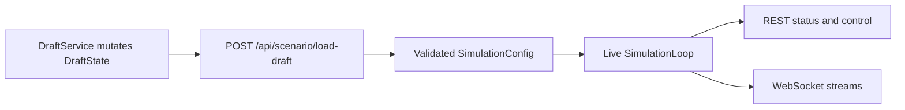

# REST and WebSocket Surfaces

PHIDS exposes two intentionally distinct network surfaces: a validated REST control plane and streaming WebSocket observation channels. The REST layer is responsible for explicit state transition requests, configuration ingress, and server-rendered HTML partials for the HTMX UI. The WebSocket layer is responsible for incremental runtime observation, with one binary protocol optimized for machine consumers and one lightweight JSON protocol optimized for browser canvas rendering.

This chapter describes current behavior in `src/phids/api/main.py` and router modules under `src/phids/api/routers/`, and should be read together with the strict draft/live boundary enforced by `DraftState` and `SimulationLoop`.

## Interface Ownership Model

The most important boundary is the distinction between editable draft state and executable runtime state. Draft mutations are performed through `DraftService` against `DraftState`; these edits do not mutate an active simulation loop. Runtime control endpoints operate only on the currently loaded `SimulationLoop` instance. The transition from draft to runtime occurs explicitly at `POST /api/scenario/load-draft`, which compiles draft state into a validated `SimulationConfig` and commits it into a live engine instance.

## Scenario Ingress and Loading

Scenario ingress has two paths. `POST /api/scenario/load` accepts a request-body `SimulationConfig` and instantiates runtime state directly. `POST /api/scenario/load-draft` accepts no scenario payload, compiles the current server-side draft, and returns an HTML status fragment for HTMX-driven control flow. `GET /api/scenario/export` serializes the current draft through the same schema boundary used by runtime loading, and `POST /api/scenario/import` validates uploaded JSON and reconstructs draft state without automatically starting a simulation.

Draft biotope settings include editable `Z2`, `Z4`, `Z6`, and `Z7` termination controls. These values remain draft-only until the load boundary is crossed; they become active only after compilation into the live `SimulationConfig`.

## Simulation Lifecycle Control

The lifecycle endpoints (`/api/simulation/start`, `/pause`, `/step`, `/reset`, `/status`, `PUT /api/simulation/wind`, and `PUT /api/simulation/tick-rate`) operate on the active loop only. `start` controls background execution, `pause` toggles paused state, and `step` advances exactly one deterministic tick when the loop is not actively running. `reset` recreates the active loop from the loaded baseline scenario and should be interpreted as runtime control, not draft editing. `status` exposes current loop state including termination metadata and current live tick speed. Wind and tick-rate updates mutate live runtime parameters directly.

## Telemetry Export and UI Polling

Telemetry routes separate bulk export from UI polling. Export endpoints under `/api/telemetry/export/*` provide CSV and NDJSON outputs for external analysis and use threadpool execution paths for CPU-heavy serialization work. UI polling endpoints (`/api/ui/tick`, `/api/ui/status-badge`, `/api/telemetry`, `/api/ui/cell-details`) support incremental rendering rather than archival transport.

`GET /api/ui/cell-details` is a key interface for temporal correctness. In live mode, it resolves current ECS/environment state. In draft mode, it returns preview details synthesized from builder state. With `expected_tick`, the route can return `409 Conflict` if the simulation has advanced, making stale reads explicit instead of silently inconsistent.

## HTMX Partial Rendering and Builder Routes

PHIDS UI routes are intentionally server-rendered. View endpoints return HTML fragments for tab panes and partial replacement, while builder mutation endpoints under `/api/config/*`, `/api/matrices/diet`, and placement routes mutate draft state through `DraftService` and return refreshed partials from canonical server-side state. This architecture keeps validation and canonical state ownership on the server rather than distributing draft logic across browser-local state replicas.

## WebSocket Protocol Split

Two WebSocket channels exist by design. `WS /ws/simulation/stream` emits binary msgpack+zlib snapshots for compact machine transport and closes with policy code `1008` when no scenario is loaded. `WS /ws/ui/stream` emits lightweight JSON payloads tuned for UI rendering and emits on meaningful signature changes so pause/resume and termination transitions remain visible even when tick count does not change.

The split is architectural: binary streaming prioritizes compact runtime serialization; UI streaming prioritizes low-friction browser paint and interaction.

## Error and State Transparency

Interface error semantics are intentionally explicit. Current examples include validation errors during scenario import and draft compilation, policy closure when simulation stream preconditions are unmet, and stale-read conflicts for cell inspection. This explicitness aligns with the project principle that state boundaries should be visible to operators and tooling.

## Verification Anchors

Current behavior is corroborated by `src/phids/api/main.py`, `src/phids/api/websockets/manager.py`, `src/phids/api/routers/`, `tests/test_api_routes.py`, and `tests/test_ui_routes.py`.

For complementary material, see `docs/ui/draft-state-and-load-workflow.md`, `docs/ui/htmx-partials-and-builder-routes.md`, and `docs/interfaces/index.md`.
