# Jules Sessions Evaluation & Project-Wide Implementation Plan

> [!IMPORTANT]
> **PRE-MERGE CLEANUP REQUIRED:** This plan document is physically tracked on branch `jules/triage-sessions` to preserve execution context across agent sessions and prevent accidental loss. Before merging `jules/triage-sessions` back into `release/v0.11.0` or `develop`, ensure all 5 phases are completed and validated, then remove or archive this file.

## Executive Summary

Following the successful cleanup of 131 obsolete/conflicting sessions, PRs, and branches, exactly **34 clean pull requests** (and their corresponding 34 Google Jules sessions) remain. These pull requests merge cleanly without git conflicts against `release/v0.11.0` (and `jules/triage-sessions`).

An in-depth code audit of all 34 PRs reveals that they represent **11 distinct functional findings**, with multiple redundant automated attempts per topic. More importantly, evaluating these findings against the core architectural constraints of PHIDS (ECS data-oriented design, Numba `@njit` hot paths, zero heap allocation, and Open Knowledge Format trace parity) reveals **critical opportunities to generalize each finding across multiple occasions throughout the codebase**.

This implementation plan evaluates each session topic one-by-one, selects the optimal candidate PR per topic, documents concrete cross-cutting codebase applications, and outlines a sequenced execution roadmap.

---

## Evaluation of Session Topics & Candidate Selection

| Topic # | Functional Finding | PR Range | Recommended PR | Architectural Assessment & Rationale |
| :--- | :--- | :--- | :--- | :--- |
| **1** | Incidental Mortality Loop Decoupling | #318-#331 (6 PRs) | [#331](https://github.com/foersben/PHIDS/pull/331) | Extracts single-entity trample resolution into `_process_single_entity` with pure parameter passing; keeps `@njit` math kernel intact. Supersedes #318-#329. |
| **2** | Simulation Router Monolith Split | #309-#330 (5 PRs) | [#330](https://github.com/foersben/PHIDS/pull/330) | Decomposes the 598-line `src/phids/api/routers/simulation.py` (largest file in repo) into `simulation/` (`controls.py`, `scenario.py`, `helpers.py`, `__init__.py`) using `router.include_router()` for 100% backward compatibility. |
| **3** | Trigger Rules `_build_node_updates` Refactor | #293-#328 (9 PRs) | [#328](https://github.com/foersben/PHIDS/pull/328) | Refactors chained `elif` blocks in `trigger_rules.py` into dedicated helper builders per node kind (`herbivore_presence`, `substance_active`, `environmental_signal`). |
| **4 & 11** | Biotope Zero-Allocation Max Gating | #299-#321 (5 PRs) | [#321](https://github.com/foersben/PHIDS/pull/321) | Replaces `np.any(layer >= SIGNAL_EPSILON)` with `layer.max() >= SIGNAL_EPSILON` in `biotope.py` diffusion loops, eliminating 2D boolean array allocations. #321 also updates unit test docstrings. |
| **5** | Numba Anchoring Kernel Short-Circuit | #323 (1 PR) | [#323](https://github.com/foersben/PHIDS/pull/323) | Replaces non-short-circuiting `found = found or (compatible and has_energy)` with `if compatible and has_energy: return True` in `anchoring.py`, allowing immediate LLVM loop breakout. |
| **6** | `validate_okf.py` Complexity Reduction | #310-#312 (2 PRs) | [#312](https://github.com/foersben/PHIDS/pull/312) | Extracts `_is_valid_target_file` and `_print_file_errors` out of `scan_bundle` in `scripts/validate_okf.py`, lowering complexity score from 15 to 11. |
| **7** | Rule of 16 Substance Bounds Enforcement | #308 (1 PR) | [#308](https://github.com/foersben/PHIDS/pull/308) | Adds Pydantic validator `num_signals + num_toxins <= MAX_SUBSTANCE_TYPES` (16) to `SimulationConfig`, closing a loophole where 16 signals + 16 toxins could overflow fixed 16x16 matrices. |
| **8** | Swarm Movement Crowding Extractor | #298-#319 (3 PRs) | [#319](https://github.com/foersben/PHIDS/pull/319) | Extracts `_handle_crowding_and_repulsion` from `movement/core.py`, flattening the main movement resolution flow without adding per-tick allocations. |
| **9** | Mycorrhizal Connections Loop Refactor | #314 (1 PR) | [#314](https://github.com/foersben/PHIDS/pull/314) | Modularizes 50-line loop body in `mycorrhiza.py` into `_connect_plants` and `_process_single_plant_mycorrhiza`, improving testability. |
| **10** | ECS Schema Biological Alignment | #296 (1 PR) | [#296](https://github.com/foersben/PHIDS/pull/296) | Synchronizes `PlantComponentSchema` with `PlantComponent` runtime state (adding 10 missing Dual-Proxy and structural mass fields) and fixes `withdrawal_duration` to `ge=1`. |

---

## Detailed Topic Evaluation & Project-Wide Generalization

### Finding 1 & 8: High-Frequency Entity Loop Decomposition & In-Loop Import Hoisting

* **Candidate PRs:** PR [#331](https://github.com/foersben/PHIDS/pull/331) (`movement/incidental.py`) and PR [#319](https://github.com/foersben/PHIDS/pull/319) (`movement/core.py`).
* **Deep Evaluation:** Both PRs break down monolithic entity loops into single-entity helpers (`_process_single_entity`, `_handle_crowding_and_repulsion`). However, our AST inspection discovered a major code smell: `movement/core.py` and `movement/incidental.py` execute dynamic imports inside the per-tick entity loops:
  * `core.py`: `import numpy as np` inside `_resolve_swarm_movement` (executed for every swarm entity every tick!).
  * `core.py`: `from phids.engine.core.herbivore_params import get_herbivore_evasion_duration` and `get_herbivore_softmax_temperature` inside the movement loop.
  * `incidental.py`: `from phids.engine.components.plant import PlantComponent` inside the co-located occupant loop.
* **Project-Wide Generalization (Multiple Occasions):**
  * **Module-Level Import Hoisting:** Cleanly hoist all dynamic imports in `movement/core.py`, `movement/incidental.py`, and `lifecycle/reproduction.py` to the top-level module scope. This eliminates repetitive `sys.modules` lookups across hot paths.
  * **Occupant Loop Standardization:** Apply the single-entity worker extraction pattern across all 5 spatial occupant loops identified in the engine:
    * `src/phids/engine/systems/interaction/movement/incidental.py` (PR #331)
    * `src/phids/engine/systems/interaction/movement/core.py` (PR #319)
    * `src/phids/engine/systems/lifecycle/reproduction.py` (`_process_cell_occupants`)
    * `src/phids/engine/systems/interaction/feeding.py` (`_process_co_located_grazing`)
    * `src/phids/engine/systems/signaling/emission.py` (`_process_cell_emitters`)

---

### Finding 2: Monolith Package Splitting with Seamless Backward Compatibility

* **Candidate PR:** PR [#330](https://github.com/foersben/PHIDS/pull/330) (`src/phids/api/routers/simulation.py`).
* **Deep Evaluation:** `simulation.py` was the single largest file in the entire repository (598 lines). PR #330 cleanly partitions it into:
  * `src/phids/api/routers/simulation/__init__.py`: Composition root exporting `router = APIRouter()` with sub-routers included via `.include_router()`.
  * `src/phids/api/routers/simulation/controls.py`: Runtime loop execution endpoints (`/start`, `/pause`, `/step`, `/reset`, `/status`, `/speed`, `/wind`).
  * `src/phids/api/routers/simulation/scenario.py`: Scenario serialization endpoints (`/load-scenario`, `/export-scenario`, `/import-scenario`, `/load-draft`).
  * `src/phids/api/routers/simulation/helpers.py`: Private HTMX fragment generators and form parsing helpers.
* **Project-Wide Generalization (Multiple Occasions):**
  * **Documentation Link Synchronization:** Update OKF documentation frontmatter sources across `docs/scientific_model/future_prospects/biological_abstractions.md` and `docs/technical_architecture/interfaces_and_ui.md` to reference the modular sub-router files.
  * **Blueprint for Remaining Monoliths:** Apply this exact packaging blueprint to other growing monolithic surfaces:
    * `src/phids/api/routers/ui.py` (398 lines) -> split into `ui/` (`dashboard.py`, `tooltips.py`, `modals.py`).
    * `src/phids/api/presenters/dashboard/cell_details/live.py` (474 lines) -> split into modular presenters.

---

### Finding 3: Polymorphic Node Builder Helpers

* **Candidate PR:** PR [#328](https://github.com/foersben/PHIDS/pull/328) (`src/phids/api/routers/config/trigger_rules.py`).
* **Deep Evaluation:** Replaces chained `elif` dictionary mutations in `_build_node_updates` with cohesive helper builders:
  * `_build_herbivore_presence_updates`
  * `_build_substance_active_updates`
  * `_build_environmental_signal_updates`
* **Project-Wide Generalization (Multiple Occasions):**
  * `src/phids/api/services/draft/trigger_rules.py`: Lines 423-445 (`_build_default_trigger_node`) has the exact same polymorphic `if node_kind == ...` branching dictionary creation. We should synchronize the helper builder patterns between the router and draft service to prevent divergence.

---

### Finding 4 & 11: Zero-Allocation Scalar Gating (`.max() >= val` vs `np.any(arr >= val)`)

* **Candidate PRs:** PR [#321](https://github.com/foersben/PHIDS/pull/321) (and PR [#315](https://github.com/foersben/PHIDS/pull/315)).
* **Deep Evaluation:** In `src/phids/engine/core/biotope.py`, `diffuse_signals()` gates active signaling channels. Calling `np.any(self._signal_layers_write[s] >= SIGNAL_EPSILON)` creates a full temporary 2D boolean NumPy array on every active channel on every tick. Replacing this with `self._signal_layers_write[s].max() >= SIGNAL_EPSILON` (or `not (layer.max() < SIGNAL_EPSILON)`) executes an in-place C-level reduction returning a scalar float, completely avoiding heap allocation.
* **Project-Wide Generalization (Multiple Occasions):**
  * **Signal Inactive Gating:** Check both read layer entry (`float(np.amax(layer)) < SIGNAL_EPSILON`) and write layer exit (`self._signal_layers_write[s].max() >= SIGNAL_EPSILON`).
  * **Audit Other Grid Comparisons:** Assert that no other PDE kernels or telemetry aggregators instantiate temporary boolean masks in per-tick loops.

---

### Finding 5: Numba Kernel Short-Circuiting

* **Candidate PR:** PR [#323](https://github.com/foersben/PHIDS/pull/323) (`src/phids/engine/systems/interaction/movement/anchoring.py`).
* **Deep Evaluation:** In `_has_compatible_food_jit`, the loop previously accumulated boolean status via `found = found or (compatible and has_energy)` without exiting early. PR #323 introduces an immediate return:

  ```python
  if compatible and has_energy:
      return True
  ```

  This allows LLVM to compile branch-optimized early breakout instructions, avoiding redundant memory reads across remaining flora channels once food is confirmed.
* **Project-Wide Generalization (Multiple Occasions):**
  * Inspect all `@njit` kernels in `src/phids/engine/core/flow/` and `src/phids/engine/systems/signaling/triggers.py` to ensure that search/predicate loops do not perform non-short-circuiting accumulator assignments.

---

### Finding 7: Rule of 16 Global Bounding Invariant Enforcement

* **Candidate PR:** PR [#308](https://github.com/foersben/PHIDS/pull/308) (`src/phids/api/schemas/simulation.py`).
* **Deep Evaluation:** The Rule of 16 requires all static interaction matrices (diet compatibility, substance triggers) to be bounded at $16 \times 16$. `SimulationConfig` previously validated `num_signals <= 16` and `num_toxins <= 16` separately, permitting up to 32 combined substances. PR #308 enforces:

  ```python
  if self.num_signals + self.num_toxins > MAX_SUBSTANCE_TYPES:
      raise ValueError(...)
  ```

* **Project-Wide Generalization (Multiple Occasions):**
  * **Draft Service Synchronization:** Verify that `src/phids/api/services/draft/substances.py` (`add_substance`) similarly enforces `len(draft.substance_definitions) < MAX_SUBSTANCE_TYPES`.
  * **Placement Schemas:** Audit `src/phids/api/schemas/placements.py` to assert that flora and herbivore species indices in initial placement payloads are bounded by `MAX_FLORA_SPECIES` and `MAX_HERBIVORE_SPECIES`.

---

### Finding 9: Mycorrhizal Connections Loop Refactoring

* **Candidate PR:** PR [#314](https://github.com/foersben/PHIDS/pull/314) (`src/phids/engine/systems/lifecycle/mycorrhiza.py`).
* **Deep Evaluation:** Extracts `_connect_plants` and `_process_single_plant_mycorrhiza` from the 50-line `_establish_mycorrhizal_connections` loop, reducing cognitive complexity from 15 to 7.
* **Project-Wide Generalization (Multiple Occasions):**
  * Together with Finding 1 (Incidental Mortality), this establishes the standard engine pattern: entity system coordination loops should delegate individual entity state mutation and grid updates to focused helper routines, keeping system entry points clean and linear.

---

### Finding 10: ECS Schema Alignment with Biological Reality (Complete Schema Parity)

* **Candidate PR:** PR [#296](https://github.com/foersben/PHIDS/pull/296) (`src/phids/api/schemas/ecs.py`).
* **Deep Evaluation:** PR #296 added 10 missing fields to `PlantComponentSchema` (such as `structural_mass`, `mycorrhizal_connections`, and `seed_terminal_velocity`).
* **CRITICAL EXTENSION & GENERALIZATION (Project-Wide Discovery):**
  Our codebase audit discovered that `SwarmComponentSchema` and `SubstanceComponentSchema` in `src/phids/api/schemas/ecs.py` suffer from the **exact same documentation and runtime drift**:
  * **Missing in `SwarmComponentSchema`:**
    * `reproduction_energy_divisor: float` (Species-level growth throttle)
    * `move_cooldown: int` (Ticks remaining until next movement)
    * `last_dx: int` (Last movement delta X: -1, 0, 1)
    * `last_dy: int` (Last movement delta Y: -1, 0, 1)
  * **Missing in `SubstanceComponentSchema`:**
    * `synthesis_duration: int` (Configured synthesis duration in ticks)
    * `aftereffect_remaining_ticks: int` (Remaining aftereffect duration at runtime)
    * `activation_condition: dict[str, object] | None` (Nested activation predicate tree for telemetry & tooltip display)
    * `triggered_this_tick: bool` (Whether condition was satisfied in current pass)
  * **Generalization Action:** When applying PR #296, we must update not only `PlantComponentSchema`, but simultaneously update `SwarmComponentSchema` and `SubstanceComponentSchema` to achieve 100% full ECS telemetry observability across REST and WebSocket inspector layers.

---

## Phased Implementation Roadmap

```mermaid
flowchart TD
    subgraph Phase1 ["Phase 1: Performance Kernels & Import Hoisting"]
        P1_1["Apply PR #321: Biotope Zero-Allocation Max Gating"]
        P1_2["Apply PR #323: Numba Anchoring Kernel Short-Circuit"]
        P1_3["Hoist In-Loop Dynamic Imports: core.py, incidental.py, reproduction.py"]
    end

    subgraph Phase2 ["Phase 2: Invariant Bounding & Full ECS Schema Parity"]
        P2_1["Apply PR #308: Rule of 16 Substance Bounds Validator"]
        P2_2["Apply PR #296: ECS PlantComponentSchema Biological Parity"]
        P2_3["Extend ECS Parity: Add missing Swarm & Substance component fields"]
    end

    subgraph Phase3 ["Phase 3: High-Frequency Entity Loop Decomposition"]
        P3_1["Apply PR #331: Incidental Mortality Loop Extractor"]
        P3_2["Apply PR #319: Swarm Movement Crowding Extractor"]
        P3_3["Apply PR #314: Mycorrhizal Connections Loop Extractor"]
    end

    subgraph Phase4 ["Phase 4: Control Plane & Script Modularization"]
        P4_1["Apply PR #330: Simulation Router Monolith Split"]
        P4_2["Apply PR #328: Trigger Rules Node Builder Helpers"]
        P4_3["Apply PR #312: validate_okf.py Complexity Reduction"]
    end

    subgraph Phase5 ["Phase 5: Full-Stack Verification & Housekeeping"]
        P5_1["Run Pre-Commit & Lint: ruff check, ruff format, mypy"]
        P5_2["Run Test Suite: pytest unit & integration tests"]
        P5_3["Run Matrix Parity & Benchmarks: verify_matrix_trace_parity, pytest-benchmark"]
        P5_4["Discard 24 Superseded PRs & Delete Remaining Jules API Sessions"]
    end

    Phase1 --> Phase2
    Phase2 --> Phase3
    Phase3 --> Phase4
    Phase4 --> Phase5
```



### Phase 1: Micro-Optimizations & In-Loop Import Hoisting

* 1. Cherry-pick / apply PR [#321](https://github.com/foersben/PHIDS/pull/321) (`layer.max() >= SIGNAL_EPSILON` in `biotope.py`).
* 2. Cherry-pick / apply PR [#323](https://github.com/foersben/PHIDS/pull/323) (`if compatible and has_energy: return True` in `anchoring.py`).
* 3. Hoist local imports to module scope in `src/phids/engine/systems/interaction/movement/core.py` (`numpy`, `get_herbivore_evasion_duration`, `get_herbivore_softmax_temperature`) and `incidental.py` (`PlantComponent`).

### Phase 2: Invariant Bounding & Complete ECS Schema Parity

* 1. Apply PR [#308](https://github.com/foersben/PHIDS/pull/308) (Rule of 16 validator in `SimulationConfig` and unit tests).
* 2. Apply PR [#296](https://github.com/foersben/PHIDS/pull/296) (`PlantComponentSchema` and `withdrawal_duration` fix).
* 3. **Generalization Task:** Update `SwarmComponentSchema` and `SubstanceComponentSchema` in `src/phids/api/schemas/ecs.py` with the missing runtime fields identified during the audit.

### Phase 3: High-Frequency Entity Loop Decomposition

* 1. Apply PR [#331](https://github.com/foersben/PHIDS/pull/331) (`_process_single_entity` in `incidental.py`).
* 2. Apply PR [#319](https://github.com/foersben/PHIDS/pull/319) (`_handle_crowding_and_repulsion` in `core.py`).
* 3. Apply PR [#314](https://github.com/foersben/PHIDS/pull/314) (`_process_single_plant_mycorrhiza` in `mycorrhiza.py`).

### Phase 4: Control Plane & Script Modularization

* 1. Apply PR [#330](https://github.com/foersben/PHIDS/pull/330) (split `simulation.py` into package `src/phids/api/routers/simulation/` with `controls.py`, `scenario.py`, `helpers.py`, `__init__.py`).
* 2. Apply PR [#328](https://github.com/foersben/PHIDS/pull/328) (`_build_node_updates` helpers in `trigger_rules.py`).
* 3. Apply PR [#312](https://github.com/foersben/PHIDS/pull/312) (`scan_bundle` helpers in `scripts/validate_okf.py`).

### Phase 5: Full-Stack Verification & Housekeeping

* 1. **Linter & Type Checker:** `uv run ruff check` and `uv run mypy`.
* 2. **Unit & Integration Tests:** `uv run pytest tests/unit/ tests/integration/`.
* 3. **Matrix Trace Parity:** `uv run python scripts/verify_matrix_trace_parity.py --all`.
* 4. **Performance Benchmark Gate:** `uv run pytest tests/benchmark/ -m benchmark`.
* 5. **Housekeeping:** Close the 24 superseded candidate PRs on GitHub, delete their remote branches, and purge their corresponding sessions from Google Jules API.

---

## Session Housekeeping Disposition Table

| Selected PR (To Apply) | Superseded Duplicate PRs (To Close & Discard) |
| :--- | :--- |
| **PR #331** (Incidental Mortality) | PR #329, PR #326, PR #322, PR #320, PR #318 |
| **PR #330** (Simulation Router Split) | PR #327, PR #324, PR #313, PR #309 |
| **PR #328** (Trigger Rules Builder) | PR #325, PR #317, PR #316, PR #307, PR #302, PR #300, PR #295, PR #293 |
| **PR #321** (Biotope Max Gating) | PR #315, PR #311, PR #303, PR #299 |
| **PR #323** (Anchoring Short-Circuit) | *(None - unique)* |
| **PR #312** (validate_okf Complexity) | PR #310 |
| **PR #308** (Rule of 16 Bounds) | *(None - unique)* |
| **PR #319** (Swarm Movement Crowding) | PR #304, PR #298 |
| **PR #314** (Mycorrhiza Loop) | *(None - unique)* |
| **PR #296** (ECS Schema Parity) | *(None - unique)* |
