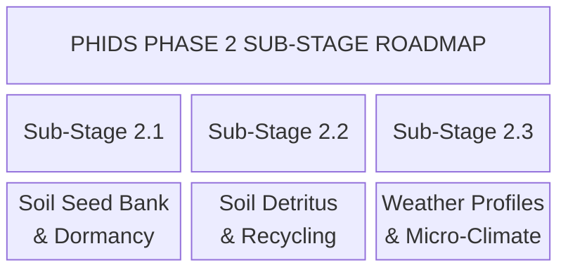

This document defines the multiphase strategic development roadmap for the Plant-Herbivore Interaction & Defense Simulator (PHIDS). It details realized and planned milestones across **biological fidelity**, **full-stack software architecture**, **spatiotemporal scaling**, **empirical database ingestion**, **UI controls**, **telemetry/replay updates**, **QA regression gates**, and **high-performance computing (HPC)** perspectives.

---

## Core Architectural Principles

1. **Standalone Scientific Utility**: Every milestone is partitioned into self-contained, independent sub-stages (v2.1, v2.2, etc.). Completing any single sub-stage yields an immediately usable, scientifically validated capability for ecological researchers, requiring zero reliance on subsequent stages.
2. **Zero-Overhead Opt-In Guarantee**: Optional biological and environmental systems (e.g., soil chemistry, weather profiles, 3D grids) default to disabled ($0\text{ bytes}$ allocated, $0\text{ ms}$ CPU overhead). They can be selectively loaded via scenario YAML/JSON files.
3. **Clean Unencumbered Evolution Strategy (No Backward Compatibility)**: PHIDS explicitly rejects backward-compatibility shims, legacy schema fallbacks, or versioned dataset wrappers. Because the framework is in active pre-release development prior to formal academic deployment, data models, Zarr telemetry buffers, and scenario schemas evolve cleanly. When breaking updates occur, example scenario files (`scenarios/*.yaml`), benchmark suites, and tests are updated directly to the latest specification.
4. **Full-Stack End-to-End Scope**: Each sub-stage plans all necessary modifications across the Python backend, Jinja2/HTMX web UI, scenario import/export buttons, DuckDB empirical database ETL, Zarr telemetry schemas, PyInstaller packaging, and Design Space Exploration (DSE) parameter search spaces.
5. **Quality & Regression Gates**: Every sub-stage must pass strict QA gates, including mutation testing via `mutmut` ($>85\%$ kill rate) and performance regression gates via `pytest-benchmark` ($<5\%$ tick latency regression).
6. **Deterministic PRNG Seeding**: All stochastic events (seed flight, zoochory transport, weather noise) use per-component/per-region PRNG generators (`np.random.Generator`), ensuring tick-by-tick deterministic replay capability.

---

## Phase 1: High-Performance Engine & Core Biological Upgrades (v1.0 - Realized)

### Realized Biological & Computer Science Milestones

* **Data-Oriented ECS Architecture & Flow Fields** `[Realized]`: Unified spatial hashing with zero-allocation JIT execution loops ($F = \alpha E \cdot N - \beta \sum T_k$).
* **Continuous Sigmoidal Hill Priming** `[Realized]`: Transitioned VOC perception from step-functions to dose-dependent logarithmic Hill kinetics ($S(c) = \frac{c^n}{K^n + c^n}$).
* **Rate-Limited Phloem Translocation** `[Realized]`: Modeled vascular carbohydrate movement from leaves to roots ($\frac{dN}{dt} = -k(N - N_{\text{target}})$).
* **Constitutive Morphological Defenses** `[Realized]`: Integrated mechanical mouthpart damage ($\lfloor m_{\text{bite}} (1-\rho) \rfloor$) and cell-wall caloric discounting ($\eta_{\text{net}}$).
* **Holling Type II Response & Swarm Paradigms** `[Realized]`: Implemented saturating feeding curves with handling time $T_h$ and multi-tier flight behavior (`MACRO_SWARM`, `SOLITARY_GRAZER`, `OVIPOSITION_SEEKER`).
* **Operator-Splitting PDE Solvers & Telemetry** `[Realized]`: Combined semi-Lagrangian wind advection with $3\times 3$ Gaussian stencils, Zarr telemetry, and HTMX web visualization.

---

## Phase 2: Advanced Spatial Fidelity & Micro-Climate Extensions (v2.0 - Planned)

Phase 2 is structured into granular, independent sub-stages. Each sub-stage can be implemented, tested, and published independently.

### Sub-Stage 2.1: Soil Seed Bank & Dormancy Kinetics (v2.1)

* **Biological Target**: Replace instant adult plant spawning with a persistent soil seed bank. Dispersed seeds land in a dormant state (`seed_bank_layer`) and require accumulated thermal degree-days ($GDD = \sum \max(0, T - T_{\text{base}})$) and a moisture threshold ($W > W_{\text{germ}}$) to sprout.
* **Standalone Researcher Utility**: Enables plant ecologists to study seed longevity, seasonal germination windows, seed mortality, and weed bank dynamics without requiring subterranean soil chemistry or weather layers.
* **Computational & Performance Cost**:
  * **Memory**: $+4\text{ Bytes/cell}$ float32 seed density array ($\sim 1\text{ MB}$ for a $512 \times 512$ grid).
  * **CPU Latency**: $< 0.05\text{ ms/tick}$ via vectorized Numba JIT array updates.
* **Implementation Effort & Full-Stack Scope**:
  * **Backend & API**: Add `SeedBankConfig` schema to `phids.api.schemas.simulation`, create `seed_bank_layer` in `GridEnvironment`, update `DraftState`/`DraftService` for hot-reloading, and integrate germination triggers in `lifecycle.py` ($\sim 250$ LOC).
  * **UI & Dashboard**: Add a "Seed Bank & Dormancy" toggle card in `src/phids/api/templates/index.html`, GDD threshold sliders, scenario JSON export/import bindings, and a live "Seed Bank Heatmap" layer toggle in the web dashboard renderer.
  * **Empirical Bio-Database Pipeline**: Extend DuckDB schema (`phids.analytics.bio_database`) and `src/data_pipeline/json_builder.py` to ingest `germination_gdd_threshold` and `seed_decay_rate` from the TRY database.
  * **Telemetry & Replay Schema**: Direct update to `ReplayState` and Zarr dataset schemas to serialize `seed_bank_density`. All scenario examples (`scenarios/*.yaml`) updated to match.
  * **QA & Verification Gates**: Unit tests for $GDD$ accumulation; mutation test coverage via `mutmut` ($>85\%$ kill rate on `lifecycle.py`); benchmark regression gate ($<5\%$ tick overhead).
  * **Packaging**: Verify standalone binary bundling in `packaging/phids.spec` for updated templates and DuckDB schemas.
  * **Documentation**: Update `docs/technical_architecture/engine_execution.md` (lifecycle phase update) and `docs/scenario_guide/index.md`.
  * **DSE Scope Extension**: Cross-reference [Design Space Exploration Guide](scenario_guide/design_space_exploration.md) for new continuous genes (`germination_gdd_threshold`, `seed_dormancy_decay_rate`).

### Sub-Stage 2.2: Soil Detritus & Biomass Recycling Loop (v2.2)

* **Biological Target**: Convert dead plant tissue and herbivore carcasses into an organic detritus layer ($B_{\text{detritus}}$) that mineralizes into bio-available soil nitrogen ($N_{\text{soil}}$), establishing a closed-loop nutrient cycle.
* **Standalone Researcher Utility**: Provides soil scientists and ecosystem ecologists with a tool to investigate nutrient turnover, plant competition under nitrogen limitation, and organic fertilizing feedback loops.
* **Computational & Performance Cost**:
  * **Memory**: Dense Mode: $+8\text{ Bytes/cell}$ ($\sim 2\text{ MB}$ for $512^2$). Macro-Patch Mode ($16 \times 16$ coarse grid): $+32\text{ Bytes/patch}$ ($\sim 32\text{ KB}$).
  * **CPU Latency**: Dense Mode: $\sim 0.10\text{ ms/tick}$. Macro-Patch Mode: $< 0.01\text{ ms/tick}$.
* **Implementation Effort & Full-Stack Scope**:
  * **Backend & API**: Add `SoilModule` to `GridEnvironment`, implement JIT mineralization kernels, and hook dead entity biomass into detritus pools during `lifecycle.py` and `interaction.py` passes ($\sim 350$ LOC).
  * **UI & Dashboard**: Add "Soil & Biomass Recycling" settings panel (mode selection: Disabled / Dense / Macro-Patch 16x16), initial nitrogen slider, scenario JSON export/import bindings, and a live 2D "Soil Nitrogen Overlay" map view.
  * **Empirical Bio-Database Pipeline**: Update DuckDB tables with soil nitrogen baselines and plant tissue N:P decomposition ratios.
  * **Telemetry & Replay Schema**: Direct update to Zarr schema adding `/soil_nitrogen` matrix layer when enabled.
  * **QA & Verification Gates**: Nitrogen and total biomass conservation law integration tests.
  * **Documentation**: Update `docs/technical_architecture/system_architecture.md` with soil double-buffering layers.
  * **DSE Scope Extension**: Cross-reference [Design Space Exploration Guide](scenario_guide/design_space_exploration.md) for soil mineralization continuous/discrete genes.

### Sub-Stage 2.3: Macro-Patch Weather & Micro-Climate Profile (v2.3)

* **Biological Target**: Introduce dynamic seasonal/diurnal temperature $T(t)$, relative humidity $H(t)$, and rainfall pulses $W(t)$ that modulate photosynthesis rates, VOC diffusion constants ($D_{\text{VOC}}(T)$), and insect activity.
* **Standalone Researcher Utility**: Enables climate change impact assessments, heatwave/drought stress experiments, and diurnal VOC emission studies.
* **Computational & Performance Cost**:
  * **Memory**: $< 1\text{ KB}$ (scalar or $K \times K$ macro-patch struct).
  * **CPU Latency**: $< 0.03\text{ ms/tick}$.
* **Implementation Effort & Full-Stack Scope**:
  * **Backend & API**: Implement `WeatherModule` in `phids.engine.core` and integrate climate parameter updates into `SimulationLoop.step()` Phase 0 ($\sim 220$ LOC).
  * **UI & Dashboard**: Add "Weather Profile" selection menu (Constant, Sinusoidal Seasonal, Drought Pulse), ambient temperature live telemetry badge on the top dashboard bar, and scenario JSON import/export support.
  * **Empirical Bio-Database Pipeline**: Ingest species thermal tolerance limits ($T_{\text{min}}, T_{\text{max}}$) into `bio_database.json`.
  * **Telemetry & Replay Schema**: Record global climate scalars directly in Zarr frame metadata.
  * **QA & Verification Gates**: Validate Arrhenius reaction rate scaling tests for VOC synthesis.
  * **Documentation**: Update `docs/scientific_model/mathematical_framework.md` with temperature-dependent Arrhenius kinetics for VOC synthesis.
  * **DSE Scope Extension**: Cross-reference [Design Space Exploration Guide](scenario_guide/design_space_exploration.md) for climate amplitude and drought intensity genes.

### Phase 2 Implementation Summary Matrix

| Sub-Stage | Core Feature | Dev Complexity | Backend & API | UI & Scenario Import/Export | Empirical DB & ETL | Zarr Telemetry & QA Gates | Target Docs | DSE Parameters Added |
|---|---|---|---|---|---|---|---|---|
| **v2.1** | Soil Seed Bank | Low-Mod ($\sim 250$ LOC) | `seed_bank_layer`, `lifecycle.py` GDD logic | HTMX Seed Bank toggle, GDD sliders, JSON buttons, live overlay | Ingest `gdd_threshold`, `seed_decay` in DuckDB | Direct `/seed_bank_density` Zarr update, `mutmut` $>85\%$ | `engine_execution.md` | `germination_gdd_threshold`, `seed_decay_rate` |
| **v2.2** | Soil Detritus Recycling | Moderate ($\sim 350$ LOC) | `SoilModule` JIT mineralization kernels | Soil settings panel (Disabled/Dense/Patch), live N-map | Soil N baselines & tissue N:P decay ratios | Direct `/soil_nitrogen` Zarr array | `system_architecture.md` | `mineralization_rate`, `soil_nitrogen_baseline` |
| **v2.3** | Weather Profiles | Low-Mod ($\sim 220$ LOC) | `WeatherModule`, `SimulationLoop` Phase 0 | Weather profile selector, dashboard temp badge | Species thermal limits ($T_{\text{min}}, T_{\text{max}}$) in JSON | Direct climate scalars in Zarr metadata | `mathematical_framework.md` | `seasonal_temp_amplitude`, `drought_factor` |

---

## Phase 3: Unified Forest-Scale Architecture & Spatiotemporal Scaling (v3.0 - Planned)

To simulate an entire physical biome (e.g., a 1 km² mixed forest) realistically, PHIDS cannot rely on arbitrary grid units and abstract ticks. This phase rigorously enforces Dimensional Anchoring and integrates a multi-scale temporal loop to support high-fidelity biological abstraction.

### Sub-Stage 3.1: Dimensional Anchoring & Modulo-Gated Loops (v3.1) [Realized]

* **Biological Target**: Lock the simulation scale to explicit physical units ($\Delta L = 1\text{m}$, $\Delta \tau = 1\text{hr}$, $\Delta E = 100\text{kcal}$) and decouple biological rules by their natural frequency.
* **Why (The Problem)**: Without physical units, biological rates (e.g., reproduction vs. diffusion) become unanchored and arbitrary, preventing empirical validation against real-world databases. High-fidelity ecosystems require matching simulation ticks to real-world diurnal and seasonal cycles.
* **How (The Implementation)**: We introduce a multi-tiered temporal loop. A `Slow Loop` manages growth and metabolism (1hr/tick), while a `Fast PDE Solver Loop` manages diffusion and wind (1s/tick).
* **Standalone Researcher Utility**: Enables massive temporal scaling where VOC diffusion (seconds) and plant growth (months) can be modeled simultaneously without floating-point errors.
* **Computational Target**: Shift from a $1000 \times 1000$ to $1024 \times 1024$ grid to allow 1-cycle bitwise modulo `& 1023` for Toroidal wrapping. Enforce Modulo-Gated loops (1hr, 24hr, 168hr) guaranteeing a 93.7% cache hit rate when streaming 64-byte ECS component cache lines during the Slow Loop.
* **Implementation Scope**: Add dimensional limits to `SimulationConfig`, refactor `SimulationLoop.step()`, and implement a Sparse Zarr playback layer (reducing network UI stream from $4.8\text{ GB/s}$ down to $720\text{ KB/s}$ via a Temporal Lens).

### Sub-Stage 3.2: Stochastic Von Neumann Kinematics & Capacity Masking (v3.2)

* **Biological Target**: Convert precise individual collision mechanics into abstracted fluid-like macro-diffusion (Gradient Ascent via Softmax).
* **Why (The Problem)**: Traditional entity-collision models scale as $O(N^2)$, which halts execution at ecosystem scales. Individual collision checking also introduces massive CPU branch mispredictions.
* **How (The Implementation)**: We treat swarms as a probabilistic fluid, moving them toward resource gradients. By substituting conditional boundary checks with boolean logic arrays, the CPU pipeline is never flushed.
* **Computational Target**: Utilize Von Neumann (4-way) kinematics to halve DRAM fetches compared to Moore neighborhoods. Utilize 128-bit XMM / 512-bit ZMM SIMD vectors for batch Softmax probability generation ($\sim 20$ cycles per swarm).
* **Implementation Scope**: Transition movement kernels. Implement Volumetric Collision using branchless boolean masking (`prob * (biomass < max_cap)`) to prevent CPU pipeline flushes from branch mispredictions in the spatial hash.

### Sub-Stage 3.3: O(1) Stochastic Raycasting for Seed Dispersal (v3.3) [Realized]

* **Biological Target**: Solve the seed dispersal computational bottleneck during massive reproduction waves.
* **Why (The Problem)**: Calculating continuous wind-drift dispersal for tens of thousands of seeds geometrically explodes simulation latency.
* **How (The Implementation)**: Instead of tracing a seed frame-by-frame, we compute its terminal flight distance via a closed-form kinematic integral, then perform a stochastic $O(1)$ coordinate raycast to deposit it instantly.
* **Computational Target**: Reduce algorithmic complexity from $O(N \times r^2)$ ($\sim 15\text{ ms}$ for 10k plants) to $O(N)$ ($\sim 20\,\mu\text{s}$ via `PCG64` generator).
* **Implementation Scope**: Replace the continuous spatial convolution for seed drops with a discrete $O(1)$ stochastic raycasting coordinate selection.

---

## Phase 4: Distributed HPC Execution & AI-Driven Ecosystem Optimization (v4.0 - Future Vision)

### Sub-Stage 4.1: GPU-Accelerated PyTorch/CUDA PDE Engines (v4.1)

* **Computational Target**: Port 2D/3D reaction-diffusion cellular automata layers to GPU tensor accelerators (PyTorch / CUDA C++ kernels).
* **Why (The Problem)**: The CPU memory bandwidth (even on DDR5) becomes the absolute bottleneck when running fluid diffusion algorithms (Navier-Stokes/Reaction-Diffusion) across millions of grid cells.
* **How (The Implementation)**: Wrap `flow_field.py` inside PyTorch Tensors. Offload the advection and diffusion convolutions directly to VRAM, syncing with the CPU only during ECS data-exchange ticks.
* **Standalone Researcher Utility**: Enables real-time simulation of massive biotope grids ($2048 \times 2048$ to $4096 \times 4096$) at over 60 FPS.
* **Implementation Effort & Scope**: High ($\sim 800$ LOC; CUDA kernel bindings). Offloads CPU memory; GPU execution time $< 0.20\text{ ms/tick}$.

### Sub-Stage 4.2: AI Agent Design Space Exploration (DSE) & Coevolution (v4.2)

* **Computational Target**: Automate Pareto multi-objective optimization using reinforcement learning and genetic algorithms to discover optimal plant defense investment strategies under multi-stress climate scenarios.
* **Why (The Problem)**: Exploring multidimensional trait parameters manually is statistically blind. We need algorithms that can dynamically search the hyper-cube of genetic configurations to locate evolutionary stable peaks.
* **How (The Implementation)**: Utilize Ray/Tune to orchestrate parallel headless instances of the simulator, evaluating fitness gradients ($J_{\text{eco}}$) across millions of mutations.
* **Evaluating AI-in-the-loop (AITL) for DSE**:
    * Rather than deploying AI as a definitive, black-box "puppet master", this phase evaluates to what extent AI-in-the-loop can act as a viable replacement or assistant for Human-in-the-loop (HITL) steering during Design Space Exploration.
    * We aim to test if headless AI agents can intelligently propose tweaks to multi-dimensional species traits (e.g., VOC emission rates, root depth allocation) across simulation seeds without producing biologically uninterpretable artifacts.
    * The goal is to determine if algorithms can reliably parse long-term survivability ($J_{\text{eco}}$) to recommend evolutionary stable strategies (ESS) to human researchers for final validation, maintaining interpretability.
* **Standalone Researcher Utility**: Provides evolutionary biologists with automated discovery of non-dominated evolutionary stable strategies (ESS) for plant chemical and morphological defense.
* **Implementation Effort & Scope**: High ($\sim 700$ LOC; Ray/Tune distributed integration). Cluster-scale parallel execution ($O(N_{\text{simulations}})$).

---

## Phase 5: Speculative Research Extensions & Future Prospects

Beyond Phase 3 and 4, PHIDS maintains a speculative research pipeline evaluating advanced biological mechanisms and computational paradigms.

### 5.1 Chronological Aging & Senescence Incorporation Models

While PHIDS intentionally omits individual chronological aging in core execution because swarm dynamics average out senescence ($N \gg 10^2$), specialized ecological scenarios (e.g., senescent mortality during long migration or age-dependent foraging decline) can be realized through three architecturally compatible paradigms:

1. **Mean Swarm Age Component (Scalar Approximation)**:
    * **Mechanism**: Add a float32 scalar `mean_age` to `SwarmComponent` ($+4\text{ Bytes/entity}$). On each tick, $\text{mean\_age} \leftarrow \text{mean\_age} + \Delta t$. Upon reproduction or split, the new mean age updates via a weighted arithmetic mean: $A_{\text{new}} = \frac{N_{\text{parent}} \cdot A_{\text{parent}} + \Delta N \cdot 0}{N_{\text{parent}} + \Delta N}$.
    * **Why**: This enables age-dependent velocity or upkeep decay at zero dynamic memory allocation overhead.
2. **Weibull Cohort Hazard Mortality Rate ($\mu_{\text{age}}$)**:
    * **Mechanism**: Model senescent mortality at the swarm level using a Weibull hazard rate: $\mu(A) = \frac{k}{\lambda}\left(\frac{A}{\lambda}\right)^{k-1}$. Casualties per tick are subtracted directly from population $N_i$ during metabolic attrition passes without instantiating individual organism entities.
    * **Why**: Captures exponential end-of-life decay mathematically without the ECS overhead of tracking a graveyard of distinct entities.
3. **Multi-Cohort Stage Partitioning (Matrix Model)**:
    * **Mechanism**: Partition a single herbivore population on a tile into $K$ discrete age-cohort ECS entities (e.g., Young, Prime, Senescent). Each cohort acts as an independent entity with distinct trait structs.
    * **Why**: Maintains SIMD vectorization while capturing fine-grained age demographics, ideal for modeling species with distinct larva-to-adult metamorphosis constraints.

### 5.2 Non-Dimensional Empirical Parameter Calibration Pipeline

To bridge raw open-access databases (TRY, PanTHERIA, GloBI, Pherobase, ToxValDB) to discrete simulation scales without generating unphysical Lotka-Volterra artifacts:

1. **Spatiotemporal Dimensional Anchoring**:
    * **Why**: Raw biological traits are measured in mixed SI units (grams, hours, liters) which causes numerical instability when mixed in PDEs.
    * **How**: Non-dimensionalize all database traits using Buckingham $\Pi$-groups based on grid cell length $L_0 = \Delta L$, tick duration $T_0 = \Delta \tau$, and energy quantum $E_0 = \Delta E$.
2. **Allometric Scaling Laws**:
    * **Why**: To extrapolate unrecorded metabolic values for unstudied species using their mass.
    * **How**: Enforce Kleiber's Law ($BMR \propto M^{0.75}$) and Metabolic Theory of Ecology ($C_{\text{max}} \propto M^{0.75}$) during ETL build passes in `src/data_pipeline/transform.py`.
3. **Empirically Bounded DSE Hyper-Cubes**:
    * **Why**: Unbounded AI exploration will produce alien, non-biological entities that break physics.
    * **How**: Restrict DSE optimization search spaces to empirical confidence intervals $[\mu_k - 2\sigma_k, \mu_k + 2\sigma_k]$ derived from database taxonomic distributions.
4. **Biologically Authenticated Cost Function**:
    * **Why**: To filter out optimization results that are mathematically optimal but biologically dead-ends.
    * **How**: Evaluate scenarios via multi-objective fitness $J_{\text{eco}} = w_1 S_{\text{LV}} + w_2 D_{\text{bio}} + w_3 P_{\text{thermo}}$, rewarding limit cycle stability while penalizing empirical parameter drift and thermodynamic violations.
    * *Detailed Reference*: [Empirical Parameter Calibration Strategy](scientific_model/future_prospects/parameter_calibration_strategy.md).

### 5.3 Evolutionary Arms Race & Dynamic Gene Mutation Solvers

* **Biological Target**: Allow plant chemical defense pathways (induced VOC synthesis rates, toxin potency) and herbivore neutralization counter-adaptations to mutate dynamically across generations.
* **Why (The Problem)**: Fixed traits prevent the simulation from exhibiting the Red Queen Hypothesis, a fundamental pillar of evolutionary biology.
* **How (The Implementation)**: Implemented via SIMD bit-mask mutations on ECS trait structs during mitosis and seed germination, enabling real-time co-evolutionary arms race simulations over $10^5$ ticks.

### 5.4 Speculative Granularity & Reality Neglectables

Several mechanisms have been intentionally deferred to the speculative research horizon because they provide minimal macroscopic reality-complicity while introducing devastating architectural or computational overhead:

1. **3D Canopy VOCs**:
    * **The Issue**: Upgrading the 2D biotope to a fully 3D tensor grid ($W \times H \times Z$) with $Z=16$ layers inflates the environment memory footprint from $80\text{ MB}$ to over $128\text{ MB}$.
    * **The Reality Check**: This completely evicts the CPU L3 cache, breaking SIMD performance. This feature is deferred indefinitely unless explicitly tied to the PyTorch/CUDA GPU engine (Phase 4.1).
2. **Trait Herbivore Morphs (Instars)**:
    * **The Issue**: Modeling distinct lifecycle stages (e.g., larva vs adult) breaks ECS SIMD uniformity by requiring fragmented cohorts on the same spatial tile.
    * **The Reality Check**: The macroscopic impact is sufficiently approximated using mean swarm mass without splitting into distinct ECS entities.
3. **Zoochory Dispersal**:
    * **The Issue**: Tracking the gut-retention times of seeds inside animals adds significant logic branching.
    * **The Reality Check**: Baseline anemochory (wind-dispersal) via the $O(1)$ stochastic raycasting solver is sufficient for broad spatial propagation without pathing overhead.
4. **Sub-Tick PDE Slicing**:
    * **The Issue**: Because $\Delta \tau = 1\text{ hr}$, simulating airborne diffusion might stretch the Courant stability limit.
    * **The Reality Check**: Executing $K$ micro-steps internally per tick multiplies the PDE solver overhead by $K$. Sub-slicing is deferred; stability will first be pursued via empirical viscosity dampening.
