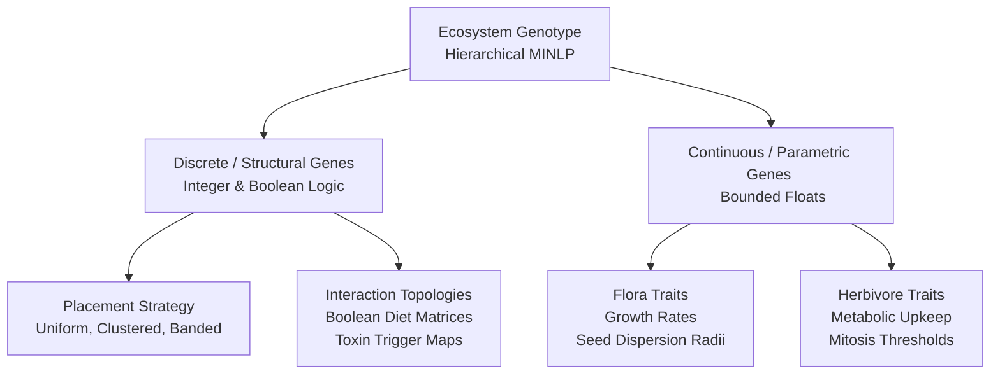
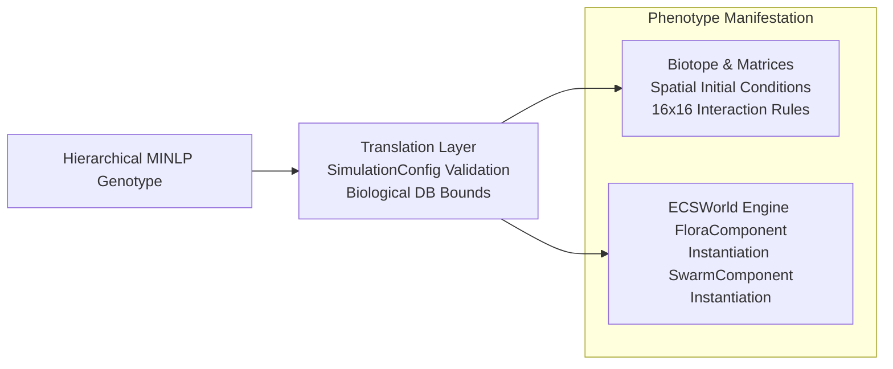
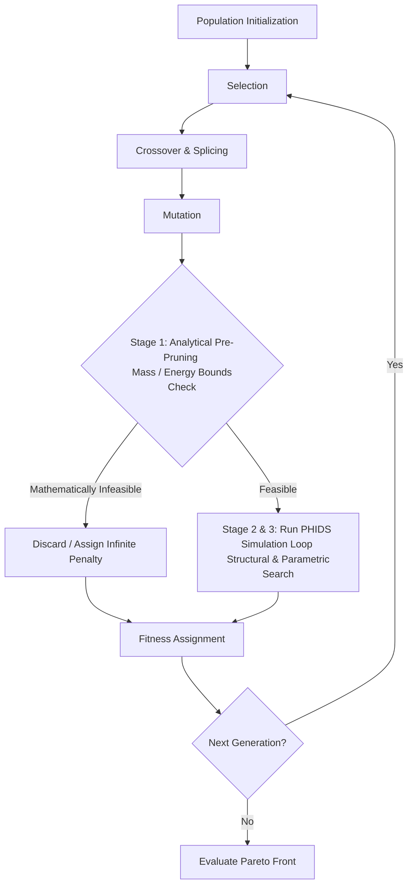
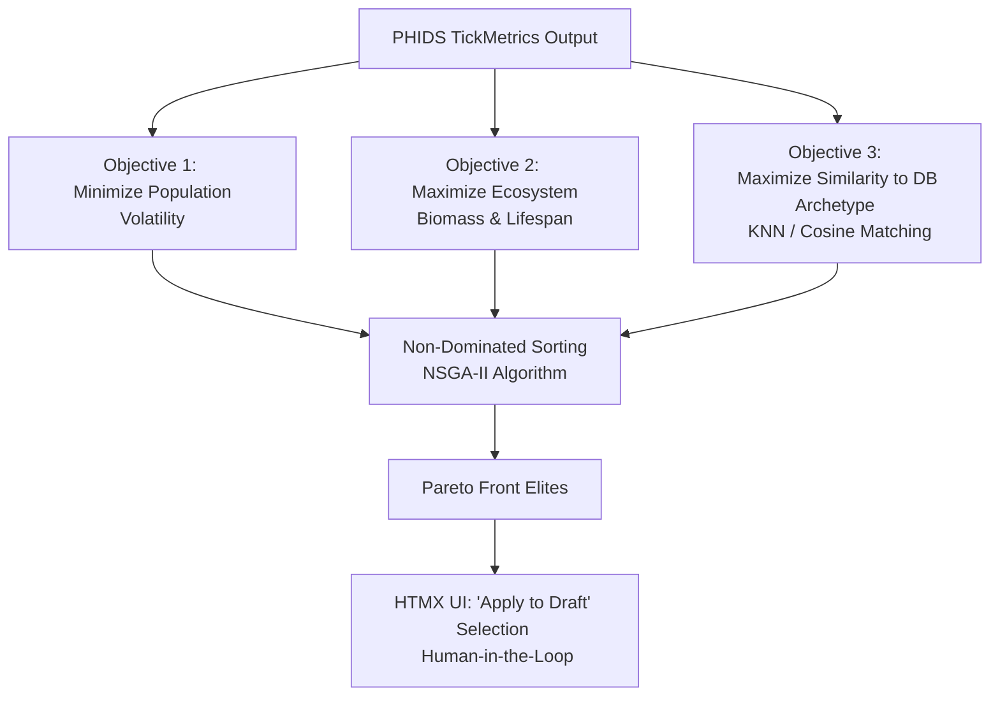
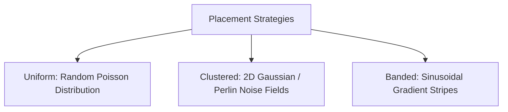

# Design Space Exploration (DSE)

The Plant-Herbivore Interaction & Defense Simulator (PHIDS) utilizes an **Evolutionary Encapsulated Multi-Stage Design Space Exploration (DSE)** architecture. DSE systematically searches a vast landscape of ecological parameters, spatial configurations, and interaction topologies to discover stable Lotka-Volterra dynamics (stable equilibria) within simulated ecosystems.

---

## 1. The Hierarchical MINLP Genotype

### 1.1 Conceptual Intuition
Imagine you are designing an entire forest ecosystem. You have two types of decisions to make:

* **Discrete Decisions (Yes/No or Choices)**: Which plant species exist? Who eats whom (the food web)? What layout strategy do we use (clumped vs. scattered)?
* **Continuous Decisions (Sliders/Numbers)**: How fast does Plant A grow ($0.0$ to $1.0$)? How much energy does Herbivore B burn per step ($0.05$ to $0.5$)?

Older versions of PHIDS treated this as a flat list of numbers (a single vector) and used standard optimization algorithms like SciPy's Differential Evolution. This failed because of the **curse of dimensionality**: if you have 10 parameters, the search space is large; if you have 50 parameters (some choices, some numbers), the search space becomes exponentially vast and complex ($O(d^N)$). 

The new DSE model treats this search space as a **Mixed-Integer Non-Linear Programming (MINLP)** problem. It separates the "discrete choices" (the structure) from the "continuous sliders" (the rates) in a hierarchy, pruning invalid structural combinations before tuning the rates.

### 1.2 Mathematical Formulation
A genotype $G$ is represented as a composite vector space:

$$G = (X_D, X_C)$$

where:

* $X_D \in \mathcal{D}$ represents the discrete subspace (categorical and binary choices):
  $$\mathcal{D} = \{S_P, \mathbf{A}, \mathbf{T}\}$$
  * $S_P \in \{\text{Uniform}, \text{Clustered}, \text{Banded}\}$: Spatial placement strategy.
  * $\mathbf{A} \in \{0, 1\}^{N_H \times N_F}$: Diet compatibility matrix ($N_H$ herbivores, $N_F$ flora).
  * $\mathbf{T} \in \{0, 1\}^{N_F \times N_F}$: Toxin signaling trigger compatibility map.
* $X_C \in \mathcal{C}$ represents the continuous parameters bounded by biological limits:
  $$\mathcal{C} = \prod_{i=1}^{V} [l_i, u_i] \subset \mathbb{R}^V$$
  * Growth rate $g_j \in [0, 1]$
  * Metabolic upkeep cost $m_i \in [0, \infty)$
  * Mitosis threshold $e_{\text{rep}, i} \in [m_i, \infty)$
  * Seed dispersal radius $r_{\text{seed}, j} \in [0, W]$ where $W$ is the grid width.

---

## 2. Genotype-to-Phenotype Mapping

### 2.1 Mapping Intuition
A **Genotype** is a blueprint (the recipe). A **Phenotype** is the physical manifestation (the actual baked cake). 
Before the simulator can evaluate an ecosystem, it must map the abstract choices and values of the genotype into the actual working components inside the simulation engine. 
* Discrete choices determine *how many* entities are spawned, *where* they are placed on the grid, and how their interaction tables are set up.
* Continuous parameters are assigned directly to the entities' internal components (e.g., speed, energy reserves).

### 2.2 Algorithmic Pipeline
Let $\Phi: G \to P$ be the mapping function from genotype to phenotype representation. The translation layer performs the following mapping pipeline:

1.  **Validation**:
    $$\Phi_{\text{val}}(G) \implies \text{SimulationConfig}$$
    We validate $G$ against the Pydantic schema rules. If $\Phi_{\text{val}}(G)$ violates physical constraints (such as $N_F + N_H > 16$), the genotype is flagged as invalid.
2.  **Discrete-to-Matrix Translation**:
    The diet compatibility matrix $\mathbf{A}$ maps directly to the active interaction registers in the ECS engine. The interaction coefficient for herbivore $i$ consuming plant $j$ is calculated as:
    $$C_{ij} = A_{ij} \times \omega_{ij}$$
    where $A_{ij} \in \{0,1\}$ is the structural genotype gene, and $\omega_{ij} \in \mathbb{R}^+$ is the continuous rate gene.
3.  **Spatial Coordinates Deployment**:
    Based on the placement strategy gene $S_P$, the translation layer generates coordinates $(x_k, y_k) \in [0, W]^2$ for each initial entity $k$. The placement generator function $f_{\text{place}}(S_P, \text{seed})$ populates the 2D grid matrix:
    $$\mathbf{M}_{\text{grid}} = f_{\text{place}}(S_P, \text{seed})$$

---

## 3. The Evolutionary Iteration Loop (Pre-Pruning)

### 3.1 Loop Intuition
Running a full ecological simulation (thousands of ticks) takes a lot of computer processing time (CPU cycles). If a genotype specifies that plants grow at $0\%$ rate, or that herbivores burn $100$ units of energy per step but only get $1$ unit of energy from eating, we already know *mathematically* that this ecosystem will collapse instantly.

To save time, we introduce a filter called **Stage 1: Analytical Pre-Pruning**. Before starting the expensive simulation loop, we run simple thermodynamic check equations. If the candidate ecosystem fails the basic math of energy balance, it is instantly discarded with a severe penalty score, bypassing the simulation entirely.

### 3.2 Stage 1 Pre-Pruning Formulation
Stage 1 Pre-Pruning evaluates thermodynamic feasibility. Let $E_{\text{in}}$ be the maximum theoretical energy input into the trophic system per unit area, and $E_{\text{out}}$ be the minimum required metabolic upkeep.

1.  **Thermodynamic Feasibility Constraint**:
    For the ecosystem to support herbivores, the primary production energy rate must exceed the metabolic maintenance rate:
    $$\sum_{j \in \text{Flora}} g_j \cdot K_j > \sum_{i \in \text{Herbivores}} m_i \cdot N_i^{(0)}$$
    where:
    * $g_j$: Growth rate of plant $j$.
    * $K_j$: Carrying capacity parameter (maximum density limit) of plant $j$.
    * $m_i$: Metabolic upkeep of herbivore $i$.
    * $N_i^{(0)}$: Initial population size of herbivore $i$.

    If this inequality is violated, the genotype is structurally unviable.

2.  **Trophic Link Check**:
    For every herbivore $i$ present in the genotype, there must be at least one active trophic connection to a plant $j$:
    $$\forall i, \exists j \text{ s.t. } A_{ij} = 1$$
    If $\sum_{j} A_{ij} = 0$, the herbivore has no food source.

If either check fails, the simulation phase is skipped, and the genotype is assigned a fitness vector:
$$\mathbf{F} = (+\infty, 0, 0)$$
representing maximum volatility, zero biomass, and zero similarity.

---

## 4. Multi-Objective Evaluation & Biological Database Connection

### 4.1 Evaluation Intuition
Ecosystem stability isn't just a single score. An ecosystem with 1,000 rabbits and 1 grass blade is unstable; an ecosystem that keeps exactly 50 rabbits and 200 grass blades alive for 10,000 steps is very stable. We evaluate configurations on three distinct goals simultaneously:
1. **Minimize Volatility**: We want population sizes to remain steady (no wild swings or sudden extinctions).
2. **Maximize Biomass**: We want a healthy amount of total living material.
3. **Database Similarity**: We want the parameters to look like real-world biology (so we aren't creating "fantasy" creatures).

We use an algorithm called **NSGA-II (Non-dominated Sorting Genetic Algorithm)**. Instead of looking for a single winner, NSGA-II finds a **Pareto Front**—a set of "elite" configurations that represent the best possible trade-offs. For example, one elite might have maximum biomass but slightly higher volatility, while another has perfect stability but lower biomass.

The database connection has two ways of working:
* **Mode A (Generative)**: The computer finds a stable configuration mathematically, then searches the SQLite database using a nearest-neighbor formula to find which real-world plants and animals are the closest match.
* **Mode B (Constrained)**: You tell the computer "I want to simulate a temperate oak forest." The database locks the variables to oak forest ranges, and the algorithm tries to find a stable configuration *within* those strict rules.

### 4.2 Multi-Objective Formulation
Let the fitness vector be $\mathbf{F}(G) = (f_1(G), f_2(G), f_3(G))$.

1.  **Objective 1 (Minimize Population Volatility)**:
    We measure the coefficient of variation (CV) of the populations over $T$ steps:
    $$f_1(G) = \sum_{k \in \text{Species}} \frac{\sigma(N_k)}{\mu(N_k)}$$
    where $\mu$ and $\sigma$ are the mean and standard deviation of species population $N_k$ over time.
2.  **Objective 2 (Maximize Biomass & Lifespan)**:
    $$f_2(G) = - \left( \sum_{t=1}^{T} \sum_{k} M_k \cdot N_k(t) \right)$$
    where $M_k$ is the individual mass coefficient of species $k$. (Negative sign since genetic algorithms minimize by default).
3.  **Objective 3 (Maximize Database Similarity via KNN)**:
    Let $\mathbf{v}_G$ be the trait vector of the genotype, and $\mathbf{v}_{\text{DB}}$ be the normalized trait vectors of biological species in the database.
    $$f_3(G) = \min_{\mathbf{v}_{\text{DB}}} \sqrt{\sum_{d=1}^{V} w_d \left( v_{G, d} - v_{\text{DB}, d} \right)^2}$$
    where $w_d$ is the weight coefficient for trait $d$.

#### NSGA-II Domination Rules
A genotype $G_1$ dominates $G_2$ ($G_1 \prec G_2$) if and only if:
$$\forall j \in \{1, 2, 3\}, f_j(G_1) \le f_j(G_2) \quad \text{and} \quad \exists j \text{ s.t. } f_j(G_1) < f_j(G_2)$$

#### Crowding Distance Calculation
To maintain diversity along the Pareto Front, solutions are sorted by crowding distance in objective space. For each objective $m$:
1. Sort the population based on objective value $m$.
2. Assign infinite distance to boundary solutions: $I[1]_{\text{dist}} = I[l]_{\text{dist}} = \infty$.
3. For all intermediate solutions $i \in [2, l-1]$:
    $$I[i]_{\text{dist}} = I[i]_{\text{dist}} + \frac{f_m(I[i+1]) - f_m(I[i-1])}{f_m^{\text{max}} - f_m^{\text{min}}}$$

---

## 5. Spatial Initial Conditions (The Placement Gene)

### 5.1 Spatial Placement Intuition
Where animals and plants start out on the grid dictates whether they survive. If all grass is on the left side and all herbivores start on the right side, the herbivores might starve before finding the grass.
We represent three starting patterns using mathematical generation rules:
1. **Uniform**: Organisms are scattered completely randomly using simple probability distributions.
2. **Clustered**: Organisms start in tight groups or patches (like families or groves). We generate this using **Perlin Noise** (which makes smooth, cloud-like patterns) or **Gaussian Clusters**.
3. **Banded**: Organisms are placed in stripes (representing ecological bands, like elevation zones on a mountain or lines of plants near water).

### 5.2 Geometric Algorithms
The spatial coordinates $(x, y)$ of spawned entities are generated by resolving the placement gene $S_P$:

#### 1. Uniform Placement (Poisson Disk Sampling)
To prevent overlaps while maintaining random placement, we sample coordinates such that no two entities start closer than a minimum distance $r_{\text{min}}$:
$$\forall p_1, p_2 \in \mathbf{X}_{\text{spawn}}, \quad \|p_1 - p_2\|_2 \ge r_{\text{min}}$$

#### 2. Clustered Placement (Multi-variate Gaussian Mixture)
For $C$ clusters, we select centroids $\boldsymbol{\mu}_c \sim \mathcal{U}(0, W)^2$. Entities are spawned around these centroids using a normal distribution with covariance matrix $\boldsymbol{\Sigma}$:
$$\mathbf{X}_{\text{spawn}, c} \sim \mathcal{N}(\boldsymbol{\mu}_c, \boldsymbol{\Sigma})$$
where $\boldsymbol{\Sigma} = \sigma^2 \mathbf{I}$ controls cluster density (spread).

#### 3. Banded Placement (Sinusoidal Probability Fields)
We define a spatial probability density function $P(x, y)$ along a direction vector $\mathbf{v} = (\cos\theta, \sin\theta)$:
$$P(x, y) = \frac{1}{2} \left[ \sin\left(\frac{2\pi (x\cos\theta + y\sin\theta)}{\lambda}\right) + 1 \right]$$
where $\lambda$ represents the band wavelength. Entities are accepted or rejected on the grid using a random roll against $P(x, y)$.

---

## Implementation Roadmap

The transition to this architecture occurs across five phases:

### Phase 1: Foundation & Biological Database
* **Task 1.1: Database Schema Definition**: Define Pydantic models mapping biological archetypes to engine parameters.
* **Task 1.2: Database Engine Initialization**: Set up a lightweight SQLite database with curated seed data.
* **Task 1.3: Bi-Directional Mapping Services**: Implement KNN search (Generative Mode) and bounded limit fetching (Constrained Mode).

### Phase 2: Engine Modifications for Structural Genes
* **Task 2.1: Spatial Distribution Schemas**: Introduce PlacementStrategy Enums (Uniform, Clustered, Banded) for flora and herbivores.
* **Task 2.2: Placement Resolution Logic**: Update Biotope/ECS generation to interpret placement strategies deterministically via seeds.

### Phase 3: The Multi-Stage DSE Algorithm
* **Task 3.1: Stage 1**: Implement Analytical Pre-Pruning validators.
* **Task 3.2: Stage 2 & 3**: Build Structural and Parametric Search implementations (utilizing frameworks like DEAP or Optuna).
* **Task 3.3: Pareto-Front Evaluation**: Establish multi-objective fitness evaluation via NSGA-II.

### Phase 4: Async Task Management & Telemetry
* **Task 4.1: Background Task Queue**: Integrate Celery/Asyncio to decouple DSE processing from the main web thread.
* **Task 4.2: DSE WebSocket Stream**: Broadcast live Pareto Front coordinates.

### Phase 5: UI/UX Integration (Human-in-the-Loop)
* **Task 5.1: Configuration Menu Elements**: Add Mode A/B radio buttons and DB dropdowns to the HTMX UI.
* **Task 5.2: Live Scatterplot Visualization**: Render real-time telemetry on the dashboard.
* **Task 5.3: HITL Review Grid**: Allow the user to select one of the top 3-5 Pareto candidates and execute "Apply to Draft".

---

## Technical Safety Checks

!!! warning "Constraint: Rule of 16 Adherence"
    Ensure the DSE Structural Search never attempts to add a 17th species, preserving the engine's zero-allocation array bounds.

!!! warning "Constraint: Numba JIT Cache Warming"
    Ensure the DSE worker shares the Numba JIT cache with the main application, or pre-warms the cache before starting the evolutionary loop to prevent compilation stalls on the first generation.

!!! warning "Constraint: Subnormal Floating-Point Drift"
    Maintain the bounds protections implemented in the previous optimizer to prevent parameters from settling exactly on 0.0, which causes subnormal float slowdowns.

## Updated Genotype Structures

The MINLP genotype space has been expanded to include:
*   **Passive Defenses:** Morphological parameters (`mechanical_damage_per_bite`, `digestibility_modifier`) attached to `FloraSpeciesParams`.
*   **Resistances:** Counter-adaptations (`morphological_adaptation`, `chemical_neutralization`, `digestive_efficiency`) attached to `HerbivoreSpeciesParams`.
*   **Senescence Rules:** Utilizing the new `resource_withdrawal` action within the `TriggerRule` discriminated union.

The underlying empirical database (`bio_database.json`) reflects this deeply nested schema layout:
*   `base_metrics`
*   `passive_defenses`
*   `substances`
*   `trigger_rules`

### Multi-Level Cascade Trigger Example

The PHIDS engine supports complex, multi-tiered defensive reactions by nesting activation conditions. For example:

1.  **Herbivore Presence:** A swarm begins feeding.
2.  **Activates Airborne Signal VOC:** The plant synthesizes an alarm signal.
3.  **Neighboring Plant Detects VOC:** The signal diffuses across the grid. A neighboring plant's trigger rule (conditioned on `environmental_signal`) evaluates to true.
4.  **Triggers Leaf Toxin Synthesis:** The neighbor preemptively synthesizes a lethal toxin.
5.  **Prolonged Ingestion Triggers Root Resource Reallocation:** If the herbivore presence persists despite the toxin, a secondary rule (conditioned on both `herbivore_presence` AND `substance_active`) triggers a `resource_withdrawal` action, dimming the plant's chemotactic profile and forcing the swarm to disperse.

## Updated Genotype Structures

The MINLP genotype space has been expanded to include:
*   **Passive Defenses:** Morphological parameters (`mechanical_damage_per_bite`, `digestibility_modifier`) attached to `FloraSpeciesParams`.
*   **Resistances:** Counter-adaptations (`morphological_adaptation`, `chemical_neutralization`, `digestive_efficiency`) attached to `HerbivoreSpeciesParams`.
*   **Senescence Rules:** Utilizing the new `resource_withdrawal` action within the `TriggerRule` discriminated union.

The underlying empirical database (`bio_database.json`) reflects this deeply nested schema layout:
*   `base_metrics`
*   `passive_defenses`
*   `substances`
*   `trigger_rules`

### Multi-Level Cascade Trigger Example

The PHIDS engine supports complex, multi-tiered defensive reactions by nesting activation conditions. For example:

1.  **Herbivore Presence:** A swarm begins feeding.
2.  **Activates Airborne Signal VOC:** The plant synthesizes an alarm signal.
3.  **Neighboring Plant Detects VOC:** The signal diffuses across the grid. A neighboring plant's trigger rule (conditioned on `environmental_signal`) evaluates to true.
4.  **Triggers Leaf Toxin Synthesis:** The neighbor preemptively synthesizes a lethal toxin.
5.  **Prolonged Ingestion Triggers Root Resource Reallocation:** If the herbivore presence persists despite the toxin, a secondary rule (conditioned on both `herbivore_presence` AND `substance_active`) triggers a `resource_withdrawal` action, dimming the plant's chemotactic profile and forcing the swarm to disperse.
