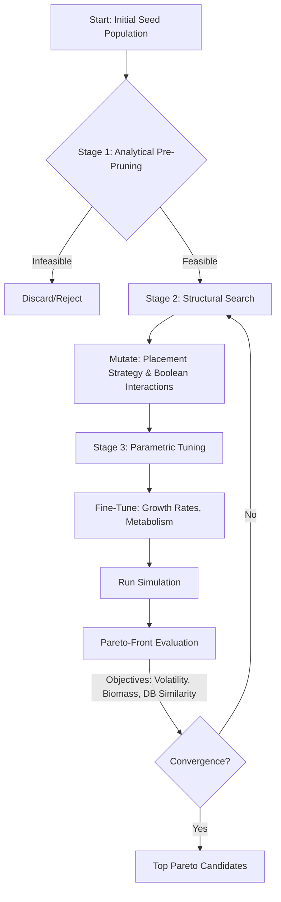
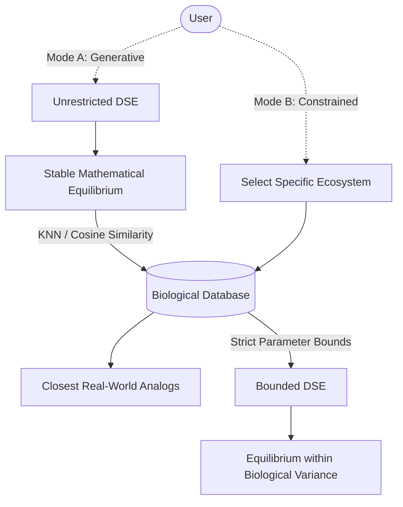
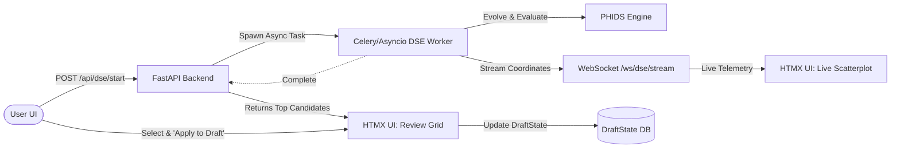

# Design Space Exploration (DSE)

The Plant-Herbivore Interaction & Defense Simulator (PHIDS) utilizes an Evolutionary Encapsulated Multi-Stage Design Space Exploration (DSE) architecture to discover stable Lotka-Volterra dynamics within complex, multi-species ecosystems.

## 1. The Shift to Multi-Stage DSE (Addressing MINLP)

Previous versions of the engine relied on flat SciPy Differential Evolution (the "Trophic Optimizer"). However, this optimizer suffers from the "curse of dimensionality" ($O(D^N)$) because it treats the ecosystem as a flat vector of continuous numbers.

The updated DSE treats ecosystem generation as a Mixed-Integer Non-Linear Programming (MINLP) problem. To avoid combinatorial explosions and computational waste, the optimization is encapsulated into distinct hierarchical stages:

*   **Stage 1 (Analytical Pre-Pruning):** The engine mathematically rejects impossible parameter bounds before wasting CPU cycles on a simulation run. For example, if a plant's maximum theoretical caloric output is lower than a herbivore's minimum metabolic upkeep, the configuration is instantly discarded.
*   **Stage 2 (Structural Search - Discrete Genes):** Mutates discrete topological configurations, such as boolean interaction matrices (who eats whom) and spatial placement topologies.
*   **Stage 3 (Parametric Tuning - Continuous Genes):** Fine-tunes continuous variables, such as specific growth rates and metabolisms, within bounded limits.
*   **Pareto-Front Evaluation:** Instead of collapsing ecosystem health into a single scalar fitness score, the DSE returns a Pareto Front evaluating multi-objective tuples: (Volatility, Biomass, Database_Similarity).



## 2. Biological Database Connection (Two-Way Mapping)

To ground the theoretical mathematics in empirical data, the DSE features a dual-mode integration with a real-world biological database:

*   **Mode A: Generative (Design-to-Nature):** An unrestricted DSE searches the mathematical space to find a stable Lotka-Volterra equilibrium. Once found, the result is mapped against the biological database via K-Nearest Neighbors (KNN) or Cosine Similarity to find the closest real-world biological analogs (e.g., matching a stable mathematical plant profile to *Taxus baccata*).
*   **Mode B: Constrained (Nature-to-Design):** The user selects a specific real-world ecosystem (e.g., a Pine Forest) from the database. The database then locks the DSE into strict parameter bounds, forcing the structural optimizer to find equilibrium only within the biological variance of those specific species.



## 3. Spatial Initial Conditions (The Placement Gene)

Spatial topology is a critical driver of Lotka-Volterra stability (e.g., clustered prey survive better than uniformly distributed prey due to signal overlap). In the multi-stage DSE, the "Placement Strategy" is a mutable structural gene evaluated during Stage 2. Options include:

*   **Uniform:** Standard Poisson random distribution.
*   **Clustered:** Dense patches generated via Perlin noise or Gaussian clusters.
*   **Banded:** Striped spatial generation mimicking altitudinal zonation or coastal gradients.

## Implementation Roadmap

The transition to this architecture will occur across the following five phases:

### Phase 1: Foundation & Biological Database

*   **Task 1.1: Database Schema Definition**
    Define Pydantic models mapping biological archetypes to engine parameters.

    ```python
    from pydantic import BaseModel, Field

    class BioPlantArchetype(BaseModel):
        species_name: str
        growth_rate_min: float = Field(..., ge=0.0)
        growth_rate_max: float = Field(..., le=1.0)
        metabolic_upkeep: float
        toxin_compatibility_classes: list[int]
    ```

*   **Task 1.2: Database Engine Initialization**
    Set up a lightweight SQLite (or Postgres) database with curated seed data.
*   **Task 1.3: Bi-Directional Mapping Services**
    Implement KNN search (Generative Mode) and bounded limit fetching (Constrained Mode).

### Phase 2: Engine Modifications for Structural Genes

*   **Task 2.1: Spatial Distribution Schemas**
    Introduce PlacementStrategy Enums (Uniform, Clustered, Banded) for flora and herbivores.
*   **Task 2.2: Placement Resolution Logic**
    Update Biotope/ECS generation to interpret placement strategies deterministically via seeds.

### Phase 3: The Multi-Stage DSE Algorithm

*   **Task 3.1: Stage 1**
    Implement Analytical Pre-Pruning validators.
*   **Task 3.2: Stage 2 & 3**
    Build Structural and Parametric Search implementations (utilizing frameworks like DEAP or Optuna).
*   **Task 3.3: Pareto-Front Evaluation**
    Establish multi-objective fitness evaluation.

### Phase 4: Async Task Management & Telemetry

*   **Task 4.1: Background Task Queue**
    Integrate Celery/Asyncio to decouple DSE processing from the main web thread.
*   **Task 4.2: DSE WebSocket Stream**
    Broadcast live Pareto Front coordinates.

### Phase 5: UI/UX Integration (Human-in-the-Loop)

*   **Task 5.1: Configuration Menu Elements**
    Add Mode A/B radio buttons and DB dropdowns to the HTMX UI.
*   **Task 5.2: Live Scatterplot Visualization**
    Render real-time telemetry on the dashboard.
*   **Task 5.3: HITL Review Grid**
    Allow the user to select one of the top 3-5 Pareto candidates and execute "Apply to Draft".



### Technical Safety Checks

!!! warning "Constraint: Rule of 16 Adherence"
    Ensure the DSE Structural Search never attempts to add a 17th species, preserving the engine's zero-allocation array bounds.

!!! warning "Constraint: Numba JIT Cache Warming"
    Ensure the DSE worker shares the Numba JIT cache with the main application, or pre-warms the cache before starting the evolutionary loop to prevent compilation stalls on the first generation.

!!! warning "Constraint: Subnormal Floating-Point Drift"
    Maintain the bounds protections implemented in the previous optimizer to prevent parameters from settling exactly on 0.0, which causes subnormal float slowdowns.
