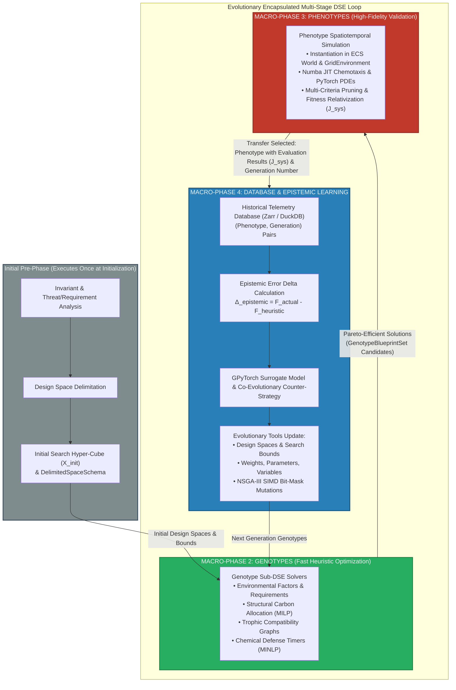
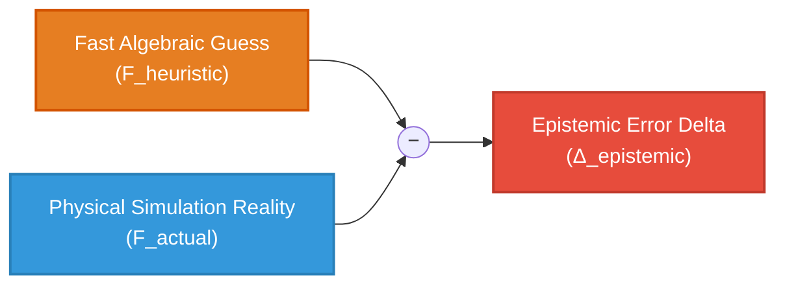

!!! warning "Module Status: Work In Progress (WIP/CIP) / Construction Site"
    The Evolutionary Encapsulated Multi-Stage Design Space Exploration (EEDSE) subsystem and its underlying optimization pipelines are strictly a Work-In-Progress (WIP) and Context-In-Process (CIP) construction site. Furthermore, **AI is not used as a massive black box anywhere in this architecture**. Any AI-in-the-loop features serve strictly to assist and evaluate configurations alongside Human-in-the-loop (HITL) processes, ensuring full biological interpretability. The APIs, algorithms, and UI panels described in this document are subject to continuous refinement.

## Abstract

The Evolutionary Encapsulated Multi-Stage Design Space Exploration (EEDSE) framework is the primary optimization and scenario discovery engine of the Plant-Herbivore Interaction & Defense Simulator (PHIDS). High-dimensional ecosystem spaces ($100+$ continuous traits and discrete choice matrices across multiple species) suffer from exponential sample complexity ($O(2^N)$). Directly evaluating thousands of candidate scenarios in high-fidelity spatiotemporal physics engines is computationally intractable ($T_{sim} \approx 0.85\text{ ms/tick}$).

EEDSE solves this bottleneck through structural encapsulation:

* **Macro Delimitation (Pre-Phase / One-Time Ingress)**: Executes once prior to the optimization loop to restrict the infinite search volume to an empirically anchored, requirement-bounded initial hyper-cube ($\mathcal{X}_{init}$).
* **Encapsulated Evolutionary Loop (Phases 2–4)**:
    * **Genotype Sub-DSE (Fast Heuristic Optimization)**: Evaluates sub-components using fast algebraic/combinatorial solvers (MILP/MINLP) to output candidate Pareto-fronts in $O(\text{ms})$.
    * **Phenotype High-Fidelity Validation**: Instantiates candidate genotypes into concrete spatiotemporal simulations, applying multi-criteria pruning and relativizing metrics into a Unified Normalized Fitness Vector ($\mathbf{J}_{sys}$).
    * **Database & Epistemic Learning (Closed-Loop Feedback)**: Stores (phenotype, generation) pairs in Zarr/DuckDB, calculates error deltas ($\mathbf{\Delta}_{epistemic}$) to recalibrate surrogate solvers, and feeds updated parameters directly back into the next generation of **Genotypes**.

## 1. Complete Workflow & Data Artifact Topology

```mermaid
flowchart TD
    classDef initial fill:#7F8C8D,stroke:#34495E,stroke-width:2px,color:#ECF0F1;
    classDef genotype fill:#27AE60,stroke:#1E8449,stroke-width:2px,color:#ECF0F1;
    classDef phenotype fill:#C0392B,stroke:#922B21,stroke-width:2px,color:#ECF0F1;
    classDef database fill:#2980B9,stroke:#1B4F72,stroke-width:2px,color:#ECF0F1;

    %% One-Time Initial Ingress
    subgraph InitialPhase["Initial Pre-Phase (Executes Once at Initialization)"]
        direction LR
        Analysis["Invariant & Threat/Requirement Analysis"] --> Delimitation["Design Space Delimitation"]
        Delimitation --> X_init["Initial Search Hyper-Cube (X_init)<br/>& DelimitedSpaceSchema"]
    end

    X_init -- "Initial Design Spaces & Bounds" --> Genotypes

    %% Encapsulated Multi-Stage Loop
    subgraph InnerLoop["Evolutionary Encapsulated Multi-Stage DSE Loop"]
        direction TB
        
        subgraph Phase2["MACRO-PHASE 2: GENOTYPES (Fast Heuristic Optimization)"]
            Genotypes["Genotype Sub-DSE Solvers<br/>• Environmental Factors & Requirements<br/>• Structural Carbon Allocation (MILP)<br/>• Trophic Compatibility Graphs<br/>• Chemical Defense Timers (MINLP)"]
        end

        Phase2 -- "Pareto-Efficient Solutions<br/>(GenotypeBlueprintSet Candidates)" --> Phase3

        subgraph Phase3["MACRO-PHASE 3: PHENOTYPES (High-Fidelity Validation)"]
            Phenotypes["Phenotype Spatiotemporal Simulation<br/>• Instantiation in ECS World & GridEnvironment<br/>• Numba JIT Chemotaxis & PyTorch PDEs<br/>• Multi-Criteria Pruning & Fitness Relativization (J_sys)"]
        end

        Phase3 -- "Transfer Selected:<br/>Phenotype with Evaluation Results (J_sys) & Generation Number" --> Phase4

        subgraph Phase4["MACRO-PHASE 4: DATABASE & EPISTEMIC LEARNING"]
            Database["Historical Telemetry Database (Zarr / DuckDB)<br/>(Phenotype, Generation) Pairs"]
            Database --> DeltaCalc["Epistemic Error Delta Calculation<br/>Δ_epistemic = F_actual - F_heuristic"]
            DeltaCalc --> Surrogate["GPyTorch Surrogate Model & Co-Evolutionary Counter-Strategy"]
            Surrogate --> EvoTools["Evolutionary Tools Update:<br/>• Design Spaces & Search Bounds<br/>• Weights, Parameters, Variables<br/>• NSGA-III SIMD Bit-Mask Mutations"]
        end

        EvoTools -- "Next Generation Genotypes" --> Genotypes
    end

    class InitialPhase initial;
    class Phase2 genotype;
    class Phase3 phenotype;
    class Phase4 database;
```

## 2. Deep-Dive Subsystem Specifications & Mathematical Invariants

### 2.1 Macro-Phase 1: Design Space Delimitation (Pre-Phase)

The delimitation pre-phase executes once prior to starting the evolutionary loop. It establishes the bounded search hyper-cube $\mathcal{X}_{init} \subset \mathbb{R}^n \times \mathbb{Z}^m$.

$$
\mathcal{X}_{init} = \left\{ \mathbf{x} \in \mathbb{R}^n \times \mathbb{Z}^m \; \middle\vert{} \; \mathbf{g}_{req}(\mathbf{x}) \le \mathbf{0}, \; \mathbf{h}_{thermo}(\mathbf{x}) \le \mathbf{0}, \; \mathbf{x}_{L} \le \mathbf{x} \le \mathbf{x}_{U} \right\}
$$

* **Requirements-Based Pre-Pruning**: Hard scenario requirements act as preliminary logical masks $\mathbf{g}_{req}(\mathbf{x})$. Non-negotiable survival bounds (e.g., minimum target flora survival threshold $E_{target} \ge E_{min}$, carrying capacity ceiling $E_{max}$, or maximum allowable metabolic penalty) eliminate non-compliant parameter sets immediately.
* **Sub-Space Partitioning**: The global parameter space is partitioned into $k$ discrete initial genotype sub-spaces ($\mathbf{G}_1, \mathbf{G}_2, \dots, \mathbf{G}_k$). Each initial genotype explores a specialized evolutionary sub-strategy:
    * $\mathbf{G}_1$: Airborne Volatile Organic Compound (VOC) alarm networks.
    * $\mathbf{G}_2$: Local tissue toxin synthesis and mechanical armor.
    * $\mathbf{G}_3$: Subterranean mycorrhizal relay chains and nutrient withdrawal.
* **Dimensional Anchoring (Buckingham $\Pi$-Theorem)**: Raw biological traits ingested from empirical databases (TRY, PanTHERIA, Pherobase) via DuckDB are non-dimensionalized relative to grid cell size ($L_0 = \Delta L$), tick duration ($T_0 = \Delta \tau$), and energy quantum ($E_0 = \Delta E$). Continuous traits are bounded within statistical intervals $[\mu_k - 2\sigma_k, \mu_k + 2\sigma_k]$.

### 2.2 Macro-Phase 2: Genotype Sub-DSE (Fast Heuristic Optimization)

The Genotype phase functions as an encapsulated Sub-DSE component within the overarching cycle. It breaks down the massive ecosystem model into sub-components evaluated by fast algebraic and combinatorial solvers in milliseconds ($T_{algebraic} \approx 1\text{ ms}$).

#### Mathematical Formulations per Sub-Stage:

```mermaid
flowchart TD
    classDef milp fill:#9B59B6,stroke:#8E44AD,stroke-width:2px,color:#fff;
    classDef graph fill:#F39C12,stroke:#D68910,stroke-width:2px,color:#fff;
    classDef minlp fill:#1ABC9C,stroke:#16A085,stroke-width:2px,color:#fff;

    G["Candidate Sub-Space (G_k)"] --> S21["Stage 2.1: Structural Carbon (MILP)"]:::milp
    G --> S22["Stage 2.2: Trophic Interaction Matrix (Graph)"]:::graph
    G --> S23["Stage 2.3: Chemical Defense Kinetics (MINLP)"]:::minlp
    
    S21 --> Pareto1["Sub-Pareto Front"]
    S22 --> Pareto2["Sub-Pareto Front"]
    S23 --> Pareto3["Sub-Pareto Front"]
    
    Pareto1 --> Prop["Pareto-Front Propagation"]
    Pareto2 --> Prop
    Pareto3 --> Prop
```

**Sub-Stage 2.1: Structural Carbon Allocation & Metabolic Balances (MILP)**

* **Solver**: Pyomo + HiGHS / SCIP.
* **Mathematical Model**:

$$
\max_{\mathbf{x}} \; \sum_{j=1}^{16} \left( g_j \cdot y_j - m_j \cdot y_j - c_{mechanical, j} \cdot x_{mech, j} \right)
$$
$$
\text{subject to } \sum_{j=1}^{16} \left( e_{build, j} \cdot y_j + e_{armor, j} \cdot x_{mech, j} \right) \le E_{photosynthate}, \quad x_{mech, j} \in \{0, 1\}, \; y_j \in [0, 1]
$$

* **Objective**: Maximizes growth rate $g_j$ against baseline maintenance metabolism $m_j$ and mechanical armor costs ($c_{mechanical, j}$).

**Sub-Stage 2.2: Trophic Interaction & Diet Compatibility (Graph Constraints)**

* **Solver**: Boolean Graph Matching Solver.
* **Mathematical Model**: Given a $16 \times 16$ boolean diet matrix $D_{ij} \in \{0, 1\}$ (Rule-of-16 bound):

$$
\sum_{j=1}^{16} D_{ij} \ge 1 \quad \forall i \in \text{Active Herbivores} \quad (\text{Prevents isolated starving species})
$$
$$
\sum_{i=1}^{16} D_{ij} \le K_{predation\_limit} \quad \forall j \in \text{Active Flora} \quad (\text{Prevents over-grazing singularity})
$$

**Sub-Stage 2.3: Chemical Defense & Trigger Rule Kinetics (MINLP)**

* **Solver**: SCIP / Bonmin.
* **Mathematical Model**: Solves sigmoidal Hill priming kinetics and timer state machines:

$$
\alpha_{priming}(C) = \frac{C^n}{K_d^n + C^n}, \quad n \ge 1, \; K_d > 0
$$
$$
\text{subject to } \tau_{synthesis} + \tau_{aftereffect} \le \tau_{max\_response}
$$

* **Objective**: Balances active defense synthesis maintenance against expected pest deterrence.

**Multi-Stage Pareto-Front Propagation**:

Rather than collapsing to a single heuristic guess, each sub-stage solver extracts a non-dominated sub-Pareto front ($\mathcal{P}_{sub}$). Valid continuous parameter ranges and discrete graph structures are propagated forward to subsequent sub-stages, preserving structural diversity and preventing premature convergence.

### 2.3 Macro-Phase 3: Phenotype High-Fidelity Validation & Pruning

Candidates from the Genotype Pareto-fronts are instantiated as concrete Phenotypes—living plant agents and herbivore swarms populated inside the double-buffered PHIDS GridEnvironment and ECSWorld.

#### 1. High-Fidelity Physics & Biology Evaluation ($T_{sim}$)

* **Numba-JIT Chemotaxis Guidance Fields**:

$$
F_t(x, y) = \alpha \cdot \left( E_t(x, y) \cdot N_t(x, y) \right) - \beta \sum_k T_{k,t}(x, y)
$$

Computed via `@njit` kernels at $O(1)$ spatial hash complexity. Herbivore swarms sample the Moore neighborhood using probabilistic softmax routing and orthokinetic momentum.

* **Reaction-Diffusion PDEs**: 2D parabolic PDEs model volatile plume dispersion, anisotropic semi-Lagrangian wind advection ($\tilde{C}^t(x,y) = C^t(x - u_x, y - u_y)$), and Gaussian convolution diffusion ($\mathcal{K}_{iso} * \tilde{C}^t$).
* **Subnormal Float Truncation**: Values decaying below $\epsilon = 1 \times 10^{-4}$ are explicitly clamped to exact $0.0$ to prevent CPU denormalization slowdowns.

#### 2. The Unified Normalized Fitness Vector ($\mathbf{J}_{sys}$)

Raw simulation outputs operate across heterogeneous scales. EEDSE relativizes these metrics into a single dimensionless vector:

$$
\mathbf{J}_{sys} = w_1 \cdot \tilde{S}_{LV} + w_2 \cdot \tilde{E}_{ratio} - w_3 \cdot D_{bio} + w_4 \cdot H_{chem}
$$

Where:
* **Spectral FFT Lotka-Volterra Stability ($\tilde{S}_{LV}$)**: FFT spectral density analysis measuring limit cycle oscillation endurance over 5,000 ticks:

$$
\tilde{S}_{LV} = 1.0 - \frac{\int \vert{}F(\omega) - F_{ideal}(\omega)\vert{} d\omega}{\int F_{ideal}(\omega) d\omega}
$$

* **Fractional Carrying Capacity ($\tilde{E}_{ratio}$)**: Ratio of aggregate biomass to maximum carrying capacity ($E / E_{max} \in [0, 1]$).
* **Mahalanobis Empirical Distance ($D_{bio}$)**: Log-space distance measuring deviation from TRY/PanTHERIA empirical trait distributions:

$$
D_{bio} = \sqrt{(\ln \mathbf{x} - \boldsymbol{\mu}_{TRY})^T \boldsymbol{\Sigma}_{TRY}^{-1} (\ln \mathbf{x} - \boldsymbol{\mu}_{TRY})}
$$

* **Chemical Defensive Diversity ($H_{chem}$)**: Shannon entropy across active secondary metabolite concentrations:

$$
H_{chem} = -\sum_{k=1}^{16} p_k \ln p_k, \quad p_k = \frac{C_k}{\sum_m C_m}
$$

#### 3. Drastic Multi-Criteria Pruning

Because evaluating thousands of phenotypes in $T_{sim}$ is computationally expensive, strict pruning filters out candidates early:

* **Termination Code Penalties ($Z_1 - Z_7$)**: Scenarios triggering premature extinction ($Z_2 \dots Z_5$) or runaway trophic growth ($Z_6, Z_7$) receive instant fitness zeroing.
* **Entropy & Variance Pruning**: Candidates that perform well but exhibit near-zero variance compared to existing population cohorts are pruned to prevent monoculture collapse.

### 2.4 Macro-Phase 4: Closed-Loop Epistemic Learning & Co-Evolution

Phase 4 completes the evolutionary closed loop, processing evaluated Genotype-Phenotype-Fitness triads $(\mathbf{G}, \mathbf{P}, \mathbf{J}_{sys})$ stored in append-only Zarr binary buffers and indexed via DuckDB / Polars.

#### 1. Epistemic Error Delta Calculation ($\mathbf{\Delta}_{epistemic}$)

```mermaid
flowchart LR
    classDef model fill:#E67E22,stroke:#D35400,stroke-width:2px,color:#fff;
    classDef sim fill:#3498DB,stroke:#2980B9,stroke-width:2px,color:#fff;
    classDef error fill:#E74C3C,stroke:#C0392B,stroke-width:2px,color:#fff;

    Heuristic["Fast Algebraic Guess<br/>(F_heuristic)"]:::model --> Diff(("−"))
    Sim["Physical Simulation Reality<br/>(F_actual)"]:::sim --> Diff
    Diff --> Delta["Epistemic Error Delta<br/>(Δ_epistemic)"]:::error
```

The engine calculates discrepancies between fast algebraic guesses ($\mathbf{\hat{F}}_{heuristic}$) and physical simulation realities ($\mathbf{F}_{actual}$):

$$
\mathbf{\Delta}_{epistemic} = \mathbf{F}_{actual} - \mathbf{\hat{F}}_{heuristic}
$$

#### 2. Surrogate Model Recalibration (GPyTorch)

A Gaussian Process Regression (GPR) surrogate model is trained on historical error deltas $\mathcal{D} = \{(\mathbf{x}_k, \mathbf{\Delta}_{epistemic, k})\}$. Minimizing the negative marginal log-likelihood loss $\mathcal{L}_{surrogate}$:

$$
\mathcal{L}_{surrogate}(\boldsymbol{\theta}) = \frac{1}{2} \mathbf{\Delta}^T \mathbf{K}_{\boldsymbol{\theta}}^{-1} \mathbf{\Delta} + \frac{1}{2} \ln \vert{}\mathbf{K}_{\boldsymbol{\theta}}\vert{} + \frac{n}{2} \ln(2\pi)
$$

The surrogate gradient recalibrates the weight matrix $\mathbf{\hat{W}}_{t+1}$ used by the MILP/MINLP sub-solvers in the next generation:

$$
\mathbf{\hat{W}}_{t+1} = \mathbf{\hat{W}}_t + \eta \cdot \nabla_{\mathbf{W}} \mathcal{L}_{surrogate}(\mathbf{\Delta}_{epistemic})
$$

This re-educates the fast algebraic solvers, forcing them to mathematically account for spatiotemporal realities (wind advection, spatial chemotaxis bypasses) during subsequent scenario generation passes.

#### 3. Adaptive Search Space Bounds Refinement

Search bounds for generation $i+1$ contract around high-performing, validated regions while expanding along dimensions of high uncertainty ($\boldsymbol{\sigma}_j$):

$$
\mathcal{X}_{i+1} = \bigcup_{j \in \text{Surviving}} \left[ \mathbf{x}_j - \mathbf{k}_{adapt} \odot \boldsymbol{\sigma}_j, \; \mathbf{x}_j + \mathbf{k}_{adapt} \odot \boldsymbol{\sigma}_j \right] \cap \mathcal{X}_{init}
$$

#### 4. Co-Evolutionary Counter-Adaptation

The historical database triggers adaptive mutations in opposing agents:
* When flora evolve high mechanical resistance, the database mutates herbivore trait structs (`morphological_adaptation`, `digestive_efficiency`, `chemical_neutralization`) to model ongoing co-evolutionary arms races.
* This prevents the DSE from settling into fragile, non-resilient local minima.

#### 5. Distributed Recombination (Ray/Tune & NSGA-III)

* High-throughput NSGA-III non-dominated sorting (DEAP library integration) extracts balanced scenario blueprints.
* Chromosomal trait structs undergo SIMD bit-mask mutations across Ray/Tune distributed worker tasks.
* Population size is strictly bounded ($N_{genotypes} \le 32$) to guarantee high-throughput completion within cluster memory budgets.

## 3. Inter-Phase Data Schema & Interface Contracts

| Phase Transition | Payload Schema Name | Data Format / Type | Core Fields Passed |
| :--- | :--- | :--- | :--- |
| Phase 1 $\to$ Phase 2 | `DelimitedSpaceSchema` | DuckDB View / Pydantic V2 | $\mathcal{X}_{init}$ bounds, requirements mask $\mathbf{g}_{req}$, Buckingham $\Pi$ scalars |
| Phase 2 $\to$ Phase 3 | `GenotypeBlueprintSet` | JSON / YAML Scenario Draft | Propagated sub-Pareto sets $\mathcal{P}_{sub}$, Rule-of-16 $16\times16$ matrices, MINLP parameters |
| Phase 3 $\to$ Phase 4 | `PhenotypeEvaluationRecord` | Zarr Array + Polars DataFrame | Raw tick telemetry, $Z_1-Z_7$ termination code, relativized vector $\mathbf{J}_{sys}$ |
| Phase 4 $\to$ Phase 1/2 | `EpistemicWeightUpdate` | Binary MsgPack Payload | Gradient updates $\mathbf{\hat{W}}_{t+1}$, GPR kernel params $\boldsymbol{\theta}$, adaptive bounds $\mathcal{X}_{i+1}$ |

## 4. Runtime Software Boundary & Codebase Mapping

| Subsystem Component | Technical Task | Primary Software Framework / Library | Codebase Location (`src/phids/`) |
| :--- | :--- | :--- | :--- |
| **Ingress & Delimitation** | Bounds Validation, Buckingham $\Pi$ Anchoring | Pydantic V2, DuckDB, NumPy | `src/phids/api/schemas/`, `src/phids/analytics/bio_database.py` |
| **Genotype Sub-DSE** | Algebraic MILP / MINLP Solvers | Pyomo, HiGHS, SCIP, PuLP | `src/phids/analytics/dse_genotype.py`, `dse_optimizer.py` |
| **Sub-DSE Pareto Extraction** | Fast Non-Dominated Sorting | DEAP (NSGA-III), NumPy | `src/phids/analytics/dse_pruning.py` |
| **Phenotype Validation** | High-Fidelity Spatial ECS & PDEs | Numba JIT (`@njit`), PyTorch CUDA | `src/phids/engine/core/biotope.py`, `flow_field.py`, `ecs.py` |
| **Relativization & Scoring** | Unified Normalized Fitness Vector | Polars, PHIDS Presenter Layer | `src/phids/telemetry/analytics.py`, `src/phids/api/presenters/` |
| **Telemetry Storage** | Append-Only High-Density Replays | Zarr, msgpack, zlib | `src/phids/telemetry/zarr_replay.py` |
| **Epistemic Delta Learning** | Gaussian Process Surrogate Weights | GPyTorch, scikit-learn | `src/phids/analytics/tuning.py` |
| **Cluster Orchestration** | Distributed Parallel Evaluation | Ray/Tune, Typer CLI | `src/phids/analytics/dse_distributed.py` |

## 5. Architectural Summary & System Guarantees

The Evolutionary Encapsulated Design Space Exploration (EEDSE) framework transforms ecological scenario discovery into a mathematically rigorous, self-correcting optimization pipeline:

* **$10^2\times$ Compute Reduction**: Eliminates $>99\%$ of unviable parameter combinations in $O(1\text{ ms})$ algebraic sub-solvers before running $T_{sim}$.
* **Empirical Authenticity**: Bounds searches via DuckDB TRY/PanTHERIA distributions and Mahalanobis distances ($D_{bio}$).
* **Self-Correcting Intelligence**: Recalibrates heuristic generator weights ($\mathbf{\hat{W}}_{t+1}$) using physical simulation error deltas ($\mathbf{\Delta}_{epistemic}$).
* **Resilient Optimization**: Avoids local minima trap-in through co-evolutionary agent mutations and adaptive search space variance expansion.
