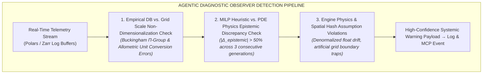

!!! warning "Status: Work In Progress (WIP / CIP) Construction Site"
    The Agentic Diagnostic Log Writer architecture is strictly a Work-In-Progress (WIP) and Context-In-Process (CIP) construction site. **AI is not used as a massive black box anywhere in PHIDS.** Rather, `dse-log-observer` runs as an interpretable diagnostic assistant under a high-precision, low-recall policy to ensure researchers and developers maintain full control over systemic assumptions and simulation code integrity.

## 1. Overview & Systemic Role

While the Evolutionary Encapsulated Design Space Exploration (EEDSE) framework automates high-dimensional scenario discovery, complex multi-physics engines can suffer from subtle calibration drift, unit conversion distortion, or engine-level assumption mismatches. For example, an unconstrained DSE solver might attempt to force empirical plant traits from the TRY database into a scenario, only for the scenario to collapse repeatedly because a grid discretization parameter ($\Delta L$) or energy quantum ($\Delta E$) over-penalizes the plant's metabolic maintenance cost ($m_j$).

The Agentic Diagnostic Log Writer (`dse-log-observer`) addresses this by acting as an asynchronous, non-blocking telemetry observer. It performs dual functions:

1. **Generational DSE Auditing**: Writing structured, human-readable execution journals of the active multi-stage DSE loop (Phase 1 Delimitation $\to$ Phase 2 Sub-DSE MILP $\to$ Phase 3 Phenotype Validation $\to$ Phase 4 Epistemic Learning).
2. **High-Precision Systemic Anomaly Detection**: Passively analyzing whether failure modes (such as repeated $Z_2-Z_5$ extinction codes) are caused by genuine biological unviability or by distorted simulator code, incorrect non-dimensionalization, or invalid physical assumptions.

## 2. High-Precision / Lower-Recall Diagnostic Policy

To prevent developer warning fatigue, the agentic log writer operates under a strict High-Precision, Lower-Recall Policy:

$$
\text{Alert Threshold: } P(\text{Systemic Distortion} \mid \mathcal{D}_{telemetry}) \ge 0.95
$$

* **Low Recall (Accepting Misses)**: The log writer does not flag every minor scenario collapse or routine evolutionary dead-end.
* **High Precision (Zero Noise)**: An alert is generated only when the agent possesses high statistical or logical certainty that a parameter value, code bug, or scaling rule is mathematically incapable of reproducing physical reality under the given constraints ($\text{Confidence} \ge 0.95$, false-positive rate $< 5\%$).

## 3. Targeted Distortion Categories



### Category A: Empirical Database & Scaling Discretization Drift

* **Symptom**: Parameters pulled directly from TRY or PanTHERIA confidence intervals $[\mu \pm 2\sigma]$ consistently yield instant extinctions ($Z_2/Z_3$) regardless of defense allocation.
* **Agentic Diagnostics**: The observer checks whether the Buckingham $\Pi$ non-dimensionalization transformation ($L_0 = \Delta L$, $T_0 = \Delta \tau$) created unphysical unit conversion factors during the DuckDB ETL pipeline pass (e.g., Kleiber's Law $BMR \propto M^{0.75}$ scaling yielding $m_i > E_{max}$).
* **Generated Warning Output**:

```json
{
  "warning_code": "WARN_EMPIRICAL_SCALE_DISTORTION",
  "confidence": 0.98,
  "subsystem": "phids.analytics.bio_database",
  "affected_traits": ["energy_upkeep_per_individual", "consumption_rate"],
  "diagnosis": "TRY database leaf-mass-per-area (SLA) mapped to grid cell size ΔL=1.0m creates an energetic upkeep requirement (m_j=0.45) that exceeds maximum solar photosynthate (E_max=0.30). The simulator scaling factor ξ_conversion in transform.py is uncalibrated by ~1.5x."
}
```

### Category B: MILP Heuristic vs. Spatial Physics Disconnect

* **Symptom**: The fast MILP solver in Phase 2 converges on a high-performing Pareto front, but $100\%$ of instantiated Phenotypes in Phase 3 fail evaluation due to spatial advection.
* **Agentic Diagnostics**: Measures the persistence of the epistemic delta ($\mathbf{\Delta}_{epistemic} = \mathbf{F}_{actual} - \mathbf{\hat{F}}_{heuristic}$). If the discrepancy remains $> 50\%$ across 3 consecutive generational recalibrations, the agent flags an unmodeled physical force (e.g., strong wind advection overpowering isotropic Gaussian diffusion).
* **Generated Warning Output**:

```json
{
  "warning_code": "WARN_HEURISTIC_MODEL_DISCONNECT",
  "confidence": 0.96,
  "subsystem": "phids.analytics.dse_optimizer",
  "diagnosis": "Phase 2 MILP solver assumes isotropic airborne VOC diffusion. High-fidelity Phase 3 physics contains directional wind vector (wind_x=12.0). The fast solver's linear constraint matrix lacks an advection attenuation scalar, rendering all generated genotypes unviable in simulation."
}
```

### Category C: Engine-Level Numerical & Code Artifacts

* **Symptom**: Sudden $O(N^2)$ latency spikes or unphysical population freezes during high-density swarm passes.
* **Agentic Diagnostics**: Audits telemetry for IEEE 754 denormalized float drift ($C < 10^{-4}$) or spatial hash bin saturation where entity collisions exceed CPU cache line boundaries.
* **Generated Warning Output**:

```json
{
  "warning_code": "WARN_ENGINE_NUMERICAL_DRIFT",
  "confidence": 0.99,
  "subsystem": "phids.engine.core.biotope",
  "diagnosis": "Denormalized float concentrations detected in signal layer 3. Subnormal float truncation threshold (SIGNAL_EPSILON) is inactive, causing CPU ALU microcode slowdowns during Gaussian convolution passes."
}
```

## 4. MCP Capabilities & Agent Governance Mapping

The Agentic Log Writer is integrated into the PHIDS **Model Context Protocol (MCP)** server as a dedicated diagnostic role:

* **Role Name**: `dse-log-observer`
* **MCP Tools Used**:
    * `query_diagnostic_logs`: Scans append-only Zarr replay buffers and Polars telemetry streams.
    * `inspect_telemetry_schema`: Verifies state array alignment and $Z_1-Z_7$ termination flag distributions.
    * `runtime_snapshot`: Captures live RAM/VRAM usage and spatial hash density.
* **MCP Resources Exposed**:
    * `phids://dse/journals/current.md`: Live Markdown stream of ongoing generational DSE progress.
    * `phids://dse/diagnostics/warnings.json`: Structured array of high-confidence distortion alerts.

## 5. Integration into Codebase

| Subsystem Component | Technical Task | Codebase Location (`src/phids/`) |
| :--- | :--- | :--- |
| **Telemetry Hook** | Asynchronous Queue Observer | [`src/phids/telemetry/analytics.py`](https://github.com/foersben/PHIDS/blob/main/src/phids/telemetry/analytics.py) |
| **Diagnostic Kernel** | Bayesian Confidence Evaluator | [`src/phids/analytics/tuning.py`](https://github.com/foersben/PHIDS/blob/main/src/phids/analytics/tuning.py) |
| **MCP Integration** | Server Tool & Resource Registration | `src/phids/api/mcp/` |
| **Dashboard Interface** | HTMX Diagnostic Warning Badge | `src/phids/api/presenters/diagnostics/` |
