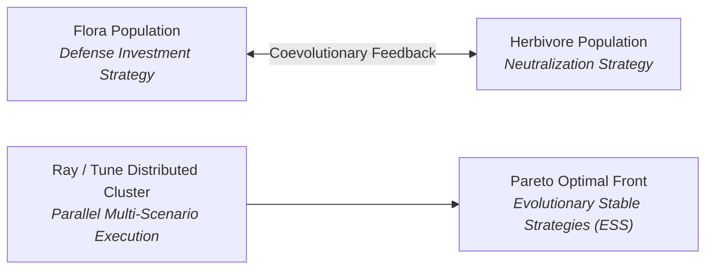

!!! warning "Status: WIP / CIP Construction Site"
    This feature is strictly a Work-In-Progress (WIP) and Context-In-Process (CIP) construction site. **AI is not used as a massive black box anywhere in PHIDS.** Rather, AI-in-the-loop (AITL) is evaluated strictly as an interpretable assistant to Human-in-the-loop (HITL) exploration, ensuring researchers retain full biological oversight.

This document details the planned framework for distributed multi-objective Evolutionary Encapsulated Multi-Stage Design Space Exploration (EEDSE) and reinforcement learning-driven coevolutionary optimization in PHIDS.

---

## 1. Core Vision

While single-objective EEDSE (such as pymoo NSGA-III) successfully locates static Lotka-Volterra limit cycles, real-world ecosystems are driven by ongoing **coevolutionary arms races**. Flora species continuously adjust metabolic investment between morphological defenses (thorns) and induced volatile chemical signaling (VOCs), while herbivore species co-evolve specialized digestive efficiencies and chemical neutralization capabilities.

For detailed touchpoints on human vs. AI intervention gates across the pipeline, see [DSE Governance & Interventions](../design_space_exploration.md#5-governance-interventions-agentic-ai-in-the-loop-aitl-vs-human-in-the-loop-hitl).

---

## 2. Technical Architecture: Ray/Tune & Distributed Multi-Objective Optimization

1. **Distributed Cluster Parallelism**: Utilizing **Ray/Tune** to scale scenario evaluations across HPC compute clusters ($O(N_{\text{simulations}})$ concurrent workers).
2. **NSGA-III & Multi-Objective Pareto Optimization**: Replaces single scalar cost functions with non-dominated sorting algorithms (NSGA-III via `pymoo`) targeting three concurrent objectives:
   * **Ecological Stability ($S_{\text{LV}}$)**: Spectral FFT limit cycle endurance.
   * **Empirical Distance ($D_{\text{bio}}$)**: Log-space Mahalanobis distance from empirical trait distributions (TRY/PanTHERIA).
   * **Defensive Diversity ($H_{\text{chem}}$)**: Shannon entropy of active plant secondary metabolites.
3. **Reinforcement Learning Agent Policies**: Modeling herbivore swarms as MARL (Multi-Agent Reinforcement Learning) policies adapting foraging heuristics under dynamic plant defense induction.

---

## 3. Targeted Milestones

* **Phase 3.2.1**: Ray/Tune task scheduler integration in `phids.analytics.dse_distributed`.
* **Phase 3.2.2**: NSGA-III Pareto front extraction exporting balanced scenario blueprints directly to `scenarios/*.yaml`.
* **Phase 3.2.3**: Dynamic SIMD bit-mask gene mutation passes on ECS trait structs during swarm mitosis and seed germination.
