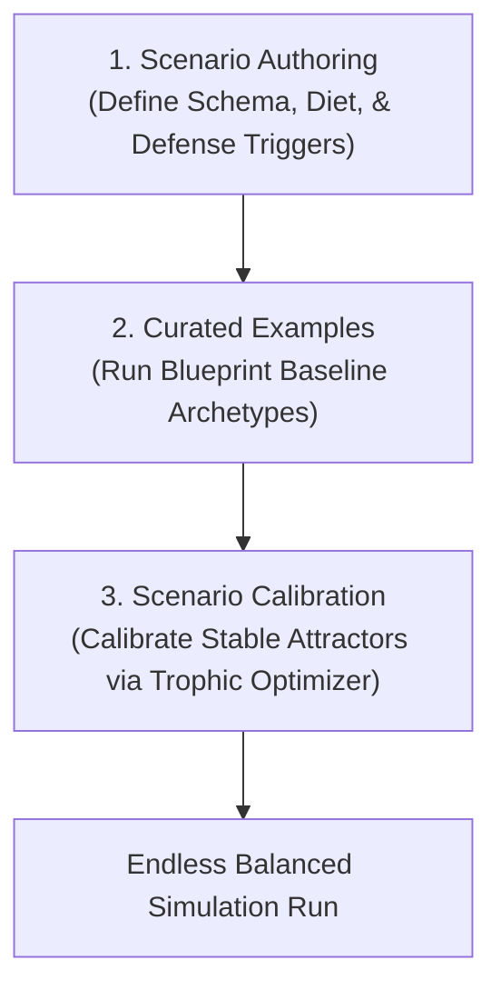

# Introduction to Scenarios

In the study of computational ecology, the greatest challenge is managing the sheer volatility of natural systems. The parameter space of a spatial ecosystem is a chaotic, highly non-linear landscape. A minor $1\%$ tweak to a single herbivore's metabolic rate or a plant's regeneration speed can be the absolute boundary between eternal multi-species balance and immediate, cascading trophic collapse.

The **Scenarios** module in PHIDS upgrades the framework from a simple "run-and-observe" simulator into a **generative biology tool**. It provides the interfaces, constraints, and optimization pipelines needed to design, validate, and calibrate complex ecological experiments.

---

---

## Exploring the Scenarios Module

To guide your workflow from initial design to self-sustaining execution, the Scenarios documentation is partitioned into three key guides:

* **[Scenario Authoring](scenario_authoring.md)**
  Documentation on the scenario `DraftState` pipeline and constraints.
* **[Curated Examples](curated_examples.md)**
  An overview of the built-in, chemically balanced default scenarios.
* **[Design Space Exploration](design_space_exploration.md)**
  Guide on utilizing the DSE Optimizer to discover stable ecological configurations.
* **[Empirical Database](empirical_database.md)**
  Documentation on the underlying trait-pipeline that pulls from real-world scientific data.

### 1. Scenario Authoring & Schema

Understand how to define your custom ecosystem configurations. This guide details:

* The Pydantic validation schema (`SimulationConfig`) ensuring configuration integrity before boot.
* The **Rule of 16** constraint, which limits flora, herbivores, and chemical substances to pre-allocated static cache lines, avoiding dynamic memory allocation latency during hot execution loops.
* How to define the **Diet Compatibility** and **Substance Trigger** matrices to construct complex trophic relationships.

### 2. Curated Examples

Inspect pre-configured blueprints designed to demonstrate specific ecological features:

* **The Eternal Canopy:** An complex, balanced forest biotope showing stabilized Lotka-Volterra wave propagation.
* **Trophic Collapse Scenario:** A demonstration of ecological breakdown when herbivore consumption rates breach flora regeneration thresholds.
* **Volatile Warning Cascade:** A scenario highlighting chemical atmospheric warning diffusion across spatial grids.

### 3. Design Space Exploration (DSE)

Discover how the framework uses SciPy's Differential Evolution to find stable parameters autonomously:

* **Optimization Search:** Why genetic/evolutionary search beats Random Walk and Simulated Annealing in rugged biological landscapes.
* **Cost Function Design:** How we penalize extinction events, reward survival time, and avoid "boring" stable states (e.g., $100\%$ flora, $0$ herbivores).

### 4. [Bio-Database & UI Architecture Roadmap](database_and_ui_roadmap.md)

Explore the structural decoupling of archetypes, visual rule building, and our migration path toward true database persistence.
