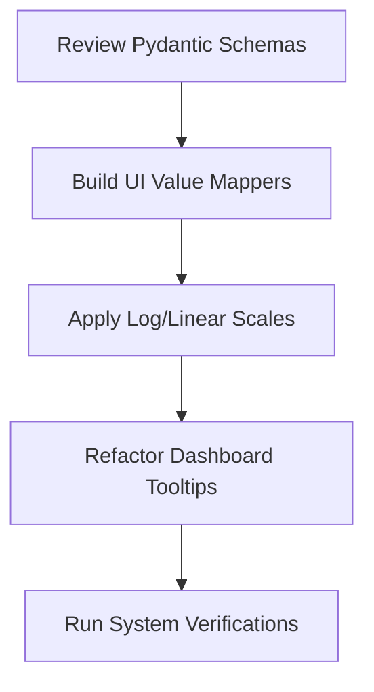

# Parameter Normalization & UI/UX Roadmap

This document outlines the strategic engineering roadmap to normalize, standardize, and clarify simulation parameters within the PHIDS engine and user interface. The primary objective is to simplify scenario configuration, reduce entry barriers for ecological modeling, and make emergent simulation states easier to interpret.

---

## 1. Core Inefficiencies & Discrepancies

Currently, configuration metrics and UI tooltips are disjointed:

* **Counter-Intuitive Names:** `velocity` in the swarm component represents "ticks between movements", meaning a higher value decreases movement speed.
* **Mismatched Scales:** Parameters mix absolute rates (e.g., `mechanical_damage_per_bite = 2.0`) with normalized coefficients (e.g., `apparent_nutrition_factor` as `0.0 to 1.0`) and large population limits (e.g., `split_population_threshold = 1000`).
* **Linear Slider Instabilities:** UI input controls use linear ranges, which lack the precision required for fine-tuning low-level parameters (e.g., metabolic upkeep coefficients around `0.05`).

---

## 2. Proposed Adjustments & Normalization Rules

### A. Rename Parameters for Semantic Clarity

We will align parameter names in the UI presentation layer to match expectations without breaking internal ECS physics engine equations:

* **Movement Speed:** Expose `velocity` in tooltips and configuration panels as **Movement Interval (ticks)**.
* **Growth Rate:** Format the float `growth_rate` as **Growth Rate (% per tick)**.
* **Consumption Rate:** Retain the biologically accurate term **Consumption Rate** but clarify its units in the UI: **Consumption Rate (Energy per individual per tick)**.

### B. UI-Level Input Mapping

To avoid floating-point errors and maintain fine-grained control:

* **Logarithmic Scaling:** Apply logarithmic curves to configuration sliders for wide-range variables (e.g., population triggers and initial entity counts).
* **Relative Percentage Modifiers:** Expose variables like diffusion and dissipation constants as normalized percentages (`0% to 100%`) in the UI, mapping them back to the narrow decimal bounds expected by the engine (e.g., `0.01 to 0.25`).

### C. Standardized Tooltip Visualization

* **Comparative Ratios:** Always render absolute resource states alongside their respective species capacities (e.g., `Energy: 45.0 / 200.0 (22.5%)`).
* **Visual Groupings:** Segment parameters into **Trophic Metabolism**, **Defensive Chemistry**, and **Spatial Dispersion** sections within inspectors.

---

## 3. Implementation Plan

1. **Phase 1: Presenter Normalization**
   Create a utility layer in `phids.api.presenters` that converts absolute values into relative/percentage metrics before serializing JSON payloads.
2. **Phase 2: HTMX Control Refactoring**
   Update dashboard config sliders to use mapped step values (e.g., converting a `0-100` slider position to a logarithmic float).
3. **Phase 3: Schema Metadata Enhancement**
   Update field descriptions in [schemas.py](file:///home/benni/Documents/antigravity_workspace/PHIDS/src/phids/api/schemas.py) to explicitly detail normalized units.
