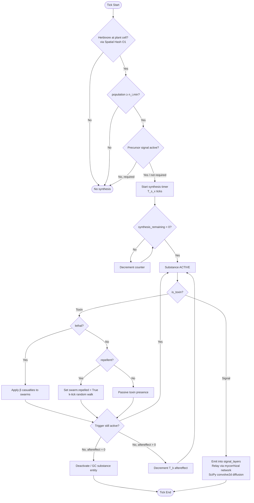

# Scenario Authoring & Schema

Scenarios in PHIDS form the boundaries of the ecological experiment. A scenario dictates grid bounds, initial biomass distributions, trophic links, and the specific biochemical triggers deployed. At the engine level, all scenarios converge on the `SimulationConfig` Pydantic model.

## The Rule of 16 Configuration Bounds

A fundamental engineering constraint within the simulation loop is the avoidance of dynamic memory allocations. To support this, configurations are structurally bounded. Scenarios are permitted a maximum of:
- **16 Flora Species**
- **16 Herbivore Species**
- **16 Substance Profiles**

These indices translate directly into fixed $(16 \times 16)$ interaction matrices for diet and defense behavior. Exceeding these bounds at the API or file ingress stage will result in rejection.

## Interaction Matrices

Scenarios orchestrate behavior through matrices:

1. **Diet Compatibility Matrix**: A boolean matrix determining whether herbivore $E_i$ can metabolize flora $P_j$. If incompatible, feeding resolves into rejection and randomized displacement.
2. **Trigger Matrix**: A mapping detailing which specific substance $S_x$ a given flora species $P_j$ synthesizes upon localized attack by herbivore $E_i$.

## Import/Export Pathways

Scenario parameters are serialized directly to and from normalized JSON payloads (`load_scenario_from_json`, `scenario_to_json`). The control center UI facilitates the injection of exported JSONs directly into the mutable `DraftState` for iteration, before finalizing the design back into the live `SimulationConfig`.

