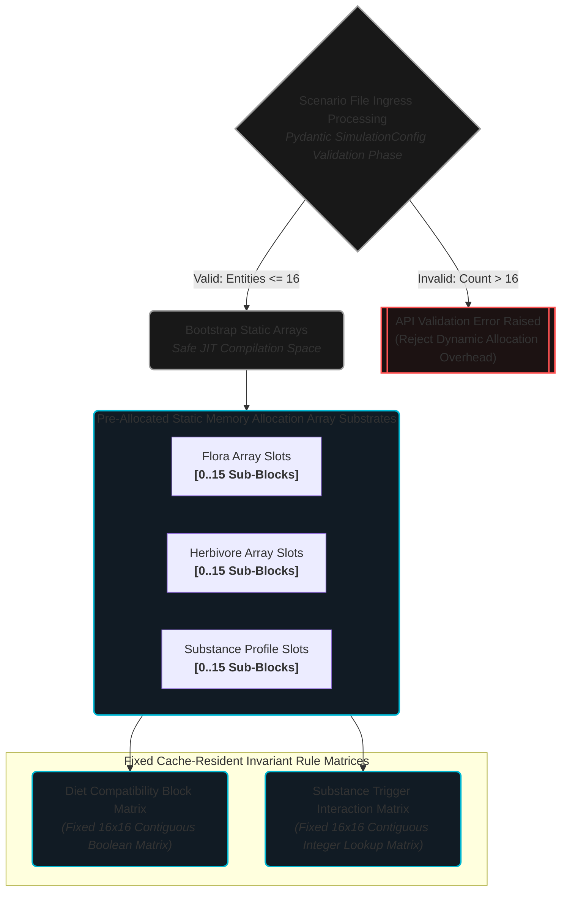
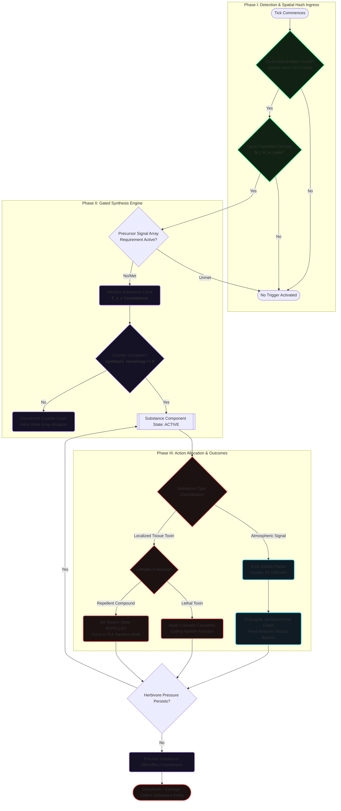

Scenarios in PHIDS form the strict boundaries of the ecological experiment. A scenario dictates the grid dimensions, initial biomass distributions, trophic links (who eats what), and the specific substance triggers deployed by flora when attacked. At the engine level, all scenarios are structurally validated against the `SimulationConfig` Pydantic schema before execution.

## The Rule of 16 Configuration Bounds

A fundamental engineering constraint within the simulation loop is the avoidance of dynamic memory allocations during high-frequency execution. If a new species was dynamically introduced, matrices tracking interaction rules would need to be rebuilt, stalling the CPU.

To circumvent this, configurations are structurally bounded. Every scenario is permitted a maximum of:

* **16 Flora Species**
* **16 Herbivore Species**
* **16 Substance Profiles**

These indices translate directly into fixed $(16 \times 16)$ boolean matrices for diet compatibility and integer matrices for defense behavior. Exceeding these bounds at the API or file ingress stage will result in a validation rejection, ensuring the simulation runs predictably.

```mermaid
flowchart TD
    %% Title Matrix Header
    subgraph Configuration_Limit ["Pre-Allocated Static Memory Allocation Array Substrates"]
        direction LR
        F_Array["Flora Array Slots<br><b>[0..15 Sub-Blocks]</b>"]
        H_Array["Herbivore Array Slots<br><b>[0..15 Sub-Blocks]</b>"]
        S_Array["Substance Profile Slots<br><b>[0..15 Sub-Blocks]</b>"]
    end

    %% Core Matrices Mapping
    subgraph PreAllocated_Matrices ["Fixed Cache-Resident Invariant Rule Matrices"]
        direction TB
        Diet_Matrix["Diet Compatibility Block Matrix<br><i>(Fixed 16x16 Contiguous Boolean Matrix)</i>"]
        Trigger_Matrix["Substance Trigger Interaction Matrix<br><i>(Fixed 16x16 Contiguous Integer Lookup Matrix)</i>"]
    end

    %% Structural Boundaries Check
    Ingress_Payload{"Scenario File Ingress Processing<br><i>Pydantic SimulationConfig Validation Phase</i>"}
    Ingress_Payload -->|Valid: Entities <= 16| Boot["Bootstrap Static Arrays<br><i>Safe JIT Compilation Space</i>"]
    Ingress_Payload -->|Invalid: Count > 16| Rejection[["API Validation Error Raised<br>(Reject Dynamic Allocation Overhead)"]]

    %% Connections
    Boot --> Configuration_Limit
    Configuration_Limit --> Diet_Matrix & Trigger_Matrix

    %% Class Allocations
    classDef dataLayer fill:#111b24,stroke:#00b8d4,stroke-width:2px,rx:6px,ry:6px;
    classDef boundary fill:#1c1212,stroke:#ff5252,stroke-width:2px,rx:6px,ry:6px;
    classDef peripheral fill:#181818,stroke:#9e9e9e,stroke-width:2px,rx:6px,ry:6px;

    class Configuration_Limit,Diet_Matrix,Trigger_Matrix dataLayer
    class Rejection boundary
    class Ingress_Payload,Boot peripheral
```

## Flora Species Parameters & Allometric Schema (`FloraSpeciesParams`)

Each flora species in PHIDS models an autotrophic organism with distinct caloric storage, permanent structural mass, seed reproductive energetics, aerodynamic properties, and symbiotic fungal connections:

| Parameter Key | UI Location | Unit | Default | Biological & Computational Interpretation |
| :--- | :--- | :--- | :--- | :--- |
| `name` | Table Header | String | `"NewFlora"` | Species identifier in telemetry exports and UI dashboards. |
| `base_energy` | Primary Table | Calories | `10.0` | Initial mobile caloric energy granted to newly germinated seedlings. |
| `max_energy` | Primary Table | Calories | `100.0` | Photosynthetic carrying capacity ceiling ($E_{\text{max}}$). |
| `growth_rate` | Primary Table | % / tick | `5.0` | Photosynthetic carbohydrate production rate ($g_j$). |
| `survival_threshold` | Primary Table | Calories | `1.0` | Senescence threshold floor ($E_{\text{survival}}$); falling below triggers death. |
| `structural_mass_max` | Primary Table | Grams dry mass | `0.0` | Permanent woodiness ceiling ($M_{\text{max}}$). 0.0 invokes Plan 1 fallback ($M_{\text{max}} = E_{\text{max}}$). |
| `structural_growth_rate` | Species Drawer | Fraction / wk | `0.01` | Lignification growth rate ($g_M$) per 168-tick slow loop stride (0.01 = 1%/week). |
| `reproduction_interval` | Primary Table | Ticks | `10` | Modulo tick interval governing reproduction attempts. |
| `seed_energy_cost` | Primary Table | Calories | `5.0` | Energy reserve ($E_{\text{seed}}$) deducted from parent upon seed drop. |
| `seed_min_dist` | Species Drawer | Grid cells | `1.0` | Minimum dispersal radius ($d_{\text{min}}$) for polar raycasting. |
| `seed_max_dist` | Primary Table | Grid cells | `3.0` | Maximum dispersal radius ($d_{\text{max}}$) for polar raycasting. |
| `seed_drop_height` | Species Drawer | Meters | `0.5` | Canopy release height used for wind-flight duration estimation. |
| `seed_terminal_velocity` | Species Drawer | m/s | `1.0` | Gravitational terminal fall velocity in horizontal wind currents. |
| `translocation_rate` | Species Drawer | Fraction / tick | `0.2` | Rate of vascular phloem nutrient withdrawal to root sinks under stress. |
| `mycorrhizal_tax_per_link` | Species Drawer | Calories / tick | `0.0` | Continuous metabolic fee deducted per active root conduit link. |
| `camouflage` | Primary Table | Boolean | `False` | Semiochemical olfactory masking flag. |
| `camouflage_factor` | Species Drawer | Multiplier | `1.0` | Volatile Organic Compound (VOC) signal dampening scalar $[0.0, 1.0]$. |

### Decoupled Dual-Proxy Architecture ($E_{\text{current}}$ vs. $M_{\text{structural}}$)

Plants in PHIDS maintain two continuous physical proxies:

1. **Caloric Pool ($E_{\text{current}}$):** Volatile mobile carbohydrates accumulated through photosynthesis and extracted during herbivore grazing.
2. **Structural Biomass ($M_{\text{structural}}$):** Permanent lignified woodiness and root infrastructure that accumulates monotonically over slow-loop gates ($M(t+1) = \min(M_{\text{max}}, M(t) + g_M \times 168)$).

Crucially, **grazing decreases $E_{\text{current}}$ but never reduces $M_{\text{structural}}$**. Trampling immunity and mechanical attrition are calculated strictly against $M_{\text{structural}}$, preventing heavily grazed mature bushes and trees from artificially reverting into fragile saplings.

---

## Canonical Domain Separation Matrix (Explicit vs. Implicit)

To preserve biological causality and prevent engine state leaks, configuration options are strictly partitioned across specialized workbench views:

| Biological Phenomenon | Canonical View | Key Parameters | Governing Reason |
| :--- | :--- | :--- | :--- |
| **Autotrophic Physiology** | **🌿 Flora Species** (`/ui/flora`) | `base_energy`, `max_energy`, `growth_rate`, `structural_mass_max`, `structural_growth_rate` | Intrinsic botanical traits of cellular tissue and woodiness. |
| **Reproduction & Dispersal** | **🌿 Flora Species** (`/ui/flora`) | `reproduction_interval`, `seed_energy_cost`, `seed_min_dist`, `seed_max_dist`, aerodynamics | Parental seed energetics and ballistic aerodynamic flight. |
| **Foraging Kinetics (MVT)** | **🐛 Herbivores** (`/ui/herbivores`) | `consumption_rate`, `handling_time`, `energy_upkeep_per_individual`, `softmax_temperature` | Optimal patch departure (Charnov 1976) is an herbivore foraging decision ($Intake \ge Upkeep$), not a botanical choice. |
| **Collateral Trampling** | **🐛 Herbivores** (`/ui/herbivores`) | `incidental_mortality_factor` ($k_{\text{incidental}}$), `incidental_mortality_mode` | Locomotion impact of animal mass; interacts branchlessly with plant $M_{\text{structural}} / M_{\text{max}}$. |
| **Trophic Food Web** | **🍽️ Diet Matrix** (`/ui/diet-matrix`) | Binary compatibility matrix $[H \times F]$ | Bipartite graph establishing which grazers can recognize and consume each plant species. |
| **Constitutive Defenses** | **🛡️ Morphology & Defense** (`/ui/morphology-defense`) | `mechanical_damage_per_bite` ($m_{\text{bite}}$), `digestibility_modifier` ($\mu_{\text{digest}}$) | Spines inflicting grazer mortality and lignin cell-wall barriers reducing caloric extraction efficiency. |
| **Inducible Defenses** | **🛡️ Morphology & Defense** (`/ui/morphology-defense`) | Trigger conditions, active toxins, VOC alarms, phloem resource withdrawal | Chemical defense cascades and nutritional masking triggered by herbivore attack or alarm plumes. |
| **Atmospheric Dispersion** | **🌍 Biotope Config** (`/ui/biotope`) | `wind_x`, `wind_y`, `signal_decay_factor`, grid dimensions | Abiotic fluid dynamics carrying seeds and semiochemical plumes. |

---

## Interaction Matrices

Scenarios orchestrate behavior through explicit matrices, which are fully editable via the HTMX UI Draft State:

1. **Diet Compatibility Matrix**: A $16 \times 16$ boolean matrix determining whether herbivore $E_i$ can metabolize flora $P_j$. If incompatible, an attempted feeding event resolves into rejection, prompting a randomized displacement of the swarm away from the plant.
2. **Trigger Matrix**: A $16 \times 16$ mapping detailing which action a given flora species $P_j$ executes upon a specific trigger initiation. Actions include synthesizing specific substances (`SynthesizeSubstanceAction`) or pulling resources (`ResourceWithdrawalAction`). Crucially, triggers can be initiated by direct localized attacks (`HerbivoreAttackInitiator`) or by sensing ambient chemical compounds (`EnvironmentalSignalInitiator`). This allows complex scenarios where a plant synthesizes lethal toxins against one grazer, while preemptively withdrawing resources when smelling warning signals from a neighbor.

## Import/Export Pathways

Scenario parameters are serialized directly to and from normalized JSON payloads (`load_scenario_from_json`, `scenario_to_json`). The control center UI facilitates the injection of exported JSONs directly into the mutable `DraftState` for manual iteration.

Once the operator finalizes the scenario, the draft is pushed into the live `SimulationConfig`. This process ensures absolute separation between experimental setup and experimental execution.

```mermaid
flowchart TD
    %% Phase 1: Detection & Extraction
    subgraph Detection ["Phase I: Detection & Spatial Hash Ingress"]
        A([Tick Commences]) --> B{"Co-located Entities Found?<br><i>Spatial Hash O(1) Check</i>"}
        B -- Yes --> C{"Local Population Density<br><b>N_i >= n_i,min</b>?"}
        B -- No --> End_Passive([No Trigger Activated])
        C -- No --> End_Passive
    end

    %% Phase 2: Synthesis Core
    subgraph Synthesis ["Phase II: Gated Synthesis Engine"]
        C -- Yes --> D{"Precursor Signal Array<br>Requirement Active?"}
        D -- No/Met --> E["Initialize Substance Clock<br><b>T_s_x Countdowns</b>"]
        D -- Unmet --> End_Passive

        E --> F{"Counter Complete?<br><b>synthesis_remaining == 0</b>"}
        F -- No --> G["Decrement Counter Layer<br><i>Inline Write Array Mutation</i>"]
        F -- Yes --> H[["Substance Component State: ACTIVE"]]
    end

    %% Phase 3: Action Bifurcation
    subgraph Evaluation ["Phase III: Action Allocation & Outcomes"]
        H --> I{"Substance Type Classification"}

        %% Airborne Path
        I -->|Atmospheric Signal| J["Emit Volatile Plume<br><i>Numba JIT Diffusion</i>"]
        J --> K["Propagate via Mycorrhizal Graph<br><i>Fixed Network Velocity Bypass</i>"]

        %% Local Tissue Toxin Path
        I -->|Localized Tissue Toxin| L{"Lethality Evaluation"}
        L -- Lethal Toxin --> M["Apply Cascade Casualties<br><i>Ceiling Attrition Function</i>"]
        L -- Repellent Compound --> N["Set Swarm State: REPELLED<br><i>Force k-Tick Random Walk</i>"]
    end

    %% Loop Closure Paths
    K & M & N --> P{"Herbivore Pressure Persists?"}
    P -- Yes --> H
    P -- No --> Q["Process Substance Aftereffect Countdowns"]
    Q --> R([Deactivate / Garbage Collect Substance Entity])

    %% Styling Classes
    classDef coreSys fill:#141224,stroke:#b388ff,stroke-width:2px,rx:6px,ry:6px;
    classDef stateData fill:#111b24,stroke:#00b8d4,stroke-width:2px,rx:6px,ry:6px;
    classDef hazard fill:#1c1212,stroke:#ff5252,stroke-width:2px,rx:6px,ry:6px;
    classDef shortcut fill:#112214,stroke:#00e676,stroke-width:2px,rx:6px,ry:6px;

    class B,C shortcut
    class E,F,G,Q coreSys
    class J,K stateData
    class I,L,M,N,R hazard
```
