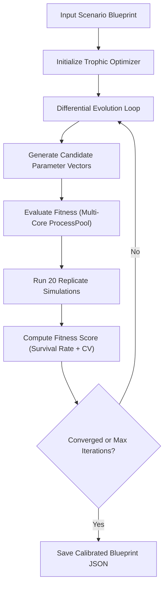

# Automated Scenario Calibration: The Trophic Optimizer

Finding a stable ecological balance in a spatial, discrete-event simulation like PHIDS is exceptionally difficult. The parameter space is highly non-linear, discontinuous, and rugged. A tiny adjustment to a single herbivore's metabolic upkeep or a plant's growth rate can trigger a rapid trophic cascade, resulting in absolute extinction or runaway growth.

To solve this, PHIDS includes a native tuning pipeline—the **Trophic Optimizer**—powered by **SciPy's Differential Evolution** algorithm. This utility calibrates scenario configurations by searching for parameter combinations that maximize ecosystem survival and stability.

---

## The Challenge of Manual Scenario Calibration

In a PHIDS scenario, biological rates are continuous variables that dictate localized spatial actions. If you attempt to balance these manually, you will encounter several constraints:

1. **High Dimensionality:** A scenario with multiple flora and herbivore species couples dozens of parameters (metabolism, reproduction, growth, seed dispersion). The volume of this space grows exponentially with the number of species ($O(D^N)$).
2. **Deceptive Local Optima:** Simple search algorithms get trapped in "dead" ecosystems that appear stable but are actually static (e.g., all herbivores dying out instantly, leaving a flat grid of plants).
3. **Stochastic Variance:** Because species movement and initial placements are randomized, a parameter set that survives one run might fail on the next due to localized crowding or starvation.

---

## Why Differential Evolution Wins

Differential Evolution (DE) is a stochastic, population-based global optimization algorithm. In PHIDS, it outperforms alternative search strategies (like Random Walk or Simulated Annealing) because:

* **Continuous Vector Space:** DE operates natively on vectors of real-valued floating-point numbers rather than discrete binary strings, allowing for fine-grained calibration of biological rates.
* **Self-Adaptive Mutation:** DE generates new trial parameters by taking the difference between existing candidates. If the population is highly diverse, the search steps are large; as the population converges on stable regimes, the search steps automatically become microscopic.
* **Stochastic Resilience via Replicates:** To prevent overfitting to lucky seeds, the Trophic Optimizer runs **parallel replicates** (typically 20 concurrent simulations per candidate parameter set) and evaluates their aggregate survival rate.



---

## The Mathematical Fitness Function

The optimizer aims to find a **"Goldilocks" configuration**—an explicit parameter set where localized spatial actions yield a long-running, self-sustaining macroscopic ecosystem.

To achieve this, the optimizer **minimizes** a composite fitness score:

$$Score = Penalty_{failures} + \overline{CV}$$

### 1. Survival and the Failure Penalty

Each candidate parameter set is evaluated over $N$ concurrent simulation runs (replicates) for a target number of ticks ($T_{max}$). A run is considered to have **failed** if the simulation terminates early due to extinction (all members of a species die) or carrying capacity breaches.

Let $S$ be the number of successful runs that completed all $T_{max}$ ticks. The optimizer defines a target survival rate of **80%** ($0.8 \times N$).

The failure penalty is calculated as:

$$Penalty_{failures} = \max\left(0, \lfloor 0.8 \times N \rfloor - S\right) \times 1000.0$$

If 80% or more of the replicates survive to the end, the penalty is $0.0$. Otherwise, each failing run below the threshold adds a severe penalty of $1000.0$.

### 2. Ecosystem Stability (Coefficient of Variation)

For all surviving runs, the optimizer measures population stability. We compute the **Coefficient of Variation (CV)** for both flora ($CV_f$) and herbivore ($CV_h$) populations across the entire simulation timeline:

$$CV = \frac{\sigma}{\mu}$$

Where:

* $\sigma$ is the standard deviation of the population count over time.
* $\mu$ is the mean population count.

The stability score for a single surviving run is the average CV across the ecosystem:

$$CV_{run} = \frac{CV_f + CV_h}{2}$$

If a run survives but one or more species populations average $0.0$ (extinction occurred at the very end), a fallback penalty of $1000.0$ is applied. The final $\overline{CV}$ is the average of $CV_{run}$ across all surviving runs.

---

## Tunable Parameters and Optimization Bounds

The Trophic Optimizer automatically extracts and calibrates the following parameters from the scenario blueprint:

| Parameter Category | Blueprint JSON Path | Calibration Bounds | Description |
| :--- | :--- | :--- | :--- |
| **Flora Growth Rate** | `flora_species[i].growth_rate` | `[1.0, 15.0]` | Base replication rate per tick. |
| **Flora Min Seed Distance** | `flora_species[i].seed_min_dist` | `[0.5, 3.0]` | Minimum radius for seed dispersal. |
| **Flora Max Seed Distance** | `flora_species[i].seed_max_dist` | `[3.1, 10.0]` | Maximum radius for seed dispersal. |
| **Herbivore Upkeep** | `herbivore_species[i].energy_upkeep_per_individual` | `[0.01, 1.0]` | Energy consumed per individual per tick. |
| **Herbivore Repr. Divisor** | `herbivore_species[i].reproduction_energy_divisor` | `[0.1, 5.0]` | Energy required to trigger mitosis/reproduction. |

---

## Step-by-Step Scenario Calibration Guide

### Step 1: Run the Calibration CLI

Use the `tune` command from the PHIDS CLI. Pass in your draft scenario blueprint, specify the target grid size, the duration of test runs, and the number of concurrent samples to execute per trial.

```bash
uv run phids tune examples/eternal_canopy_blueprint.json \
  --grid-size 80 \
  --ticks 2500 \
  --samples 20 \
  --out examples/optimized_canopy.json
```

### Step 2: Monitor Optimization Logs

The optimizer will print the progression of the Differential Evolution algorithm:

```text
Starting stochastic optimization sweep with 10 parameters and 20 concurrent runs per eval
differential_evolution step 1: f(x)= 42.13
differential_evolution step 2: f(x)= 28.67
Genome Evaluation: survived=18/20, avg_cv=0.182, fitness_score=0.182
Genome Evaluation: survived=20/20, avg_cv=0.125, fitness_score=0.125
Optimization complete. Best fitness: 0.125
```

### Step 3: Verify the Optimized Scenario

The calibrated configuration is saved to the file specified in the `--out` argument. You can load this directly into the simulation loop or the dashboard UI to inspect the stable Lotka-Volterra wave pattern:

```bash
uv run phids run examples/optimized_canopy.json
```

---

## Best Practices for Trophic Tuning

### 1. The "Train Small, Run Large" Paradigm

Because fitness evaluations run hundreds of simulations, optimization is computationally intensive.

* **Tip:** Calibrate on a smaller grid (e.g., `40x40` or `80x80`) and for fewer ticks (e.g., `1500`).
* **Why it works:** Because the PHIDS simulation uses local spatial neighborhood checks and density boundaries, parameters calibrated on small grids scale cleanly to massive execution grids (`150x150` or higher) without needing recalibration.

### 2. Isolate Inter-Species Signalling

When optimizing multi-species scenarios with complex chemical defense triggers, set `mycorrhizal_inter_species = False` in your draft configuration. If pioneer species can broadcast alarm signals across the entire mycorrhizal root grid instantly, the map will flood with toxins prematurely, causing all herbivores to starve before the optimizer can locate a stable metabolic equilibrium.

### 3. Check for Floating-Point Drift

Verify that your optimized parameters do not sit exactly on the boundaries of the search intervals (e.g., upkeep exactly at `0.01`). If a parameter is pushed to the extreme edge, expand the bounds in `src/phids/analytics/tuning.py` or simplify the trophic interactions to prevent compounding floating-point drift over multi-hour simulation playbacks.
