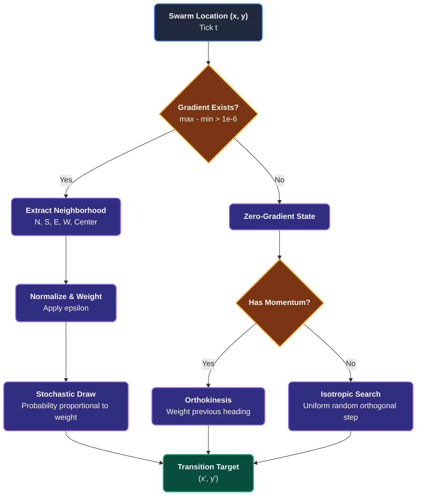
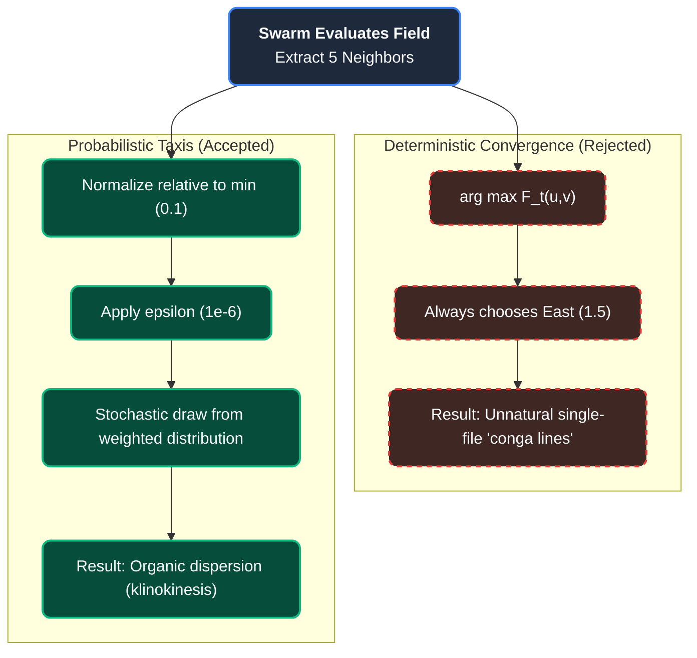

Herbivore swarms navigate the PHIDS biotope via a unified scalar guidance field, simulating a sensory-driven process called **chemotaxis**.

## Biological and Physical Context

**Chemotaxis** is the phenomenon whereby somatic cells, bacteria, and other single-cell or multicellular organisms direct their movements according to certain chemicals in their environment.

In nature, organisms do not possess a top-down, global map of the world. They cannot calculate the most efficient Euclidean path to a food source three miles away while simultaneously avoiding a predator blocking a narrow mountain pass. Instead, they sense local chemical gradients-moving towards higher concentrations of attractants (food, mating pheromones) and away from repellents (toxins, predators).

By modeling chemotaxis, PHIDS ensures swarm navigation is inherently local, imperfect, and biologically plausible. Furthermore, real-world chemical plumes are subjected to wind, thermal eddies, and turbulent diffusion, making scent trails noisy and chaotic rather than perfectly smooth geometric cones.

## The Unified Flow Field

Rather than solving a separate navigation problem for every individual herbivore swarm (e.g., $N$ swarms calculating paths across an $M \times M$ grid), PHIDS constructs a single **Flow Field** $F_t(x, y)$ at the beginning of each tick $t$.

This scalar lattice is a spatial superposition of two primary potentials:

1. **Attractants ($E_t$):** The aggregate caloric energy of all flora species.
2. **Repellents ($T_t$):** The aggregate concentration of localized defensive toxins emitted by flora.

### Mathematical Formulation

To calculate exactly how desirable a specific patch of land is for a grazing swarm, we need to mathematically weigh the rewards against the dangers. We take the total caloric value of all the food at that spot and subtract the total strength of all the defensive toxins present. This simple subtraction gives us a baseline "desirability score" for every single cell on the map.

In formal terms, the baseline gradient at cell $(x, y)$ before propagation is computed as:

$$
G_t(x,y) = \alpha E_t(x,y) - \beta \sum_k T_{k,t}(x,y)
$$

Within this baseline calculation, $E_t(x,y)$ represents the total accumulated plant energy available at the spatial coordinate, providing the foundational attraction. This is countered by $T_{k,t}(x,y)$, tracking the concentration of the $k$-th toxin channel present at that coordinate. The influence of these forces is scaled by the non-negative weighting constants $\alpha$ and $\beta$, representing attractant and repellent sensitivities respectively.

To create an "influence map" that swarms can detect from a short distance away, this baseline gradient undergoes an iterative **Jacobi relaxation** propagation until the matrix converges or reaches a maximum step limit, spreading with a steep decay coefficient $\delta$ (e.g., $0.5$).

### The Gradient Ascent (Stochastic Taxis)

A swarm located at $(x, y)$ determines its next position by evaluating the Flow Field $F_t$ in its immediate **Von-Neumann Neighborhood** $\mathcal{V}(x,y)$ (the current cell plus its 4 orthogonal adjacent cells: North, South, East, and West).

Rather than deterministically selecting the absolute highest gradient (strict gradient ascent), the engine applies **probability-weighted sampling**. The probability $P(u,v)$ of transitioning to a neighbor $(u,v) \in \mathcal{V}(x,y)$ is strictly proportional to its normalized flow-field magnitude relative to the neighborhood minimum.

This stochastic approach mathematically models biological sensory noise, receptor saturation, and the physical turbulence of volatile organic compounds in a real ecosystem.

## Neighborhood Gradient Normalization & Stochastic Selection

When a swarm at coordinate $(x, y)$ evaluates candidate positions across its 5-cell Von-Neumann neighborhood (center cell plus North, South, East, and West), the raw scalar flow-field values are extracted from $F_t$. To convert raw scalar gradients into an operational probability distribution, the engine shifts all neighborhood values relative to the local neighborhood minimum and adds a computational epsilon ($\epsilon = 1 \times 10^{-6}$). This normalization guarantees non-zero selection probabilities for all valid adjacent tiles, ensuring that while high-gradient coordinates command the highest statistical likelihood of selection, alternative headings and stationary resting states remain viable options within the stochastic draw.

If the center cell `(1,1)` had an overwhelmingly dominant value (e.g., the swarm is currently situated on a high-energy plant), the probability distribution collapses heavily onto the center cell, an act defined as **Anchoring**.

## Alternatives Considered & Architectural Decisions

During the engineering of the PHIDS interaction system, several navigation paradigms were evaluated and explicitly rejected to maintain ecological fidelity and simulation invariants:

### 1. Deterministic Convergence (`arg max`) vs. Probabilistic Taxis
* **The Rejected Model:** Using a strict $\operatorname*{arg\,max}$ mathematical function forces the swarm to perfectly select the steepest gradient every single tick.
* **Why we rejected it:** In a discrete grid, absolute determinism forces all swarms on a gradient slope to merge into the exact same optimal trajectory, forming unnatural, single-file "conga lines." By embracing a **Probabilistic Taxis** model, the engine natively introduces lateral dispersion. Swarms fan out organically as they approach a target, faithfully recreating the chaotic search patterns and klinokinesis observed in real biological foragers.

### 2. Moore Neighborhood vs. Von-Neumann Neighborhood
* **The Rejected Model:** The Moore Neighborhood (evaluating 8 directions including diagonals) allows for smoother visual pathing without jagged edges.
* **Why we rejected it:** Switching to Moore on a discrete grid introduces the **Euclidean Distance Exploit**. A diagonal step covers a physical distance of $\sqrt{2} \approx 1.414$ units. If not explicitly mathematically penalized in the hot-path kernel, swarms traveling diagonally outpace orthogonal swarms by 41%, corrupting the fundamental velocity constants of the ecosystem. The **Von-Neumann Neighborhood** strictly preserves a 1:1 ratio between ticks and physical distance traversed, allowing the Numba `@njit` kernels to remain incredibly lean while guaranteeing absolute kinematic consistency.
* **Future Alternative Consideration (The Sensory Penalty):** Should the visual "blockiness" of orthogonal movement ever become undesirable, an 8-way Moore search could be safely implemented by applying a mathematical penalty to the diagonal cells during probability weighting. By dividing the flow gradient score of the four diagonal cells by $\approx 1.414$ before inserting them into the probability distribution, the engine would naturally suppress the appeal of diagonal routes, effectively balancing the Euclidean speed exploit with a proportional sensory handicap.

### 3. A* (A-Star) or Dijkstra Pathfinding
* **The Rejected Model:** Calculating optimal, obstacle-avoidant paths from every swarm to the nearest food source.
* **Why we rejected it:** Classic pathfinding scales poorly. Calculating paths for hundreds of swarms across a dynamic grid per tick would create a computational bottleneck of $O(N \cdot M^2)$. Furthermore, swarms lack "global knowledge" of the map. Our $O(1)$ unified Flow Field sampling perfectly mimics biological sensory constraints while maintaining extreme computational efficiency.

## Zero-Gradient Navigation (The Isotropic Search)

A critical edge case in spatial ecology occurs when an organism is entirely outside the sensory horizon of any resource or predator. Mathematically, this happens when the entire neighborhood evaluates to a flat zero-gradient:

$$\max_{(u,v)} F_t(u,v) - \min_{(u,v)} F_t(u,v) < 1 \times 10^{-6}$$

If a swarm relied strictly on gradient ascent, a zero-gradient would result in indefinite paralysis. In biological systems, when an organism loses a scent trail, it transitions from directed movement (taxis) to undirected, exploratory movement (kinesis).

### Algorithmic Resolution

When PHIDS evaluates a zero-gradient (flat) neighborhood, the swarm enters a **Random Walk** state. If the swarm has existing momentum (inertia), it heavily weights its probability distribution toward its previous heading (`last_dx`, `last_dy`), simulating orthokinesis. If no inertia exists, it selects an orthogonal neighbor from a uniform random distribution, effectively performing an isotropic search until it re-enters an active Flow Field.

## Impact of Resource Reallocation on Chemotaxis

When a plant triggers a `resource_withdrawal` action, its `apparent_nutrition_factor` scalar drops below 1.0. Inside the Numba JIT Chemotaxis Flow Field resolution loop (`flow_field.py`), the base attractant landscape matrix is scaled before diffusion:

$$A[x, y] = E_{\text{plant}}[x, y] \cdot \text{apparent\_nutrition\_factor}[x, y]$$

!!! info "Sensory Impact"
    When a plant under pressure sets its apparent nutrition factor to 0.1, it "dims" its attractant profile to zero-gradient levels. To the herbivores' sensory systems, the coordinate looks barren. The grazing swarms immediately lose their sensory anchor and transition into an isotropic Random Walk to seek active gradients elsewhere, letting the plant recover.
