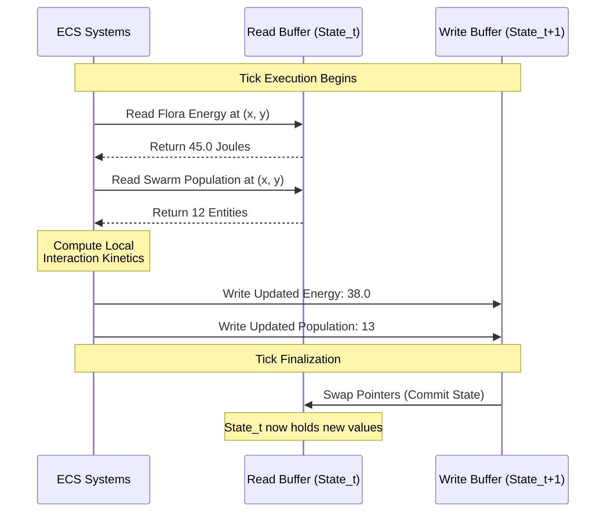

PHIDS converts simulation ticks into comparable, analytical artifacts. The primary method for evaluating a scenario's success or failure is through longitudinal population and energy tracking.

In addition to discrete physical entity transitions, PHIDS evaluates localized field dynamics governed generally by the reaction-diffusion partial differential equation:

$$ \frac{\partial \rho}{\partial t} = \nabla \cdot (D \nabla \rho) + f(\rho) $$

## 1. The Lotka-Volterra Paradigm

The core engine tracks aggregate metrics-total flora energy, total flora population, and total herbivore population-at the conclusion of every tick.

These aggregates are directly inspired by the **Lotka-Volterra Equations**, standard continuous-time herbivore-plant models defined by:

$$
\begin{aligned}
\frac{dx}{dt} &= \alpha x - \beta xy \\
\frac{dy}{dt} &= \delta xy - \gamma y
\end{aligned}
$$

Where:

* $x$: Plant population (Flora).
* $y$: Herbivore population.
* $\alpha, \beta, \gamma, \delta$: Growth, consumption, mortality, and assimilation rates.

### The Purpose of Tracking

While PHIDS is a discrete spatial simulation and *not* a continuous ODE solver (see [Population Dynamics](population_dynamics.md)), the macroscopic emergent behavior of the grid should still resemble classical Lotka-Volterra dynamics.

A successful, stable scenario will exhibit **Cyclic Oscillations** (Boom-and-Bust cycles):

1. **Boom:** Flora energy grows, enabling high reproduction.
2. **Explosion:** Herbivores discover the dense flora, feed rapidly, and undergo massive mitosis (splitting).
3. **Bust:** The enormous herbivore swarm overgrazes the flora, causing a precipitous drop in plant energy.
4. **Starvation:** With no food left, herbivores suffer severe metabolic attrition and die off.
5. **Recovery:** The few remaining plants, now free of herbivores, begin to grow again.

If a scenario does not cycle, it inevitably hits a **Termination Condition**.

## 2. Termination Protocol ($Z_1$ - $Z_7$)

The engine integrates continuous checks against operational bounds:

* **Max Duration ($Z_1$)**: Cap on ticks. The scenario successfully ran its course without collapsing.
* **Extinctions ($Z_2, Z_3, Z_4, Z_5$)**: Target or global population collapse. A species was entirely wiped out by either starvation or herbivory.
* **Runaway Growth ($Z_6, Z_7$)**: Exceeding specified energy/population carrying capacities. The biological parameters were completely unbalanced, causing infinite reproduction.

Termination flags provide vital context as to *why* a particular experimental model collapsed, allowing for deeper scientific comparison across scenario families.

## 3. Simulation & Batch Diagrams

The UI Control Center visualizes these metrics via several primary tools tailored for either the live simulation view or aggregate batch processing.

### Live Simulation Diagrams

The immediate visual interface of the simulation relies on a real-time, top-down 2D array representation known as the Live Dashboard Canvas, which renders the state of the underlying `GridEnvironment` cellular automata. Within this Cartesian space, grid cell colorations are mapped strictly to physical energy states: verdant green intensities correspond to the localized caloric energy density of Flora, while red clusters denote the physical presence and size of Herbivore swarms. The canvas is further augmented by transparent overlays that visualize the dispersion of invisible chemical fields, such as the blue gradients of airborne signal diffusion or the fuchsia heatmaps of localized defensive toxins.

Simultaneously, a longitudinal Telemetry Chart provides a continuous temporal narrative by tracking aggregate ecosystem populations and energy reserves over time. This line graph is essential for visually diagnosing the cyclic, oscillatory nature of the Lotka-Volterra dynamics. For example, if the red herbivore population line exhibits a massive, unsustainable spike followed by an immediate flatline to zero, while the green flora energy line subsequently enters unconstrained exponential growth, the operator can instantly classify the scenario trajectory as a $Z_5$ termination event, definitively indicating complete Herbivore Extinction.

### Batch Processing Diagnostics

When orchestrating large-scale Monte Carlo batches to evaluate the probabilistic stability of a scenario, relying on a singular averaged population trajectory is analytically insufficient, as it masks critical bifurcations and localized extinction events. To resolve this, PHIDS outputs robust, high-dimensionality statistical artifacts designed for systemic diagnosis.

To evaluate total carrying capacity and trophic flow efficiency, the system utilizes a Stacked Biomass Proxy. This normalized area chart visualizes the ratio of the ecosystem's total Joules held by Flora versus the energy successfully assimilated by Herbivores, definitively showing whether caloric energy is smoothly propagating up the trophic chain or if it is bottlenecked at the primary producer level. The cyclical stability of these populations is further analyzed using Phase Space mapping, which plots Flora Population ($X$) against Herbivore Population ($Y$) across the temporal axis. In a perfectly balanced Lotka-Volterra ecosystem, this trajectory resolves into a closed, repeating orbital loop; conversely, if the ecosystem suffers a catastrophic collapse, the trajectory mathematically spirals into the origin $(0,0)$.

To quantify the overarching resilience of a scenario configuration, the framework computes a Collapse Risk Focus using a survival probability curve (Kaplan-Meier estimator). This explicitly measures the statistical probability that a given scenario instantiation will successfully reach a specified temporal horizon $T$ without triggering an irreversible extinction or runaway termination state (defined as boundaries $Z_2$ through $Z_7$).

Furthermore, diagnosing the exact *cause* of an ecosystem collapse requires isolating specific mortality vectors. The Defense Economy Ratio isolates plant fatalities explicitly tagged as `death_defense_maintenance`, visualizing the severe metabolic burden of synthesizing defensive compounds. A sudden spike in this ratio indicates an evolutionary failure where the flora are aggressively over-producing toxins, ultimately starving themselves to death despite surviving herbivore grazing. Conversely, the Herbivore Pressure Focus correlates the total herbivore population against specific flora deaths categorized as `death_herbivore_feeding` and herbivore casualties tagged as `death_starvation`. This multi-variate correlation definitively proves whether a declining plant population is the direct result of intense active herbivory, or merely an artifact of poor baseline abiotic growth constraints, while simultaneously pinpointing the exact moment an exploding herbivore population completely exhausts its available food reserves and initiates mass starvation.

### Tabular Ledger

Complementing the visual diagnostics is the Tabular Ledger, a highly optimized, densely packed data grid that provides an exact, deterministic numeric breakdown of every state transition per tick. Powered by the highly concurrent `Polars` DataFrame library to ensure extreme execution performance and zero-copy memory management, this ledger meticulously segregates specific mortality vectors, energy fluxes, and spatial anomalies. By querying this tabular export, research scientists can move beyond visual correlation and definitively, mathematically prove the exact causal chain that triggered a population collapse at any specific point in the temporal sequence.

## 4. State Buffering and Commit Phases

The continuous narrative described above is executed within a strict deterministic framework. The implementation uses a double-buffering pattern (read state vs. write state) to prevent race conditions during execution.

### I. Implementation Mechanics

The core execution loop in `src/phids/engine/loop.py` structures a strict, non-overlapping sequence of phase updates. The engine relies fundamentally on a double-buffering architectural pattern: all system updates read properties exclusively from the read-state state array ($State_t$) and write altered values exclusively to a disconnected write-state array ($State_{t+1}$).

Crucially, ecological events like plant biomass consumption or defensive synthesis occur during the middle phases, but the global navigation maps and environmental properties are not mutated on the fly. The method `self.env.rebuild_energy_layer()` is executed as an isolated operation near the end of the tick sequence (Phase 6), explicitly processing metabolic debt consolidations, plant mortality deletions, and defense synthesis allocations before swapping the buffers for the next tick.

### II. Why It Is Solved This Way

If individual swarms mutated the environment or altered plant attributes inline while iterating through the entity loop, the simulation would lose spatial determinism. The system's outcomes would depend entirely on the order in which entities were stored in the underlying memory arrays. A swarm processed at index `0` would eat all local food, leaving a swarm at index `1` to starve, whereas reversing the array indices would reverse their fates. Inline mutation introduces severe race conditions and prevents parallel execution.

### III. The Historical/Continuous Alternative

Traditional sequential loop architectures update agent states and environment matrices inline within a single shared array block. This approach makes it impossible to safely parallelize operations across multiple processor threads without introducing heavy mutex locks or thread synchronization barriers.

### IV. Computational Improvement

* **Parallelization Mechanics:** Double-buffering allows the engine to eliminate all data hazards (Read-After-Write, Write-After-Read). Because $State_t$ is strictly read-only throughout the entirety of the tick execution, the interaction and lifecycle systems can be parallelized across multicore architectures or vectorized via Numba's `prange` loops with zero synchronization overhead.
* **Complexity:** The deferred reconstruction pass scales linearly at $O(N + E)$ (where $N$ is active populations and $E$ is environment grid tiles), avoiding the constant memory thrashing of writing back and forth to main memory lines.

### V. Biological Modeling Realism

* **Ecological Concurrency:** In a real ecosystem, thousands of organisms act simultaneously within a given split-second window; they do not politely take sequential turns.
* **Fair Resource Competition:** By executing all evaluations against a fixed snapshot of the world ($State_t$) and deferring commitments, the engine guarantees that all overlapping herbivores face fair, simultaneous exploitation competition for a plant's biomass. It ensures that resource depletion dynamics reflect genuine collective pressure rather than software-induced indexing artifacts.

## 5. Absolute Physics vs. Relative Analytics

During scenario configuration and telemetry review, it is common to question why the engine requires unscaled, absolute values (e.g., configuring `energy_min = 5.0` instead of a percentage).

### The Mathematical Necessity of Absolute Bounds

In Lotka-Volterra dynamics and spatially explicit cellular automata, physical limits and interaction thresholds define the carrying capacity of the environment. The engine must compute deterministic mass and energy transfers per tick based on *what is actually there*, rather than abstract percentages:

* **Toxicity:** A plant emitting `0.1` units of lethal toxin applies an exact, absolute metabolic penalty to a grazing herbivore. If this were a "percentage", the damage formula would require a dynamic denominator (e.g., percentage of *what*? The plant's capacity? The herbivore's resistance?) which introduces unstable feedback loops into the integration algorithms.
* **Biomass Thresholds:** A swarm must consume absolute biomass (e.g., `4.5` energy units per individual) to stave off starvation. Translating this to a relative percentage would require recalculating the threshold every time the herd population fluctuates, destroying Numba's vectorization capabilities.

### Analytics & Evolutionary Encapsulated Multi-Stage Design Space Exploration (EEDSE)

While the engine computes physical absolutes, human operators exploring the scenario design space (EEDSE) rely on relative context. Therefore, PHIDS utilizes a decoupling pattern:

* **Raw Telemetry:** The Zarr buffers and ECS engine record and evaluate strict absolutes.
* **Relativization (Normalization):** The UI and analytics dashboards scale these raw limits on-the-fly (e.g., translating a plant's absolute energy of `45.0` against its genetic capacity of `50.0` to yield a `90%` health metric).

This dichotomy ensures the underlying scientific model remains mathematically rigorous and computationally deterministic, while the analytical output remains cognitively accessible for researchers tuning the ecosystem.

## 5. Ecological Parameter Relativization (Normalization)

Within the mathematical engine, species and environmental interactions are strictly calculated using raw, absolute numerical primitives (e.g., specific Joules of energy, precise entity headcounts, and raw concentration floats).

However, from an analytical and design-space exploration (EEDSE) perspective, comparing a species with an absolute baseline energy of `5.0` to one with a baseline of `500.0` is ecologically opaque. A loss of `2.0` energy is devastating for the first, but trivial for the second.

To resolve this, the scientific framework employs **Relativization** (often referred to technically as normalization). Data points are transformed into dimensionless scales (ratios, percentages, and fractional multipliers) before presentation:

* **Fractional Carrying Capacity (`energy_ratio`)**: Translates absolute biomass into a 0.0 to 1.0 fraction of the species' genetic maximum. This allows direct cross-species comparison of "ecological stress" regardless of their absolute size or metabolic requirements.
* **Dimensionless Defense & Digestibility Scalars**: Instead of defining absolute lignin hardness, properties like `digestibility_modifier` are normalized to a `[0, 1]` coefficient. This simplifies the Lotka-Volterra interaction strength ($\beta$) into a proportional loss, ensuring that defensive evolutionary traits remain stable and bounded even if the global simulation scale is magnified by orders of magnitude.

Relativization ensures that scientists and scenario authors can intuit the systemic pressures acting upon an ecosystem without needing to memorize the arbitrary absolute mathematical limits of the underlying physics engine.
