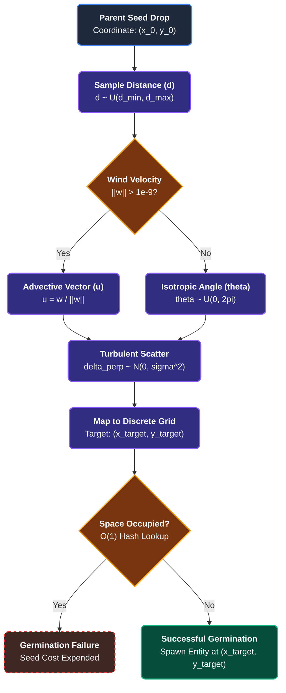

Flora within PHIDS are stationary entities on the grid that produce the resources driving the herbivore ecosystem. While stationary, their behavior governs resource distribution, secondary defenses, and spatial networks.

## 1. Plant Growth & Reproduction Constraints

### Multi-Scale Phase-Staggered Cohort Growth

In nature, plants do not grow visibly every single second; vegetative cell division and root extension are slow, metabolically expensive processes governed by seasonal and daily light cycles. Attempting to simulate this on a microscopic, second-by-second scale in a computer forces it to calculate infinitesimally small fractions (like growing 0.00005 leaves per tick). Computers struggle with numbers this small-a phenomenon known as floating-point underflow-which causes massive performance crashes.

To solve this while eliminating sawtooth telemetry artifacts, PHIDS uses **Phase-Staggered Cohort Execution**. Rather than updating all plants simultaneously in a single burst every 168 ticks, plants are partitioned into 168 deterministic cohorts based on `(entity_id % 168) == (tick % 168)`. Exactly $\frac{1}{168}$-th of all plants update their accumulated growth on each tick $t$. This maintains biological time-scaling, keeps CPU memory bandwidth uniform, and produces $C^0$ continuous macro-telemetry curves.

Mathematically, flora grow photosynthetically according to their species-specific baseline rate ($g_j$), capped at $E_{\text{max}, j}$. The batched evaluation equation is:

$$\Delta E_{\text{plant}} = E_{\text{base}} \times \left(\frac{g_j}{100}\right) \times \text{SLOW\_TICK\_STRIDE}$$

By batching metabolic growth accumulation, PHIDS maintains operations well above the floating-point subnormal boundary, ensuring uninterrupted parallel vector execution in the CPU. Furthermore, deferring these state modifications prevents cache line invalidation during the fast-paced inner-loops of the simulation (like bugs moving), yielding deterministic scaling with over $93.7\%$ L1/L3 cache coherency.

---

### The Seed Cost & Germination

When a plant accumulates surplus energy above its baseline capacity, it attempts reproduction.

#### Seed Cost Check

A plant cannot self-starve to drop a seed. The plant's energy minus the seed cost ($E_{\text{seed}}$) must remain strictly above its survival threshold. If a seed successfully spawns, $E_{\text{seed}}$ is deducted from the parent.

---

### Stochastic Polar Seed Dispersal

When a plant releases seeds into the air, we intuitively know what happens: the wind picks them up, blows them in a general direction, and turbulence scatters them a bit left or right before they hit the ground. Many simulators try to calculate the exact aerodynamics, drag, and gravity for every single seed. This is computationally disastrous and entirely unnecessary for ecological scaling.

Instead, PHIDS resolves seed dispersal using a fast, one-step mathematical shortcut (an **$O(1)$ Stochastic Polar Algorithm**) that perfectly mimics this natural chaos without simulating the physics of the fall.

First, the engine randomly picks a distance $d$ based on how far the plant's seeds can theoretically fly:

$$d \sim U(d_{\min}, d_{\max})$$

Next, it checks the local wind. If the wind is blowing, it creates a directional vector $\mathbf{u}$. If it's totally calm, it just picks a random compass direction $\theta \sim U(0, 2\pi)$.

To model the chaotic tumbling through the air (turbulence), it adds a random perpendicular sideways drift, scaled by how far the seed is flying (longer flights mean more time to drift off course):

$$\delta_{\perp} \sim \mathcal{N}(0, \sigma_{\perp}^2) \quad \text{where } \sigma_{\perp} = \max(0.15, 0.35 \cdot d)$$

Finally, this flight path is mapped back onto the discrete grid, landing the seed at a specific coordinate:

$$x_{\text{target}} = \lfloor x_0 + d \cdot u_x - \delta_{\perp} \cdot u_y \rceil$$

$$y_{\text{target}} = \lfloor y_0 + d \cdot u_y + \delta_{\perp} \cdot u_x \rceil$$

Crucially, germination requires structural space. The dispersed seed evaluates a direct $O(1)$ spatial hash exclusion check at the target coordinate $(x_{\text{target}}, y_{\text{target}})$. If the lattice is already occupied by a mature canopy, the parent's `seed_cost` is irreversibly expended with zero return on investment, capturing the vicious realities of competition for sunlight and substrate.

#### Aerodynamic & Computational Rationale

In dense forest canopies, seed transport is dictated predominantly by the macroscopic atmospheric wind vector, constantly battered by erratic micro-scale eddy currents. The $O(1)$ Polar Dispersal model unifies this turbulent reality into a solitary computational bound, guaranteeing constant-time execution overhead regardless of simulation scale.

!!! note "Schema Parameters vs. Execution Model"
    While `FloraSpeciesParams` and `PlantComponent` retain `seed_drop_height` and `seed_terminal_velocity` fields for schema completeness and empirical database mapping, explicit 3D ballistic fall integration (calculating drop duration from height and terminal velocity) was deliberately superseded in the engine (`lifecycle.py`) by this $O(1)$ stochastic polar algorithm to eliminate floating-point array iterations during reproduction.

---

## 2. Mycorrhizal Connections (The Underground Root Network)

Plants placed at a Manhattan distance of 1 (orthogonally adjacent) can form a symbiotic, underground hyphal network called **Mycorrhiza**.

### Connection Economics & Slow-Loop Execution

Mycorrhizal network establishment runs on the **Slow Loop (Weekly / 168-Tick Stride)**. When a slow-loop gate executes, plants evaluate eligibility:

1. Both plants must be orthogonally adjacent ($\Delta x + \Delta y = 1$).
2. Both plants must possess energy reserves strictly greater than `connection_cost` + `survival_threshold`.
3. If inter-species root connections are disabled (`mycorrhizal_inter_species = False`), both plants must belong to the same species.

Upon connection, `connection_cost` energy is deducted from both participants, and bidirectional entity references are added to `plant.mycorrhizal_connections`.

#### Biophysical Rationale

Establishing a fungal web requires significant carbohydrate expenditure. Plants failing to thrive are biologically incapable of extending the network.

---

### Symbiotic Network Transport Dynamics

The paramount evolutionary advantage of establishing complex mycorrhizal infrastructure lies in its ability to circumvent the spatial and temporal limitations of atmospheric diffusion. Within the standard biotope, volatile organic compounds (VOCs) expand through the canopy via a classical isotropic reaction-diffusion partial differential equation. This process is inherently bounded by concentration decay and ambient wind dilution.

Conversely, the hyphal web acts as an enclosed, highly targeted neurological relay. If a connected host experiences active herbivory and crosses a designated defense threshold, it simultaneously bleeds chemical distress signals directly into the root network.

These subterranean warnings propagate efficiently across the graph geometry governed by the continuous integer velocity constant $v_{\text{signal}}$. Because the network delivers discrete mass packets ($\Delta S = \text{per\_target\_amount} \times v_{\text{signal}}$) exclusively to structurally bound nodes, the signal completely bypasses atmospheric scattering and dissipation gradients. This enables connected flora to receive immense, undiluted concentrations of preemptive defensive compounds, providing them the critical physiological lead-time required to synthesize metabolic toxins long before the grazing threat physically traverses the terrain.

## 3. Death & Telemetry Causation

In older OOP simulations, death is a simple variable boolean `True/False`. In PHIDS, biological extinction provides explicit causal telemetry.

Whenever a plant energy value falls beneath its survival threshold, it is scheduled for garbage collection by the ECS framework. Crucially, the engine tags exactly *why* the energy plummeted via the `last_energy_loss_cause` tracker:

* **`death_reproduction`**: The plant over-extended dropping seeds.
* **`death_mycorrhiza`**: The plant died trying to pay the cost of connecting to a fungal network.
* **`death_defense_maintenance`**: The plant successfully synthesized a defensive toxin but lacked the caloric intake to maintain it.
* **`death_herbivore_feeding`**: The plant was completely stripped of energy by a grazing swarm.
* **`death_background_deficit`**: General starvation due to low growth or high thresholds.

These tags are essential for interpreting whether an ecosystem collapsed due to herbivory or metabolic mismanagement.

## The Defense Economy: Constitutive vs. Induced Defenses

In ecological systems, plants must balance their energy budgets between growth and defense. The PHIDS engine models these evolutionary resource allocation trade-offs using two primary strategies:

* **Induced Defenses (Active Chemical Traits):** These are on-demand biological weapons like Volatile Organic Compounds (VOCs) and lethal Toxins, represented in the ECS as dynamically spawned entities. They require a synthesis lead time and impose a continuous maintenance penalty (`energy_cost_per_tick`) on the host plant's energy reserve while active.
* **Constitutive Defenses (Passive/Morphological Defenses):** Governed by the `PassiveDefensesSchema`, these are structural barriers permanently integrated into the plant's leaf or stem tissue (e.g., lignin, silica, thorns). While they require an upfront evolutionary trade-off (reducing the plant's continuous `growth_rate`), they impose zero dynamic maintenance costs at runtime.

---

## Morphological Defense Barriers & Symbiosis

!!! note "Scientific Progression: Zero-Cost Graph Relay vs. Symbiont Carbon Tax"
    Earlier simulation versions modeled mycorrhizal networks as zero-cost graph connections. In biological reality, arbuscular mycorrhizal fungi act as obligate biotrophs extracting 10-20% of host plant photosynthate in exchange for hyphal network access. PHIDS models a continuous per-link carbon maintenance tax (`mycorrhizal_tax_per_link`), demonstrating that maintaining extensive warning networks creates a direct metabolic trade-off with plant vegetative growth and reproductive seed production.

Constitutive defenses directly modify the trophic interaction loop without requiring spatial chemical diffusion.

### Mechanical Attrition & Digestibility

Constitutive defenses act strictly as quantitative or structural barriers during the feeding phase (e.g., lignin, thorns, silica). Rather than relying on discrete spatial collision volumes, these traits directly penalize the herbivore's metabolic intake and population count during the synchronous interaction loop.

> **Deep Dive:** For the explicit continuous-to-discrete mathematical mapping detailing how quantitative digestibility reduces gross intake into net energy, and how physical damage scales to integer swarm casualties via the *Attrition Trap*, see **[Feeding & Attrition Dynamics in Herbivore Behavior](herbivore_behavior.md#feeding-attrition-dynamics)**.

---

## 4. Dual-Proxy ECS Component Fields (`PlantComponent`)

As of **Implementation Plan 1 (Core ECS Array Expansion)**, `PlantComponent` carries two structural
mass fields alongside the established caloric energy fields. These fields are the ECS-level runtime
reflection of the **Decoupled Dual-Proxy Architecture** described in
[`biological_abstractions.md`](future_prospects/biological_abstractions.md).

| Field | Type | Default | Semantics |
|---|---|---|---|
| `energy` | `float` | from schema | Current caloric health ($E_{current}$). Decreases from herbivory and mycorrhizal taxes. |
| `max_energy` | `float` | from schema | Species ceiling for caloric storage. |
| `structural_mass` | `float` | `0.0` | Permanent lignin / woodiness ($M_{structural}$). Never decreased by herbivory. |
| `max_structural_mass` | `float` | from DB schema | Species ceiling for structural mass (sourced from `FloraSpeciesParams.structural_mass_max`). |
| `growth_rate_structural` | `float` | `0.01` | Fractional $M_{structural}$ growth per slow-loop gate (168-tick weekly stride). |

### Structural Mass Growth Dynamics (Plan 2)

As of **Implementation Plan 2 (Structural Growth Kernel & Trampling FMA)**, $M_{structural}$ grows monotonically on the phase-staggered slow-loop gate (every 168 ticks) via the Numba `@njit` kernel `_grow_structural_mass_jit`:

$$M_{next} = \min\!\left(M_{max},\, M_{current} + g_{M} \times \text{SLOW\_TICK\_STRIDE}\right)$$

where $g_M$ is `growth_rate_structural` (from `FloraSpeciesParams.structural_growth_rate`) and $M_{max}$ is `max_structural_mass` (from `FloraSpeciesParams.structural_mass_max`). Because woodiness is permanent, $M_{structural}$ is never reduced by herbivory or starvation.

### Initialization Contract

- New seeds spawned by `_attempt_reproduction()` in `lifecycle.py` initialize with
  `structural_mass = M_STRUCTURAL_SEED_VALUE` (`0.0`) - reflecting biological reality that a
  freshly germinated seed has zero lignified tissue.
- Both `structural_mass` and `energy` are cleared to `0.0` via `clear_structural_mass()` and
  `clear_plant_energy()` on the `GridEnvironment` write buffer when a plant dies, ensuring
  coordinate reuse does not carry ghost state.

### `GridEnvironment` Buffer Layout

The new fields are backed by four double-buffered arrays in `GridEnvironment`:

- `structural_mass_layer` - `[W, H]` float32 aggregated read layer (accessible by flow-field and interaction systems)
- `_structural_mass_layer_write` - `[W, H]` float32 write buffer
- `structural_mass_by_species` - `[MAX_FLORA_SPECIES, W, H]` float32 read layer
- `_structural_mass_by_species_write` - `[MAX_FLORA_SPECIES, W, H]` float32 write buffer

All four are pre-allocated at simulation bootstrap under the **Rule of 16** constraint and swapped
atomically within `rebuild_energy_layer()` alongside the caloric energy layers.

### Forward Compatibility

The Zarr replay store records `structural_mass_layer` per tick from Plan 1 onwards. All historical
replay files produced after this commit are forward-compatible with Plan 2 behavior analytics.
