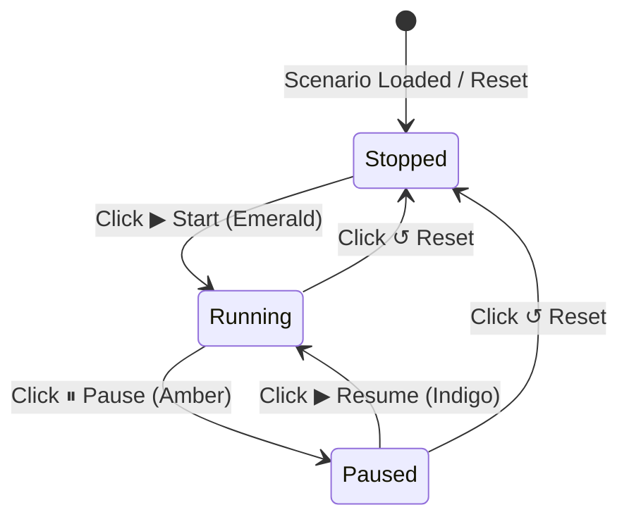

!!! note "Status: Active Architecture Specifications"
    This document outlines theoretical architectural solutions and production implementation specifications for spatial grid mechanics in PHIDS. It compares biological fidelity against the performance constraints of the PHIDS Numba JIT ECS engine.

In an idealized ecological simulation, every individual organism, developmental stage, and decision-making process would be modeled with infinite precision. In PHIDS, the absolute primary constraints are **computability and simulation speed**.

The engine relies on double-buffered, contiguous memory arrays and stateless, memory-decoupled Markovian execution (via Numba `@njit`). To maintain real-time performance across massive grid topologies (e.g., $256 \times 256$), the **hot paths** (the inner loops executed millions of times per second) must be heavily optimized for SIMD (Single Instruction, Multiple Data) vectorization. This means strictly avoiding CPU branch prediction penalties (e.g., `if/else` statements, enums, or state machines) and relying entirely on branchless float arithmetic.

This document explores the fundamental contradictions between deep biological modeling and high-performance ECS constraints, outlining the implemented architectural solutions. We structure each section by starting with the simple biological concept, exploring the computational contradiction, and detailing the complex, engine-native mathematical solution.

---

## 1. Foraging Kinetics: MVT vs. Intake-Driven Hysteresis

### The Core Concept (Simple)

When an animal (like a deer) finds a bush, it does not instantly eat the whole bush and run away. It stays, eats until its stomach is full, rests to digest, and only leaves to find a better bush when the current one is mostly stripped bare.

### The Contradiction (The Problem)

Ecological theory models this using **Charnov's Marginal Value Theorem (MVT)**, which states a forager leaves when the local food drops below the landscape average. But in our computer simulation, calculating the landscape average requires global memory. Swarms in PHIDS are memoryless - they only know what is in their exact coordinate right now. Giving them global memory ruins the engine's speed.

### The Implementation (Complex / Hot Path)

We simulate handling time and patch departure using $O(1)$ branchless math in `src/phids/engine/systems/interaction/movement.py`:

- **Holling Type II & MVT Full Belly Override:** Swarms evaluate their energetic intake every tick. If caloric intake meets or exceeds metabolic upkeep ($Intake \ge Upkeep > 0.0$) or apparent nutrition $\ge 0.999$, `_is_swarm_anchored_jit` evaluates to `True` and movement probability drops to `0.0`. They stay and feed (resolving jitter).
- **The Deficit Unlock:** As the plant's biomass drops, Holling Type II limits throttle the swarm's intake. Once $Intake < Upkeep$, the swarm operates at a deficit. It unlocks and resumes evaluating the local chemical gradient via random walk/chemotaxis.
- **Hot Path Impact:** This requires zero new state tracking. It relies purely on scalar comparisons in `@njit` kernels, preserving SIMD vectorization while perfectly mimicking optimal MVT departure.

---

## 2. Grid Saturation: The "Zombie Forest" Problem

### The Core Concept (Simple)

If a deer eats 90% of a plant, the plant might survive as a tiny, stunted stubble. But if a forest is entirely filled with stunted stubble, new seeds from healthy trees have no empty ground to land on, and the forest stops growing.

### The Contradiction (The Problem)

To keep the simulation incredibly fast, a grid coordinate can only hold exactly one plant (Occupied or Empty). We cannot calculate complex sub-grid densities where a seed and a stubble share the same millimeter of dirt. If we do not clear the stubble, the ecosystem stagnates in a "zombie forest."

### The Implementation (Complex / Hot Path)

We require lightweight mechanics to force **coordinate turnover** without breaking the binary occupancy rule:

1. **Crippled Photosynthesis & Structural Upkeep Tax:** Biologically, maintaining root and stem structures requires baseline caloric upkeep. In Plan 3, plants pay a per-tick maintenance fee proportional to structural mass ($E_{upkeep} = E_{survival} \times \text{STRUCTURAL\_UPKEEP\_SCALAR} \times \frac{M_{structural}}{M_{max}}$). If grazed down to 10%, a plant's reduced leaf area fails to generate enough photosynthetic energy to meet this baseline. It starves, automatically zeroing out the coordinate.
2. **Competitive Overwriting (Seed Dominance):** Biologically, an established canopy suppresses saplings via shade and allelopathy. However, if the canopy is destroyed (stubble), a healthy seed can outcompete it. Computably, seeds are permitted to overwrite occupied coordinates *if* the occupying plant's energy is below a critical stubble threshold ($E < 20\%$).
3. **Background Mortality (Max Lifespan):** A universal age limit acts as an ecological garbage collector, ensuring rolling coordinate turnover.

---

## 3. Plant Lifecycle: Simulating Phenological Phases

### The Core Concept (Simple)

In botany, plants transition through seven distinct phenological phases:

1. **Seed:** The dormant embryonic stage protected by an outer coat.
2. **Germination:** The awakening stage where the embryo breaks dormancy.
3. **Seedling:** The early growth stage featuring the first true leaves.
4. **Sapling:** The juvenile stage of woody plants with flexible stems.
5. **Vegetative:** The mature growth phase focusing entirely on leaves and stems.
6. **Reproductive:** The flowering, pollination, and fruit-bearing stage.
7. **Senescence:** The final phase of cellular breakdown leading to death.

### The Contradiction (The Problem)

In traditional programming, we would use an explicit State Machine (`enum State { SEED, GERMINATION, SEEDLING... }`). But `if/else` branching on enums inside the core simulation loop causes CPU branch mispredictions, destroying Numba SIMD vectorization. Furthermore, hard transitions between discrete states fail to capture the continuous nature of biological growth.

### The Implementation (Complex / Hot Path)

Instead of discrete enums, PHIDS abstracts these seven phases mathematically across our **Dual-Proxy Architecture** ($E_{current}$ for caloric health, and $M_{structural}$ for permanent woodiness). We map the phases entirely through branchless threshold masks:

- **Seed:** $M_{structural} \approx 0$. Plant has zero structural defense and is vulnerable to incidental seedling destruction.
- **Germination:** *Implicitly Abstracted.* There is no awakening state. Germination is simply the continuous phase where $E_{current}$ begins to increase from its initial seed value.
- **Seedling & Sapling:** Governed by $M_{structural}$ thresholds. As $M_{structural}$ increases, `_compute_trample_probability_jit` scales down destruction probability: $P(\text{destroy}) = \min(P_{max}, \text{pop} \times k_{\text{incidental}} \times \max(0, 1 - \frac{M_{structural}}{M_{max}}))$.
- **Vegetative:** Governed by $M_{structural} \ge M_{adult}$. The plant has maximum structural defense ($P_{\text{destroy}} = 0.0$). Photosynthesis maximizes $E_{current}$.
- **Reproductive:** Governed by $E_{current} > E_{reproductive}$. It is not a rigid state, but a metabolic overflow phase. A branchless mask `(E_current > E_rep) * 1.0` activates seed dispersion, draining the excess $E_{current}$ back down to baseline.
- **Senescence:** Governed by the universal `Age` counter or when $E_{current} < \text{Upkeep}(M_{structural})$.

**Hot Path Impact:** All seven phases exist biologically in the simulation, but computationally, they are just float multiplications executing instantly across millions of cells without a single `if/else` stall.

---

## 4. Collateral Damage: Trampling and Incidental Grazing

### The Core Concept (Simple)

If a massive herd of herbivores moves across a field, they do not just eat targeted flora - they accidentally crush, trample, or clip fragile seeds and saplings underfoot or during indiscriminate foraging.

### The Contradiction (The Problem)

Calculating hit-box collisions (checking exactly where every animal's foot lands relative to every seed) is standard in video games, but computationally prohibitive for large-scale ecological grids. It requires nested loops that ruin spatial grid alignment.

### The Implementation (Complex / Hot Path)

Rather than a collision engine, collateral damage is evaluated probabilistically during coordinate transition in `_resolve_incidental_mortality` in `movement.py`:

- When a swarm moves to a new coordinate $(nx, ny)$, the engine calculates the destruction probability $P(\text{destroy}) = \min(P_{max}, \text{population} \times k_{\text{incidental}} \times \max(0, 1 - \frac{M_{structural}}{M_{max}}))$. Default $P_{max} = 0.50$.
- If `random.random() < P`, the seedling is culled, cleared from GridEnvironment write layers, unregistered from the spatial hash, and queued for garbage collection under death cause `"death_collateral_trampling"` or `"death_incidental_consumption"`.
- **Hot Path Impact:** Heavy herds act as natural plows through early-succession biomes. The heavier the swarm and the smaller the plant's $M_{structural}$, the higher the likelihood of seedling mortality.

---

## 5. Trophic & Symbiotic Contradictions (Integration Challenges)

When integrating these new computable abstractions with existing, heavily documented systems (Mycorrhizal Networks and Morphological Defenses), severe biological contradictions emerge.

### Contradiction A: Mycorrhizal Subsidies vs. The Zombie Forest

**The Core Concept (Simple):** Trees talk to each other using underground fungal networks, but the fungi demand a sugar tax in return. If a tree is eaten down to a stubble, it cannot pay the tax. The fungus will cut off the tree to protect itself.

**The Implementation (Complex / Hot Path):** According to `flora_and_symbiosis.md`, plants pay an obligate `mycorrhizal_tax_per_link`. If a plant is grazed to stubble (10%), its photosynthesis drops. If the tax remains static, the fungal network instantly kills the plant by draining its remaining energy.
Arbuscular mycorrhizal fungi are obligate biotrophs. If the host plant stops providing carbohydrates, the fungi actively wall off the hyphal connection to prevent parasitism. Computably, if $E_{plant}$ drops below upkeep, the plant automatically drops all `mycorrhizal_connections`. It becomes isolated from the network to avoid the tax. If it recovers, it must pay the `connection_cost` again to re-join. This mirrors biological fungal selfish-routing while keeping the math $O(1)$.

### Contradiction B: Continuous Energy Proxy vs. Morphological Defenses

**The Core Concept (Simple):** A massive, old thorn-bush has thick, woody roots and sharp spikes. Even if a deer eats all its leaves, the woody skeleton remains. A passing herd cannot just trample it like a tiny, fragile sapling.

**The Implementation (Complex / Hot Path):** According to `morphological_defenses.md`, plants utilize structural defenses requiring heavy lignin investment. We proposed using a single Continuous Energy Proxy ($E$) to represent developmental states. However, this conflates *Current Health* with *Structural Age*. If a mature thorn-bush ($E_{adult}$) is grazed to 15% energy, the continuous proxy implies it reverted to a defenseless sapling and would be trampled.
A single proxy is biologically insufficient. The ECS array is expanded to include two continuous float proxies: **$E_{current}$ (Current Caloric Health)** and **$M_{structural}$ (Permanent Woodiness/Lignin)**.

- Grazing reduces $E_{current}$ but *never* reduces $M_{structural}$.
- Trampling vulnerability and Morphological Defenses are calculated strictly against $M_{structural}$.
- Starvation/Death is calculated strictly against $E_{current}$.
- **Hot Path Impact:** Adds contiguous float32 arrays (`structural_mass_layer`, `_structural_mass_layer_write`, `structural_mass_by_species`, `_structural_mass_by_species_write`) to `GridEnvironment`. It preserves branchless memory execution while cleanly decoupling a plant's age/structure from its current grazing damage, solving the trampling paradox.

---

## 6. Empirical Initialization & DSE Optimization

### The Core Concept (Simple)

We have these robust mathematical proxies ($E_{current}$ and $M_{structural}$), but where do the starting numbers come from? How do we know if a simulated plant should have a maximum energy of 50 or 500? And how do we ensure the simulation does not just instantly crash because the herbivores eat too fast?

### The Contradiction (The Problem)

Manually guessing these parameters leads to fragile ecosystems that collapse. However, running a massive machine learning algorithm to search for perfect balance during the actual simulation would completely halt the real-time speed.

### The Implementation (Complex / Hot Path)

This is entirely solved by separating the **Parameter Discovery** from the **Runtime Simulation**. We achieve this via our **Empirical Bio-Database** and the **Evolutionary Encapsulated Multi-Stage Design Space Exploration (EEDSE)**.

1. **Empirical Constraints (Database):** 
   Our DuckDB database (`bio_database.json` / `bio_database.py`) is populated with empirical, real-world dry-mass data across 16 flora species (sourced from GBIF, TRY, DrDuke). The schema contains critical scalar parameters such as `max_energy`, `growth_rate`, `survival_threshold`, `structural_mass_max`, and `structural_growth_rate`. These raw data points serve as the *hard bounding boxes* for our dual proxies.
2. **EEDSE Parameter Tuning (Offline Optimization):** 
   Before the simulation starts, our DSE optimizer (`src/phids/analytics/dse_optimizer.py`) takes these database constraints and runs a distributed NSGA-II multi-objective optimization. It tests parameter permutations within empirical database bounds, filtering out unbalanced topologies using Analytical Pre-Pruning.
3. **Hot Path Impact:** 
   The result of the DSE is a perfectly tuned, highly realistic Lotka-Volterra configuration. When the simulation starts, the engine loads these pre-computed constants into `E_current` and `M_structural` Numba arrays. The runtime engine does zero heavy lifting for parameter tuning, preserving pure $O(1)$ execution speed.

---

## 7. Implementation Status: The Decoupled Dual-Proxy Architecture

The **Decoupled Dual-Proxy Architecture** is fully implemented across four production milestones on the `feature/grid-visuals-and-tooltips` and `feature/decoupled-dual-proxy` branches.

| Plan | Title | Status | Branch Commits |
|---|---|---|---|
| **Plan 1** | Core ECS Array Expansion (Foundation) | **DONE** | `4f8cdb6` |
| **Plan 2** | Structural Growth Kernel & Trampling FMA | **DONE** | `08456a8`, `f1800de`, `43fccc6` |
| **Plan 3** | Movement Resolution Incidental Mortality & Upkeep Tax | **DONE** | `92d3e08` |
| **Plan 4** | Dashboard UI Telemetry & Dual-Proxy Tooltip Pipeline | **DONE** | `ffd0ddc`, `a6203fa`, `47efe6b`, `4f5b6af`, `d4ca1ea`, `53fadd1`, `fb53b35`, `0980aed`, `27f6204`, `1cae166` |

### Plan 1 - Core ECS Array Expansion (Delivered in commit `4f8cdb6`)

- `src/phids/shared/constants.py`: Declared `M_STRUCTURAL_SEED_VALUE = 0.0` and `M_STRUCTURAL_GROWTH_RATE = 0.01`.
- `src/phids/engine/components/plant.py`: Added `structural_mass: float = 0.0` and `max_structural_mass: float = 0.0`.
- `src/phids/engine/core/biotope.py`: Added double-buffered `float32` arrays (`structural_mass_layer`, `_structural_mass_layer_write`, `structural_mass_by_species`, `_structural_mass_by_species_write`); `set_structural_mass()` and `clear_structural_mass()` helpers; dual-proxy `rebuild_energy_layer()` swap; `to_dict()` state serialization.
- `src/phids/engine/systems/lifecycle.py`: Initialized `structural_mass = 0.0` on seed spawn; wired `clear_structural_mass()` on both death paths.
- `src/phids/io/zarr_replay.py`: Added `structural_mass_layer` to `_ReplayEnvLike` protocol and `append_raw_arrays()` for tick-by-tick Zarr logging.
- `tests/`: Added unit tests and benchmarks verifying < 2.6 ms 256x256 layer rebuild limits.

### Plan 2 - Structural Growth Kernel & Trampling FMA (Delivered in commits `08456a8`, `f1800de`, `43fccc6`)

- `src/phids/analytics/bio_database.json` & `bio_database.py`: Populated `structural_mass_max` and `structural_growth_rate` for all 16 flora species based on empirical dry-mass data.
- `src/phids/api/schemas/species.py`: Extended `FloraSpeciesParams` and `FloraProfile` dataclasses.
- `src/phids/engine/systems/lifecycle.py`: Implemented Numba `@njit` kernel `_grow_structural_mass_jit` on the 168-tick slow loop stride ($M_{next} = \min(M_{max}, M + g_M \times 168)$).
- `src/phids/engine/systems/interaction/movement.py`: Implemented Numba `@njit` kernel `_compute_trample_probability_jit` and MVT Full Belly patch departure lock in `_is_swarm_anchored_jit`.
- `tests/`: Added unit tests in `test_biotope_state_mutation_pilot.py` and `test_trampling_fma.py`, benchmark in `test_dual_proxy_memory_benchmark.py`.

### Plan 3 - Movement Resolution Incidental Mortality & Upkeep Tax (Delivered in commit `92d3e08`)

- `src/phids/api/schemas/species.py`: Extended `HerbivoreSpeciesParams` with `incidental_mortality_factor: float = 0.0` and `incidental_mortality_mode: Literal["trampling", "consumption"] = "trampling"`.
- `src/phids/engine/systems/interaction/movement.py`: Integrated `_resolve_incidental_mortality` on coordinate entry, culling co-located seedlings probabilistically ($P \le P_{max} = 0.50$) and logging death causes `"death_collateral_trampling"` or `"death_incidental_consumption"`.
- `src/phids/engine/systems/lifecycle.py`: Implemented `_calculate_structural_upkeep_jit` kernel and deducted maintenance tax ($E_{upkeep} = E_{survival} \times \text{STRUCTURAL\_UPKEEP\_SCALAR} \times \frac{M_{structural}}{M_{max}}$) per lifecycle tick.
- `src/phids/telemetry/analytics.py`: Added `calculate_mean_structural_mass_by_species` and `calculate_incidental_mortality_rate`.
- `tests/`: Created `tests/integration/systems/test_dual_proxy_integration.py` with 4 end-to-end scenario tests. Full test suite: **1212 passed, 0 failed**.

### Plan 4 - Dashboard UI Telemetry & Dual-Proxy Tooltip Pipeline (Delivered in commits `ffd0ddc`, `a6203fa`, `47efe6b`, `4f5b6af`, `d4ca1ea`, `53fadd1`, `fb53b35`, `0980aed`, `27f6204`, `1cae166`)

- `src/phids/api/presenters/dashboard/payloads.py`: Serialized dual-proxy fields (`structural_mass`, `max_structural_mass`, `fragility_pct`, `incidental_risk_level`, `max_energy`) across columnar entity tables and `extract_ui_snapshot`. Implemented dynamic in-memory self-healing for active loop entities.
- `src/phids/engine/loop.py` & `src/phids/engine/systems/lifecycle.py`: Initialized placement structural mass proportional to initial placement energy ($M_{\text{structural}} = M_{\text{max}} \times \frac{E_{\text{initial}}}{E_{\text{max}}}$) and enforced the **Plan 1 Compatibility Fallback Rule** ($M_{\text{max}} = E_{\text{max}}$ when `structural_mass_max == 0.0`).
- `src/phids/api/templates/base.html`: Unified primary simulation action button (`#sim-main-action-btn`), global HTMX sync bridge (`window.phidsSyncMainActionButton`), and robust `/api/simulation/pause` task recovery.
- `src/phids/api/templates/partials/dashboard.html`: Integrated dual-proxy health/biomass bars, energy ratio formatting, live-only mycorrhizal link layer rendering, and explicit `(inter-species)` vs `(intra-species)` badges.

---

## 8. Frontend UI Realization & Telemetry Integration (Plan 4)

To bridge the backend Numba JIT N-dimensional array engine with the user interface, the **Plan 4 Dashboard Telemetry Pipeline** translates continuous spatial arrays into real-time visual controls and hover tooltips.

### 8.1 Dual-Proxy Tooltip & Health Bar Invariants

When hovering over any cell containing plant entities:

1. **Caloric Health ($E$) Bar**:
   - Displays current caloric energy vs. species maximum energy ($E / E_{\text{max}}$).
   - Rendered with an emerald-to-teal gradient (`bg-gradient-to-r from-emerald-500 to-teal-400`).
   - Percentage formula: $\text{Energy \%} = \min\left(100, \max\left(0, \frac{E}{E_{\text{max}}} \times 100\right)\right)$.
2. **Structural Biomass ($M$) Bar**:
   - Displays permanent structural mass vs. species ceiling ($M_{\text{structural}} / M_{\text{max}}$).
   - Rendered with an amber-to-yellow gradient (`bg-gradient-to-r from-amber-600 to-yellow-500`).
   - Percentage formula: $\text{Biomass \%} = \min\left(100, \max\left(0, \frac{M_{\text{structural}}}{M_{\text{max}}} \times 100\right)\right)$.
3. **Dynamic Fragility ($\mathcal{F}$) & Risk Badges**:
   - **Woody Maturity Structure:** If $M_{\text{max}} > 0$ and $M_{\text{structural}} \ge M_{\text{max}}$, badge displays `🛡️ Woody Structure` (`bg-emerald-500/20 text-emerald-300`).
   - **Fragility Percentage:** If $M_{\text{structural}} < M_{\text{max}}$, badge displays `⚠️ Fragility % (Risk Level)`:
     - **High Risk:** Fragility $> 60\%$ (`bg-amber-500/20 text-amber-300`).
     - **Medium Risk:** $20\% < \text{Fragility} \le 60\%$.
     - **Low Risk:** $\text{Fragility} \le 20\%$.

### 8.2 Plan 1 Compatibility Fallback Rule ($M_{\text{max}} = E_{\text{max}}$)

In legacy scenarios or built-in benchmarks where `structural_mass_max` is zero or unspecified (`0.0`), the system strictly enforces the **Plan 1 Compatibility Rule**:
- The engine and presenter pipeline set $M_{\text{max}} = E_{\text{max}}$ (e.g. $100.0\text{ J}$ or $60.0\text{ J}$).
- Placed initial plants receive initial structural mass proportional to their starting placement energy ratio ($M_{\text{structural}} = M_{\text{max}} \times \frac{E_{\text{initial}}}{E_{\text{max}}}$).
- This prevents mature initial plants in benchmark scenarios from incorrectly spawning as $100\%$ fragile stubs.

### 8.3 Unified Primary Action Control Button State Machine

The dashboard unifies simulation execution controls into a single primary action button (`#sim-main-action-btn`) driven by `window.phidsSyncMainActionButton(running, paused)`:

- **▶ Start (Emerald `bg-emerald-500`):** Simulation stopped/loaded/reset. Triggers `POST /api/simulation/start`.
- **⏸ Pause (Amber `bg-amber-500`):** Simulation actively running. Triggers `POST /api/simulation/pause`.
- **▶ Resume (Indigo `bg-indigo-500`):** Simulation paused. Triggers `POST /api/simulation/pause` (or `start`) to resume.

### 8.4 Mycorrhizal Overlay Invariants

- **Render Layer Order:** `drawMycorrhizalLinks()` executes *after* `drawFlora()` in `dashboard.html` to guarantee root links render clearly on top of plant tiles.
- **Engine Link Validation:** Live canvas rendering strictly displays real engine-established connections (`data.mycorrhizal_links`).
- **Tooltip Disambiguation:** Tooltip entries replace ambiguous `*` asterisks with explicit badges:
  - **Inter-species link:** ` (inter-species)`
  - **Intra-species link:** ` (intra-species)`
