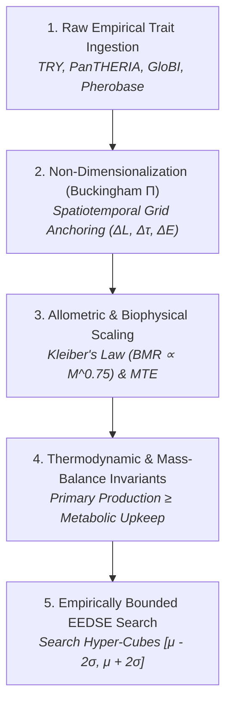

This document details the scientific strategy for bridging raw empirical database entries (TRY, PanTHERIA, GloBI, Pherobase, ToxValDB) and discrete simulation parameters within the Plant-Herbivore Interaction & Defense Simulator (PHIDS). It establishes a non-dimensionalization framework ensuring Evolutionary Encapsulated Multi-Stage Design Space Exploration (EEDSE) searches yield biologically authentic ecosystems rather than unphysical mathematical artifacts.

---

## 1. The Core Calibration Challenge

1. **Unconstrained EEDSE Fallacy**: Search algorithms easily locate parameter sets that achieve Lotka-Volterra limit cycles or stable equilibria. However, without empirical bounds, these equilibria frequently rely on absurd biological ratios - such as a single aphid consuming $500\text{ kcal/sec}$ or a grass blade synthesizing $10\text{ MJ}$ per tick.
2. **Heterogeneous Unit Mismatch**: Open empirical databases store quantitative traits in SI or scientific units:

    * **TRY**: Specific Leaf Area ($\text{mm}^2/\text{mg}$), Canopy Height ($\text{m}$), Seed Dry Mass ($\text{mg}$), Tensile Strength ($\text{N/mm}^2$).
    * **PanTHERIA**: Basal Metabolic Rate ($\text{mL O}_2/\text{hr}$), Adult Body Mass ($\text{g}$), Weaning Age ($\text{days}$).
    * **Pherobase / NIST**: Volatile Diffusion Coefficients ($\text{cm}^2/\text{s}$), Henry's Law Constants ($\text{mol/m}^3\cdot\text{Pa}$).
    * **ToxValDB**: $\text{LD}_{50}$ ($\text{mg/kg}$).

PHIDS operates within a discrete spatial-temporal grid where spatial coordinates are cells ($1\text{ cell} = \Delta L$), time progresses in ticks ($1\text{ tick} = \Delta \tau$), and energy is represented as bounded floating-point scalars ($E_i \in [0, E_{\text{max}}]$).

---

## 2. Five-Tier Empirical Calibration Pipeline

### Tier 1: Spatiotemporal Dimensional Anchoring ($\Pi$-Groups)

All physical traits are non-dimensionalized using explicit grid anchors (as defined by the [Unified Forest-Scale Architecture](spatiotemporal_scaling.md)):

* **Length Scale**: $L_0 = \Delta L$ (meters per cell).
* **Time Scale**: $T_0 = \Delta \tau$ (seconds per tick).
* **Energy Scale**: $E_0 = \Delta E$ (Joules per unit energy).

Key Dimensionless Groups:

* **Metabolic Upkeep Ratio**: $\Pi_M = \frac{C_{\text{max}} \cdot \eta_{\text{dig}}}{m_i} > 1.0$ (guarantees herbivores can physically survive on ingested food).
* **Diffusion Courant Number**: $\Pi_D = \frac{D_{\text{physical}} \cdot \Delta \tau}{\Delta L^2} \le 0.25$ (guarantees Numba 2D stencil numerical stability).

### Tier 2: Allometric & Biophysical Scaling (Kleiber's Law & Arrhenius Kinetics)

Parameters scale automatically across 6 orders of magnitude in organism mass ($M_{\text{body}}$) and account for ambient micro-climate temperature ($T$):

* **Metabolic Upkeep (Kleiber-Arrhenius Law)**:

$$m_i(T) = m_{\text{ref}} \cdot \left(\frac{M_{\text{body}}}{M_{\text{ref}}}\right)^{0.75} \cdot \exp\left( -\frac{E_a}{k_B} \left( \frac{1}{T} - \frac{1}{T_{\text{ref}}} \right) \right) \cdot \frac{\Delta \tau}{T_{\text{ref}}}$$

  Where $E_a \approx 0.65\,\text{eV}$ is the metabolic activation energy (Metabolic Theory of Ecology standard), and $k_B$ is Boltzmann's constant.

* **Consumption Limit**:

$$C_{\text{max}}(T) = C_{\text{ref}} \cdot \left(\frac{M_{\text{body}}}{M_{\text{ref}}}\right)^{0.75} \cdot \exp\left( -\frac{E_a}{k_B} \left( \frac{1}{T} - \frac{1}{T_{\text{ref}}} \right) \right) \cdot \frac{\Delta \tau}{T_{\text{ref}}}$$

* **Foraging Velocity & Grid Resolution Scaling**:

$$V_{\text{cells}} = \max\left(1, \left\lceil v_{\text{ref}} \cdot \left(\frac{M_{\text{body}}}{M_{\text{ref}}}\right)^{0.16} \cdot \frac{\Delta \tau}{\Delta L} \right\rceil\right)$$

* **Cell Carrying Capacity**: Cell energy bounds scale quadratically with grid resolution: $E_{\text{max, cell}} = E_{\text{ref, cell}} \cdot \left(\frac{\Delta L}{\Delta L_{\text{ref}}}\right)^2$.

### Tier 3: Thermodynamic Invariants & Hard Biological Safeguards

* **Photosynthetic Cap**: Plant daily growth $r_{\text{growth}}$ bounded by incident solar irradiance per cell surface area: $r_{\text{growth}} \le I_{\text{solar}} \cdot \Delta L^2 \cdot \Delta \tau$.
* **Digestibility Ceiling**: $\eta_{\text{digest}} \le 1.0$; Handling Time $T_h \ge \frac{1}{\text{max\_bite\_rate}}$.

### Tier 4: Empirically Bounded EEDSE (Log-Normal Hyper-Cubes & Taxonomic Imputation)

1. **Log-Normal Space Transformation**:
    Because ecological traits (body mass, seed mass, SLA, metabolic rates) span multiple orders of magnitude following log-normal distributions, EEDSE hyper-cubes are constructed in **log-transformed parameter space** to prevent unphysical negative lower bounds or linear skew:

    $$p_k \in \left[ 10^{\mu_{\log, k} - 2\sigma_{\log, k}}, \, 10^{\mu_{\log, k} + 2\sigma_{\log, k}} \right]$$

2. **Hierarchical Taxonomic Imputation**:
    When empirical database entries are missing for a specific species, the ETL pipeline imputes trait parameters using geometric means following a strict phylogenetic hierarchy:

    $$\text{Species} \to \text{Genus} \to \text{Family} \to \text{Functional Group}$$

3. **Multi-Objective Cost Function**:

    $$J_{\text{eco}} = w_1 \cdot S_{\text{LV}} + w_2 \cdot \sum_{k=1}^K \left( \frac{\log_{10}(p_k) - \mu_{\log, k}}{\sigma_{\log, k}} \right)^2 + w_3 \cdot P_{\text{thermo}}$$

    * Rewards stable Lotka-Volterra limit cycles ($S_{\text{LV}}$ via FFT spectral analysis).
    * Penalizes Mahalanobis distance from empirical log-space biological distributions ($D_{\text{bio}}$).
    * Imposes step penalties for thermodynamic violations ($P_{\text{thermo}}$).

---

## 3. Parameter Mapping Matrix

| Parameter Name | Phase | Empirical Source | Raw Database Units | Target PHIDS Unit / Scale | Mathematical Normalization Operator |
|---|---|---|---|---|---|
| `growth_rate` | Present | TRY (Specific Leaf Area) | $\text{mm}^2/\text{mg}$ | Float/tick ($0.01 - 2.0$) | $r_{\text{growth}} = I_{\text{solar}} \cdot \Delta \tau \cdot \frac{\text{SLA}}{\text{SLA}_{\text{max}}} \cdot \text{CellArea}$ |
| `max_energy` | Present | TRY (Canopy Height) | $\text{m}, \text{kg}$ | Float ($50.0 - 5000.0$) | $E_{\text{max}} = E_{\text{base}} \cdot \left(1 + \kappa_{\text{bio}} \cdot H_{\text{canopy}}\right)$ |
| `energy_upkeep_per_individual` | Present | PanTHERIA (BMR) | $\text{mL O}_2/\text{hr}$ | Float/tick ($0.001 - 1.0$) | $m_i = \text{BMR}_{\text{watts}} \cdot \Delta \tau \cdot \xi_{\text{conversion}}$ |
| `consumption_rate` | Present | PanTHERIA (Food Intake) | $\text{g/day}$ | Float/tick ($0.1 - 50.0$) | $C_{\text{max}} = I_{\text{daily}} \cdot \frac{\Delta \tau}{86400 \cdot E_{\text{unit}}}$ |
| `diffusivity` ($D$) | Present | Pherobase / NIST | $\text{cm}^2/\text{s}$ | Float ($0.001 - 0.25$) | $D_{\text{grid}} = D_{\text{physical}} \cdot \frac{\Delta \tau}{\Delta L^2}$ |
| `germination_gdd_threshold` | v2.1 | TRY (GDD Threshold) | ${}^{\circ}\text{C}\cdot\text{days}$ | Float GDD | $\text{GDD}_{\text{thresh}} = \sum \max(0, T - T_{\text{base}})$ |
| `mineralization_rate` | v2.2 | Soil Biology DB | $\text{mg N/kg/day}$ | Float $N/\text{tick}$ | $k_{\text{miner}} = k_{\text{ref}} \cdot Q_{10}^{(T-20)/10} \cdot \frac{\Delta \tau}{86400}$ |
