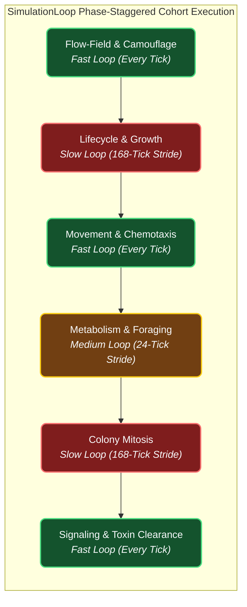
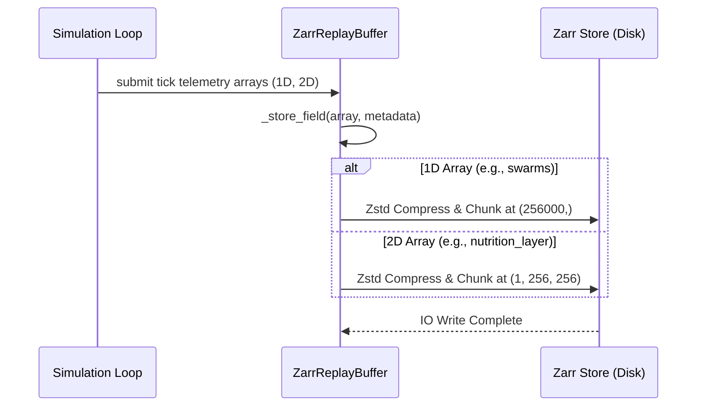
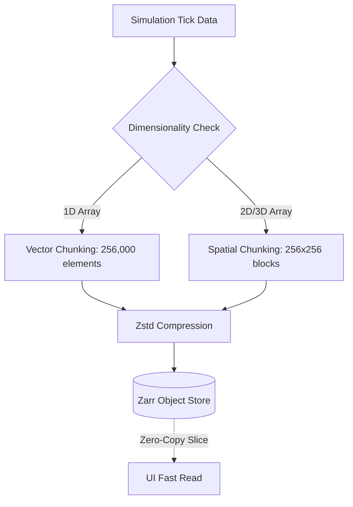
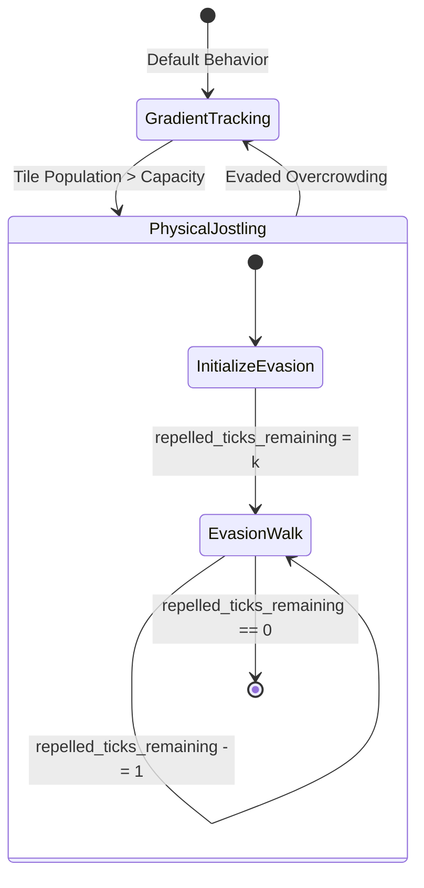

!!! success "Status: Fully Realized Engine Architecture"
    The core spatiotemporal scaling mechanisms detailed in this document-including Phase-Staggered Cohort Multi-Scale Temporal Decoupling, Von Neumann Kinematics, Zarr + Polars Telemetry, Kleiber's Law Allometric Scaling, Toroidal Wrap-around Topology, and Stochastic Seed Dispersal-are **fully realized** in the PHIDS core simulation engine (`src/phids/engine/`).

To simulate an entire physical biome (e.g., a 1 km² mixed forest) realistically, PHIDS cannot rely on arbitrary grid units and abstract ticks. The system rigorously enforces Dimensional Anchoring, strictly coupling physical space, thermodynamic energy, and biological time into a unified computational framework.

This architecture unifies the empirical database pipeline (ETL), the Entity-Component-System (ECS), telemetry storage, and the multi-stage simulation loop to successfully model large-scale ecosystems without violating hardware limits, branching efficiency, or visual interpretability.

## 1. The Spatiotemporal Dimensional Anchor & Memory Limits [Realized]

Before a forest scenario is initialized, the `SimulationConfig` explicitly defines the base physical units ($\Delta L$, $\Delta \tau$, $\Delta E$). Everything else in the engine scales relative to these constants.

* **Space** ($\Delta L = 1\text{ meter}$): A $1024 \times 1024$ `GridEnvironment` equals exactly $1.04 \text{ km}^2$. The choice of a power-of-two dimension ($1024$ rather than $1000$) is computationally critical: it allows Toroidal wrap-around boundaries to use bitwise AND (`x & 1023`), which executes in a single CPU cycle, completely avoiding integer modulo (`x % 1000`) which incurs a 10-20 cycle penalty.
* **Time** ($\Delta \tau = 1\text{ hour}$): One simulation tick is exactly 1 hour of biological time.
* **Energy** ($\Delta E = 100\text{ kcal}$): One internal PHIDS `energy_unit` translates to exactly 100 kilocalories of digestible biological matter.

### Memory Footprint (RAM vs. Disk)

A critical distinction in large-scale simulation is what must reside in live memory (Compute) versus what is saved (Storage).

#### Live Compute (RAM)

A common misconception in cellular automata is that grid scaling induces exponential memory bloat. For a $1024 \times 1024$ grid ($\sim 10^6$ cells):

* A single single-precision (`float32`) continuous field requires exactly $4 \text{ MB}$ of RAM.
* A standard PHIDS simulation operates roughly 20 continuous layers (plant energy, root networks, 16 double-buffered chemical substance layers, wind vectors).
* **Total Environmental RAM**: $\sim 80 \text{ MB}$.

A modern server CPU (e.g., AMD EPYC) has $\sim 50 \text{ GB/s}$ memory bandwidth per channel. Linearly reading one $4 \text{ MB}$ field takes just $\sim 0.08 \text{ ms}$. However, the $80 \text{ MB}$ footprint spills out of the L3 cache for standard consumer CPUs (often $32 \text{ MB}$ L3), meaning the engine becomes DRAM latency-bound ($\sim 70 \text{ ns}$ fetch penalty). This strict analysis validates the roadmap's eventual move to GPU tensor cores (HBM bandwidth $> 1 \text{ TB/s}$).

#### Historical Storage (Disk)

While computing an 80 MB grid is fast, storing it every tick for a 10,000-tick run would generate $800 \text{ GB}$ of raw output per scenario. This necessitates a strict decoupling of compute and storage (detailed in Section 5).

## 2. Multi-Scale Temporal Decoupling (Phase-Staggered Cohort Execution) [Realized]

Because VOC diffusion happens in seconds, but plant growth happens in months, evaluating all rules linearly on a 1-hour tick causes chemical diffusion to be too slow and plant growth to be uncomputably small (triggering subnormal floating-point errors).

To resolve this while preserving smooth macro-telemetry curves and uniform per-tick CPU instruction and memory bandwidth, `SimulationLoop.step()` implements **Phase-Staggered Cohort Execution** (`(entity_id % S) == (tick % S)`), executing distinct biological systems across natural frequency strides ($S_{\text{medium}} = 24$, $S_{\text{slow}} = 168$):

* **The Fast Loop (Every Tick / Hourly):**
    * *Signaling & Taxis:* Volatile Organic Compounds (VOCs) diffuse. Swarms calculate chemotactic gradients and execute continuous movement steps.
* **The Medium Loop (Cohort Phase $(i \% 24) == (t \% 24)$ / Daily):**
    * *Metabolism & Feeding:* $\frac{1}{24}$-th of swarms evaluate daily Basal Metabolic Rate (BMR) and herbivore feeding on each tick $t$.
* **The Slow Loop (Cohort Phase $(i \% 168) == (t \% 168)$ / Weekly):**
    * *Growth & Demographics:* $\frac{1}{168}$-th of plants apply accumulated photosynthetic growth (`SLOW_TICK_STRIDE = 168`), mycorrhizal tax, and reproduction checks on each tick $t$. Swarms with caloric surpluses evaluate mitosis. Dead entities are culled from the Spatial Hash.

### Evaluating Computability, Telemetry Smoothness & Cache Line Locality

Under Phase-Staggered Cohort Execution:

* **Macro Telemetry Smoothness ($C^0$ Continuity):** By staggering plant and swarm updates across their respective stride phases ($(i \% S) == (t \% S)$), global ecosystem metrics (total biomass, global plant energy, active mycorrhizal connections) become $C^0$ continuous, completely eliminating impulse spikes and 24-tick / 168-tick sawtooth artifacts.
* **Uniform Memory & Compute Bandwidth:** Exactly $\frac{1}{S}$-th of all entities are updated on every single tick. Per-tick CPU instruction counts and L1/L2 memory cache streaming remain uniform, completely avoiding DRAM cache-thrashing bursts.
* **Branch Predictability:** Cohort phase masks rely on bitwise and arithmetic modulo operations that evaluate cleanly in Numba `@njit` kernels with near-zero branch penalty.

## 3. Behavioral Abstraction: Stochastic Von Neumann Kinematics [Realized]

At a $1 \text{ m}^2$ resolution, tracking the individual leg movements of insects or deer is biologically irrelevant and computationally disastrous. PHIDS abstracts physical movement using a probabilistic gradient ascent within a von Neumann neighborhood.

* **The Von Neumann Neighborhood:** A swarm does not evaluate a 360-degree continuous radius (Moore 8-way). It only looks at its four adjacent orthogonal tiles: North, South, East, and West ($N, S, E, W$). This reduces DRAM fetches by $50\%$ compared to Moore neighborhoods (`_gather_neighbours_jit` in `src/phids/engine/systems/interaction/movement.py`).
* **Stochastic Choice (SIMD Vectorization):** Instead of deterministically snapping to the absolute highest value, the swarm applies a Softmax function to the four flow-field values. A Softmax operation across 4 neighbors fits perfectly into a single 128-bit XMM register (or batched across 4 swarms in a 512-bit ZMM register for AVX-512). This reduces the probabilistic gradient ascent calculation to just $\sim 20$ clock cycles per swarm.

## 4. Multi-Scale Phase-Staggered Loop Boundaries [Realized]

To prevent IEEE 754 subnormal floating-point truncation traps and maximize CPU L1/L2 cache locality, `SimulationLoop.step()` decouples biological process frequencies via Phase-Staggered Cohort Execution (Fast, Medium, and Slow loops):

## 5. Storage, Replay, and Telemetry (Zarr + Polars) [Realized]

To prevent disk-bloat, PHIDS draws a strict boundary between Compute and Storage:

### A. Polars (Discrete Analytical Telemetry)

The macroscopic Lotka-Volterra aggregates - total species populations, total ecosystem energy, and death-cause counters - are tiny numerical scalars.

* **Storage Strategy:** These are appended every tick as flat dictionaries and lazily materialized into highly compressed Polars DataFrames (`src/phids/telemetry/analytics.py`). The append operation takes amortized $O(1)$ time ($\sim 5 \mu\text{s}$).

### B. Zarr (High-Density Spatial Replay)

* **L2 Cache-Aligned Spatial Chunking:** Zarr chunks spatial grids dynamically based on dimensionality to maximize CPU L2 cache hits during PDE convolutions. 1D vector arrays (like swarms) are chunked at $1 \text{ MB}$ ($256,000$ elements). 2D scalar fields and 3D multi-channel layers are explicitly chunked into $256 \times 256$ spatial blocks ($256 \text{ KB}$ each). This perfectly aligns with modern L2 cache lines, drastically reducing cache-miss thrashing when the fast-loop iterates over local Von-Neumann neighborhoods. Zstd compression achieves $> 2 \text{ GB/s}$ compression throughput over these blocks.

#### Zero-Copy Zarr Slice Chunking Workflow

The following diagrams illustrate how the Engine dispatches unboxed memory arrays to the Zarr buffer, which slices and chunks them according to dimensionality before passing them through the Zstd compressor to disk.

* **Subnormal Tail Clamping:** Signal tails below $1 \times 10^{-4}$ are clamped to $0.0$ prior to Zstd compression, enabling high run-length compression ratios.

## 6. Allometric Scaling & Population Densities [Realized]

To maintain realistic flora and fauna densities on a $1 \text{ m}^2$ resolution grid, the ETL pipeline enforces strict allometric scaling laws derived from PanTHERIA and TRY (`src/data_pipeline/archetype_extractor.py`).

* **Capacity Limit:** A $1 \text{ m}^2$ cell has a fixed maximum photosynthetic carrying capacity based on actual solar irradiance (e.g., $\sim 10,000 \text{ kcal/day/m}^2$ gross).
* **Swarm Energy Requirements (Kleiber's Law):** Herbivore energy demands are mapped directly to physical mass ($M$) using Kleiber’s Law ($BMR \propto M^{0.75}$). An Aphid swarm has low individual BMR, allowing a massive `split_population_threshold` (10,000). A Deer herd has a high individual BMR, forcing the swarm to maintain continuous high velocity across the grid to survive.

## 7. Resolved Scaling Horizons: Edge Effects & Spatial Congestion [Realized]

As PHIDS pushes toward full $1 \text{ km}^2$ macro-scale simulation, three specific spatial scaling issues have been resolved:

### A. Boundary Topology & Edge Effects

At $1024 \times 1024$, rigid walls distort macro-ecology. Prevailing winds blow VOCs against the grid boundary, creating artificial concentration spikes.

* **The Fix (Toroidal Power-of-2 Bitwise Wrap):** The grid topology uses a Torus (wrap-around). Numba spatial convolution kernels use `boundary='wrap'`, and coordinate updates utilize single-cycle modulo masking (`(x - 1) % width`) or power-of-2 bitwise AND masking (`(x - 1) & mask_x`) to seamlessly simulate an infinite, continuous forest.

### B. $O(1)$ Trophic Anchoring Fast-Path ("Bolt Optimization")

Evaluating the chemotactic scalar field across disparate tensor arrays for thousands of swarms demands significant CPU bandwidth.

* **The Fix ($O(1)$ Anchoring Override):** Prior to resolving global navigation vectors, `_is_swarm_anchored` checks if the swarm is co-located with uneaten compatible food via a direct $O(1)$ scalar read of `apparent_nutrition_layer`. If anchored, movement vector calculation is short-circuited instantly ($\Delta x = 0, \Delta y = 0$), bypassing continuous gradient evaluation entirely during feeding.

### D. Overcrowding Evasion & Micro-Stuttering ($k$-ticks)

When swarms cluster on high-value vegetation patches, physical density limits frequently trigger repulsion jostling on the boundary, which historically caused single-tick oscillations (micro-stuttering) as swarms stepped out and were immediately pulled back in by chemotaxis.

* **The Fix (Stateful Configurable Evasion):** Physical repulsion triggers a continuous, stateful $k$-tick random walk ($k$ defined by `evasion_duration_ticks` in the species schema). This injects just enough momentum to cleanly break out of dense local minima without compromising long-term global pathfinding.

#### Multi-Tick Repelled State Workflow

The following state diagram demonstrates how the $k$-tick evasion mechanic temporarily overrides gradient tracking until the swarm clears the overcrowded area.

### E. Volumetric Collision & Branchless Capacity Masking [Realized]

Because 1 cell equals exactly $1 \text{ m}^2$, the ECS Spatial Hash faces entity stacking if unchecked.

* **The Fix (Branchless Capacity Masking):** Preventing swarm stacking evaluates capacity as a branchless boolean mask (`mask = min(1.0, is_current + (pop <= max_capacity))`) inside Numba `@njit` kernels (`_apply_branchless_capacity_mask_jit` & `_weighted_field_choice_jit` in `src/phids/engine/systems/interaction/movement.py`). By multiplying candidate probabilities by this mask, overcrowded target cells have their weight instantly set to `0.0` without executing conditional `if` branches on population counts, eliminating CPU pipeline flushes from branch mispredictions.

## 8. Aspirational Scaling Goals [Planned]

The following architectural optimizations represent future milestones that are planned but not yet realized in the core engine.

### A. Visual Representation: The "Temporal Lens" (Zarr Replay)

If 1 tick = 1 hour, and the Web UI renders at 60 FPS, the user watches 60 hours pass every second. Transmitting the raw environment at 60 FPS requires massive bandwidth. The planned **Temporal Lens Toggle** will resolve this by bypassing the simulation engine and reading historical data directly from Zarr buffers:

* **Micro Lens (Sparse Zarr Reads):** The UI fetches only the sparse swarm coordinate chunks from the Zarr store for every tick, making real-time foraging visually fluid.
* **Meso Lens (Daily Trophic Shifts) & Temporal Striding:** The UI utilizes Zarr's native chunk striding to fetch environment snapshots only on `tick % 24 == 0`. Client-side WebGL interpolates the 24-tick gaps without backend CPU cost. Storing snapshots only every 24 ticks (Meso Lens) will drastically reduce the 10,000-tick storage IOPS burden.
* **Macro Lens (Evolutionary Time-Lapse):** The UI fetches Zarr snapshot chunks only on `tick % 168 == 0` (Weekly). Swarm positions are abstracted into density heatmaps.
