# Herbivore Behavior & Kinematics

Herbivore swarms represent the primary consumer tier in the PHIDS simulation. Their behaviors—movement, feeding, population scaling, and division—are carefully bounded by biological rules that produce macroscopic swarm dynamics without relying on expensive global computation.

## 1. Locomotion & Probabilistic Sampling

Swarms do not move in absolute straight lines toward a distant target. When sampling their Moore Neighborhood $\mathcal{N}(x,y)$ against the unified Flow Field $F_t$, they utilize **probabilistic softmax-like weighting**.

**Biological Rationale:**
In real ecological systems, individuals in a herd do not possess perfect information. If 1,000 herbivores all determined that coordinate (5,5) had the absolute highest gradient mathematically, and all moved there simultaneously, they would form a physically impossible singularity. By using probabilistic sampling weighted heavily toward the gradient peak, PHIDS naturally models the "diffuse foraging fronts" observed in grazing animals or hymenoptera (insects). The swarm as a whole moves *generally* toward the target, but individual entities exhibit slight variations.

## 2. Inertial Persistence (The Orthokinetic Rule)

A critical edge case occurs when the entire gradient is flat (values $< 1 \times 10^{-6}$). This implies the swarm is outside the sensory horizon of any plant or toxin.

If gradient ascent alone drove the system, the swarm would halt completely.

**Algorithmic Resolution:**
When $F_t(u,v) \approx 0$, the swarm relies on **movement inertia** stored from its previous tick (`last_dx`, `last_dy`).

- A 10:1 preference weight is given to continue moving in the current heading.
- If no previous heading exists, isotropic random dispersal (Random Walk) is applied.

**Biological Rationale:**
This emulates *orthokinesis*—directional persistence. An animal searching a barren landscape does not spin in circles; it maintains a general heading until it intersects a new scent trail or geographic feature.

## 3. Capacity Limits & Physical Repulsion

The biotope is a discrete grid. While multiple swarms can occupy the same $(x, y)$ coordinate, doing so infinitely violates spatial realism.

**Algorithmic Resolution:**
At the start of the interaction phase, PHIDS aggregates the total population of all swarms currently on a tile. If this sum exceeds the `TILE_CARRYING_CAPACITY` (e.g., 500 individuals), the swarms enter a **Repelled Random Walk** state for $k$ ticks.

**Biological Rationale:**
This is a computational surrogate for crowding-induced displacement. When too many grazers cram into a single patch, physical jostling forces the groups to scatter radially, expanding the foraging front and alleviating the localized density pressure.

## 4. Trophic Anchoring (The Arrestment Reflex & Anchoring Heuristic)

### I. Implementation Mechanics

Before evaluating the global navigation vectors derived from substance gradients or pheromone trails, the herbivore interaction pipeline executes a short-circuit guard clause:

```python
# Conceptual engine shortcut
if self.env.has_viable_vegetation(swarm.x, swarm.y, swarm.diet_type):
    # Anchoring Override triggered
    nx, ny = swarm.x, swarm.y
    swarm.state = SwarmState.FEEDING
else:
    # Fallback to multi-layer vector calculation
    nx, ny = self.flow_field.evaluate_gradient(swarm.x, swarm.y)
```

If the plant entity existing at the swarm’s current coordinate possesses non-depleted biomass compatible with the herbivore's diet matrix, the engine locks the swarm's movement vectors to zero for that tick. The swarm bypasses all gradient tracking, remaining anchored to the tile to feed.

### II. Why It Is Solved This Way

Flow field evaluation involves reading across multiple continuous data layers (e.g., plant defensive volatile arrays, attractant gradients, terrain resistance matrices). If every herbivore swarm executed this continuous mathematical tracking while already sitting on a massive food source, the engine would waste immense memory bandwidth re-calculating target paths for entities that have already successfully attained their goal state.

```mermaid
flowchart TD
    Start_Move([Evaluate Swarm Movement]) --> Check_Local{"Valid, Diet-Compatible Flora<br>Present on Immediate Tile?<br><i>O(1) Spatial Hash Lookup</i>"}

    %% Anchoring Path
    Check_Local -- Yes: Food Underfoot --> Trigger_Anchor["Trigger Anchoring Override State"]
    Trigger_Anchor --> Set_Zero["Lock Delta Velocity Vector to Zero (vx=0, vy=0)"]
    Set_Zero --> Execute_Feed["Transition Swarm State to FEEDING"]
    Execute_Feed --> Skip_Field["Bypass Matrix Lookups & Navigation Loops"]

    %% Flow Field Gradient Path
    Check_Local -- No: Tile Depleted --> Evaluate_Nav["Fallback to Chemotactic Gradient Ascent"]
    Evaluate_Nav --> Read_Arrays["Scan Global Guide Surface Fields<br><i>Read Multi-Layer Substance Arrays</i>"]
    Read_Arrays --> Moore_Max["Sample Maximum Neighbor Cell Value<br><i>arg max F_t(u, v) over Moore Neighborhood</i>"]
    Moore_Max --> Commit_Step["Update Coordinates to Target Neighbor Cell Index"]

    %% Convergence
    Skip_Field & Commit_Step --> End_Move([Movement Update Frame Finished])

    %% Class Allocations
    classDef shortcut fill:#112214,stroke:#00e676,stroke-width:2px,rx:6px,ry:6px;
    classDef coreSys fill:#141224,stroke:#b388ff,stroke-width:2px,rx:6px,ry:6px;
    classDef stateData fill:#111b24,stroke:#00b8d4,stroke-width:2px,rx:6px,ry:6px;

    class Check_Local,Trigger_Anchor,Skip_Field shortcut
    class Set_Zero,Execute_Feed,Commit_Step coreSys
    class Read_Arrays,Moore_Max stateData
```



### III. The Historical/Continuous Alternative

The classic continuous modeling approach applies a constant, uninterrupted chemotaxis equation where the herbivore's velocity vector $\vec{v}$ is driven at all times by the gradient of an attractant field:

$$
\vec{v} = \chi \nabla C
$$

Under this old model, animals are forced to continually shift and vibrate according to shifting chemical backgrounds, even while actively eating a plant.

### IV. Computational Improvement

- **Complexity:** Drops the navigation cost for actively feeding swarms from an $O(M)$ array look-up and interpolation phase (where $M$ is the number of substance layers or flow field vectors) to a flat $O(1)$ boolean evaluation of the local cell state.
- **Numba Optimization:** When herbivore densities are high and resources are abundant, up to 90% of the active swarms bypass the memory-bound array index operations required for vector-field pathing. This allows the Numba-compiled execution loops to maximize CPU cache residency by processing feeding swarms via simple in-place array updates.

### V. Biological Modeling Realism

- **Optimal Foraging Theory (Marginal Value Theorem):** Biologically, an animal does not expend metabolic kinetic energy navigating along a distant odor plume when it is currently standing on a valid, calorie-dense food source.
- **Patch Dynamics:** Enforcing an explicit "Anchoring Heuristic" accurately captures the behavioral dichotomy of animals: alternating between a highly stationary *exploitation state* (feeding) and a highly mobile *exploration state* (navigating via flow fields). The swarm will only resume flow-field tracking once its voracious grazing depletes the local tile's biomass below its target threshold, triggering an emergent, resource-driven departure from the patch.

## 5. Mitosis & Clonal Bifurcation

When an anchored swarm consumes immense amounts of energy, it converts the surplus into population. If $N_i \ge N_{split}$, the swarm physically divides.

**Algorithmic Resolution:**
The system executes a binary fission:

1. The parent swarm's population and energy are divided exactly in half ($N/2, E/2$).
2. A new `SwarmComponent` is allocated carrying the remaining half.
3. The new offspring swarm inherits identical phenotypic traits (consumption rate, metabolism).
4. The offspring is explicitly placed via a `_random_walk_step` in an adjacent tile.

**Biological Rationale:**
Symmetric partitioning conserves absolute biomass during the split. Forcing the offspring into an adjacent tile prevents immediate spatial re-coalescence. This physically models the division of a super-colony—such as insect hives branching off a new queen, or a massive grazing herd fracturing into two distinct pods under social pressure.


### Feeding & Attrition Dynamics

#### The Theoretical Model (Continuous Thought)
In a continuous biological model, herbivore populations grow or shrink based on net caloric intake versus metabolic burn, and suffer continuous attrition rates when feeding on heavily armored plants. A perfectly continuous solver allows for fractional survival (e.g., 0.4 of a herbivore remaining) and continuous caloric absorption.

#### The Numerical Mapping (Discrete Realization)
Because PHIDS operates a rigid Entity-Component-System (ECS) spatial hash, populations must remain strict integers, and metabolic accounting must strictly govern the "Attrition Trap" (starving while eating due to low digestibility).

**Phase 1: Caloric Accounting (The Attrition Trap)**
To simulate quantitative defenses (like high lignin), the digestibility modifier must scale the *gross* intake before baseline metabolism is paid.
1. **Gross Intake:** $\Delta e_{\text{raw}} = \text{bites\_taken} \times E_{\text{per\_bite}}$
2. **Digestion:** $\Delta e_{\text{real}} = \Delta e_{\text{raw}} \times \text{digestibility\_modifier}$
3. **Net Energy:** $E_{t+1} = E_t + \Delta e_{\text{real}} - \text{metabolism\_upkeep}$
*(If $\Delta e_{\text{real}}$ cannot cover the upkeep, the swarm mathematically loses energy despite feeding).*

**Phase 2: Mechanical Attrition (Integer Enforcement)**
To prevent "ghost fractions" from breaking the simulation constraints, physical damage taken from plant defenses is cast using a strict mathematical floor function:
$$\text{Casualties} = \lfloor \text{mechanical\_damage\_per\_bite} \cdot (1.0 - \text{resistance}_{\text{mechanical}}) \rfloor$$

## Co-Evolutionary Adaptations & Resistance Matrices

To counter plant defenses, the PHIDS engine supports formal evolutionary arms races through the `HerbivoreResistancesSchema` attached to the `HerbivoreSpeciesParams` (with the dictionary mapping `resistances`).

In nature, herbivores do not passively accept plant defenses; they co-evolve specialized adaptations to bypass them.

!!! info "Biological Context"
    **Mechanical Resistance:** Giraffes possess heavily keratinized, prehensile tongues and thick saliva, allowing them to strip acacia leaves completely ignoring massive thorns.
    **Chemical Resistance:** Monarch caterpillars have evolved to sequester the deadly cardiac glycosides of milkweed without taking cellular damage. Ruminants (like deer or cattle) have specialized foregut fermentation chambers utilizing symbiotic bacteria to break down tough lignins that other herbivores cannot digest.

These are represented by three primary parameters:
*   `morphological_adaptation`: Resistance to physical trauma.
*   `chemical_neutralization`: Metabolic ability to neutralize ingested active toxins.
*   `digestive_efficiency`: Ability to extract calories from tough or high-lignin plant matter.

The resistances mapping allows swarms to mathematically mitigate incoming damage or digestibility penalties. A swarm with a `morphological_adaptation` (i.e. $\text{resistance}_{\text{mechanical}}$) of 0.9 will effectively ignore 90% of the damage from a thorny plant, giving them an exclusive ecological niche and a massive competitive advantage over non-resistant swarms.
