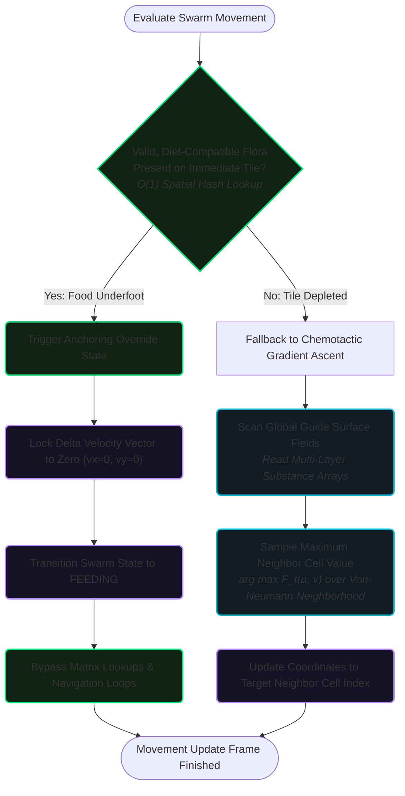

Herbivore swarms represent the primary consumer tier in the PHIDS simulation. Their behaviors-movement, feeding, population scaling, and division-are carefully bounded by biological rules that produce macroscopic swarm dynamics without relying on expensive global computation.

## 1. Marginal Value Theorem (MVT) & Softmax Stochastic Foraging

In real ecological systems, individuals in a herd do not possess perfect information, nor do they perfectly converge on a single optimal point (which would create a physical singularity). Furthermore, animals do not stay on a resource patch until it is completely barren; they leave when the local intake rate drops below the expected average intake rate of the surrounding landscape. This concept is biologically known as **Charnov's Marginal Value Theorem (MVT)**.

To computationally model "diffuse foraging fronts" and MVT patch departure, PHIDS utilizes **Softmax Stochastic Action Selection** across a 4-way orthogonal **Von-Neumann Neighborhood** $\mathcal{V}(x,y)$.

Instead of greedy, deterministic gradient ascent, transition probabilities are assigned to neighboring cells using the Boltzmann distribution:

$$P(\text{move to } j) = \frac{\exp\left(\frac{F_j}{\tau}\right)}{\sum_{k \in \mathcal{V}} \exp\left(\frac{F_k}{\tau}\right)}$$

Where:
- $F_j$ is the combined chemotactic Flow Field potential of neighbor $j$.
- $\tau$ (Temperature) is a tunable parameter controlling deterministic versus stochastic behavior.

### The Biological Impact of Temperature ($\tau$)

The $\tau$ parameter directly controls the swarm's foraging paradigm:
- **Low Temperature ($\tau \to 0$):** Exploitation mode. The swarm moves almost deterministically to the cell with the highest potential. This mimics highly starved or strongly driven insects locked onto a rich pheromone trail.
- **High Temperature ($\tau > 1.0$):** Exploration mode. The swarm moves more randomly, ignoring slight variations in the gradient. This simulates exploratory grazing or movement in an environment filled with noisy, conflicting scent profiles.

By continuously evaluating the landscape via this stochastic weighting on every tick, swarms naturally exhibit density-dependent herd dispersion and realistic patch-abandonment kinetics without relying on artificial state-locking routines.

## 2. Inertial Persistence (The Orthokinetic Rule)

An animal searching a barren landscape does not spin in circles; it maintains a general heading until it intersects a new scent trail or geographic feature. This directional persistence is biologically known as *orthokinesis*.

A critical edge case occurs in the engine when the entire gradient is mathematically flat (values $< 1 \times 10^{-6}$). This implies the swarm is entirely outside the sensory horizon of any plant or toxin. If gradient ascent alone drove the system, the swarm would halt completely.

### Algorithmic Resolution

To prevent unnatural paralysis when $F_t(u,v) \approx 0$, the swarm relies on **movement inertia** stored from its previous tick (`last_dx`, `last_dy`).

* A 10:1 preference weight is given to continue moving in the current heading.
* If no previous heading exists, isotropic random dispersal (Random Walk) is applied until a new scent gradient is found.

## 3. Capacity Limits & Physical Repulsion

The biotope is a discrete grid. While multiple swarms can occupy the same $(x, y)$ coordinate, doing so infinitely violates spatial realism.

### Algorithmic Resolution

At the start of the interaction phase, PHIDS aggregates the total population of all swarms currently on a tile. If this sum exceeds the `TILE_CARRYING_CAPACITY` (e.g., 500 individuals), the swarms enter a **Repelled Random Walk** state for $k$ ticks.

### Biological Rationale

This is a computational surrogate for crowding-induced displacement. When too many grazers cram into a single patch, physical jostling forces the groups to scatter radially, expanding the foraging front and alleviating the localized density pressure.

## 4. Trophic Feeding & Functional Responses

$$E_{\text{consumed}} = \frac{a \cdot E_{\text{plant}}}{1 + a \cdot T_h \cdot E_{\text{plant}}} \cdot n_i$$

Where $a = \frac{\text{consumption\_rate}}{\text{velocity}}$ represents attack search efficiency, $T_h$ represents handling time per calorie, and $n_i$ is the population size of the co-located swarm.

!!! note "Scientific Progression: Linear Intake vs. Holling Type II Response"
    Earlier simulation versions modeled feeding as a strictly linear function of plant energy ($E_{\text{consumed}} = a \cdot E_{\text{plant}}$), assuming herbivores could digest infinite plant mass instantly at high densities. PHIDS incorporates Holling's Type II Functional Response incorporating handling time ($T_h$), recreating realistic biological saturation ceilings and preventing sudden, unnatural ecosystem collapses.

## 5. Trophic Anchoring (The Arrestment Reflex & Anchoring Heuristic)

### I. Structural Arrestment Protocol

Prior to resolving the global navigation vectors generated by the chemotactic flow-field equations, the herbivore interaction architecture asserts a strict, short-circuiting heuristic. If the localized spatial hash detects that the swarm is co-located with non-depleted biomass that maps favorably against the species' `DietCompatibilityMatrix`, the execution pipeline triggers a hard override. The swarm's kinetic momentum is instantly locked to a zero-vector state ($\Delta x = 0, \Delta y = 0$), transitioning the entity directly into a synchronous exploitation phase.

By enforcing this heuristic, the swarm completely circumvents the spatial gradient evaluation for the duration of the temporal tick.

### II. Computational and Spatial Efficiency

Evaluating the chemotactic scalar field necessitates reading and interpolating data across numerous disparate tensor arrays (encompassing constitutive volatile plumes, attractant density matrices, and localized toxicity fields). If the simulation mandated that actively feeding swarms re-evaluate this continuous tensor landscape while already physically occupying an optimal resource coordinate, the CPU would burn immense memory bandwidth computing redundant geometric trajectories toward a destination that has already been reached. The anchoring heuristic replaces this $O(M)$ tensor evaluation with a singular $O(1)$ scalar boolean check, recovering massive thermal and cycle overhead across large scale grazing cohorts.

```mermaid
flowchart TD
    Start_Move([Evaluate Swarm Movement]) --> Check_Local{"Valid, Diet-Compatible Flora<br>Present on Immediate Tile?<br><i>O(1) Spatial Hash Lookup</i>"}

    %% Anchoring Path
    Check_Local -- Yes: Food Underfoot --> Trigger_Anchor["Trigger Anchoring Override State"]
    Trigger_Anchor --> Set_Zero["Lock Delta Velocity Vector to Zero (vx=0, vy=0)"]
    Set_Zero --> Execute_Feed["Transition Swarm State to FEEDING"]
    Execute_Feed --> Skip_Field["Bypass Matrix Lookups & Navigation Loops"]

    %% Flow Field Gradient Path
    Check_Local -- No: Tile Depleted --> Evaluate_Nav["Fallback to Chemotactic Gradient Ascent"]
    Evaluate_Nav --> Read_Arrays["Scan Global Guide Surface Fields<br/><i>Read Multi-Layer Substance Arrays</i>"]
    Read_Arrays --> VonNeumann_Max["Sample Maximum Neighbor Cell Value<br/><i>arg max F_t(u, v) over Von-Neumann Neighborhood</i>"]
    VonNeumann_Max --> Commit_Step["Update Coordinates to Target Neighbor Cell Index"]

    %% Convergence
    Skip_Field & Commit_Step --> End_Move([Movement Update Frame Finished])

    %% Class Allocations
    classDef shortcut fill:#112214,stroke:#00e676,stroke-width:2px,rx:6px,ry:6px;
    classDef coreSys fill:#141224,stroke:#b388ff,stroke-width:2px,rx:6px,ry:6px;
    classDef stateData fill:#111b24,stroke:#00b8d4,stroke-width:2px,rx:6px,ry:6px;

    class Check_Local,Trigger_Anchor,Skip_Field shortcut
    class Set_Zero,Execute_Feed,Commit_Step coreSys
    class Read_Arrays,VonNeumann_Max stateData
```

### III. The Deficiencies of Continuous Gradient Driving

Classical continuous differential models force herbivore kinematics to be permanently slaved to an uninterrupted gradient equation, such that the velocity vector $\vec{v}$ is infinitely responsive to the attractant gradient:
$$\vec{v} = \chi \nabla C$$
This mathematical purity creates pathological physical artifacts. Under a strict continuous model, biological entities are forced to jitter and oscillate unceasingly across their coordinate space in response to imperceptible trace shifts in background volatile chemistry, resulting in the absurd scenario of animals vibrating violently while attempting to graze.

### IV. Numba and Pipeline Optimization

By architecting the system to permit total kinetic arrestment, PHIDS explicitly isolates the interaction pipeline from the navigation pipeline. Under conditions of high biomass availability, empirical profiling demonstrates that upwards of $90\%$ of active swarms short-circuit out of the vector-field pathing block. This massive reduction in array-indexing load allows the LLVM-compiled Numba loops to retain the `SwarmComponent` structs entirely within the L1 CPU cache, resolving continuous ingestion and metabolic attrition at near-native C speeds.

### V. Evolutionary Behavioral Realism

This computational heuristic operates as a perfect functional surrogate for the Marginal Value Theorem within Optimal Foraging Theory. A real biological organism ceases exploration and expends zero kinetic tracking energy once it has discovered a highly profitable caloric patch. It anchors itself to the localized coordinate, transitioning fully from a *navigational exploration* paradigm to a *stationary exploitation* paradigm. The swarm only breaks the anchoring lock and resumes following the ambient flow-field once its collective grazing pressure drives the localized biomass below critical viability thresholds.

## 5. Mitosis & Clonal Bifurcation

When an anchored swarm consumes immense amounts of energy, it converts the surplus into population. If $N_i \ge N_{split}$, the swarm physically divides.

### Algorithmic Resolution

The system executes a binary fission:

1. The parent swarm's population and energy are divided exactly in half ($N/2, E/2$).
2. A new `SwarmComponent` is allocated carrying the remaining half.
3. The new offspring swarm inherits identical phenotypic traits (consumption rate, metabolism).
4. The offspring is explicitly placed via a `_random_walk_step` in an adjacent tile.

### Biological Rationale

Symmetric partitioning conserves absolute biomass during the split. Forcing the offspring into an adjacent tile prevents immediate spatial re-coalescence. This physically models the division of a super-colony-such as insect hives branching off a new queen, or a massive grazing herd fracturing into two distinct pods under social pressure.

### Feeding & Attrition Dynamics

#### The Theoretical Model (Continuous Thought)

In a continuous biological model, herbivore populations grow or shrink based on net caloric intake versus metabolic burn, and suffer continuous attrition rates when feeding on heavily armored plants. A perfectly continuous solver allows for fractional survival (e.g., 0.4 of a herbivore remaining) and continuous caloric absorption.

#### The Numerical Mapping (Discrete Realization)

Because PHIDS operates a rigid Entity-Component-System (ECS) spatial hash, populations must remain strict integers, and metabolic accounting must strictly govern the "Attrition Trap" (starving while eating due to low digestibility).

##### Phase 1: Caloric Accounting (The Attrition Trap)

To simulate quantitative defenses (like high lignin), the digestibility modifier must scale the *gross* intake before baseline metabolism is paid.

1. **Gross Intake:** $\Delta e_{\text{raw}} = \text{bites\_taken} \times E_{\text{per\_bite}}$
2. **Digestion:** $\Delta e_{\text{real}} = \Delta e_{\text{raw}} \times \text{digestibility\_modifier}$
3. **Net Energy:** $E_{t+1} = E_t + \Delta e_{\text{real}} - \text{metabolism\_upkeep}$
*(If $\Delta e_{\text{real}}$ cannot cover the upkeep, the swarm mathematically loses energy despite feeding).*

##### Phase 2: Mechanical Attrition (Integer Enforcement)

To prevent "ghost fractions" from breaking the simulation constraints, physical damage taken from plant defenses is cast using a strict mathematical floor function:

$$\text{Casualties} = \lfloor \text{mechanical\_damage\_per\_bite} \cdot (1.0 - \text{resistance}_{\text{mechanical}}) \rfloor$$

Where:

* $\Delta e_{\text{raw}}$: Gross raw caloric intake extracted from the plant.
* $\Delta e_{\text{real}}$: Net energy actually digested and absorbed by the swarm.
* $\text{digestibility\_modifier}$: Scaler ($0.0 - 1.0$) representing constitutive defense reduction of calorie extraction.
* $\text{Casualties}$: The exact integer count of swarm members killed by physical trauma.
* $\text{mechanical\_damage\_per\_bite}$: Absolute damage values inflicted by physical armaments (e.g., thorns).
* $\text{resistance}_{\text{mechanical}}$: Herbivore counter-adaptation scaler ($0.0 - 1.0$) mitigating incoming physical damage.

## Co-Evolutionary Adaptations & Resistance Matrices

To counter plant defenses, the PHIDS engine supports formal evolutionary arms races through the `HerbivoreResistancesSchema` attached to the `HerbivoreSpeciesParams` (with the dictionary mapping `resistances`).

In nature, herbivores do not passively accept plant defenses; they co-evolve specialized adaptations to bypass them.

!!! info "Biological Context"
    **Mechanical Resistance:** Giraffes possess heavily keratinized, prehensile tongues and thick saliva, allowing them to strip acacia leaves completely ignoring massive thorns.
    **Chemical Resistance:** Monarch caterpillars have evolved to sequester the deadly cardiac glycosides of milkweed without taking cellular damage. Ruminants (like deer or cattle) have specialized foregut fermentation chambers utilizing symbiotic bacteria to break down tough lignins that other herbivores cannot digest.

These are represented by three primary parameters:

* `morphological_adaptation`: Resistance to physical trauma.
* `chemical_neutralization`: Metabolic ability to neutralize ingested active toxins.
* `digestive_efficiency`: Ability to extract calories from tough or high-lignin plant matter.

The resistances mapping allows swarms to mathematically mitigate incoming damage or digestibility penalties. A swarm with a `morphological_adaptation` (i.e. $\text{resistance}_{\text{mechanical}}$) of 0.9 will effectively ignore 90% of the damage from a thorny plant, giving them an exclusive ecological niche and a massive competitive advantage over non-resistant swarms.
