This section formally details the Plant-Herbivore Interaction & Defense Simulator (PHIDS) as a rigorous, deterministic computational ecology model. The documentation here defines the theoretical foundations, the explicit mathematical representations of the biological mechanisms, and the bounded approximations underlying the execution of the system.

## A Coupled Hybrid Dynamical System

PHIDS operates as a profoundly coupled hybrid dynamical system designed to bridge the micro-scale behaviors of individual biotic agents with the macro-scale abiotic fields they inhabit. The architecture relies on the strict synchronization of discrete entity transitions-governed by a data-oriented Entity-Component-System (ECS)-with continuous field updates that execute across highly optimized, double-buffered cellular automata layers.

This structural duality allows the engine to resolve the inherent tension in ecological modeling: the need to track explicit, integer-based population boundaries (preventing fractional or "ghost" biological artifacts) while simultaneously computing continuous-space physical phenomena like atmospheric volatile transport and spatial flow-field gradients. The mathematical framework translates complex biological events-ranging from resource acquisition and grazing pressure to induced semiochemical signaling and swarm mitigation-into transparent, causal operator chains that execute deterministically without floating-point drift.

```mermaid
graph TD
    subgraph Data-Oriented ECS Layer [Discrete Entity Updates]
        A(Herbivore Swarms)
        B(Flora Entities)
        C(Toxin Responses)

        A <-->|Population Dynamics| B
        B -->|Growth & Reproduction| B
    end

    subgraph Cellular Automata Layer [Continuous Field Dynamics]
        D(Volatile Organic Compounds)
        E(Resource Density Gradients)
        F(Chemotactic Flow Fields)

        D -->|Reaction-Diffusion| D
    end

    A -.->|Physical Interactions| E
    B -.->|Metabolic Emissions| D
    F ==>|Sensory Guidance Vectors| A
    D -.->|Signal Interference| F

    classDef ecs fill:#111b24,stroke:#00b8d4,stroke-width:2px;
    classDef ca fill:#141224,stroke:#b388ff,stroke-width:2px;

    class A,B,C ecs;
    class D,E,F ca;
```

## Structure of the Scientific Exposition

The theoretical and computational foundations of PHIDS are partitioned into specialized domains to provide rigorous clarity on both the *what* and the *why* of the engine's construction.

**Part I: Foundations** establishes the overarching [Mathematical Framework](mathematical_framework.md) and deterministic execution cycles, followed by an analysis of [Related Works](related_works.md) framing PHIDS within the broader computational ecology landscape.

**Part II: Autotrophic Dynamics** explores the sessile biosphere, detailing the metabolic economics of [Flora & Symbiosis](flora_and_symbiosis.md) alongside the structural constraints and deterrent mechanisms defined by [Morphological Defenses](morphological_defenses.md).

**Part III: Signaling & Transport** governs the spatial movement of information and physical phenomena, providing mathematical clarity on [Reaction-Diffusion PDEs](reaction_diffusion.md) and the sensory navigation models underpinning [Chemotaxis & Flow Fields](chemotaxis.md).

**Part IV: Heterotrophic Kinematics** addresses the macroscopic behaviors of mobile agents, tracking decision loops and metabolic attrition in [Herbivore Behavior & Kinematics](herbivore_behavior.md) and addressing structural mitosis within [Population Dynamics](population_dynamics.md).

Finally, **Part V: Ecosystem Synthesis** introduces the statistical lenses used to interpret systemic stability and failure cascades through [Ecological Analytics](ecological_analytics.md).

## Speculative Research and Future Horizons

Beyond the core deterministic mechanics, ongoing research pushes the boundaries of biological fidelity and execution scale. Strategic pathways include the formal non-dimensionalization required for empirical [Parameter Calibration Strategies](future_prospects/parameter_calibration_strategy.md) and the architectural milestones necessary for macroscopic [Spatiotemporal Scaling](future_prospects/spatiotemporal_scaling.md) across expansive virtual biomes.

By prioritizing formal exposition, explicit boundaries, and the rationale behind each numerical approximation, this documentation ensures that the output telemetry from PHIDS is mathematically traceable and experimentally reproducible.
