# Scientific Model Overview

This section formally details the Plant-Herbivore Interaction & Defense Simulator (PHIDS) as a rigorous, deterministic computational ecology model. The documentation here defines the theoretical foundations, the explicit mathematical representations of the biological mechanisms, and the bounded approximations underlying the execution of the system.

## A Coupled Hybrid Dynamical System

PHIDS operates as a profoundly coupled hybrid dynamical system designed to bridge the micro-scale behaviors of individual biotic agents with the macro-scale abiotic fields they inhabit. The architecture relies on the strict synchronization of discrete entity transitions-governed by a data-oriented Entity-Component-System (ECS)-with continuous field updates that execute across highly optimized, double-buffered cellular automata layers.

This structural duality allows the engine to resolve the inherent tension in ecological modeling: the need to track explicit, integer-based population boundaries (preventing fractional or "ghost" biological artifacts) while simultaneously computing continuous-space physical phenomena like atmospheric volatile transport and spatial flow-field gradients. The mathematical framework translates complex biological events-ranging from resource acquisition and grazing pressure to induced semiochemical signaling and swarm mitigation-into transparent, causal operator chains that execute deterministically without floating-point drift.

```mermaid
graph TD
    subgraph Data-Oriented ECS Layer [Discrete Entity Updates]
        A(Herbivore Swarms)
        B(Flora Entities)
        C(Toxin Responses)

        A <-->|Population Dynamics| B
        B -->|Growth & Reproduction| B
    end

    subgraph Cellular Automata Layer [Continuous Field Dynamics]
        D(Volatile Organic Compounds)
        E(Resource Density Gradients)
        F(Chemotactic Flow Fields)

        D -->|Reaction-Diffusion| D
    end

    A -.->|Physical Interactions| E
    B -.->|Metabolic Emissions| D
    F ==>|Sensory Guidance Vectors| A
    D -.->|Signal Interference| F

    classDef ecs fill:#111b24,stroke:#00b8d4,stroke-width:2px;
    classDef ca fill:#141224,stroke:#b388ff,stroke-width:2px;

    class A,B,C ecs;
    class D,E,F ca;
```

## Structure of the Scientific Exposition

The theoretical and computational foundations of PHIDS are partitioned into specialized domains to provide rigorous clarity on both the *what* and the *why* of the engine's construction.

### Part I: Foundations

* [Mathematical Framework](part_1_foundations/mathematical_framework.md) - Formal PDEs, continuous-discrete coupling, deterministic operator chains, and state preservation invariants.
* [Related Works](part_1_foundations/related_works.md) - Theoretical contextualization of PHIDS alongside classical Lotka-Volterra models, cellular automata, and IBM frameworks.

### Part II: Autotrophic Dynamics

* [Flora & Symbiosis](part_2_autotrophic_dynamics/flora_and_symbiosis.md) - Autotrophic metabolic economics, underground mycorrhizal fungal networks, and nutrient exchange cascades.
* [Morphological Defenses](part_2_autotrophic_dynamics/morphological_defenses.md) - Physical deterrents, trichome density, structural barriers, and constitutive defense kinetics.

### Part III: Signaling & Transport

* [Reaction-Diffusion PDEs](part_3_signaling_and_transport/reaction_diffusion.md) - Isotropic Gaussian kernels, volatile organic compound (VOC) plume advection, and atmospheric dispersion physics.
* [Chemotaxis & Flow Fields](part_3_signaling_and_transport/chemotaxis.md) - Global sensory navigation gradients, sensory field sampling, and Charnov Marginal Value Theorem patch dynamics.

### Part IV: Heterotrophic Kinematics

* [Herbivore Behavior & Kinematics](part_4_heterotrophic_kinematics/herbivore_behavior.md) - Foraging decision state machines, kinetic movement models, and metabolic attrition budgets.
* [Population Dynamics](part_4_heterotrophic_kinematics/population_dynamics.md) - Density-dependent mortality, swarm mitosis, biomass energy bifurcation, and carrying capacity constraints.

### Part V: Ecosystem Synthesis

* [Ecological Analytics](part_5_ecosystem_synthesis/ecological_analytics.md) - Statistical metrics, trophic stability indicators, phase portraits, and emergence analysis.

### Attested Computations

* [Attested Computations Suite](computations/index.md) - Sanctioned deterministic baseline computations enforcing 1:1 table-to-trace parity.

## Speculative Research and Future Horizons

Beyond the core deterministic mechanics, ongoing research pushes the boundaries of biological fidelity and execution scale. Strategic pathways include:

* [Biological Abstractions & Grid Mechanics](future_prospects/biological_abstractions.md) - Trade-off analysis of spatial discretizations and biological fidelity limits.
* [Parameter Calibration Strategies](future_prospects/parameter_calibration_strategy.md) - Formal non-dimensionalization and empirical field parameter harmonization.
* [Spatiotemporal Scaling](future_prospects/spatiotemporal_scaling.md) - Architectural roadmap for forest-scale biome simulation across distributed memory topologies.

By prioritizing formal exposition, explicit boundaries, and the rationale behind each numerical approximation, this documentation ensures that the output telemetry from PHIDS is mathematically traceable and experimentally reproducible.
