# Mathematical Framework

This document formalizes the Plant-Herbivore Interaction & Defense Simulator (PHIDS) as a coupled hybrid dynamical system. In this model, discrete entity transitions within a data-oriented Entity-Component-System (ECS) are strictly synchronized with continuous field updates executing across double-buffered cellular automata layers.

## 1. Global State Representation

Let the global state of the biotope at discrete time step (tick) $t$ be defined as:

$$
\mathcal{X}_t = (\mathcal{E}_t, \mathcal{G}_t, \mathcal{P}_t)
$$

where:

- $\mathcal{X}_t$: The comprehensive global state tuple of the biotope at time step $t$.
- $\mathcal{E}_t$: The set of discrete biological entities (flora and herbivore swarms) active in the spatial hash of the Entity-Component-System (ECS).
- $\mathcal{G}_t$: The continuous, vectorized environmental lattice fields representing plant energy, signal concentrations, and toxins.
- $\mathcal{P}_t$: The static configuration parameters (such as the inter-species diet compatibility matrix and plant defense parameters).

The deterministic progression of the system is the ordered composition of distinct phase operators:

$$
\mathcal{X}_{t+1} = \mathcal{T}_{\text{termination\_check}} \circ \mathcal{T}_{\text{telemetry}} \circ \mathcal{T}_{\text{signaling}} \circ \mathcal{T}_{\text{interaction}} \circ \mathcal{T}_{\text{lifecycle}} \circ \mathcal{T}_{\text{camouflage}} \circ \mathcal{T}_{\text{flow\_field}} (\mathcal{X}_t)
$$

Where:

- $\mathcal{T}_{\text{flow\_field}}$: Generates the unified navigation potential landscape.
- $\mathcal{T}_{\text{camouflage}}$: Adjusts the apparent attractiveness of camouflage-enabled flora.
- $\mathcal{T}_{\text{lifecycle}}$: Evaluates flora growth, reproduction, and natural mortality rules.
- $\mathcal{T}_{\text{interaction}}$: Resolves grazing, energy transfer, mechanical damage, and attrition.
- $\mathcal{T}_{\text{signaling}}$: Computes diffusion, decay, and mycorrhizal transport of volatile substances.
- $\mathcal{T}_{\text{telemetry}}$: Ingests current state variables into the Zarr replay buffers.
- $\mathcal{T}_{\text{termination\_check}}$: Determines whether biotope survival or time bounds have been reached.

This phase ordering is not arbitrary; it enforces causal relationships (e.g., swarms move based on *current* plant energy, signaling occurs based on *post-movement* herbivore presence).

```mermaid
flowchart TD
    %% Global State Ingress
    subgraph State_In ["Global State Snapshot (Tick t)"]
        E_t["Discrete ECS Entities<br><b>(E_t)</b>"]
        G_t["Vectorized Fields<br><b>(G_t)</b>"]
        P_t["Static Configuration Matrix<br><b>(P_t)</b>"]
    end

    %% Operator Pipeline Sequence
    subgraph Pipeline ["The Phase Composition Chain (Right-to-Left Execution Sequence)"]
        direction TB
        T1["1. Flow Field Generation<br><b>T_flow_field</b>"]
        T2["2. Camouflage Attenuation<br><b>T_camouflage</b>"]
        T3["3. Flora Lifecycle & Growth<br><b>T_lifecycle</b>"]
        T4["4. Herbivore Interaction & Grazing<br><b>T_interaction</b>"]
        T5["5. Induced Defense Signaling<br><b>T_signaling</b>"]
        T6["6. Telemetry Ingestion<br><b>T_telemetry</b>"]
        T7["7. Termination Check<br><b>T_termination_check</b>"]
    end

    %% Global State Egress
    subgraph State_Out ["Mutated Global State (Tick t+1)"]
        X_next["Unified State Array Object<br><b>X_(t+1)</b>"]
    end

    %% Spatial Distribution Links
    E_t & G_t & P_t -->|Is bound to| T1
    T1 --> T2 --> T3 --> T4 --> T5 --> T6 --> T7
    T7 -->|Commit Write Buffers| X_next

    %% Visual Styling Classes
    classDef stateData fill:#111b24,stroke:#00b8d4,stroke-width:2px,rx:6px,ry:6px;
    classDef coreSys fill:#141224,stroke:#b388ff,stroke-width:2px,rx:6px,ry:6px;
    classDef coreState fill:#1c1212,stroke:#ff5252,stroke-width:2px,rx:6px,ry:6px;

    class E_t,G_t stateData
    class P_t stateData
    class T1,T2,T3,T4,T5,T6,T7 coreSys
    class X_next coreState
```

## 2. Flora Lifecycle and Symbiotic Dynamics

The state of flora entities evolves through a local, bounded integration process.

### 2.1 Bounded Growth

For a flora entity $i$ of species $j$, the energy reserve $E_{i,j}$ increases linearly per time step up to a physiological maximum:

$$
E_{i,j}^{t+1} = \min\left(E_{i,j}^t + E_{\text{base},j} \frac{g_j}{100}, \; E_{\text{max},j}\right)
$$

where:

- $E_{i,j}^t$: The current energy reserve of flora entity $i$ of species $j$ at time step $t$.
- $E_{i,j}^{t+1}$: The energy reserve of the flora entity at the next time step $t+1$.
- $E_{\text{base},j}$: The baseline reference energy value for flora species $j$.
- $g_j$: The growth rate percentage parameter for flora species $j$.
- $E_{\text{max},j}$: The maximum physiological energy capacity of flora species $j$.

### 2.2 Reproduction & Dispersion

Reproduction is gated by both an energetic threshold (the parent must survive the expenditure) and a deterministic tick interval.
Offspring dispersion is modeled by a localized kernel:

- **Calm conditions:** Sampling within a bounded annulus ($r_{\text{min}} \le r \le r_{\text{max}}$).
- **Wind-active conditions:** A Gaussian kernel shifted by the local wind vector.

where:

- $r$: The sampled dispersion radial distance from the parent plant to the offspring.
- $r_{\text{min}}$: The minimum allowed dispersion radius parameter.
- $r_{\text{max}}$: The maximum allowed dispersion radius parameter.

### 2.3 Symbiotic Relay Networks

Flora may establish bidirectional mycorrhizal links with neighbors. These links bypass atmospheric diffusion, transferring signals via graph-based propagation at a fixed velocity $t_g$:
- $t_g$: The signal propagation velocity across mycorrhizal graph links (defined in graph edges or distance units per tick).

## 3. Global Flow-Field and Swarm Navigation

To circumvent the computational constraints of $O(N^2)$ pathfinding, PHIDS calculates a unified, continuous guidance surface per tick, which herbivore swarms then sample locally.

### 3.1 Flow Field Generation

**a) The Theoretical Model (Continuous Thought):**
The scalar potential surface $F(\mathbf{r})$ over a continuous domain models infinite superposition without grid masking artifacts:

$$
F(\mathbf{r}) = \alpha E(\mathbf{r}) - \beta \sum_k T_k(\mathbf{r})
$$

Where:

- $F(\mathbf{r})$: The scalar potential field value at spatial coordinate vector $\mathbf{r}$.
- $E(\mathbf{r})$: The continuous caloric attraction potential field derived from plant energy sources.
- $T_k(\mathbf{r})$: The continuous chemical repulsion potential field for defensive toxin layer $k$.
- $\alpha$: The positive coupling weight scaling attraction toward food resources.
- $\beta$: The positive coupling weight scaling repulsion away from active toxins.

**b) The Numerical Mapping (Discrete Realization):**
This continuous model is mapped to row-major NumPy array indices where the flow-field is evaluated per tick:

$$
F_t[x, y] = \alpha E_t[x, y] - \beta \sum_{k=1}^{N_T} T_{k,t}[x, y]
$$

Where:

- $F_t[x, y]$: The discrete potential field value at grid coordinate cell $[x, y]$ at tick $t$.
- $E_t[x, y]$: The discrete aggregate plant energy present at coordinate $[x, y]$ at tick $t$.
- $T_{k,t}[x, y]$: The discrete concentration of toxin type $k$ at coordinate $[x, y]$ at tick $t$.
- $N_T$: The total number of unique defensive toxin types/species tracked in the simulation.

This implementation uses `np.sum` inside the Numba `@njit` loop across the toxin layers to stack them additively, circumventing maximum-value masking where overlapping distinct toxins might otherwise shadow one another.

### 3.2 Swarm Advection and Behavior

A swarm selects its target transition from its local Moore neighborhood $\mathcal{N}(x,y)$:

$$
(x',y') = \operatorname*{arg\,max}_{(u,v) \in \mathcal{N}(x,y)} F_t(u,v)
$$

Where:

- $(x', y')$: The discrete target coordinate chosen for the swarm's next position.
- $(x, y)$: The current discrete coordinate of the swarm entity.
- $\mathcal{N}(x, y)$: The local Moore neighborhood representing the 8 surrounding cells and the current cell.
- $F_t(u,v)$: The potential field value at candidate neighbor tile $(u, v)$ at tick $t$.

This baseline gradient-ascent is overridden by biological responses:

1. **Capacity Repulsion:** If tile population exceeds $C_{\text{max}}$, swarms engage in a brief random walk to model physical jostling.
   - $C_{\text{max}}$: The maximum carrying capacity (in population units) allowed on a single tile before density-dependent repulsion is triggered.
2. **Anchoring:** If a swarm co-locates with an energy-rich, diet-compatible plant, movement is suppressed to prioritize feeding.

> **Deep Dive:** See [Chemotaxis & Flow Fields](chemotaxis.md) for a detailed explanation of unified scalar guidance, finite-neighborhood ascent, and biological equivalents.

## 4. Herbivore Interaction and Metabolic Attrition

Feeding and population dynamics are resolved locally via O(1) spatial-hash lookups.

### 4.1 Diet-Gated Consumption

Energy transferred from plant $j$ to swarm $i$ with population $N_i$ and velocity $v_i$ is bounded by the plant's available energy and the swarm's consumption rate $r_i$:

$$
\Delta E_{i\leftarrow j} = \min\left( \frac{r_i}{\max(1, v_i)} N_i, \; E_j \right)
$$

Where:

- $\Delta E_{i\leftarrow j}$: The total energy quantity transferred from plant entity $j$ to herbivore swarm $i$ during the grazing interaction.
- $r_i$: The consumption rate parameter (base bites taken per individual) of herbivore species $i$.
- $v_i$: The current movement velocity of swarm $i$ (acting as a penalty to grazing dwell-time when moving fast).
- $N_i$: The current population count of individuals in swarm $i$.
- $E_j$: The current energy reserve of plant entity $j$.

The velocity denominator accounts for reduced feeding dwell-time when moving rapidly.

### 4.2 Metabolism, Reproduction, and Mitosis

Swarms continuously deplete energy proportional to $N_i$. Deficits manifest as immediate casualties rather than delayed starvation events.
Conversely, if surplus energy exceeds baseline requirements ($E_i^t > N_i E_{\text{min},i}$), it is converted into new individuals based on reproductive cost $\rho_i$. If $N_i$ reaches the configured split threshold, the entity undergoes mitosis, bifurcating into two independent swarms.

Where:

- $E_i^t$: The current total energy reserve of herbivore swarm $i$ at tick $t$.
- $E_{\text{min},i}$: The minimum survival energy threshold per individual for herbivore species $i$.
- $\rho_i$: The energy cost required to produce one new individual of herbivore species $i$.

> **Deep Dive:** See [Population Dynamics vs. Continuous ODEs](population_dynamics.md) for an analysis of discrete modeling vs. continuous Lotka-Volterra implementations.

## 5. Induced Defense and Signaling Diffusion

Induced defenses translate herbivore presence into local toxic and volatile chemical fields.

### 5.1 Trigger Evaluation

For a given plant, local herbivore populations are evaluated against a specified minimum $n_{i,\text{min}}$. If triggered, a `SubstanceComponent` initiates a synthesis countdown. Upon activation, it emits toxins or volatile signals.
- $n_{i,\text{min}}$: The minimum local population of herbivore species $i$ required to trigger the plant's defense response component.

### 5.2 Reaction-Diffusion Formulation

**a) The Theoretical Model (Continuous Thought):**
The airborne signal transport is modeled by a continuous parabolic partial differential equation:

$$
\frac{\partial C_s}{\partial t} = D_s \nabla^2 C_s - \lambda_s C_s + Q_s
$$

Where:

- $C_s$: Concentration of signaling substance $s$.
- $t$: Continuous time.
- $D_s$: Diffusion coefficient for signaling substance $s$.
- $\nabla^2$: The Laplacian operator modeling spatial diffusion.
- $\lambda_s$: The infinitesimal decay rate governing atmospheric clearance of substance $s$.
- $Q_s$: The continuous source term representing the signal emission rate from active plants.

**b) The Numerical Mapping (Discrete Realization):**
This continuous equation is translated into an explicit operator-splitting cellular automata execution, applied once per tick ($\Delta t = 1$):

$$
C_s^{t+1} = \gamma_s \cdot (\mathcal{K}_{\text{iso}} * C_s^t) + Q_s^t
$$

Where:

- $C_s^{t+1}$: The discrete concentration field of signaling substance $s$ at time step $t+1$.
- $C_s^t$: The discrete concentration field of signaling substance $s$ at time step $t$.
- $\gamma_s$: The discrete multiplicative atmospheric decay factor, calculated as $\gamma_s = 1.0 - \text{decay\_rate}_s$.
- $\mathcal{K}_{\text{iso}}$: The pre-computed isotropic Gaussian convolution kernel matrix.
- $*$: The 2D spatial convolution operator.
- $Q_s^t$: The discrete point source mass injection at time step $t$.

To preserve numerical sparsity and protect the CPU from subnormal float slowdowns (denormalized values), any resultant concentration magnitude strictly below $1 \times 10^{-4}$ is truncated to exactly zero. Surface toxin layers entirely bypass this mechanism, remaining localized at the source coordinate.

> **Deep Dives:**
>
> - See [Reaction-Diffusion & Partial Differential Equations](reaction_diffusion.md) for step-by-step examples of convolution kernels and gradient dispersion models.
> - See [Herbivore Behavior & Kinematics](herbivore_behavior.md) for explicit movement momentum, probabilistic spatial routing, and capacity displacement rules.
> - See [Flora & Symbiosis](flora_and_symbiosis.md) for reproductive dispersion equations, explicit energy checks, and Mycorrhizal (Root Network) transfer bypasses.
> - See [Ecological Analytics](ecological_analytics.md) for how the PHIDS data output structurally evaluates these discrete implementations against classic continuous equations like the Lotka-Volterra models.
